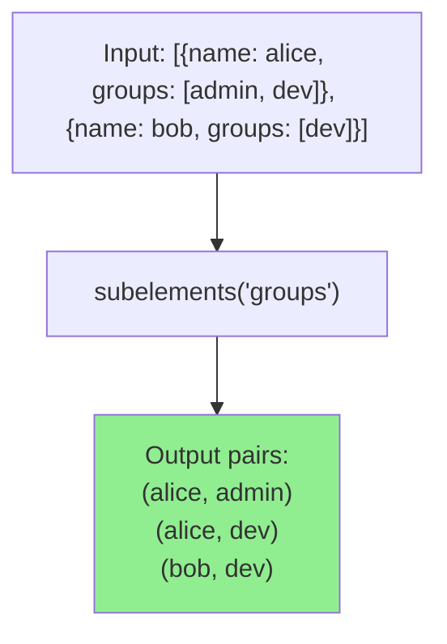

# How to Use the subelements Filter in Ansible

Author: [nawazdhandala](https://www.github.com/nawazdhandala)

Tags: Ansible, Filters, Loops, Data Transformation, Automation

Description: Learn how to use the subelements filter in Ansible to iterate over nested list attributes within a list of dictionaries for complex task loops.

---

If you have ever needed to loop over a list of users and their SSH keys, or a list of servers and their ports, you have probably struggled with nested loops in Ansible. The `subelements` filter solves this by taking a list of dictionaries and a nested list attribute, then producing a flat list of pairs that you can iterate over with a single loop.

This is one of those filters that looks confusing at first, but once you see it in action, you will wonder how you managed without it.

## The Problem subelements Solves

Consider this data structure:

```yaml
users:
  - name: alice
    groups:
      - admin
      - developers
      - docker
  - name: bob
    groups:
      - developers
      - docker
  - name: charlie
    groups:
      - viewers
```

You want to add each user to each of their groups. Without subelements, you would need a nested loop, which Ansible does not natively support well. You would have to use `include_tasks` with a loop inside a loop, which is messy.

## Basic Usage

The `subelements` filter takes the list and the name of the nested list attribute, then produces pairs:

```yaml
# Use subelements to iterate over users and their groups
- name: Add users to their groups
  ansible.builtin.user:
    name: "{{ item.0.name }}"
    groups: "{{ item.1 }}"
    append: true
  loop: "{{ users | subelements('groups') }}"
  loop_control:
    label: "{{ item.0.name }} -> {{ item.1 }}"
```

Each iteration gives you a pair:
- `item.0` is the parent dictionary (the user)
- `item.1` is one element from the nested list (one group)

The loop runs for every combination:
```
alice -> admin
alice -> developers
alice -> docker
bob -> developers
bob -> docker
charlie -> viewers
```

## SSH Key Management

The classic use case for subelements is managing SSH authorized keys:

```yaml
# vars/ssh_users.yml
ssh_users:
  - name: alice
    state: present
    keys:
      - "ssh-rsa AAAA...1 alice@laptop"
      - "ssh-rsa AAAA...2 alice@desktop"
  - name: bob
    state: present
    keys:
      - "ssh-rsa AAAA...3 bob@laptop"
  - name: charlie
    state: absent
    keys:
      - "ssh-rsa AAAA...4 charlie@old-laptop"
```

The playbook:

```yaml
# Manage SSH keys for each user using subelements
- name: Ensure user accounts exist
  ansible.builtin.user:
    name: "{{ item.name }}"
    state: "{{ item.state }}"
  loop: "{{ ssh_users }}"
  loop_control:
    label: "{{ item.name }}"

- name: Manage SSH authorized keys
  ansible.posix.authorized_key:
    user: "{{ item.0.name }}"
    key: "{{ item.1 }}"
    state: "{{ item.0.state }}"
  loop: "{{ ssh_users | selectattr('state', 'equalto', 'present') | list | subelements('keys') }}"
  loop_control:
    label: "{{ item.0.name }}: {{ item.1[:30] }}..."
```

## Database User Privileges

Another practical example involves granting database privileges:

```yaml
# vars/db_users.yml
db_users:
  - name: app_readonly
    password: "{{ vault_app_readonly_password }}"
    privileges:
      - database: production
        priv: "SELECT"
      - database: analytics
        priv: "SELECT"
  - name: app_readwrite
    password: "{{ vault_app_readwrite_password }}"
    privileges:
      - database: production
        priv: "SELECT,INSERT,UPDATE,DELETE"
  - name: app_admin
    password: "{{ vault_app_admin_password }}"
    privileges:
      - database: production
        priv: "ALL"
      - database: analytics
        priv: "ALL"
      - database: staging
        priv: "ALL"
```

```yaml
# Grant database privileges using subelements
- name: Create database users
  community.postgresql.postgresql_user:
    name: "{{ item.name }}"
    password: "{{ item.password }}"
    state: present
  loop: "{{ db_users }}"
  loop_control:
    label: "{{ item.name }}"

- name: Grant privileges
  community.postgresql.postgresql_privs:
    database: "{{ item.1.database }}"
    roles: "{{ item.0.name }}"
    privs: "{{ item.1.priv }}"
    type: database
    state: present
  loop: "{{ db_users | subelements('privileges') }}"
  loop_control:
    label: "{{ item.0.name }} on {{ item.1.database }}"
```

## Virtual Host Configuration

Managing multiple domains per web server:

```yaml
# vars/vhosts.yml
web_servers:
  - hostname: web01
    vhosts:
      - domain: example.com
        root: /var/www/example
        ssl: true
      - domain: api.example.com
        root: /var/www/api
        ssl: true
      - domain: staging.example.com
        root: /var/www/staging
        ssl: false
  - hostname: web02
    vhosts:
      - domain: shop.example.com
        root: /var/www/shop
        ssl: true
```

```yaml
# Deploy virtual host configs using subelements
- name: Create document roots
  ansible.builtin.file:
    path: "{{ item.1.root }}"
    state: directory
    owner: www-data
    group: www-data
    mode: '0755'
  loop: "{{ web_servers | subelements('vhosts') }}"
  loop_control:
    label: "{{ item.0.hostname }}: {{ item.1.domain }}"
  delegate_to: "{{ item.0.hostname }}"

- name: Deploy vhost configs
  ansible.builtin.template:
    src: vhost.conf.j2
    dest: "/etc/nginx/sites-available/{{ item.1.domain }}.conf"
  loop: "{{ web_servers | subelements('vhosts') }}"
  loop_control:
    label: "{{ item.1.domain }}"
  delegate_to: "{{ item.0.hostname }}"
```

The template:

```jinja2
{# templates/vhost.conf.j2 - Nginx vhost from subelements data #}
server {
    listen {{ '443 ssl' if item.1.ssl else '80' }};
    server_name {{ item.1.domain }};
    root {{ item.1.root }};


    ssl_certificate /etc/letsencrypt/live/{{ item.1.domain }}/fullchain.pem;
    ssl_certificate_key /etc/letsencrypt/live/{{ item.1.domain }}/privkey.pem;


    # Managed by Ansible for {{ item.0.hostname }}
}
```

## Handling Missing Subelements

If some items might not have the nested list attribute, you can pass a `skip_missing` flag:

```yaml
# Handle items that might not have the nested attribute
- name: Process optional packages
  ansible.builtin.debug:
    msg: "{{ item.0.name }} needs {{ item.1 }}"
  loop: "{{ services | subelements('extra_packages', skip_missing=true) }}"
  vars:
    services:
      - name: web
        extra_packages:
          - php-fpm
          - php-mysql
      - name: cache
        # no extra_packages key at all
      - name: db
        extra_packages:
          - postgresql-contrib
```

Without `skip_missing=true`, this would fail on the "cache" entry because it has no `extra_packages` key.

## Nested Attribute Paths

You can access deeper nested attributes using dot notation:

```yaml
# Access nested list attributes
- name: Process deep nested data
  ansible.builtin.debug:
    msg: "{{ item.0.name }}: {{ item.1 }}"
  loop: "{{ servers | subelements('network.interfaces') }}"
  vars:
    servers:
      - name: web01
        network:
          interfaces:
            - eth0
            - eth1
      - name: db01
        network:
          interfaces:
            - eth0
```

## Combining subelements with Filters

You can filter the parent list before applying subelements:

```yaml
# Only process active users' SSH keys
- name: Manage keys for active users only
  ansible.posix.authorized_key:
    user: "{{ item.0.name }}"
    key: "{{ item.1 }}"
    state: present
  loop: >-
    {{ users
       | selectattr('active', 'equalto', true)
       | list
       | subelements('ssh_keys') }}
  loop_control:
    label: "{{ item.0.name }}"
  vars:
    users:
      - name: alice
        active: true
        ssh_keys: ["ssh-rsa AAA...1"]
      - name: bob
        active: false
        ssh_keys: ["ssh-rsa AAA...2"]
      - name: charlie
        active: true
        ssh_keys: ["ssh-rsa AAA...3", "ssh-rsa AAA...4"]
```

## Flow Diagram



## Summary

The `subelements` filter is indispensable when you need to iterate over items and their nested list attributes in a single loop. SSH key management, database privileges, virtual host deployment, and any scenario involving a parent-child relationship in your data are natural fits. Remember that `item.0` is the parent and `item.1` is the subelement, use `skip_missing=true` for optional nested attributes, and filter the parent list before applying subelements to control which items are processed. This filter eliminates the need for nested `include_tasks` loops, keeping your playbooks flat and readable.
