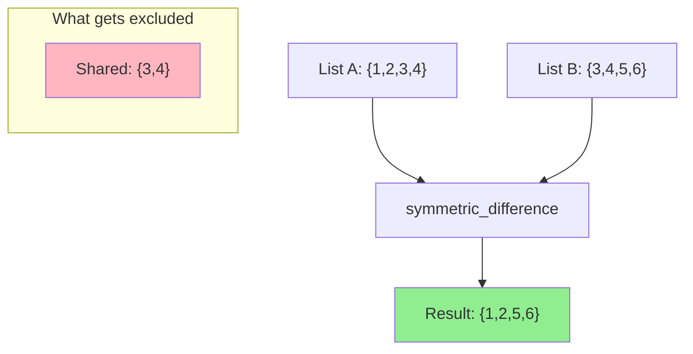

# How to Use the symmetric_difference Filter in Ansible

Author: [nawazdhandala](https://www.github.com/nawazdhandala)

Tags: Ansible, Filters, Set Operations, Automation, Configuration Management

Description: Learn how to use the symmetric_difference filter in Ansible to find items that exist in either of two lists but not in both for drift detection.

---

Among the set operation filters in Ansible, `symmetric_difference` is the one people reach for least often, yet it solves a very specific and useful problem. It returns items that are in either of the two lists, but not in both. In other words, it gives you everything that is different between two lists, from both sides.

If list A has `[1, 2, 3, 4]` and list B has `[3, 4, 5, 6]`, the symmetric difference is `[1, 2, 5, 6]`. The shared elements (3 and 4) are excluded.

## Basic Usage

```yaml
# Find items unique to each list (not shared between them)
- name: Symmetric difference example
  ansible.builtin.debug:
    msg: "{{ list_a | symmetric_difference(list_b) }}"
  vars:
    list_a: [1, 2, 3, 4]
    list_b: [3, 4, 5, 6]
```

Output: `[1, 2, 5, 6]`

This is the same as combining `A | difference(B)` and `B | difference(A)`:

```yaml
# symmetric_difference is equivalent to combining both directions of difference
- name: Equivalent manual approach
  ansible.builtin.debug:
    msg: "{{ (list_a | difference(list_b)) | union(list_b | difference(list_a)) }}"
  vars:
    list_a: [1, 2, 3, 4]
    list_b: [3, 4, 5, 6]
```

Same output: `[1, 2, 5, 6]`

But `symmetric_difference` does it in a single filter call, which is cleaner.

## Configuration Drift Detection

The most practical use case for symmetric_difference is detecting drift between desired and actual states:

```yaml
# Detect configuration drift between desired and actual state
- name: Get currently enabled Apache modules
  ansible.builtin.shell: apache2ctl -M 2>/dev/null | awk '{print $1}' | sort
  register: current_modules_raw
  changed_when: false

- name: Detect module drift
  ansible.builtin.debug:
    msg: |
      Configuration drift detected!
      Modules that differ: {{ drift_modules }}
      Modules on server but not desired: {{ current_modules | difference(desired_modules) }}
      Modules desired but not on server: {{ desired_modules | difference(current_modules) }}
  vars:
    desired_modules:
      - rewrite_module
      - ssl_module
      - proxy_module
      - headers_module
    current_modules: "{{ current_modules_raw.stdout_lines }}"
    drift_modules: "{{ desired_modules | symmetric_difference(current_modules) }}"
  when: drift_modules | length > 0
```

If there is no drift, `symmetric_difference` returns an empty list, and the task is skipped. Any mismatch in either direction triggers the alert.

## Comparing File Lists

You can use symmetric_difference to find files that differ between two directories or two snapshots:

```yaml
# Compare expected files against actual files in a deployment
- name: List deployed files
  ansible.builtin.find:
    paths: /var/www/app/
    file_type: file
  register: deployed_files

- name: Check deployment integrity
  ansible.builtin.set_fact:
    deployed_names: "{{ deployed_files.files | map(attribute='path') | map('basename') | list }}"

- name: Find file differences
  ansible.builtin.debug:
    msg: |
      File discrepancies found: {{ discrepancies | length }}
      Extra files: {{ deployed_names | difference(expected_files) }}
      Missing files: {{ expected_files | difference(deployed_names) }}
      All discrepancies: {{ discrepancies }}
  vars:
    expected_files:
      - index.html
      - app.js
      - style.css
      - config.json
      - favicon.ico
    discrepancies: "{{ expected_files | symmetric_difference(deployed_names) }}"
  when: discrepancies | length > 0
```

## Inventory Reconciliation

When reconciling your Ansible inventory with an external source of truth:

```yaml
# Reconcile Ansible inventory with cloud provider
- name: Get instances from cloud API
  amazon.aws.ec2_instance_info:
    filters:
      instance-state-name: running
      "tag:Environment": production
  register: cloud_instances

- name: Compare cloud instances with inventory
  ansible.builtin.debug:
    msg: |
      Inventory/Cloud Reconciliation:
      Total discrepancies: {{ mismatches | length }}
      In inventory but not in cloud: {{ inventory_hosts | difference(cloud_hosts) }}
      In cloud but not in inventory: {{ cloud_hosts | difference(inventory_hosts) }}
  vars:
    inventory_hosts: "{{ groups['production'] | sort }}"
    cloud_hosts: "{{ cloud_instances.instances | map(attribute='tags.Name') | sort | list }}"
    mismatches: "{{ inventory_hosts | symmetric_difference(cloud_hosts) }}"
  failed_when: mismatches | length > 0
```

This task will fail if there are any discrepancies between what your inventory says and what actually exists in the cloud, acting as a safety check before running deployments.

## Security Audit: Expected vs Actual Open Ports

```yaml
# Audit open ports against the security baseline
- name: Scan open ports
  ansible.builtin.shell: ss -tlnp | awk 'NR>1 {print $4}' | grep -oP '\d+$' | sort -n | uniq
  register: open_ports_raw
  changed_when: false

- name: Security port audit
  ansible.builtin.set_fact:
    open_ports: "{{ open_ports_raw.stdout_lines | map('int') | list }}"
    baseline_ports: [22, 80, 443]

- name: Report port discrepancies
  ansible.builtin.debug:
    msg: |
      Port Security Audit
      ===================
      Expected ports: {{ baseline_ports }}
      Actual open ports: {{ open_ports }}
      Discrepancies: {{ baseline_ports | symmetric_difference(open_ports) | sort }}
      Unauthorized ports: {{ open_ports | difference(baseline_ports) | sort }}
      Missing ports: {{ baseline_ports | difference(open_ports) | sort }}
  when: (baseline_ports | symmetric_difference(open_ports)) | length > 0
```

## Using symmetric_difference in Templates

```jinja2
{# templates/drift_report.html.j2 - Generate a drift report #}
<html>
<head><title>Configuration Drift Report</title></head>
<body>
<h1>Drift Report for {{ inventory_hostname }}</h1>
<p>Generated: {{ ansible_date_time.iso8601 }}</p>



<h2 style="color: red;">DRIFT DETECTED</h2>
<table border="1">
<tr><th>Service</th><th>Status</th></tr>

<tr>
  <td>{{ svc }}</td>
  <td>
    
      Running but not desired (should be stopped)
    
      Desired but not running (should be started)
    
  </td>
</tr>

</table>

<h2 style="color: green;">NO DRIFT - All services match desired state</h2>

</body>
</html>
```

## Combining symmetric_difference with when Conditions

Use it as a guard condition for remediation tasks:

```yaml
# Only run remediation if there is drift
- name: Check for package drift
  ansible.builtin.set_fact:
    package_drift: "{{ desired_packages | symmetric_difference(installed_packages) }}"

- name: Remediate package drift
  block:
    - name: Install missing packages
      ansible.builtin.apt:
        name: "{{ item }}"
        state: present
      loop: "{{ desired_packages | difference(installed_packages) }}"

    - name: Remove extra packages
      ansible.builtin.apt:
        name: "{{ item }}"
        state: absent
      loop: "{{ installed_packages | difference(desired_packages) }}"
  when: package_drift | length > 0
```

## Visualizing symmetric_difference



## Relationship Between Set Operations

Here is how symmetric_difference fits with the other set filters:

```yaml
# Complete set operation comparison
- name: All set operations on the same data
  ansible.builtin.debug:
    msg: |
      A: {{ a }}
      B: {{ b }}
      union (A or B):                {{ a | union(b) | sort }}
      intersect (A and B):           {{ a | intersect(b) | sort }}
      difference (A not B):          {{ a | difference(b) | sort }}
      difference (B not A):          {{ b | difference(a) | sort }}
      symmetric_difference (A xor B): {{ a | symmetric_difference(b) | sort }}
  vars:
    a: [1, 2, 3, 4, 5]
    b: [4, 5, 6, 7, 8]
```

Output:
```
union:                [1, 2, 3, 4, 5, 6, 7, 8]
intersect:            [4, 5]
difference (A not B): [1, 2, 3]
difference (B not A): [6, 7, 8]
symmetric_difference: [1, 2, 3, 6, 7, 8]
```

Notice that `symmetric_difference` is the union minus the intersection. That is the mathematical identity: `A XOR B = (A UNION B) - (A INTERSECT B)`.

## Summary

The symmetric_difference filter is your tool for finding everything that is different between two lists, from both directions simultaneously. It is especially useful for drift detection, inventory reconciliation, security audits, and any scenario where you need to quickly identify discrepancies between desired and actual states. While you could achieve the same result by combining difference and union, symmetric_difference does it in one clean call. Use it alongside the other set filters (union, intersect, difference) for a complete toolkit of list comparison operations in your Ansible automation.
