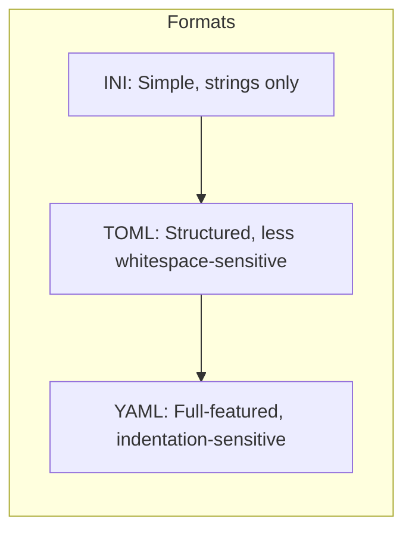

# How to Use the TOML Inventory Plugin in Ansible

Author: [nawazdhandala](https://www.github.com/nawazdhandala)

Tags: Ansible, Inventory, TOML, DevOps, Configuration

Description: Learn how to write Ansible inventory files in TOML format as an alternative to INI and YAML, with structured examples for groups, variables, and host definitions.

---

TOML (Tom's Obvious, Minimal Language) is a configuration file format that emphasizes readability. If you work with tools like Rust's Cargo, Python's pyproject.toml, or Hugo, you already know TOML. Ansible supports TOML as an inventory format through the ansible-core package, giving you another option alongside INI and YAML.

## Why TOML for Inventory?

TOML sits between INI and YAML in terms of complexity. It supports proper data types (strings, integers, booleans, arrays, tables) like YAML, but has a simpler syntax that some people find less error-prone than YAML's indentation rules.

Here is a quick comparison:


```mermaid
graph LR
    subgraph Formats
        INI["INI: Simple, strings only"]
        TOML["TOML: Structured, less whitespace-sensitive"]
        YAML["YAML: Full-featured, indentation-sensitive"]
    end
    INI --> TOML
    TOML --> YAML
```

## Prerequisites

Install the ansible-core package which includes the TOML inventory plugin:

```bash
# Install Ansible if needed
python -m pip install ansible-core

# Python 3.11+ includes tomllib. For older Python versions, install a TOML parser:
python -m pip install tomli
```

## Enabling the TOML Inventory Plugin

The TOML plugin is enabled by default in current Ansible versions. If you customize `enable_plugins` in your `ansible.cfg`, make sure `toml` stays in the list:

```ini
# ansible.cfg
[inventory]
enable_plugins = host_list, script, auto, yaml, ini, toml
```

## Basic TOML Inventory

Create a file ending in `.toml`:

```toml
# inventory.toml
# Basic TOML inventory with groups and hosts

[webservers.hosts.web1]
ansible_host = "10.0.1.10"

[webservers.hosts.web2]
ansible_host = "10.0.1.11"

[databases.hosts.db1]
ansible_host = "10.0.2.10"

[databases.hosts.db2]
ansible_host = "10.0.2.11"
```

Test the inventory:

```bash
# List all hosts from the TOML inventory
ansible-inventory -i inventory.toml --list

# Show the group tree
ansible-inventory -i inventory.toml --graph
```

## Adding Host Variables

TOML lets you add variables with proper types directly under each host:

```toml
# inventory.toml
# Hosts with typed variables

[webservers.hosts.web1]
ansible_host = "10.0.1.10"
ansible_user = "deploy"
http_port = 8080
ssl_enabled = true
max_workers = 4
allowed_origins = ["https://app.example.com", "https://api.example.com"]

[webservers.hosts.web2]
ansible_host = "10.0.1.11"
ansible_user = "deploy"
http_port = 8081
ssl_enabled = true
max_workers = 8
allowed_origins = ["https://app.example.com"]

[databases.hosts."db-primary"]
ansible_host = "10.0.2.10"
ansible_user = "dbadmin"
db_role = "primary"
max_connections = 200
replication_enabled = true
```

Note how `db-primary` uses quotes because quoted TOML keys are useful for host names that include characters outside the bare-key set. Hyphens are allowed in bare TOML keys, so `[databases.hosts.db-primary]` would also be valid. Booleans, integers, and arrays work naturally without any special handling.

## Adding Group Variables

Group variables go under a `vars` table within the group:

```toml
# inventory.toml
# Group variables

[webservers.vars]
ansible_user = "deploy"
http_port = 80
document_root = "/var/www/html"
nginx_worker_processes = "auto"

[webservers.hosts.web1]
ansible_host = "10.0.1.10"
http_port = 8080    # Override the group default

[webservers.hosts.web2]
ansible_host = "10.0.1.11"

[databases.vars]
ansible_user = "dbadmin"
postgresql_version = 16
listen_port = 5432

[databases.hosts."db-primary"]
ansible_host = "10.0.2.10"

[databases.hosts."db-replica"]
ansible_host = "10.0.2.11"
```

## Nested Groups

TOML handles nested groups through group tables and `children` lists:

```toml
# inventory.toml
# Nested group hierarchy

[all]
children = ["production", "staging"]

[production]
children = ["prod_web", "prod_db"]

[staging]
children = ["stg_web", "stg_db"]

# Production web servers
[prod_web.hosts."web-prod-01"]
ansible_host = "10.0.1.10"

[prod_web.hosts."web-prod-02"]
ansible_host = "10.0.1.11"

# Production database servers
[prod_db.hosts."db-prod-01"]
ansible_host = "10.0.2.10"

# Staging web servers
[stg_web.hosts."web-stg-01"]
ansible_host = "10.1.1.10"

# Staging database servers
[stg_db.hosts."db-stg-01"]
ansible_host = "10.1.2.10"

# Production environment variables
[production.vars]
env = "production"
monitoring_enabled = true

# Staging environment variables
[staging.vars]
env = "staging"
monitoring_enabled = false
```

## Complete Production Example

Here is a full TOML inventory for a multi-tier application:

```toml
# inventory.toml
# Production infrastructure inventory

[production]
children = ["webservers", "databases", "cache", "loadbalancers"]

# ---- Global Variables ----
[all.vars]
ansible_python_interpreter = "/usr/bin/python3"
ntp_servers = ["0.pool.ntp.org", "1.pool.ntp.org"]
dns_servers = ["10.0.0.2", "10.0.0.3"]
timezone = "UTC"

# ---- Web Servers ----
[webservers.vars]
ansible_user = "deploy"
nginx_version = "1.24"
ssl_enabled = true

[webservers.hosts."web-01"]
ansible_host = "10.0.1.10"
http_port = 8080

[webservers.hosts."web-02"]
ansible_host = "10.0.1.11"
http_port = 8081

[webservers.hosts."web-03"]
ansible_host = "10.0.1.12"
http_port = 8082

# ---- Database Servers ----
[databases.vars]
ansible_user = "dbadmin"
postgresql_version = 16
backup_enabled = true

[databases.hosts."db-primary"]
ansible_host = "10.0.2.10"
db_role = "primary"
max_connections = 300

[databases.hosts."db-replica-01"]
ansible_host = "10.0.2.11"
db_role = "replica"
max_connections = 200

[databases.hosts."db-replica-02"]
ansible_host = "10.0.2.12"
db_role = "replica"
max_connections = 200

# ---- Cache Servers ----
[cache.vars]
redis_version = "7.2"
redis_maxmemory = "4gb"

[cache.hosts."redis-01"]
ansible_host = "10.0.3.10"
redis_role = "master"

[cache.hosts."redis-02"]
ansible_host = "10.0.3.11"
redis_role = "replica"

# ---- Load Balancers ----
[loadbalancers.hosts."lb-01"]
ansible_host = "10.0.0.10"
haproxy_role = "active"

[loadbalancers.hosts."lb-02"]
ansible_host = "10.0.0.11"
haproxy_role = "standby"

# ---- Parent Group: Production ----
[production.vars]
env = "production"
monitoring_enabled = true
log_level = "warn"
```

## Using the TOML Inventory in Playbooks

Playbooks work the same way regardless of inventory format:

```yaml
# site.yml
# Works with TOML, YAML, or INI inventory
- hosts: webservers
  become: true
  tasks:
    - name: Install nginx
      apt:
        name: "nginx={{ nginx_version }}*"
        state: present

    - name: Configure application port
      template:
        src: app-config.j2
        dest: /etc/app/config.conf
      vars:
        port: "{{ http_port }}"

- hosts: databases
  become: true
  tasks:
    - name: Configure PostgreSQL
      template:
        src: postgresql.conf.j2
        dest: /etc/postgresql/{{ postgresql_version }}/main/postgresql.conf
```

```bash
# Run with TOML inventory
ansible-playbook -i inventory.toml site.yml
```

## TOML vs YAML vs INI

| Feature | INI | TOML | YAML |
|---------|-----|------|------|
| Data types | Limited; inline host vars are parsed as Python literals, but `:vars` entries are strings | Full types | Full types |
| Lists | Limited to inline host vars | Yes | Yes |
| Nested structures | Limited | Yes | Yes |
| Whitespace-sensitive | No | No | Yes |
| Learning curve | Low | Low | Medium |
| Comment syntax | `#` or `;` | `#` | `#` |
| Ansible default | Yes | Yes (built-in plugin) | Yes |

## Converting Between Formats

You can dump any inventory format to check its structure:

```bash
# Dump TOML inventory as JSON
ansible-inventory -i inventory.toml --list

# Dump TOML inventory as YAML
ansible-inventory -i inventory.toml --list --yaml > inventory.yml

# Dump inventory in TOML format
ansible-inventory -i inventory.toml --list --toml > exported-inventory.toml
```

You can use `ansible-inventory --toml` to export inventory in TOML format, but review the result before treating it as a hand-maintained inventory file.

## Limitations

The TOML inventory plugin has a few limitations compared to INI and YAML:

1. **Parser requirement**: You need Ansible 2.8 or later and an available TOML parser, such as Python 3.11+'s `tomllib` or `tomli`/`toml` on older Python versions
2. **Less common in Ansible ecosystem**: Most documentation and examples use INI or YAML
3. **No host range support**: Unlike INI format, TOML does not support `web-[01:10]` range patterns
4. **Verbose for large inventories**: The table syntax can get long with many nested groups

## When to Use TOML

TOML is a good choice when:
- Your team is already comfortable with TOML from other tools
- You want proper data types without YAML's indentation sensitivity
- Your inventory is small to medium-sized
- You prefer explicit structure over implicit (YAML indentation)

For most teams, YAML or INI will be the better default choice, but TOML is a solid option if it fits your workflow.
