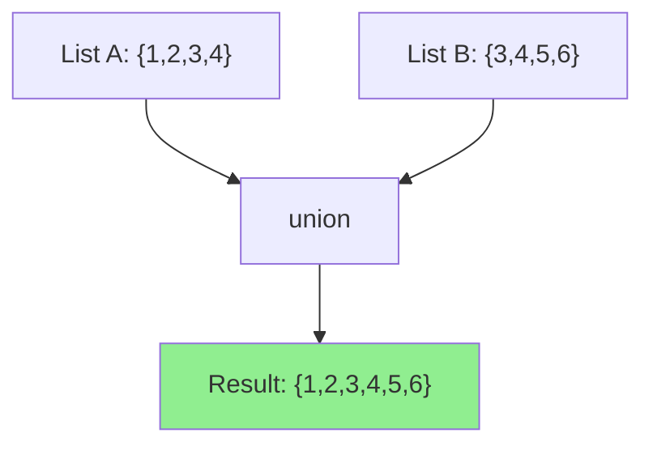

# How to Use the union Filter in Ansible

Author: [nawazdhandala](https://www.github.com/nawazdhandala)

Tags: Ansible, Filters, Set Operations, Automation, DevOps

Description: Learn how to use the union filter in Ansible to merge two lists together while automatically removing duplicate entries for clean configurations.

---

Merging lists is one of the most frequent operations in Ansible. You pull variables from group_vars, host_vars, defaults, and sometimes dynamic sources. When these lists need to be combined without duplicates, the `union` filter does exactly what you need. It takes two lists and returns a single list containing all unique elements from both.

If you have been using `list_a + list_b | unique` as a workaround, the `union` filter is the cleaner, more readable alternative.

## Basic Usage

```yaml
# Merge two lists and remove duplicates automatically
- name: Basic union example
  ansible.builtin.debug:
    msg: "{{ list_a | union(list_b) }}"
  vars:
    list_a: [1, 2, 3, 4]
    list_b: [3, 4, 5, 6]
```

Output: `[1, 2, 3, 4, 5, 6]`

The result contains every element from both lists, but each element appears only once. The order follows list_a first, then new elements from list_b.

## union vs Concatenation + unique

You might wonder why you would use `union` instead of just combining lists and deduplicating:

```yaml
# These two approaches produce the same result
- name: Using union
  ansible.builtin.debug:
    msg: "{{ list_a | union(list_b) }}"

- name: Using concatenation + unique
  ansible.builtin.debug:
    msg: "{{ (list_a + list_b) | unique }}"
```

Both work, but `union` is more concise and clearly communicates the intent. It is a set operation, and naming it as such makes your playbooks easier to understand.

## Practical Example: Combining Package Lists

The most common use case is merging package lists from different sources:

```yaml
# Merge required packages from multiple roles and install them all
- name: Install combined package list
  ansible.builtin.apt:
    name: "{{ base_packages | union(app_packages) | union(monitoring_packages) | sort }}"
    state: present
  vars:
    base_packages:
      - curl
      - wget
      - git
      - vim
      - htop
    app_packages:
      - nginx
      - python3
      - python3-pip
      - curl
      - git
    monitoring_packages:
      - prometheus-node-exporter
      - htop
      - sysstat
```

The result is a single deduplicated list. Notice that `curl`, `git`, and `htop` appear in multiple source lists but will only be installed once.

## Chaining Multiple Unions

You can chain union calls to merge more than two lists:

```yaml
# Chain union to merge multiple lists
- name: Combine firewall rules from all sources
  ansible.builtin.set_fact:
    all_allowed_ports: >-
      {{ global_ports
         | union(role_ports)
         | union(host_ports)
         | union(emergency_ports | default([]))
         | sort }}
  vars:
    global_ports: [22, 80, 443]
    role_ports: [8080, 8443]
    host_ports: [22, 9090]
    emergency_ports: [2222]
```

Result: `[22, 80, 443, 2222, 8080, 8443, 9090]`

## Building Dynamic Inventory Groups

Union is useful for creating combined groups:

```yaml
# Create a combined target group from multiple inventory groups
- name: Define maintenance targets
  ansible.builtin.set_fact:
    maintenance_targets: >-
      {{ groups['webservers'] | default([])
         | union(groups['appservers'] | default([]))
         | union(groups['workers'] | default([])) }}

- name: Notify all targets about maintenance
  ansible.builtin.command: /usr/local/bin/notify_maintenance.sh
  delegate_to: "{{ item }}"
  loop: "{{ maintenance_targets }}"
```

## Using union in Templates

Inside Jinja2 templates, union keeps your generated configs clean:

```jinja2
{# templates/sudoers.j2 - Combine sudo users from multiple sources #}
# /etc/sudoers.d/managed - Managed by Ansible
# Do not edit manually



{{ user }}    ALL=(ALL:ALL) NOPASSWD: ALL

```

The playbook:

```yaml
# Generate sudoers config with combined user lists
- name: Configure sudoers
  ansible.builtin.template:
    src: templates/sudoers.j2
    dest: /etc/sudoers.d/managed
    mode: '0440'
    validate: 'visudo -cf %s'
  vars:
    base_sudo_users:
      - admin
      - deploy
    team_sudo_users:
      - alice
      - bob
      - deploy
    emergency_sudo_users:
      - oncall
```

## DNS Record Aggregation

When managing DNS records from multiple sources:

```yaml
# Combine DNS records from application and infrastructure teams
- name: Generate zone file
  ansible.builtin.template:
    src: templates/zone.j2
    dest: /etc/bind/zones/db.example.com
  vars:
    infra_records:
      - "ns1    IN  A   10.0.0.1"
      - "ns2    IN  A   10.0.0.2"
      - "mail   IN  A   10.0.1.10"
    app_records:
      - "www    IN  A   10.0.2.10"
      - "api    IN  A   10.0.2.20"
      - "mail   IN  A   10.0.1.10"
    all_records: "{{ infra_records | union(app_records) }}"
```

The "mail" record appears in both lists but will only show up once in the zone file.

## Role Variable Merging

A common pattern in roles is merging default values with user-provided values:

```yaml
# roles/webserver/defaults/main.yml
default_vhosts:
  - example.com
  - www.example.com

# roles/webserver/tasks/main.yml
- name: Configure virtual hosts
  ansible.builtin.template:
    src: vhost.conf.j2
    dest: "/etc/nginx/sites-available/{{ item }}.conf"
  loop: "{{ default_vhosts | union(extra_vhosts | default([])) }}"
```

Users of the role can add extra vhosts without overriding the defaults:

```yaml
# playbook.yml
- hosts: webservers
  roles:
    - role: webserver
      extra_vhosts:
        - api.example.com
        - staging.example.com
```

The result includes all default vhosts plus the extra ones, with no duplicates.

## Conditional Union

You can conditionally include lists in a union:

```yaml
# Conditionally add development tools to the package list
- name: Build package list based on environment
  ansible.builtin.set_fact:
    final_packages: >-
      {{ base_packages
         | union(dev_packages if environment == 'development' else [])
         | union(debug_packages if enable_debugging | default(false) else [])
         | sort }}
  vars:
    base_packages: [nginx, python3, git]
    dev_packages: [strace, gdb, valgrind]
    debug_packages: [tcpdump, nmap, netcat]
    environment: development
```

## Combining with Other Set Operations

Union works nicely alongside intersect and difference for complex logic:

```yaml
# Calculate effective permissions using set operations
- name: Determine final access list
  ansible.builtin.debug:
    msg: |
      Base access: {{ base_access }}
      Granted: {{ granted_access }}
      Revoked: {{ revoked_access }}
      Final: {{ final_access }}
  vars:
    base_access: [read, list]
    granted_access: [write, execute]
    revoked_access: [execute]
    final_access: "{{ base_access | union(granted_access) | difference(revoked_access) | sort }}"
```

Output final access: `['list', 'read', 'write']`

## Flow Diagram



## Edge Cases

A few things to keep in mind:

1. Union with an empty list returns the other list unchanged.

2. Union with itself returns the deduplicated version of the list.

3. For dictionaries, union compares entire objects. Two dicts must be completely identical to be considered the same.

4. The order of the result follows the first list, then new items from the second list.

```yaml
# Edge case examples
- name: Union edge cases
  ansible.builtin.debug:
    msg: |
      With empty: {{ [1,2,3] | union([]) }}
      With self: {{ [1,1,2,2,3] | union([1,1,2,2,3]) }}
      Order preserved: {{ [3,1,2] | union([5,4]) }}
```

## Summary

The union filter is the cleanest way to merge two lists while removing duplicates in Ansible. Use it instead of concatenation plus unique for better readability. It handles package lists, user accounts, firewall rules, DNS records, and any other data that needs to be combined from multiple sources. Chain multiple union calls to merge more than two lists, and combine it with sort for idempotent output. Along with intersect and difference, union completes the set of operations you need for robust list management in your automation code.
