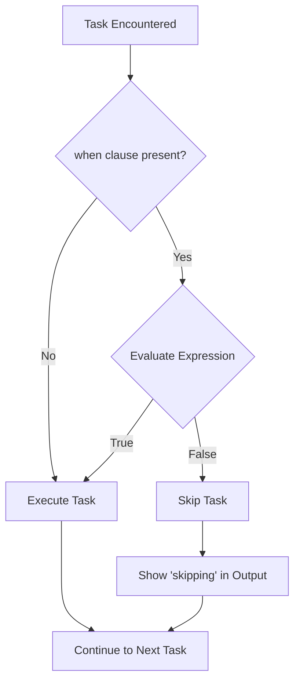

# How to Use the when Clause in Ansible Tasks

Author: [nawazdhandala](https://www.github.com/nawazdhandala)

Tags: Ansible, Conditionals, when Clause, Playbooks, Task Control

Description: Learn how to use the when clause in Ansible to control task execution with conditionals, facts, and variable-based logic.

---

The `when` clause is one of the most frequently used features in Ansible. It lets you skip or execute tasks based on conditions evaluated at runtime. Whether you need to run a task only on certain operating systems, skip it when a variable is not set, or conditionally apply configuration based on gathered facts, `when` is how you do it.

## Basic Syntax

The `when` clause takes a Jinja2 expression that evaluates to true or false. Unlike most Ansible parameters, you do not need double curly braces around the expression.

```yaml
# basic-when.yml - Simple conditional execution
---
- name: Basic when examples
  hosts: all
  gather_facts: true
  tasks:
    # Run only on Debian-based systems
    - name: Install apt packages
      ansible.builtin.apt:
        name: nginx
        state: present
      become: true
      when: ansible_os_family == "Debian"

    # Run only on RedHat-based systems
    - name: Install dnf packages
      ansible.builtin.dnf:
        name: nginx
        state: present
      become: true
      when: ansible_os_family == "RedHat"
```

Notice there are no `{{ }}` braces. The `when` clause implicitly treats its value as a Jinja2 expression. If you add braces, it will usually still work, but it can cause problems with certain expressions and is not the intended syntax.

## Comparing Variables

You can compare variables against specific values using standard comparison operators:

```yaml
# comparisons.yml - Variable comparisons in when
---
- name: Variable comparison examples
  hosts: all
  gather_facts: true
  vars:
    app_env: production
    max_workers: 8
    deploy_branch: main
  tasks:
    - name: Enable production logging
      ansible.builtin.template:
        src: production-logging.conf.j2
        dest: /etc/app/logging.conf
        mode: '0644'
      when: app_env == "production"

    - name: Warn about high worker count
      ansible.builtin.debug:
        msg: "Worker count {{ max_workers }} is unusually high"
      when: max_workers > 16

    - name: Skip if not deploying from main
      ansible.builtin.debug:
        msg: "Deploying from {{ deploy_branch }}"
      when: deploy_branch != "main"

    - name: Check memory threshold
      ansible.builtin.debug:
        msg: "System has sufficient memory"
      when: ansible_memtotal_mb >= 2048
```

## Using when with Boolean Variables

For boolean variables, the syntax is clean. Just use the variable name directly for true, or `not` for false:

```yaml
# boolean-when.yml - Boolean conditionals
---
- name: Boolean when examples
  hosts: all
  gather_facts: false
  vars:
    enable_ssl: true
    enable_debug: false
    maintenance_mode: false
  tasks:
    - name: Configure SSL
      ansible.builtin.debug:
        msg: "Setting up SSL"
      when: enable_ssl

    - name: Enable debug logging
      ansible.builtin.debug:
        msg: "Debug mode is on"
      when: enable_debug

    - name: Run only when NOT in maintenance mode
      ansible.builtin.debug:
        msg: "System is operational"
      when: not maintenance_mode
```

## Using when with Facts

Ansible facts gathered from remote hosts are available for conditionals:

```yaml
# fact-based-when.yml - Conditionals based on gathered facts
---
- name: Fact-based conditionals
  hosts: all
  gather_facts: true
  tasks:
    - name: Configure for Ubuntu specifically
      ansible.builtin.debug:
        msg: "Running Ubuntu-specific configuration"
      when: ansible_distribution == "Ubuntu"

    - name: Only on Ubuntu 22.04 or later
      ansible.builtin.debug:
        msg: "Ubuntu {{ ansible_distribution_version }}"
      when:
        - ansible_distribution == "Ubuntu"
        - ansible_distribution_version is version('22.04', '>=')

    - name: Run only on virtual machines
      ansible.builtin.debug:
        msg: "This is a VM ({{ ansible_virtualization_type }})"
      when: ansible_virtualization_role == "guest"

    - name: Configure swap only if less than 4GB RAM
      ansible.builtin.debug:
        msg: "Setting up swap file"
      when: ansible_memtotal_mb < 4096
```

## Using when with in Operator

Check if a value exists in a list:

```yaml
# in-operator.yml - Check membership in a list
---
- name: in operator examples
  hosts: all
  gather_facts: true
  vars:
    allowed_envs:
      - production
      - staging
    current_env: staging
  tasks:
    - name: Only run in allowed environments
      ansible.builtin.debug:
        msg: "Running in {{ current_env }}"
      when: current_env in allowed_envs

    - name: Run on specific OS families
      ansible.builtin.debug:
        msg: "Supported OS: {{ ansible_os_family }}"
      when: ansible_os_family in ["Debian", "RedHat"]

    - name: Check group membership
      ansible.builtin.debug:
        msg: "This host is a web server"
      when: "'webservers' in group_names"
```

## when with Jinja2 Tests

Jinja2 tests provide readable type checking and pattern matching:

```yaml
# jinja2-tests.yml - Using Jinja2 tests in when
---
- name: Jinja2 test examples
  hosts: localhost
  gather_facts: false
  vars:
    app_version: "2.5.1"
    optional_feature: null
    server_count: 5
  tasks:
    - name: Check if variable is defined
      ansible.builtin.debug:
        msg: "app_version is defined"
      when: app_version is defined

    - name: Check if variable is not none
      ansible.builtin.debug:
        msg: "optional_feature is set"
      when: optional_feature is not none

    - name: Check if value matches a pattern
      ansible.builtin.debug:
        msg: "Valid semver format"
      when: app_version is match('^\d+\.\d+\.\d+$')

    - name: Check if number is even
      ansible.builtin.debug:
        msg: "Server count is even"
      when: server_count is even

    - name: Check if number is divisible by
      ansible.builtin.debug:
        msg: "Server count is divisible by 5"
      when: server_count is divisibleby(5)
```

## when with Blocks

Apply a condition to multiple tasks at once using blocks:

```yaml
# when-with-block.yml - Apply condition to a group of tasks
---
- name: Conditional block example
  hosts: all
  gather_facts: true
  tasks:
    - name: Debian-specific setup
      when: ansible_os_family == "Debian"
      block:
        - name: Update apt cache
          ansible.builtin.apt:
            update_cache: true
          become: true

        - name: Install Debian packages
          ansible.builtin.apt:
            name:
              - build-essential
              - libssl-dev
            state: present
          become: true

        - name: Enable unattended upgrades
          ansible.builtin.apt:
            name: unattended-upgrades
            state: present
          become: true

    - name: RedHat-specific setup
      when: ansible_os_family == "RedHat"
      block:
        - name: Install EPEL repository
          ansible.builtin.dnf:
            name: epel-release
            state: present
          become: true

        - name: Install RedHat packages
          ansible.builtin.dnf:
            name:
              - gcc
              - openssl-devel
            state: present
          become: true
```

## when with Loops

When `when` and `loop` are used together, the condition is evaluated for each item:

```yaml
# when-with-loop.yml - Conditional within a loop
---
- name: Conditional loop execution
  hosts: localhost
  gather_facts: false
  vars:
    services:
      - name: nginx
        enabled: true
      - name: redis
        enabled: true
      - name: elasticsearch
        enabled: false
      - name: memcached
        enabled: false
  tasks:
    - name: Start only enabled services
      ansible.builtin.debug:
        msg: "Starting {{ item.name }}"
      loop: "{{ services }}"
      when: item.enabled
      loop_control:
        label: "{{ item.name }}"
```

## The Execution Flow



## Common Mistakes

Avoid wrapping the `when` expression in Jinja2 braces:

```yaml
# Wrong (works sometimes but can cause issues)
when: "{{ my_var == 'value' }}"

# Right
when: my_var == 'value'
```

Do not use `when: true` or `when: false` literally. While it works, it is pointless:

```yaml
# Pointless - just remove the when clause
when: true

# If you need to temporarily disable a task, use a variable
when: feature_x_enabled | default(false)
```

Be careful with string vs boolean comparisons:

```yaml
# This might not work if enable_feature is the string "true"
when: enable_feature == true

# Safer approach
when: enable_feature | bool
```

## Best Practices

Keep `when` expressions simple and readable. If a condition is complex, compute it as a `set_fact` first and then reference the fact in `when`. Use blocks to apply a single condition to multiple tasks instead of repeating the same `when` on each task. Always test both the true and false paths of your conditionals. Use `ansible_os_family` or `ansible_distribution` for OS-specific tasks rather than checking package manager availability. Prefer Jinja2 tests (`is defined`, `is match`, `is version`) over manual string manipulation for readability.

The `when` clause is fundamental to writing Ansible playbooks that adapt to different environments and conditions. Master it, and your playbooks become flexible enough to handle any infrastructure variation you throw at them.
