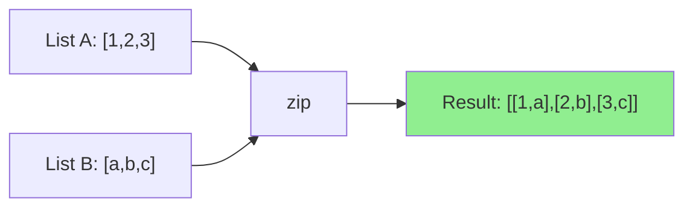

# How to Use the zip and zip_longest Filters in Ansible

Author: [nawazdhandala](https://www.github.com/nawazdhandala)

Tags: Ansible, Filters, Data Transformation, Jinja2, Automation

Description: Learn how to use the zip and zip_longest filters in Ansible to pair up elements from multiple lists for parallel iteration and data combination.

---

When you have two or more related lists and need to combine them element-by-element, the `zip` and `zip_longest` filters are exactly what you need. They take multiple lists and pair up corresponding elements, producing a list of tuples. This is invaluable for cases where data arrives in parallel lists rather than as a single list of dictionaries.

## Basic zip Usage

The zip filter pairs elements from two lists by position:

```yaml
# Pair up elements from two lists
- name: Basic zip example
  ansible.builtin.debug:
    msg: "{{ names | zip(ips) | list }}"
  vars:
    names: ['web01', 'web02', 'web03']
    ips: ['10.0.1.10', '10.0.1.11', '10.0.1.12']
```

Output:
```json
[["web01", "10.0.1.10"], ["web02", "10.0.1.11"], ["web03", "10.0.1.12"]]
```

Each element from `names` is paired with the element at the same position from `ips`.

## Looping Over Zipped Lists

The most common use is iterating over paired data:

```yaml
# Loop over paired hostnames and IP addresses
- name: Add hosts to /etc/hosts
  ansible.builtin.lineinfile:
    path: /etc/hosts
    regexp: ".*{{ item.0 }}$"
    line: "{{ item.1 }}    {{ item.0 }}"
  loop: "{{ hostnames | zip(ip_addresses) | list }}"
  vars:
    hostnames: ['web01', 'db01', 'cache01']
    ip_addresses: ['10.0.1.10', '10.0.2.10', '10.0.3.10']
```

## Building Dictionaries from Parallel Lists

Zip is the key to converting parallel lists into dictionaries:

```yaml
# Create a dictionary from separate key and value lists
- name: Build dictionary from parallel lists
  ansible.builtin.debug:
    msg: "{{ dict(keys | zip(values)) }}"
  vars:
    keys: ['hostname', 'ip', 'port', 'environment']
    values: ['web01', '10.0.1.10', 8080, 'production']
```

Output:
```json
{"hostname": "web01", "ip": "10.0.1.10", "port": 8080, "environment": "production"}
```

## Zipping More Than Two Lists

You can zip multiple lists together:

```yaml
# Zip three lists together
- name: Combine server details from three lists
  ansible.builtin.debug:
    msg: "Host: {{ item.0 }}, IP: {{ item.1 }}, Role: {{ item.2 }}"
  loop: "{{ names | zip(ips, roles) | list }}"
  vars:
    names: ['web01', 'db01', 'cache01']
    ips: ['10.0.1.10', '10.0.2.10', '10.0.3.10']
    roles: ['frontend', 'database', 'cache']
```

## zip vs zip_longest

The key difference: `zip` stops at the shortest list, while `zip_longest` continues until the longest list is exhausted, filling in a default value for missing elements.

```yaml
# Compare zip and zip_longest behavior with unequal lists
- name: zip stops at shortest
  ansible.builtin.debug:
    msg: "zip: {{ list_a | zip(list_b) | list }}"
  vars:
    list_a: [1, 2, 3, 4, 5]
    list_b: ['a', 'b', 'c']

- name: zip_longest fills in missing values
  ansible.builtin.debug:
    msg: "zip_longest: {{ list_a | zip_longest(list_b, fillvalue='N/A') | list }}"
  vars:
    list_a: [1, 2, 3, 4, 5]
    list_b: ['a', 'b', 'c']
```

Output:
```
zip: [[1, 'a'], [2, 'b'], [3, 'c']]
zip_longest: [[1, 'a'], [2, 'b'], [3, 'c'], [4, 'N/A'], [5, 'N/A']]
```

## Practical Example: Mapping Ports to Services

When you have separate lists of services and their ports:

```yaml
# Create service-to-port mappings from parallel lists
- name: Open firewall ports for services
  community.general.ufw:
    rule: allow
    port: "{{ item.1 }}"
    proto: tcp
    comment: "{{ item.0 }}"
  loop: "{{ service_names | zip(service_ports) | list }}"
  vars:
    service_names: ['SSH', 'HTTP', 'HTTPS', 'App', 'Metrics']
    service_ports: ['22', '80', '443', '8080', '9090']
```

## Generating Configuration from Parallel Data

```yaml
# Generate HAProxy backend from parallel server lists
- name: Build HAProxy config
  ansible.builtin.template:
    src: haproxy_backend.j2
    dest: /etc/haproxy/backends.cfg
  vars:
    server_names: ['app01', 'app02', 'app03']
    server_ips: ['10.0.1.10', '10.0.1.11', '10.0.1.12']
    server_ports: [8080, 8080, 8080]
    server_weights: [100, 100, 50]
```

The template:

```jinja2
{# templates/haproxy_backend.j2 - HAProxy backend from zipped data #}
backend app_servers
    balance roundrobin

    server {{ name }} {{ ip }}:{{ port }} weight {{ weight }} check

```

Output:
```
backend app_servers
    balance roundrobin
    server app01 10.0.1.10:8080 weight 100 check
    server app02 10.0.1.11:8080 weight 100 check
    server app03 10.0.1.12:8080 weight 50 check
```

## Creating Environment Variable Files

```yaml
# Build .env file from separate key and value lists
- name: Generate environment file
  ansible.builtin.template:
    src: env_file.j2
    dest: /opt/app/.env
    mode: '0600'
  vars:
    env_keys:
      - DATABASE_URL
      - REDIS_URL
      - API_KEY
      - LOG_LEVEL
      - PORT
    env_values:
      - "postgresql://user:pass@db:5432/app"
      - "redis://cache:6379"
      - "{{ vault_api_key }}"
      - "info"
      - "3000"
```

```jinja2
{# templates/env_file.j2 - Environment file from zipped lists #}
# Application Environment - Managed by Ansible

{{ key }}={{ value }}

```

## Using zip_longest for Alignment

When generating tabular output where rows might have different column counts:

```jinja2
{# templates/status_table.txt.j2 - Aligned status table #}
Service Status Report
=====================



{{ "%-15s" | format(header) }}: {{ value }}

---

```

## Transposing Data

Zip can transpose rows into columns:

```yaml
# Transpose a matrix (list of lists)
- name: Transpose data
  ansible.builtin.debug:
    msg: "{{ matrix[0] | zip(matrix[1], matrix[2]) | list }}"
  vars:
    matrix:
      - [1, 2, 3]
      - [4, 5, 6]
      - [7, 8, 9]
```

Output: `[[1, 4, 7], [2, 5, 8], [3, 6, 9]]`

Rows become columns and columns become rows.

## Pairing Old and New Values for Migration

```yaml
# Map old paths to new paths for a migration
- name: Migrate files from old to new paths
  ansible.builtin.command: mv {{ item.0 }} {{ item.1 }}
  loop: "{{ old_paths | zip(new_paths) | list }}"
  vars:
    old_paths:
      - /var/app/config.v1.yml
      - /var/app/data.v1.db
      - /var/app/logs.v1/
    new_paths:
      - /opt/app/config/settings.yml
      - /opt/app/data/main.db
      - /var/log/app/
  args:
    creates: "{{ item.1 }}"
```

## Combining with items2dict

Convert zipped data into a dictionary:

```yaml
# Build a lookup table from parallel lists
- name: Create server lookup
  ansible.builtin.set_fact:
    server_lookup: >-
      {{ hostnames | zip(ip_addresses)
         | map('list')
         | map('zip', ['key', 'value'] | map('list'))
         | list
         | items2dict }}
```

A simpler approach:

```yaml
# Simpler dictionary creation from parallel lists
- name: Create lookup dictionary
  ansible.builtin.set_fact:
    server_lookup: "{{ dict(hostnames | zip(ip_addresses)) }}"
  vars:
    hostnames: ['web01', 'db01', 'cache01']
    ip_addresses: ['10.0.1.10', '10.0.2.10', '10.0.3.10']
```

## Flow Diagram



## Summary

The `zip` and `zip_longest` filters pair up elements from multiple lists by position. Use `zip` when all lists are the same length or you want to stop at the shortest. Use `zip_longest` when lists may differ in length and you need a fill value for missing elements. These filters are essential for converting parallel lists into paired data, building dictionaries from separate key and value lists, generating tabular configurations, and any scenario where related data arrives in separate lists rather than pre-combined structures. Combine them with `dict()` for dictionary creation and with loop unpacking for clean iteration patterns.
