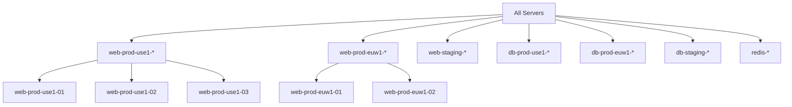

# How to Use Wildcard Patterns in Ansible Inventory

Author: [nawazdhandala](https://www.github.com/nawazdhandala)

Tags: Ansible, Inventory, Wildcard, Patterns, DevOps

Description: Learn how to use wildcard patterns in Ansible to match groups of hosts by name patterns, domain suffixes, and naming conventions for flexible infrastructure targeting.

---

Wildcard patterns let you target hosts based on their names without listing each one explicitly. If your servers follow a naming convention (and they should), wildcards let you select hosts that match a pattern like "all servers starting with web" or "everything in the example.com domain." This is faster than maintaining groups for every possible selection criteria.

## Basic Wildcard Syntax

Ansible uses standard glob-style wildcards where `*` matches any number of characters.

Given this inventory:

```ini
# inventory.ini
[webservers]
web-prod-01.example.com
web-prod-02.example.com
web-prod-03.example.com
web-staging-01.example.com
web-staging-02.example.com

[databases]
db-prod-primary.example.com
db-prod-replica-01.example.com
db-prod-replica-02.example.com
db-staging-01.example.com

[cache]
redis-prod-01.example.com
redis-prod-02.example.com
redis-staging-01.example.com

[monitoring]
prometheus.internal.local
grafana.internal.local
alertmanager.internal.local
```

Use wildcards to match subsets of hosts:

```bash
# Match all hosts starting with "web"
ansible 'web*' -i inventory.ini -m ping

# Match all hosts in the example.com domain
ansible '*.example.com' -i inventory.ini -m ping

# Match all production hosts (contain "prod")
ansible '*prod*' -i inventory.ini -m ping

# Match all hosts in the internal.local domain
ansible '*.internal.local' -i inventory.ini -m ping
```

## Wildcards on the Command Line

Always quote wildcard patterns to prevent your shell from expanding them:

```bash
# Correct: single quotes prevent shell expansion
ansible '*prod*' -i inventory.ini -m ping

# Also correct: double quotes work too
ansible "*prod*" -i inventory.ini -m ping

# WRONG: unquoted * will be expanded by the shell
# ansible *prod* -i inventory.ini -m ping
```

## Wildcards in Playbooks

Use wildcards directly in the `hosts` field:

```yaml
# patch-production.yml
# Target all production servers using wildcard
- hosts: "*prod*"
  become: true
  tasks:
    - name: Apply security patches
      apt:
        update_cache: true
        upgrade: safe

    - name: Check if reboot required
      stat:
        path: /var/run/reboot-required
      register: reboot_file

    - name: Reboot if needed
      reboot:
        msg: "Rebooting for security patches"
      when: reboot_file.stat.exists
```

## Combining Wildcards with Other Patterns

Wildcards work with union, intersection, and exclusion:

```bash
# All prod hosts except databases
ansible '*prod*:!databases' -i inventory.ini -m ping

# All web hosts that are also in the prod naming convention
ansible 'web*:&*prod*' -i inventory.ini -m ping

# All .example.com hosts OR all .internal.local hosts
ansible '*.example.com:*.internal.local' -i inventory.ini -m ping

# All staging hosts except redis
ansible '*staging*:!redis*' -i inventory.ini -m ping
```

## Practical Wildcard Patterns

Here are patterns you will actually use in day-to-day operations:

```bash
# Target hosts by environment prefix
ansible 'prod-*' -i inventory.ini --list-hosts
ansible 'staging-*' -i inventory.ini --list-hosts
ansible 'dev-*' -i inventory.ini --list-hosts

# Target hosts by role in the hostname
ansible '*-web-*' -i inventory.ini --list-hosts
ansible '*-db-*' -i inventory.ini --list-hosts
ansible '*-cache-*' -i inventory.ini --list-hosts

# Target hosts by datacenter in the hostname
ansible '*-us-east-*' -i inventory.ini --list-hosts
ansible '*-eu-west-*' -i inventory.ini --list-hosts

# Target hosts by domain suffix
ansible '*.prod.example.com' -i inventory.ini --list-hosts
ansible '*.staging.example.com' -i inventory.ini --list-hosts
```

## Wildcards with the --limit Flag

The `--limit` flag also accepts wildcards:

```bash
# Run a playbook that targets "webservers" but limit to only prod hosts
ansible-playbook -i inventory.ini deploy.yml --limit 'web-prod-*'

# Limit to staging only
ansible-playbook -i inventory.ini deploy.yml --limit '*staging*'

# Limit to a specific datacenter
ansible-playbook -i inventory.ini deploy.yml --limit '*us-east*'
```

This is powerful because the playbook's `hosts` field stays generic while `--limit` narrows the execution.

## A Real-World Scenario

Imagine you have a fleet of 100 servers across three environments and two data centers:

```ini
# inventory.ini
[all_servers]
web-prod-use1-01.example.com
web-prod-use1-02.example.com
web-prod-use1-03.example.com
web-prod-euw1-01.example.com
web-prod-euw1-02.example.com
web-staging-use1-01.example.com
web-staging-use1-02.example.com
db-prod-use1-01.example.com
db-prod-use1-02.example.com
db-prod-euw1-01.example.com
db-staging-use1-01.example.com
redis-prod-use1-01.example.com
redis-prod-euw1-01.example.com
redis-staging-use1-01.example.com
```

With consistent naming, wildcards give you precise targeting:

```bash
# All servers in US East 1
ansible '*-use1-*' -i inventory.ini --list-hosts

# All servers in EU West 1
ansible '*-euw1-*' -i inventory.ini --list-hosts

# All production web servers in US East 1
ansible 'web-prod-use1-*' -i inventory.ini --list-hosts

# All staging servers regardless of role or region
ansible '*-staging-*' -i inventory.ini --list-hosts

# All Redis servers across all environments
ansible 'redis-*' -i inventory.ini --list-hosts
```



## Wildcard Limitations

Wildcards are simple glob patterns, not regular expressions. They have a few limitations:

1. **No character classes**: You cannot do `web-[0-9]*` with wildcards. Use regex patterns (`~web-[0-9].*`) for that.

2. **No alternation**: You cannot do `web|db` with wildcards. Use union patterns instead: `web*:db*`.

3. **Case-sensitive**: `Web*` and `web*` are different patterns. Ansible host matching is case-sensitive.

4. **Matches against inventory hostname**: Wildcards match against the name in the inventory file, not the `ansible_host` value. If your inventory uses short names like `web1`, the wildcard must match that, not the IP address.

## Previewing Wildcard Matches

Always preview before running:

```bash
# List hosts matching a wildcard
ansible '*prod*' -i inventory.ini --list-hosts

# List hosts for a playbook with a limit
ansible-playbook -i inventory.ini site.yml --limit '*staging*' --list-hosts

# Count matching hosts
ansible '*prod*' -i inventory.ini --list-hosts | tail -n +2 | wc -l
```

## Best Practices for Wildcard-Friendly Naming

To get the most out of wildcards, adopt a consistent naming convention:

```
{role}-{environment}-{region}-{index}.{domain}
```

Examples:
- `web-prod-use1-01.example.com`
- `db-staging-euw1-01.example.com`
- `redis-prod-apse1-01.example.com`

With this convention, every dimension of your infrastructure is targetable with a wildcard:
- Role: `web-*`, `db-*`, `redis-*`
- Environment: `*-prod-*`, `*-staging-*`
- Region: `*-use1-*`, `*-euw1-*`
- Specific: `web-prod-use1-01*`

Wildcard patterns are a quick, flexible way to target hosts when your naming conventions are solid. They work on the command line, in playbooks, and with the `--limit` flag. For more complex matching, look into regex patterns, but for most day-to-day operations, wildcards get the job done with minimal syntax.
