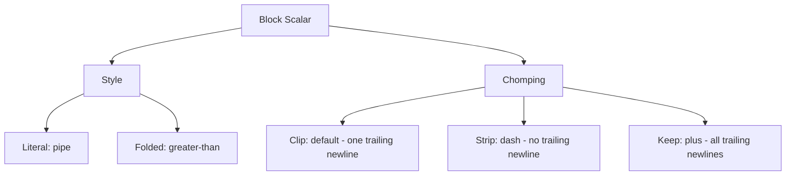

# How to Use YAML Block Scalars in Ansible

Author: [nawazdhandala](https://www.github.com/nawazdhandala)

Tags: Ansible, YAML, Block Scalars, Configuration, DevOps

Description: Comprehensive guide to YAML block scalars in Ansible covering literal blocks, folded blocks, indentation indicators, and chomping modifiers.

---

Block scalars are YAML's way of handling multi-line string content. They come in two flavors (literal and folded), with three chomping options (clip, strip, keep), and optional indentation indicators. Understanding all the combinations eliminates guesswork when writing Ansible playbooks that deal with multi-line content.

## The Block Scalar Matrix

Every block scalar combines a style with a chomping modifier:



This gives you six combinations: `|`, `|-`, `|+`, `>`, `>-`, `>+`.

## All Six Combinations Demonstrated

```yaml
# 1. Literal + Clip (|) - preserves newlines, one trailing
literal_clip: |
  line one
  line two
# Result: "line one\nline two\n"

# 2. Literal + Strip (|-) - preserves newlines, no trailing
literal_strip: |-
  line one
  line two
# Result: "line one\nline two"

# 3. Literal + Keep (|+) - preserves newlines, keeps all trailing
literal_keep: |+
  line one
  line two

# Result: "line one\nline two\n\n" (extra blank line preserved)

# 4. Folded + Clip (>) - folds newlines, one trailing
folded_clip: >
  line one
  line two
# Result: "line one line two\n"

# 5. Folded + Strip (>-) - folds newlines, no trailing
folded_strip: >-
  line one
  line two
# Result: "line one line two"

# 6. Folded + Keep (>+) - folds newlines, keeps all trailing
folded_keep: >+
  line one
  line two

# Result: "line one line two\n\n"
```

## Indentation Indicators

When your content starts with spaces, you need to tell YAML how much indentation belongs to the block structure versus the content. Use a number after the style indicator.

```yaml
# Without indentation indicator - YAML guesses from first line
normal: |
  no leading spaces
  on any line

# With indentation indicator (2) - explicit indentation level
indented: |2
    this content has 2 extra spaces
    that are part of the actual string
```

## Practical Ansible Examples

### Script Content

```yaml
# Use |  for scripts where newlines and indentation matter
- name: Create deployment script
  ansible.builtin.copy:
    dest: /opt/deploy.sh
    mode: '0755'
    content: |
      #!/bin/bash
      set -euo pipefail

      echo "Deploying version $1"

      if [ -z "$1" ]; then
          echo "Error: version argument required"
          exit 1
      fi

      docker pull registry.example.com/app:$1
      docker stop app || true
      docker rm app || true
      docker run -d --name app registry.example.com/app:$1
```

### Configuration Files

```yaml
# Use | for config files
- name: Deploy sudoers configuration
  ansible.builtin.copy:
    dest: /etc/sudoers.d/deploy
    mode: '0440'
    validate: visudo -cf %s
    content: |
      # Managed by Ansible
      deploy ALL=(ALL) NOPASSWD: /usr/bin/systemctl restart app
      deploy ALL=(ALL) NOPASSWD: /usr/bin/systemctl status app
```

### Long Commands

```yaml
# Use >- for long commands that should be one line
- name: Build Docker image with many arguments
  ansible.builtin.command: >-
    docker build
    --tag {{ registry }}/{{ image }}:{{ version }}
    --build-arg BUILD_DATE={{ ansible_date_time.iso8601 }}
    --build-arg VCS_REF={{ git_sha }}
    --build-arg VERSION={{ version }}
    --file Dockerfile.production
    --no-cache
    .
```

### Error Messages

```yaml
# Use >- for long assertion messages
- name: Verify disk space is sufficient
  ansible.builtin.assert:
    that:
      - ansible_mounts | selectattr('mount', 'equalto', '/') | map(attribute='size_available') | first > min_disk_space
    fail_msg: >-
      Insufficient disk space on {{ inventory_hostname }}.
      Available: {{ ansible_mounts | selectattr('mount', 'equalto', '/') | map(attribute='size_available') | first | human_readable }}.
      Required: {{ min_disk_space | human_readable }}.
      Please free up space before proceeding with deployment.
```

## When to Use Which

| Scenario | Style | Example |
|----------|-------|---------|
| Shell scripts | `pipe` | Content with significant newlines |
| Config files | `pipe` | INI, YAML, TOML content |
| Long commands | `>-` | Docker, AWS CLI commands |
| When conditions | `>-` | Multi-line boolean expressions |
| Descriptions | `>` | Human-readable text |
| Inline templates | `pipe` | Jinja2 content |


## Common Use Cases

Here are several practical scenarios where this module proves essential in real-world playbooks.

### Infrastructure Provisioning Workflow

```yaml
# Complete workflow incorporating this module
- name: Infrastructure provisioning
  hosts: all
  become: true
  gather_facts: true
  tasks:
    - name: Gather system information
      ansible.builtin.setup:
        gather_subset:
          - hardware
          - network

    - name: Display system summary
      ansible.builtin.debug:
        msg: >-
          Host {{ inventory_hostname }} has
          {{ ansible_memtotal_mb }}MB RAM,
          {{ ansible_processor_vcpus }} vCPUs,
          running {{ ansible_distribution }} {{ ansible_distribution_version }}

    - name: Install required packages
      ansible.builtin.package:
        name:
          - curl
          - wget
          - git
          - vim
          - htop
          - jq
        state: present

    - name: Configure system timezone
      ansible.builtin.timezone:
        name: "{{ system_timezone | default('UTC') }}"

    - name: Configure hostname
      ansible.builtin.hostname:
        name: "{{ inventory_hostname }}"

    - name: Update /etc/hosts
      ansible.builtin.lineinfile:
        path: /etc/hosts
        regexp: '^127\.0\.1\.1'
        line: "127.0.1.1 {{ inventory_hostname }}"

    - name: Configure SSH hardening
      ansible.builtin.lineinfile:
        path: /etc/ssh/sshd_config
        regexp: "{{ item.regexp }}"
        line: "{{ item.line }}"
      loop:
        - { regexp: '^PermitRootLogin', line: 'PermitRootLogin no' }
        - { regexp: '^PasswordAuthentication', line: 'PasswordAuthentication no' }
      notify: restart sshd

    - name: Configure firewall rules
      community.general.ufw:
        rule: allow
        port: "{{ item }}"
        proto: tcp
      loop:
        - "22"
        - "80"
        - "443"

    - name: Enable firewall
      community.general.ufw:
        state: enabled
        policy: deny

  handlers:
    - name: restart sshd
      ansible.builtin.service:
        name: sshd
        state: restarted
```

### Integration with Monitoring

```yaml
# Using gathered facts to configure monitoring thresholds
- name: Configure monitoring based on system specs
  hosts: all
  become: true
  tasks:
    - name: Set monitoring thresholds based on hardware
      ansible.builtin.template:
        src: monitoring_config.yml.j2
        dest: /etc/monitoring/config.yml
      vars:
        memory_warning_threshold: "{{ (ansible_memtotal_mb * 0.8) | int }}"
        memory_critical_threshold: "{{ (ansible_memtotal_mb * 0.95) | int }}"
        cpu_warning_threshold: 80
        cpu_critical_threshold: 95

    - name: Register host with monitoring system
      ansible.builtin.uri:
        url: "https://monitoring.example.com/api/hosts"
        method: POST
        body_format: json
        body:
          hostname: "{{ inventory_hostname }}"
          ip_address: "{{ ansible_default_ipv4.address }}"
          os: "{{ ansible_distribution }}"
          memory_mb: "{{ ansible_memtotal_mb }}"
          cpus: "{{ ansible_processor_vcpus }}"
        headers:
          Authorization: "Bearer {{ monitoring_api_token }}"
        status_code: [200, 201, 409]
```

### Error Handling Patterns

```yaml
# Robust error handling with this module
- name: Robust task execution
  hosts: all
  tasks:
    - name: Attempt primary operation
      ansible.builtin.command: /opt/app/primary-task.sh
      register: primary_result
      failed_when: false

    - name: Handle primary failure with fallback
      ansible.builtin.command: /opt/app/fallback-task.sh
      when: primary_result.rc != 0
      register: fallback_result

    - name: Report final status
      ansible.builtin.debug:
        msg: >-
          Task completed via {{ 'primary' if primary_result.rc == 0 else 'fallback' }} path.
          Return code: {{ primary_result.rc if primary_result.rc == 0 else fallback_result.rc }}

    - name: Fail if both paths failed
      ansible.builtin.fail:
        msg: "Both primary and fallback operations failed"
      when:
        - primary_result.rc != 0
        - fallback_result is defined
        - fallback_result.rc != 0
```

### Scheduling and Automation

```yaml
# Set up scheduled compliance scans using cron
- name: Configure automated scans
  hosts: all
  become: true
  tasks:
    - name: Create scan script
      ansible.builtin.copy:
        dest: /opt/scripts/compliance_scan.sh
        mode: '0755'
        content: |
          #!/bin/bash
          cd /opt/ansible
          ansible-playbook playbooks/validate.yml -i inventory/ > /var/log/compliance_scan.log 2>&1
          EXIT_CODE=$?
          if [ $EXIT_CODE -ne 0 ]; then
            curl -X POST https://hooks.example.com/alert \
              -H "Content-Type: application/json" \
              -d "{\"text\":\"Compliance scan failed on $(hostname)\"}"
          fi
          exit $EXIT_CODE

    - name: Schedule weekly compliance scan
      ansible.builtin.cron:
        name: "Weekly compliance scan"
        minute: "0"
        hour: "3"
        weekday: "1"
        job: "/opt/scripts/compliance_scan.sh"
        user: ansible
```


## Conclusion

Block scalars are one of the most frequently used YAML features in Ansible. The choice between literal (`|`) and folded (`>`) depends on whether newlines in your content are meaningful. The chomping modifier (`-` or `+`) controls trailing newlines. For most Ansible work, you will use `|` for file content and scripts, and `>-` for long commands and conditions. Knowing all six combinations and when to apply each one will save you from unexpected whitespace bugs.
