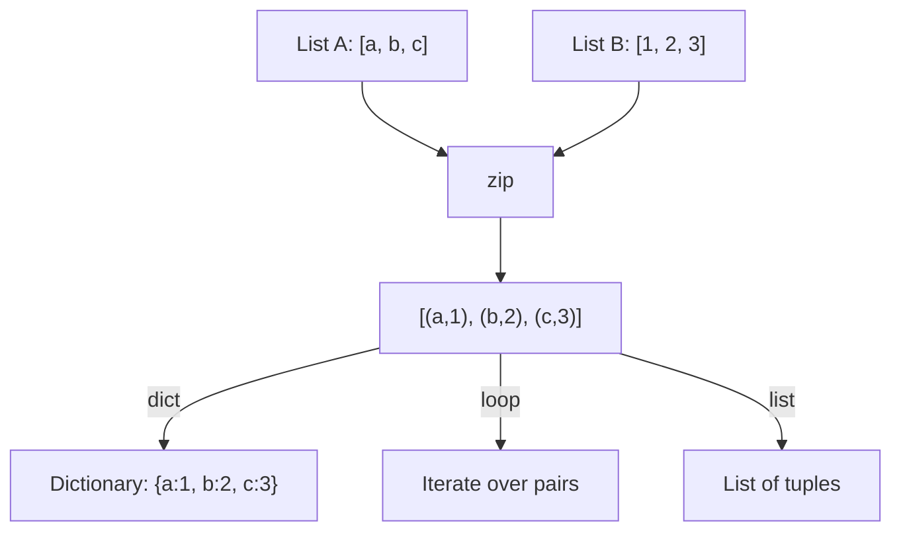

# How to Use zip Filter to Combine Lists in Ansible

Author: [nawazdhandala](https://www.github.com/nawazdhandala)

Tags: Ansible, Filters, Data Transformation, Lists

Description: Learn how to use the zip filter in Ansible to combine parallel lists into pairs, create dictionaries, and iterate over multiple lists simultaneously.

---

The `zip` filter pairs up elements from two or more lists by position. The first element from list A pairs with the first element from list B, the second with the second, and so on. This is incredibly useful when you have related data spread across separate lists and need to bring them together.

## Basic zip Usage

Here is the simplest case, combining two lists element by element:

```yaml
# playbook-basic-zip.yml
# Pairs up two parallel lists: server names and their IP addresses
- name: Basic zip example
  hosts: localhost
  gather_facts: false
  vars:
    server_names:
      - web-01
      - db-01
      - cache-01
    server_ips:
      - 10.0.1.10
      - 10.0.2.10
      - 10.0.3.10

  tasks:
    - name: Zip names and IPs together
      ansible.builtin.debug:
        msg: "{{ server_names | zip(server_ips) | list }}"
```

Output:

```json
[
    ["web-01", "10.0.1.10"],
    ["db-01", "10.0.2.10"],
    ["cache-01", "10.0.3.10"]
]
```

## Creating Dictionaries from Zipped Lists

The most common pattern is zipping two lists and converting the result into a dictionary:

```yaml
# playbook-zip-to-dict.yml
# Creates a hostname-to-IP dictionary by zipping two lists
- name: Create dictionary from zipped lists
  hosts: localhost
  gather_facts: false
  vars:
    hostnames:
      - web-01
      - db-01
      - cache-01
    ip_addresses:
      - 10.0.1.10
      - 10.0.2.10
      - 10.0.3.10

  tasks:
    - name: Create hostname to IP mapping
      ansible.builtin.set_fact:
        host_map: "{{ dict(hostnames | zip(ip_addresses)) }}"

    - name: Show the dictionary
      ansible.builtin.debug:
        var: host_map

    - name: Look up a specific host
      ansible.builtin.debug:
        msg: "web-01 is at {{ host_map['web-01'] }}"
```

Output:

```json
{
    "web-01": "10.0.1.10",
    "db-01": "10.0.2.10",
    "cache-01": "10.0.3.10"
}
```

## Zipping More Than Two Lists

You can zip three or more lists together:

```yaml
# playbook-multi-zip.yml
# Combines three parallel lists: names, IPs, and roles
- name: Zip three lists
  hosts: localhost
  gather_facts: false
  vars:
    names:
      - web-01
      - db-01
      - cache-01
    ips:
      - 10.0.1.10
      - 10.0.2.10
      - 10.0.3.10
    roles:
      - webserver
      - database
      - cache

  tasks:
    - name: Zip three lists together
      ansible.builtin.debug:
        msg: "{{ names | zip(ips, roles) | list }}"

    - name: Build structured objects from zipped data
      ansible.builtin.set_fact:
        servers: >-
          
          
          
          
          {{ result }}

    - name: Show server objects
      ansible.builtin.debug:
        var: servers
```

## Handling Lists of Different Lengths

By default, `zip` stops at the shortest list. Elements from longer lists that have no pair are dropped:

```yaml
# playbook-uneven-zip.yml
# Shows that zip truncates to the shortest list length
- name: Zip with uneven lists
  hosts: localhost
  gather_facts: false
  vars:
    names:
      - alpha
      - bravo
      - charlie
      - delta
    values:
      - 1
      - 2
      - 3

  tasks:
    - name: Zip uneven lists (delta is dropped)
      ansible.builtin.debug:
        msg: "{{ names | zip(values) | list }}"

    - name: Pair count
      ansible.builtin.debug:
        msg: "{{ names | zip(values) | list | length }} pairs from {{ names | length }} names and {{ values | length }} values"
```

Output: `[["alpha", 1], ["bravo", 2], ["charlie", 3]]`

## zip with Longest (Filling Missing Values)

Use `zip_longest` to pad the shorter list with a fill value:

```yaml
# playbook-zip-longest.yml
# Uses zip_longest to handle lists of different lengths with a fill value
- name: Zip with fill value for missing elements
  hosts: localhost
  gather_facts: false
  vars:
    servers:
      - web-01
      - web-02
      - web-03
      - web-04
    assigned_ips:
      - 10.0.1.10
      - 10.0.1.11

  tasks:
    - name: Zip with default fill value
      ansible.builtin.debug:
        msg: "{{ servers | zip_longest(assigned_ips, fillvalue='unassigned') | list }}"
```

Output:

```json
[
    ["web-01", "10.0.1.10"],
    ["web-02", "10.0.1.11"],
    ["web-03", "unassigned"],
    ["web-04", "unassigned"]
]
```

## Zip Flow



## Iterating Over Zipped Lists

Loop over paired elements to process related items together:

```yaml
# playbook-zip-loop.yml
# Loops over zipped pairs to deploy services with matching configurations
- name: Loop over zipped lists
  hosts: localhost
  gather_facts: false
  vars:
    service_names:
      - frontend
      - backend
      - worker
    service_ports:
      - 3000
      - 8080
      - 9090
    service_replicas:
      - 2
      - 3
      - 5

  tasks:
    - name: Deploy each service with its config
      ansible.builtin.debug:
        msg: "Deploy {{ item.0 }} on port {{ item.1 }} with {{ item.2 }} replicas"
      loop: "{{ service_names | zip(service_ports, service_replicas) | list }}"
      loop_control:
        label: "{{ item.0 }}"
```

## Practical Example: Creating Users with SSH Keys

```yaml
# playbook-users-keys.yml
# Pairs usernames with their SSH keys to create accounts
- name: Create users with SSH keys
  hosts: all
  become: true
  vars:
    usernames:
      - alice
      - bob
      - carol
    ssh_keys:
      - "ssh-rsa AAAA... alice@laptop"
      - "ssh-rsa BBBB... bob@desktop"
      - "ssh-rsa CCCC... carol@workstation"

  tasks:
    - name: Create user accounts
      ansible.builtin.user:
        name: "{{ item.0 }}"
        state: present
        create_home: true
      loop: "{{ usernames | zip(ssh_keys) | list }}"
      loop_control:
        label: "{{ item.0 }}"

    - name: Deploy SSH keys
      ansible.posix.authorized_key:
        user: "{{ item.0 }}"
        key: "{{ item.1 }}"
        state: present
      loop: "{{ usernames | zip(ssh_keys) | list }}"
      loop_control:
        label: "{{ item.0 }}"
```

## Building Environment Files

```yaml
# playbook-env-file.yml
# Zips variable names and values to create an environment file
- name: Generate environment file from parallel lists
  hosts: localhost
  gather_facts: false
  vars:
    env_keys:
      - DATABASE_URL
      - REDIS_URL
      - API_KEY
      - LOG_LEVEL
    env_values:
      - "postgres://db.internal:5432/myapp"
      - "redis://cache.internal:6379"
      - "sk_live_abc123"
      - "info"

  tasks:
    - name: Create .env file
      ansible.builtin.copy:
        content: |
          # Generated by Ansible
          
          {{ key }}={{ value }}
          
        dest: /tmp/myapp.env

    - name: Also create as dictionary for other uses
      ansible.builtin.set_fact:
        env_dict: "{{ dict(env_keys | zip(env_values)) }}"

    - name: Show dictionary form
      ansible.builtin.debug:
        var: env_dict
```

## Combining with Indexes

To get index-element pairs (like Python's enumerate), zip with `range`:

```yaml
# playbook-enumerate.yml
# Creates indexed pairs similar to Python's enumerate function
- name: Enumerate a list
  hosts: localhost
  gather_facts: false
  vars:
    servers:
      - web-01
      - web-02
      - web-03

  tasks:
    - name: Enumerate servers (index + name)
      ansible.builtin.debug:
        msg: "Server #{{ item.0 }}: {{ item.1 }}"
      loop: "{{ range(servers | length) | zip(servers) | list }}"
```

## Summary

The `zip` filter is the tool for combining parallel lists in Ansible. Use it with `dict()` to create key-value mappings from two lists. Use it with loops to iterate over related data from separate sources. Use `zip_longest` when lists may have different lengths and you need padding. The pattern of zipping, then either converting to a dictionary or looping over the pairs, covers the vast majority of scenarios where you have correlated data in separate list variables.
