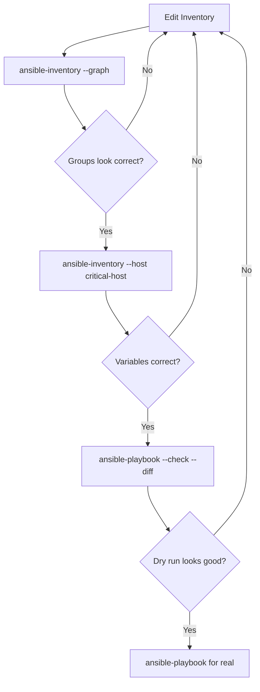

# How to Verify Your Ansible Inventory with ansible-inventory --graph

Author: [nawazdhandala](https://www.github.com/nawazdhandala)

Tags: Ansible, Inventory, Debugging, Verification, CLI

Description: Learn how to use ansible-inventory --graph and related commands to visualize, debug, and verify your Ansible inventory structure.

---

Before you run a playbook, you should know exactly what your inventory looks like. The `ansible-inventory` command is the official tool for inspecting your inventory from the command line. Its `--graph` flag gives you a visual tree of hosts and groups, and the other flags let you drill into variables, host details, and more. This post covers all the ways to use `ansible-inventory` to verify your setup.

## The --graph Flag

The `--graph` flag displays your inventory as an ASCII tree, showing group hierarchies and host membership:

```bash
# Display the inventory as a tree
ansible-inventory -i inventory/hosts.yml --graph
```

Output:

```
@all:
  |--@ungrouped:
  |--@webservers:
  |  |--web01
  |  |--web02
  |  |--web03
  |--@appservers:
  |  |--app01
  |  |--app02
  |--@databases:
  |  |--db01
  |  |--db02
  |--@production:
  |  |--@webservers:
  |  |  |--web01
  |  |  |--web02
  |  |  |--web03
  |  |--@appservers:
  |  |  |--app01
  |  |  |--app02
```

The `@` prefix indicates a group name. Hosts appear without any prefix. Nested groups show the parent-child relationship.

## Scoping --graph to a Group

You can limit the tree to a specific group:

```bash
# Show only the webservers branch
ansible-inventory -i inventory/hosts.yml --graph webservers
```

Output:

```
@webservers:
  |--web01
  |--web02
  |--web03
```

This is useful when your inventory is large and you want to focus on one section.

## Adding Variables to the Graph

The `--vars` flag shows variables alongside each host and group:

```bash
# Show the tree with variable values
ansible-inventory -i inventory/hosts.yml --graph --vars
```

Output:

```
@all:
  |--@webservers:
  |  |--web01
  |  |  |--{ansible_host = 10.0.1.10}
  |  |  |--{ansible_port = 22}
  |  |  |--{ansible_user = deploy}
  |  |  |--{http_port = 80}
  |  |--web02
  |  |  |--{ansible_host = 10.0.1.11}
  |  |  |--{ansible_port = 22}
  |  |  |--{ansible_user = deploy}
  |  |  |--{http_port = 80}
```

This lets you verify that variables are assigned correctly to each host.

## The --list Flag: Full JSON Output

For a complete machine-readable view of your inventory, use `--list`:

```bash
# Dump the entire inventory as JSON
ansible-inventory -i inventory/hosts.yml --list
```

The output is the same JSON format that dynamic inventory scripts produce. It includes all groups, hosts, and variables:

```json
{
    "all": {
        "children": ["webservers", "appservers", "databases", "ungrouped"]
    },
    "webservers": {
        "hosts": ["web01", "web02", "web03"]
    },
    "_meta": {
        "hostvars": {
            "web01": {
                "ansible_host": "10.0.1.10",
                "ansible_port": 22,
                "ansible_user": "deploy"
            }
        }
    }
}
```

Pipe it through `jq` or `python3 -m json.tool` for readable formatting:

```bash
# Pretty-print the JSON output
ansible-inventory -i inventory/hosts.yml --list | python3 -m json.tool

# Extract specific groups with jq
ansible-inventory -i inventory/hosts.yml --list | jq '.webservers'

# Count hosts per group
ansible-inventory -i inventory/hosts.yml --list | jq 'to_entries | map(select(.value.hosts?)) | map({key: .key, count: (.value.hosts | length)}) | sort_by(.count) | reverse'
```

## Inspecting a Single Host

The `--host` flag shows all variables for a specific host, after all precedence rules are applied:

```bash
# Show final variables for a specific host
ansible-inventory -i inventory/hosts.yml --host web01
```

Output:

```json
{
    "ansible_host": "10.0.1.10",
    "ansible_port": 22,
    "ansible_user": "deploy",
    "http_port": 80,
    "ssl_enabled": true,
    "environment": "production",
    "ntp_servers": ["ntp1.example.com", "ntp2.example.com"]
}
```

This is the definitive view of what variables a host will have when a playbook runs. It accounts for all group_vars, host_vars, and variable precedence.

## The --yaml Flag

Output the inventory in YAML format instead of JSON:

```bash
# Export inventory as YAML
ansible-inventory -i inventory/hosts.yml --list --yaml
```

This is handy if you want to convert a dynamic inventory to a static YAML file:

```bash
# Convert any inventory source to a static YAML file
ansible-inventory -i dynamic_inventory.py --list --yaml > static_export.yml
```

## Verifying Dynamic Inventories

The `ansible-inventory` command works with all inventory sources, including dynamic plugins and scripts:

```bash
# Verify AWS EC2 dynamic inventory
ansible-inventory -i inventory/aws_ec2.yml --graph

# Verify a custom inventory script
ansible-inventory -i scripts/custom_inventory.py --graph

# Verify multiple merged inventory sources
ansible-inventory -i inventory/ --graph
```

For dynamic inventories that query external APIs, the `--graph` command actually runs the plugin and shows the real results. This catches configuration errors in your dynamic inventory setup.

## Common Verification Checks

Here are the verification checks I run before deploying to production:

**Check 1: Host count matches expectations**

```bash
# Count total hosts
ansible-inventory -i inventory/ --list | python3 -c "
import json, sys
data = json.load(sys.stdin)
hosts = set()
for group, info in data.items():
    if isinstance(info, dict) and 'hosts' in info:
        hosts.update(info['hosts'])
print(f'Total unique hosts: {len(hosts)}')
"
```

**Check 2: No hosts in ungrouped**

```bash
# Check for ungrouped hosts (usually a sign of inventory misconfiguration)
ansible-inventory -i inventory/ --graph ungrouped
```

If you see hosts under `ungrouped`, they are not assigned to any group, which might indicate a typo or missing group assignment.

**Check 3: Critical variables are set**

```bash
# Verify that all webservers have ansible_host set
ansible-inventory -i inventory/ --list | python3 -c "
import json, sys
data = json.load(sys.stdin)
hostvars = data.get('_meta', {}).get('hostvars', {})
webservers = data.get('webservers', {}).get('hosts', [])
for host in webservers:
    vars = hostvars.get(host, {})
    if 'ansible_host' not in vars:
        print(f'WARNING: {host} missing ansible_host')
    else:
        print(f'OK: {host} -> {vars[\"ansible_host\"]}')
"
```

**Check 4: No duplicate hosts across groups that should be exclusive**

```bash
# Check for hosts appearing in both staging and production
ansible-inventory -i inventory/ --list | python3 -c "
import json, sys
data = json.load(sys.stdin)
staging = set(data.get('staging', {}).get('hosts', []))
production = set(data.get('production', {}).get('hosts', []))
overlap = staging & production
if overlap:
    print(f'WARNING: These hosts are in BOTH staging and production: {overlap}')
else:
    print('OK: No overlap between staging and production')
"
```

## Debugging Inventory Issues

When something is wrong with your inventory, increase verbosity:

```bash
# Show detailed debug output about inventory loading
ansible-inventory -i inventory/ --graph -vvv
```

The verbose output shows:

- Which inventory plugins are being tried
- Which files are being processed
- How variables are being merged
- Any warnings about unrecognized files

## Exporting for Documentation

You can use `ansible-inventory` to generate documentation from your live inventory:

```bash
# Generate a text-based inventory summary
echo "# Inventory Report - $(date)" > inventory_report.md
echo "" >> inventory_report.md
echo '```' >> inventory_report.md
ansible-inventory -i inventory/ --graph >> inventory_report.md
echo '```' >> inventory_report.md
echo "" >> inventory_report.md
echo "## Host Count by Group" >> inventory_report.md
ansible-inventory -i inventory/ --list | python3 -c "
import json, sys
data = json.load(sys.stdin)
for group in sorted(data.keys()):
    if group == '_meta' or group == 'all':
        continue
    info = data[group]
    if isinstance(info, dict) and 'hosts' in info:
        print(f'- **{group}**: {len(info[\"hosts\"])} hosts')
" >> inventory_report.md
```

## The Verification Workflow

Here is the workflow I follow before running any playbook:



The `ansible-inventory` commands catch structural problems (wrong groups, missing hosts, incorrect variables) before you even try to connect to anything. The `--check` flag on the playbook catches logic problems. Only after both checks pass should you run the playbook for real.

Making `ansible-inventory --graph` part of your standard workflow prevents the most common inventory mistakes: hosts in the wrong group, missing variables, and unintended group overlaps. It takes seconds to run and can save hours of debugging a failed deployment.
