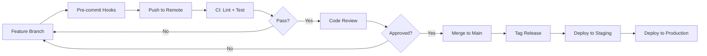

# How to Version Control Ansible Projects

Author: [nawazdhandala](https://www.github.com/nawazdhandala)

Tags: Ansible, Git, Version Control, DevOps

Description: Learn how to properly version control your Ansible projects using Git, including branching strategies, secrets management, and CI integration.

---

Ansible code is infrastructure code, and it deserves the same version control discipline as application code. I have seen teams treat playbooks as throwaway scripts, editing them directly on jump boxes and never committing changes. That approach works until someone makes a breaking change and nobody knows what the previous working state looked like. Here is how to do it properly.

## Setting Up the Git Repository

Start with a proper `.gitignore`:

```gitignore
# .gitignore for Ansible projects
# Ignore retry files generated on playbook failures
*.retry

# Ignore local ansible.cfg overrides
# (keep the project-level ansible.cfg tracked)
ansible.cfg.local

# Ignore fact cache
.ansible_facts/
fact_cache/

# Ignore downloaded roles and collections
roles/external/
collections/

# Ignore vault password files
.vault_pass
.vault_password
vault-password.txt

# Ignore Python virtual environments
venv/
.venv/
__pycache__/

# Ignore IDE files
.idea/
.vscode/
*.swp
*.swo
*~

# Ignore SSH keys
*.pem
*.key
id_rsa*

# Ignore Molecule ephemeral files
molecule/*/.__pycache__/
molecule/*/.cache/

# Ignore terraform state if using terraform alongside
*.tfstate
*.tfstate.backup
```

## Repository Structure

Organize the repo so everything needed to run Ansible is in one place:

```
ansible-infra/
├── .github/
│   └── workflows/
│       ├── lint.yml
│       └── molecule.yml
├── .gitignore
├── .ansible-lint
├── ansible.cfg
├── requirements.yml
├── requirements.txt
├── Makefile
├── inventories/
│   ├── production/
│   └── staging/
├── playbooks/
├── roles/
├── group_vars/
├── host_vars/
└── docs/
```

## Branching Strategy

For Ansible projects, a simple branch strategy works best. Feature branches for new work, main branch for production-ready code.

```bash
# Create a feature branch for new role development
git checkout -b feature/add-redis-role

# Make changes, test with molecule
molecule test -s default

# Commit with meaningful messages
git add roles/redis/
git commit -m "Add redis role with cluster support

- Supports standalone and cluster modes
- Includes Molecule tests for both configurations
- Default port is 6379, configurable via redis_port"

# Push and create a pull request
git push origin feature/add-redis-role
```

## Commit Message Standards

Write commit messages that explain why, not just what:

```bash
# GOOD commit messages
git commit -m "Add health check to nginx role before reload

Previously, nginx would reload even with invalid config,
causing downtime. Now validates config with nginx -t first."

git commit -m "Pin community.mysql collection to 3.8.0

Version 3.9.0 introduced a breaking change in mysql_user
module parameter handling. Pinning until we can update
our playbooks."

# BAD commit messages
git commit -m "update playbook"
git commit -m "fix bug"
git commit -m "changes"
```

## Handling Ansible Vault in Git

Vault-encrypted files are safe to commit. The encrypted content looks like this:

```yaml
# group_vars/production/vault.yml
# This file is encrypted with ansible-vault and safe to commit
$ANSIBLE_VAULT;1.1;AES256
61626364656667686970717273747576
```

Set up your vault workflow:

```bash
# Create an encrypted variables file
ansible-vault create inventories/production/group_vars/vault.yml

# Edit an existing encrypted file
ansible-vault edit inventories/production/group_vars/vault.yml

# Encrypt an existing file
ansible-vault encrypt inventories/production/group_vars/secrets.yml
```

Reference vault variables from regular variable files:

```yaml
# inventories/production/group_vars/all.yml
# Regular variables reference vault variables
db_host: db01.prod.example.com
db_port: 5432
db_user: "{{ vault_db_user }}"
db_password: "{{ vault_db_password }}"
api_key: "{{ vault_api_key }}"
```

```yaml
# inventories/production/group_vars/vault.yml (encrypted)
# Actual secret values stored encrypted
vault_db_user: produser
vault_db_password: supersecretpassword123
vault_api_key: sk-abcdef1234567890
```

## Git Hooks for Quality

Use pre-commit hooks to catch issues before they reach the repository:

```yaml
# .pre-commit-config.yaml
# Install: pip install pre-commit && pre-commit install
repos:
  - repo: https://github.com/ansible/ansible-lint
    rev: v6.22.1
    hooks:
      - id: ansible-lint
        files: \.(yml|yaml)$
        exclude: (molecule|.github)/

  - repo: https://github.com/pre-commit/pre-commit-hooks
    rev: v4.5.0
    hooks:
      - id: trailing-whitespace
      - id: end-of-file-fixer
      - id: check-yaml
        args: ['--allow-multiple-documents']
      - id: check-added-large-files
        args: ['--maxkb=500']
      - id: detect-private-key
      - id: no-commit-to-branch
        args: ['--branch', 'main']
```

Install the hooks:

```bash
# Install pre-commit and set up hooks
pip install pre-commit
pre-commit install

# Run hooks against all files (first time setup)
pre-commit run --all-files
```

## CI Pipeline for Ansible

Set up GitHub Actions to validate every pull request:

```yaml
# .github/workflows/lint.yml
# Validate Ansible code on every push and PR
name: Ansible CI

on:
  push:
    branches: [main]
  pull_request:
    branches: [main]

jobs:
  lint:
    runs-on: ubuntu-latest
    steps:
      - uses: actions/checkout@v4

      - name: Set up Python
        uses: actions/setup-python@v5
        with:
          python-version: '3.11'

      - name: Install dependencies
        run: |
          pip install -r requirements.txt
          ansible-galaxy collection install -r requirements.yml

      - name: Run ansible-lint
        run: ansible-lint playbooks/ roles/

      - name: Check vault files are encrypted
        run: |
          # Find all vault files and verify they are encrypted
          find . -name "vault.yml" -o -name "vault.yaml" | while read f; do
            head -1 "$f" | grep -q '^\$ANSIBLE_VAULT' || {
              echo "ERROR: $f is not encrypted!"
              exit 1
            }
          done

  molecule:
    runs-on: ubuntu-latest
    strategy:
      matrix:
        role:
          - common
          - nginx
          - postgresql
    steps:
      - uses: actions/checkout@v4

      - name: Set up Python
        uses: actions/setup-python@v5
        with:
          python-version: '3.11'

      - name: Install dependencies
        run: pip install molecule molecule-docker ansible-core

      - name: Run Molecule tests
        run: molecule test
        working-directory: roles/${{ matrix.role }}
```

## Tagging Releases

Tag stable versions for production deployments:

```bash
# Tag a release after successful staging deployment
git tag -a v1.5.0 -m "Release 1.5.0: Add Redis cluster support

Changes:
- New redis role with cluster mode
- Updated nginx role with HTTP/3 support
- Fixed PostgreSQL backup timing issue"

# Push tags to remote
git push origin v1.5.0

# Deploy a specific tagged version
git checkout v1.5.0
ansible-playbook playbooks/site.yml -i inventories/production/hosts.yml
```

## Git Workflow Visualization



## Tracking External Dependencies

Keep a lock file or pinned versions for reproducibility:

```yaml
# requirements.yml - pinned versions for all dependencies
collections:
  - name: community.general
    version: 8.2.0
  - name: ansible.posix
    version: 1.5.4

roles:
  - name: geerlingguy.docker
    version: 6.1.0
```

```bash
# After updating dependencies, commit the changes
ansible-galaxy collection install -r requirements.yml --force
git add requirements.yml
git commit -m "Bump community.general to 8.2.0 for UFW fix"
```

## Summary

Version controlling Ansible projects requires a good `.gitignore`, encrypted vault files committed to the repo, pre-commit hooks for quality, CI pipelines for validation, and tagged releases for production. Treat your Ansible code with the same rigor as application code. The investment in proper Git workflow prevents the chaos of untracked infrastructure changes and gives your team confidence that every change is reviewed, tested, and recoverable.
