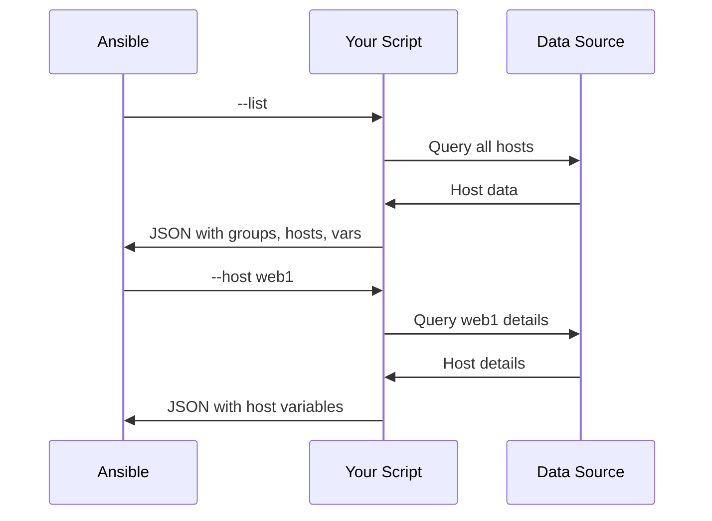

# How to Write a Custom Dynamic Inventory Script in Python

Author: [nawazdhandala](https://www.github.com/nawazdhandala)

Tags: Ansible, Python, Dynamic Inventory, Scripting, Automation

Description: Build a custom Ansible dynamic inventory script in Python that queries any data source and returns properly formatted JSON for host and group discovery.

---

The built-in inventory plugins cover major cloud providers, but what about your internal CMDB, a custom API, a spreadsheet, or a database that tracks your servers? That is where custom dynamic inventory scripts come in. You write a Python script that queries your data source, formats the result as JSON, and Ansible uses it as if it were a regular inventory file.

## How Dynamic Inventory Scripts Work

Ansible calls your script with one of two command-line arguments:

- `--list` returns all hosts and groups
- `--host <hostname>` returns variables for a specific host

The script must print valid JSON to stdout.



## The Required JSON Format

The `--list` output must follow this structure:

```json
{
    "webservers": {
        "hosts": ["web1.example.com", "web2.example.com"],
        "vars": {
            "http_port": 80
        }
    },
    "databases": {
        "hosts": ["db1.example.com"],
        "vars": {
            "db_port": 5432
        }
    },
    "_meta": {
        "hostvars": {
            "web1.example.com": {
                "ansible_host": "10.0.1.10",
                "custom_var": "value1"
            },
            "web2.example.com": {
                "ansible_host": "10.0.1.11",
                "custom_var": "value2"
            },
            "db1.example.com": {
                "ansible_host": "10.0.2.10"
            }
        }
    }
}
```

The `_meta` section with `hostvars` is optional but recommended. When present, Ansible skips individual `--host` calls, which improves performance significantly.

## A Minimal Working Script

Here is the simplest possible dynamic inventory script:

```python
#!/usr/bin/env python3
"""
Minimal Ansible dynamic inventory script.
Returns a static set of hosts for demonstration.
"""

import json
import sys


def get_inventory():
    """Return the full inventory."""
    return {
        "webservers": {
            "hosts": [
                "web1.example.com",
                "web2.example.com",
            ],
            "vars": {
                "ansible_user": "deploy",
                "http_port": 80,
            },
        },
        "databases": {
            "hosts": [
                "db1.example.com",
            ],
            "vars": {
                "ansible_user": "dbadmin",
            },
        },
        "_meta": {
            "hostvars": {
                "web1.example.com": {
                    "ansible_host": "10.0.1.10",
                },
                "web2.example.com": {
                    "ansible_host": "10.0.1.11",
                },
                "db1.example.com": {
                    "ansible_host": "10.0.2.10",
                },
            }
        },
    }


def get_host_vars(hostname):
    """Return variables for a single host."""
    inventory = get_inventory()
    hostvars = inventory.get("_meta", {}).get("hostvars", {})
    return hostvars.get(hostname, {})


def main():
    if len(sys.argv) == 2 and sys.argv[1] == "--list":
        print(json.dumps(get_inventory(), indent=2))
    elif len(sys.argv) == 3 and sys.argv[1] == "--host":
        print(json.dumps(get_host_vars(sys.argv[2]), indent=2))
    else:
        print(json.dumps({}))
        sys.exit(1)


if __name__ == "__main__":
    main()
```

Make it executable and test it:

```bash
# Make the script executable
chmod +x inventory.py

# Test the --list output
./inventory.py --list

# Test host-specific variables
./inventory.py --host web1.example.com

# Use it with Ansible
ansible-inventory -i inventory.py --list
ansible all -i inventory.py -m ping
```

## Querying a REST API

A more realistic example pulls host data from an internal API:

```python
#!/usr/bin/env python3
"""
Ansible dynamic inventory script that queries an internal CMDB API.
Discovers hosts and groups from the company's infrastructure database.
"""

import json
import os
import sys
from urllib.request import Request, urlopen
from urllib.error import URLError


CMDB_URL = os.environ.get("CMDB_URL", "https://cmdb.internal.example.com/api/v1")
CMDB_TOKEN = os.environ.get("CMDB_TOKEN", "")


def api_request(endpoint):
    """Make an authenticated request to the CMDB API."""
    url = f"{CMDB_URL}/{endpoint}"
    headers = {
        "Authorization": f"Bearer {CMDB_TOKEN}",
        "Accept": "application/json",
    }
    req = Request(url, headers=headers)
    try:
        with urlopen(req, timeout=10) as response:
            return json.loads(response.read().decode())
    except URLError as e:
        print(f"Error querying CMDB: {e}", file=sys.stderr)
        return []


def build_inventory():
    """Query the CMDB and build the Ansible inventory structure."""
    servers = api_request("servers?status=active")

    inventory = {"_meta": {"hostvars": {}}}

    for server in servers:
        hostname = server["fqdn"]
        role = server.get("role", "ungrouped")
        environment = server.get("environment", "unknown")

        # Add to role-based group
        role_group = f"role_{role}"
        if role_group not in inventory:
            inventory[role_group] = {"hosts": [], "vars": {}}
        inventory[role_group]["hosts"].append(hostname)

        # Add to environment-based group
        env_group = f"env_{environment}"
        if env_group not in inventory:
            inventory[env_group] = {"hosts": [], "vars": {}}
        inventory[env_group]["hosts"].append(hostname)

        # Set host variables
        inventory["_meta"]["hostvars"][hostname] = {
            "ansible_host": server.get("ip_address", hostname),
            "ansible_user": server.get("ssh_user", "admin"),
            "ansible_port": server.get("ssh_port", 22),
            "server_role": role,
            "server_env": environment,
            "datacenter": server.get("datacenter", "unknown"),
            "os_version": server.get("os_version", "unknown"),
            "cpu_cores": server.get("cpu_cores", 0),
            "ram_gb": server.get("ram_gb", 0),
        }

    return inventory


def get_host_vars(hostname):
    """Return variables for a single host."""
    inventory = build_inventory()
    return inventory["_meta"]["hostvars"].get(hostname, {})


def main():
    if not CMDB_TOKEN:
        print("Error: CMDB_TOKEN environment variable is required", file=sys.stderr)
        sys.exit(1)

    if len(sys.argv) == 2 and sys.argv[1] == "--list":
        inventory = build_inventory()
        print(json.dumps(inventory, indent=2))
    elif len(sys.argv) == 3 and sys.argv[1] == "--host":
        hostvars = get_host_vars(sys.argv[2])
        print(json.dumps(hostvars, indent=2))
    else:
        print("Usage: inventory.py --list | --host <hostname>", file=sys.stderr)
        sys.exit(1)


if __name__ == "__main__":
    main()
```

Use it:

```bash
# Set the CMDB credentials
export CMDB_URL="https://cmdb.internal.example.com/api/v1"
export CMDB_TOKEN="your-api-token"

# Test the inventory
ansible-inventory -i inventory.py --graph
```

## Querying a Database

If your infrastructure data lives in a PostgreSQL database:

```python
#!/usr/bin/env python3
"""
Ansible dynamic inventory that reads from a PostgreSQL database.
Requires: pip install psycopg2-binary
"""

import json
import os
import sys

import psycopg2
import psycopg2.extras


DB_CONFIG = {
    "host": os.environ.get("INVENTORY_DB_HOST", "localhost"),
    "port": int(os.environ.get("INVENTORY_DB_PORT", 5432)),
    "dbname": os.environ.get("INVENTORY_DB_NAME", "infrastructure"),
    "user": os.environ.get("INVENTORY_DB_USER", "ansible"),
    "password": os.environ.get("INVENTORY_DB_PASSWORD", ""),
}


def query_database(sql, params=None):
    """Execute a query and return results as a list of dicts."""
    conn = psycopg2.connect(**DB_CONFIG)
    try:
        with conn.cursor(cursor_factory=psycopg2.extras.RealDictCursor) as cur:
            cur.execute(sql, params)
            return cur.fetchall()
    finally:
        conn.close()


def build_inventory():
    """Build Ansible inventory from database records."""
    # Query all active servers
    servers = query_database("""
        SELECT hostname, ip_address, ssh_user, ssh_port,
               role, environment, datacenter, os_type
        FROM servers
        WHERE status = 'active'
        ORDER BY hostname
    """)

    inventory = {"_meta": {"hostvars": {}}}

    for server in servers:
        hostname = server["hostname"]
        role = server["role"]
        env = server["environment"]

        # Build role group
        role_group = f"role_{role}"
        inventory.setdefault(role_group, {"hosts": [], "vars": {}})
        inventory[role_group]["hosts"].append(hostname)

        # Build environment group
        env_group = f"env_{env}"
        inventory.setdefault(env_group, {"hosts": [], "vars": {}})
        inventory[env_group]["hosts"].append(hostname)

        # Build datacenter group
        dc_group = f"dc_{server['datacenter']}"
        inventory.setdefault(dc_group, {"hosts": [], "vars": {}})
        inventory[dc_group]["hosts"].append(hostname)

        # Host variables
        inventory["_meta"]["hostvars"][hostname] = {
            "ansible_host": server["ip_address"],
            "ansible_user": server["ssh_user"] or "admin",
            "ansible_port": server["ssh_port"] or 22,
            "server_role": role,
            "server_environment": env,
            "server_datacenter": server["datacenter"],
            "server_os": server["os_type"],
        }

    return inventory


def main():
    if len(sys.argv) == 2 and sys.argv[1] == "--list":
        print(json.dumps(build_inventory(), indent=2))
    elif len(sys.argv) == 3 and sys.argv[1] == "--host":
        inv = build_inventory()
        hostvars = inv["_meta"]["hostvars"].get(sys.argv[2], {})
        print(json.dumps(hostvars, indent=2))
    else:
        print("Usage: inventory.py --list | --host <hostname>", file=sys.stderr)
        sys.exit(1)


if __name__ == "__main__":
    main()
```

## Adding Caching

For data sources that are slow to query, add a simple file-based cache:

```python
#!/usr/bin/env python3
"""
Dynamic inventory with file-based caching.
Cache expires after CACHE_MAX_AGE seconds.
"""

import json
import os
import sys
import time

CACHE_FILE = "/tmp/ansible_custom_inventory_cache.json"
CACHE_MAX_AGE = 300  # 5 minutes


def load_cache():
    """Load inventory from cache if it exists and is fresh."""
    if not os.path.exists(CACHE_FILE):
        return None
    cache_age = time.time() - os.path.getmtime(CACHE_FILE)
    if cache_age > CACHE_MAX_AGE:
        return None
    with open(CACHE_FILE, "r") as f:
        return json.load(f)


def save_cache(inventory):
    """Save inventory to cache file."""
    with open(CACHE_FILE, "w") as f:
        json.dump(inventory, f, indent=2)


def build_inventory():
    """Build the inventory (replace with your actual data source query)."""
    # Check cache first
    cached = load_cache()
    if cached:
        return cached

    # Build fresh inventory from data source
    inventory = {
        "webservers": {"hosts": ["web1.example.com", "web2.example.com"]},
        "_meta": {
            "hostvars": {
                "web1.example.com": {"ansible_host": "10.0.1.10"},
                "web2.example.com": {"ansible_host": "10.0.1.11"},
            }
        },
    }

    # Save to cache
    save_cache(inventory)
    return inventory


def main():
    if len(sys.argv) == 2 and sys.argv[1] == "--list":
        print(json.dumps(build_inventory(), indent=2))
    elif len(sys.argv) == 3 and sys.argv[1] == "--host":
        inv = build_inventory()
        hostvars = inv["_meta"]["hostvars"].get(sys.argv[2], {})
        print(json.dumps(hostvars, indent=2))
    elif len(sys.argv) == 2 and sys.argv[1] == "--refresh":
        # Force cache refresh
        if os.path.exists(CACHE_FILE):
            os.remove(CACHE_FILE)
        print(json.dumps(build_inventory(), indent=2))
    else:
        sys.exit(1)


if __name__ == "__main__":
    main()
```

## Testing and Debugging

Always validate your script output:

```bash
# Validate JSON output
./inventory.py --list | python3 -m json.tool

# Check that Ansible can parse it
ansible-inventory -i inventory.py --list
ansible-inventory -i inventory.py --graph

# Test connectivity
ansible all -i inventory.py -m ping

# Debug with verbose output
ansible all -i inventory.py -m ping -vvv
```

## Common Mistakes

1. **Forgetting the shebang line**: The script must start with `#!/usr/bin/env python3` and be executable.

2. **Printing to stdout**: Any debug output (`print` statements) goes to stdout and corrupts the JSON. Use `sys.stderr` for debug messages.

3. **Missing _meta section**: Without `_meta.hostvars`, Ansible calls `--host` for every single host, which is very slow with large inventories.

4. **Not handling errors gracefully**: If your data source is down, return an empty inventory `{}` rather than crashing with a traceback.

Custom dynamic inventory scripts bridge the gap between Ansible and whatever system tracks your infrastructure. Keep the script simple, always include the `_meta` section for performance, add caching for slow data sources, and validate the JSON output before deploying.
