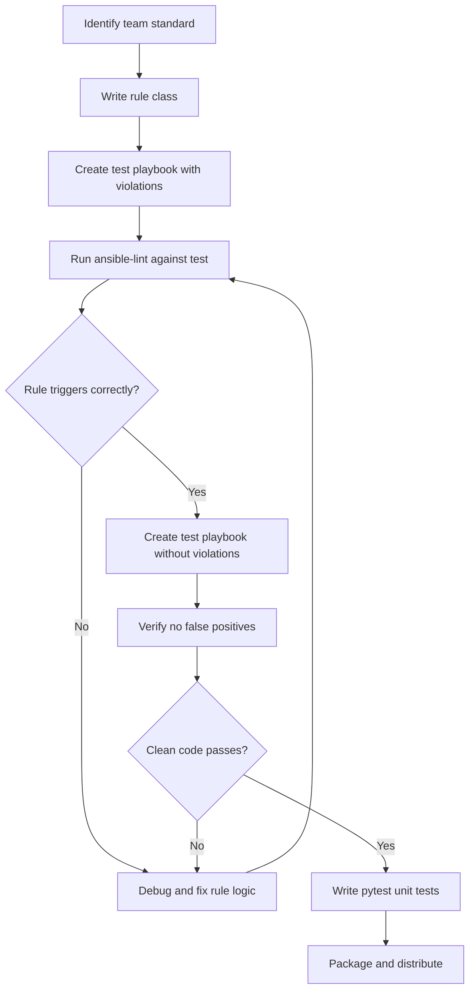

# How to Write Custom ansible-lint Rules

Author: [nawazdhandala](https://www.github.com/nawazdhandala)

Tags: Ansible, ansible-lint, Custom Rules, Python

Description: Step-by-step guide to writing custom ansible-lint rules in Python, covering task matching, play matching, file content scanning, and testing.

---

The built-in rules in ansible-lint are comprehensive, but every organization has unique standards. Maybe your company requires all playbooks to include a specific tag, or prohibits the use of certain variables, or mandates that all file operations set explicit ownership. Custom rules let you codify these requirements into automated checks that run alongside the built-in rules.

This post walks through the full process of writing custom rules, from understanding the rule API to testing and packaging your rules for team use.

## The Rule API

Every ansible-lint rule is a Python class that extends `AnsibleLintRule`. The class provides several methods you can override to inspect different aspects of Ansible content.

```python
# anatomy_of_a_rule.py - Shows all available hook methods
"""Demonstrates the full rule API."""
from ansiblelint.rules import AnsibleLintRule
from ansiblelint.file_utils import Lintable


class MyRule(AnsibleLintRule):
    """One-line description shown in rule listings."""

    # Required attributes
    id = "custom-001"              # Unique rule ID
    description = "Detailed description of what this rule checks."
    severity = "MEDIUM"            # LOW, MEDIUM, HIGH, VERY_HIGH
    tags = ["custom"]              # Tags for grouping/filtering
    version_added = "1.0.0"        # When the rule was added

    def matchtask(self, task, file=None):
        """Called for every task. Return a string message for violation."""
        return False

    def matchplay(self, file, data):
        """Called for every play. Return list of MatchError objects."""
        return []

    def matchdir(self, lintable):
        """Called for every directory. Return list of MatchError objects."""
        return []

    def matchyaml(self, file, data):
        """Called for every YAML file. Return list of MatchError objects."""
        return []
```

## Setting Up Your Development Environment

Create a directory structure for developing and testing custom rules:

```bash
# Project structure
mkdir -p custom_rules tests
touch custom_rules/__init__.py
```

Install the development dependencies:

```bash
pip install ansible-lint pytest
```

Configure ansible-lint to use your custom rules:

```yaml
# .ansible-lint - Reference your custom rules directory
---
profile: moderate

rulesdir:
  - ./custom_rules/
```

## Writing Your First Rule: Require Task Tags

Let us write a rule that requires every task to have at least one tag. This is a common organizational requirement.

```python
# custom_rules/require_task_tags.py - Require tags on every task
"""Rule to enforce tags on all tasks."""
from __future__ import annotations
from typing import TYPE_CHECKING
from ansiblelint.rules import AnsibleLintRule

if TYPE_CHECKING:
    from ansiblelint.file_utils import Lintable


class RequireTaskTagsRule(AnsibleLintRule):
    """All tasks must have at least one tag defined."""

    id = "custom-require-tags"
    description = (
        "Tasks without tags cannot be selectively run or skipped. "
        "All tasks must include at least one tag."
    )
    severity = "MEDIUM"
    tags = ["custom", "tags", "organizational"]

    # Modules to skip (meta tasks, handlers called by name)
    SKIP_MODULES = {"meta", "ansible.builtin.meta"}

    def matchtask(self, task, file=None):
        """Check if the task has tags."""
        # Get the module being used
        module = task.get("action", {}).get("__ansible_module__", "")

        # Skip meta tasks
        if module in self.SKIP_MODULES:
            return False

        # Skip handlers (they are invoked by name, not by tags)
        if file and hasattr(file, "kind") and file.kind == "handlers":
            return False

        # Check for tags
        tags = task.get("tags", [])
        if isinstance(tags, str):
            tags = [tags]

        if not tags:
            return "Task is missing tags. Add at least one tag."

        return False
```

Test it against a playbook:

```yaml
# test_playbook.yml - Should trigger the custom rule
---
- name: Test require tags rule
  hosts: localhost
  tasks:
    - name: This task has no tags
      ansible.builtin.debug:
        msg: "I should have tags"

    - name: This task has tags
      ansible.builtin.debug:
        msg: "I have tags"
      tags:
        - test
```

```bash
ansible-lint test_playbook.yml
# Output:
# custom-require-tags: Task is missing tags. Add at least one tag.
# test_playbook.yml:6 Task/Handler: This task has no tags
```

## Writing a Play-Level Rule: Require Specific Variables

This rule checks that every play defines a required variable (like `environment` or `team`).

```python
# custom_rules/require_play_vars.py - Require specific variables in plays
"""Rule to require certain variables in every play."""
from __future__ import annotations
from ansiblelint.rules import AnsibleLintRule


REQUIRED_VARS = ["environment", "team_owner"]


class RequirePlayVarsRule(AnsibleLintRule):
    """Plays must define required organizational variables."""

    id = "custom-require-play-vars"
    description = (
        "Every play must define the following variables: "
        f"{', '.join(REQUIRED_VARS)}. "
        "These are used for auditing and notification routing."
    )
    severity = "HIGH"
    tags = ["custom", "organizational"]

    def matchplay(self, file, data):
        """Check that required variables exist in the play."""
        results = []

        if not isinstance(data, dict):
            return results

        # Get all variables defined in the play
        play_vars = set()
        for var_source in ("vars", "vars_files", "vars_prompt"):
            var_data = data.get(var_source, {})
            if isinstance(var_data, dict):
                play_vars.update(var_data.keys())
            elif isinstance(var_data, list):
                for item in var_data:
                    if isinstance(item, dict):
                        play_vars.update(item.keys())

        # Check for missing required variables
        for required_var in REQUIRED_VARS:
            if required_var not in play_vars:
                results.append(
                    self.create_matcherror(
                        message=(
                            f"Play is missing required variable '{required_var}'"
                        ),
                        filename=file,
                    )
                )

        return results
```

## Writing a File-Level Rule: Check for Sensitive Data

This rule scans file content for potential secrets or sensitive data patterns.

```python
# custom_rules/no_sensitive_data.py - Detect hardcoded sensitive data
"""Rule to detect hardcoded sensitive data in Ansible files."""
from __future__ import annotations
import re
from ansiblelint.rules import AnsibleLintRule


class NoSensitiveDataRule(AnsibleLintRule):
    """Files must not contain hardcoded passwords, tokens, or API keys."""

    id = "custom-no-sensitive-data"
    description = (
        "Hardcoded secrets should be stored in Ansible Vault "
        "or an external secrets manager, not in plain text."
    )
    severity = "VERY_HIGH"
    tags = ["custom", "security"]

    # Patterns that suggest hardcoded secrets
    PATTERNS = [
        (re.compile(r'password\s*:\s*["\'][^{"\']', re.IGNORECASE),
         "Possible hardcoded password"),
        (re.compile(r'api_key\s*:\s*["\'][A-Za-z0-9]', re.IGNORECASE),
         "Possible hardcoded API key"),
        (re.compile(r'secret_key\s*:\s*["\'][A-Za-z0-9]', re.IGNORECASE),
         "Possible hardcoded secret key"),
        (re.compile(r'AWS_SECRET_ACCESS_KEY\s*:\s*["\'][A-Za-z0-9]'),
         "Possible hardcoded AWS secret key"),
        (re.compile(r'private_key\s*:\s*["\']-----BEGIN'),
         "Possible embedded private key"),
    ]

    # Lines to ignore (references to vault or lookups)
    SAFE_PATTERNS = [
        re.compile(r'\{\{'),           # Jinja2 variable
        re.compile(r'vault_'),          # Vault reference
        re.compile(r'lookup\('),        # Lookup plugin
        re.compile(r'^\s*#'),           # Comment
    ]

    def matchyaml(self, file, data):
        """Scan file content for sensitive data patterns."""
        results = []

        if not hasattr(file, "content") or not file.content:
            return results

        for line_num, line in enumerate(file.content.splitlines(), start=1):
            # Skip safe lines
            if any(safe.search(line) for safe in self.SAFE_PATTERNS):
                continue

            # Check for sensitive patterns
            for pattern, message in self.PATTERNS:
                if pattern.search(line):
                    results.append(
                        self.create_matcherror(
                            message=message,
                            filename=file,
                            linenumber=line_num,
                        )
                    )
                    break  # One match per line is enough

        return results
```

## Writing a Rule with Auto-Fix Support

Recent versions of ansible-lint support auto-fixing. Here is a rule that can fix issues automatically:

```python
# custom_rules/fix_become_user.py - Add become_user when become is true
"""Rule to require explicit become_user with auto-fix."""
from __future__ import annotations
from ansiblelint.rules import AnsibleLintRule


class FixBecomeUserRule(AnsibleLintRule):
    """When become is true, become_user must be explicitly set."""

    id = "custom-fix-become-user"
    description = "Tasks with become: true should specify become_user."
    severity = "MEDIUM"
    tags = ["custom", "security"]

    def matchtask(self, task, file=None):
        """Check for become without become_user."""
        become = task.get("become", False)
        become_user = task.get("become_user")

        if become and not become_user:
            return "become is true but become_user is not specified"

        return False
```

## Testing Your Rules

Write tests to verify your rules catch violations and pass clean code.

```python
# tests/test_require_tags.py - Test the require tags rule
"""Tests for the require task tags rule."""
import pytest
from ansiblelint.runner import Runner
from ansiblelint.config import Options


def test_task_without_tags_fails(tmp_path):
    """Tasks without tags should trigger the rule."""
    playbook = tmp_path / "test.yml"
    playbook.write_text(
        "---\n"
        "- name: Test play\n"
        "  hosts: localhost\n"
        "  tasks:\n"
        "    - name: Task without tags\n"
        "      ansible.builtin.debug:\n"
        '        msg: "no tags"\n'
    )

    runner = Runner(str(playbook), rules_dir=["custom_rules"])
    results = runner.run()

    rule_ids = [r.rule.id for r in results]
    assert "custom-require-tags" in rule_ids


def test_task_with_tags_passes(tmp_path):
    """Tasks with tags should not trigger the rule."""
    playbook = tmp_path / "test.yml"
    playbook.write_text(
        "---\n"
        "- name: Test play\n"
        "  hosts: localhost\n"
        "  tasks:\n"
        "    - name: Task with tags\n"
        "      ansible.builtin.debug:\n"
        '        msg: "has tags"\n'
        "      tags:\n"
        "        - test\n"
    )

    runner = Runner(str(playbook), rules_dir=["custom_rules"])
    results = runner.run()

    rule_ids = [r.rule.id for r in results]
    assert "custom-require-tags" not in rule_ids
```

Run the tests:

```bash
pytest tests/ -v
```

## Packaging Rules for Distribution

To share your custom rules across multiple projects, package them as a Python package:

```python
# setup.py - Package your rules
from setuptools import setup, find_packages

setup(
    name="myorg-ansible-lint-rules",
    version="1.0.0",
    description="Custom ansible-lint rules for MyOrg",
    packages=find_packages(),
    install_requires=["ansible-lint>=6.0.0"],
    python_requires=">=3.9",
)
```

Install the package in any project:

```bash
pip install git+https://gitlab.myorg.com/infra/ansible-lint-rules.git
```

Then reference the installed package in your `.ansible-lint`:

```yaml
# .ansible-lint
rulesdir:
  - ./venv/lib/python3.12/site-packages/myorg_lint_rules/
```

## Rule Development Workflow



Custom rules turn your team's coding standards from tribal knowledge into automated enforcement. Start with the most common code review feedback you give, write a rule for it, and gradually build a comprehensive set that covers your organization's specific requirements.
