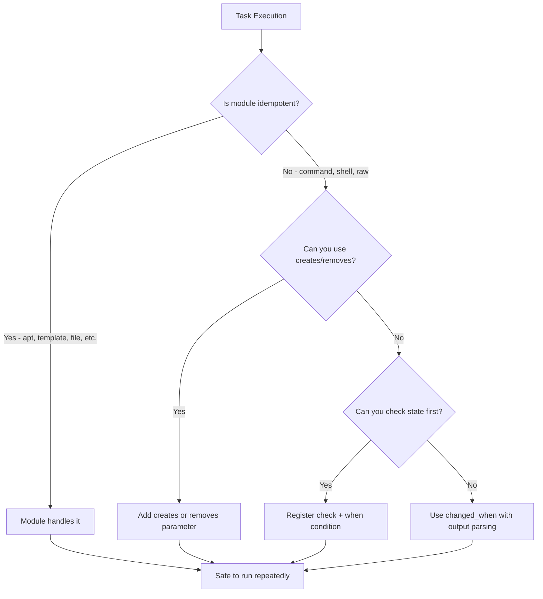

# How to Write Idempotent Ansible Tasks

Author: [nawazdhandala](https://www.github.com/nawazdhandala)

Tags: Ansible, Idempotency, DevOps, Configuration Management

Description: Master the art of writing idempotent Ansible tasks that can be safely run multiple times without causing unintended changes or side effects.

---

Idempotency is the core principle that makes Ansible trustworthy. An idempotent task produces the same result whether you run it once or fifty times. If the system is already in the desired state, a properly written task does nothing. Getting this right is what separates robust automation from dangerous scripting.

## Why Idempotency Matters

Consider a task that appends a line to a configuration file. Run it once, you get one line. Run it again, you get a duplicate. Run your playbook ten times during debugging, and you have ten duplicate lines breaking your config. That is the cost of non-idempotent tasks.

Ansible modules are designed to be idempotent by default, but you can easily break that guarantee with careless use of `command`, `shell`, and `raw` modules.

## Built-in Idempotent Modules

Most Ansible modules handle idempotency for you. Here are examples of naturally idempotent tasks:

```yaml
# These tasks are idempotent by design
# Running them multiple times produces no extra changes

- name: Ensure nginx is installed
  ansible.builtin.apt:
    name: nginx
    state: present
  # apt module checks if nginx is already installed before doing anything

- name: Ensure nginx service is running and enabled
  ansible.builtin.service:
    name: nginx
    state: started
    enabled: yes
  # service module checks current state before taking action

- name: Deploy nginx configuration
  ansible.builtin.template:
    src: nginx.conf.j2
    dest: /etc/nginx/nginx.conf
    owner: root
    group: root
    mode: '0644'
  notify: reload nginx
  # template module compares checksums and only writes if content changed

- name: Ensure log directory exists
  ansible.builtin.file:
    path: /var/log/myapp
    state: directory
    owner: www-data
    group: www-data
    mode: '0755'
  # file module checks if directory exists with correct permissions
```

## The Problem with command and shell

The `command` and `shell` modules are where idempotency breaks down. Ansible has no way to know if the command needs to run because it cannot inspect the result beforehand.

Here is a non-idempotent task:

```yaml
# BAD: This runs every time, even if the database already exists
- name: Create application database
  ansible.builtin.command: mysql -e "CREATE DATABASE myapp"
```

Fix it with `creates` or `removes` conditions:

```yaml
# GOOD: Uses creates to skip if the result already exists
- name: Initialize application database
  ansible.builtin.command: mysql -e "CREATE DATABASE IF NOT EXISTS myapp"
  register: db_result
  changed_when: "'already exists' not in db_result.stderr"
```

Or better yet, use a purpose-built module:

```yaml
# BEST: Use the mysql_db module which handles idempotency internally
- name: Ensure application database exists
  community.mysql.mysql_db:
    name: myapp
    state: present
    login_unix_socket: /var/run/mysqld/mysqld.sock
```

## Using creates and removes

The `creates` and `removes` parameters tell Ansible to check for a file before running a command:

```yaml
# Only run the build if the binary does not already exist
- name: Build application from source
  ansible.builtin.command:
    cmd: make install
    chdir: /opt/myapp/src
    creates: /usr/local/bin/myapp

# Only run cleanup if the temp directory exists
- name: Clean up temporary build files
  ansible.builtin.command:
    cmd: rm -rf /tmp/build-artifacts
    removes: /tmp/build-artifacts
```

## Controlling changed_when and failed_when

Sometimes a command always reports "changed" even when it did nothing meaningful. Use `changed_when` to tell Ansible the truth:

```yaml
# Check if a user exists before deciding if we changed anything
- name: Ensure deploy user exists
  ansible.builtin.command: id deploy
  register: user_check
  changed_when: false
  failed_when: false

- name: Create deploy user if missing
  ansible.builtin.user:
    name: deploy
    shell: /bin/bash
    groups: www-data
  when: user_check.rc != 0
```

A more practical example with `changed_when`:

```yaml
# Register output and determine change based on actual result
- name: Apply database migrations
  ansible.builtin.command:
    cmd: python manage.py migrate --noinput
    chdir: /opt/myapp
  register: migrate_result
  changed_when: "'No migrations to apply' not in migrate_result.stdout"
```

## Making File Operations Idempotent

Use `lineinfile` and `blockinfile` instead of `shell` with `echo >>`:

```yaml
# BAD: Appends a duplicate line every run
- name: Add server to hosts file
  ansible.builtin.shell: echo "10.0.1.5 appserver" >> /etc/hosts

# GOOD: lineinfile ensures the line exists exactly once
- name: Ensure appserver entry in hosts file
  ansible.builtin.lineinfile:
    path: /etc/hosts
    line: "10.0.1.5 appserver"
    state: present

# GOOD: blockinfile manages a whole block with markers
- name: Add application host entries
  ansible.builtin.blockinfile:
    path: /etc/hosts
    marker: "# {mark} ANSIBLE MANAGED - app hosts"
    block: |
      10.0.1.5 appserver01
      10.0.1.6 appserver02
      10.0.1.7 appserver03
```

## Handling Downloads Idempotently

Downloading files can be made idempotent with checksum verification:

```yaml
# Download only if the file does not exist or checksum does not match
- name: Download application binary
  ansible.builtin.get_url:
    url: "https://releases.example.com/myapp-{{ app_version }}.tar.gz"
    dest: "/tmp/myapp-{{ app_version }}.tar.gz"
    checksum: "sha256:{{ app_sha256 }}"
    mode: '0644'
```

## Idempotent Service Configuration Pattern

Here is a complete pattern for configuring a service idempotently:

```yaml
# roles/app_config/tasks/main.yml
# Full idempotent service configuration workflow

- name: Install application package
  ansible.builtin.apt:
    name: "myapp={{ app_version }}"
    state: present
    update_cache: yes

- name: Create application configuration
  ansible.builtin.template:
    src: myapp.conf.j2
    dest: /etc/myapp/myapp.conf
    owner: myapp
    group: myapp
    mode: '0640'
    validate: myapp --config-test %s
  notify: restart myapp

- name: Create systemd service file
  ansible.builtin.template:
    src: myapp.service.j2
    dest: /etc/systemd/system/myapp.service
    owner: root
    group: root
    mode: '0644'
  notify:
    - reload systemd
    - restart myapp

- name: Ensure myapp service is running
  ansible.builtin.service:
    name: myapp
    state: started
    enabled: yes
```

## Idempotency Decision Flow



## Testing Idempotency

The simplest test: run your playbook twice. On the second run, every task should show "ok" and zero tasks should show "changed."

```bash
# Run the playbook twice and check for changes on the second run
ansible-playbook playbooks/site.yml -i inventories/staging/hosts.yml

# Second run - should show 0 changed
ansible-playbook playbooks/site.yml -i inventories/staging/hosts.yml | grep -E "changed="
```

For automated testing, use Molecule with an idempotence test:

```yaml
# molecule/default/molecule.yml
# Molecule automatically tests idempotence by running converge twice
dependency:
  name: galaxy
driver:
  name: docker
platforms:
  - name: idempotency-test
    image: ubuntu:22.04
    pre_build_image: true
provisioner:
  name: ansible
  playbooks:
    converge: converge.yml
scenario:
  test_sequence:
    - create
    - converge
    - idempotence  # This runs converge again and fails if anything changed
    - verify
    - destroy
```

## Summary

Writing idempotent Ansible tasks comes down to a few rules. Prefer purpose-built modules over `command` and `shell`. When you must use `command`, add `creates`, `removes`, or `changed_when` to communicate intent. Use `lineinfile` and `blockinfile` instead of shell redirection. Test idempotency by running your playbook twice and verifying zero changes on the second run. Follow these principles and your automation becomes something you can run with confidence at any time.
