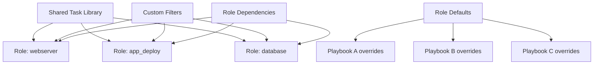

# How to Write Reusable Ansible Code

Author: [nawazdhandala](https://www.github.com/nawazdhandala)

Tags: Ansible, Reusability, Roles, DevOps

Description: Learn techniques for writing reusable Ansible code including parameterized roles, shared task files, custom modules, and collection packaging.

---

The moment you copy-paste an Ansible task from one playbook to another, you have created a maintenance burden. When that task needs updating, you have to find and fix it in multiple places. Reusable Ansible code means writing it once, parameterizing it properly, and including it wherever needed. Here is how to build Ansible code that scales across projects and teams.

## Parameterize Everything with Defaults

The foundation of reusable code is parameterization. Never hardcode values in tasks. Put everything in variables with sensible defaults.

```yaml
# roles/app_deploy/defaults/main.yml
# Every configurable aspect has a default value
app_deploy_repo: ""
app_deploy_version: "main"
app_deploy_dir: "/opt/{{ app_deploy_name }}"
app_deploy_name: "myapp"
app_deploy_user: "deploy"
app_deploy_group: "deploy"
app_deploy_venv_path: "{{ app_deploy_dir }}/venv"
app_deploy_requirements: "{{ app_deploy_dir }}/requirements.txt"
app_deploy_service_name: "{{ app_deploy_name }}"
app_deploy_port: 8080
app_deploy_workers: "{{ ansible_processor_vcpus | default(2) }}"
app_deploy_env_vars: {}
app_deploy_pre_deploy_commands: []
app_deploy_post_deploy_commands: []
```

```yaml
# roles/app_deploy/tasks/main.yml
# Tasks use variables instead of hardcoded values
- name: Ensure application user exists
  ansible.builtin.user:
    name: "{{ app_deploy_user }}"
    group: "{{ app_deploy_group }}"
    system: yes
    shell: /bin/bash

- name: Clone application repository
  ansible.builtin.git:
    repo: "{{ app_deploy_repo }}"
    dest: "{{ app_deploy_dir }}"
    version: "{{ app_deploy_version }}"
  become_user: "{{ app_deploy_user }}"

- name: Install Python dependencies
  ansible.builtin.pip:
    requirements: "{{ app_deploy_requirements }}"
    virtualenv: "{{ app_deploy_venv_path }}"
  become_user: "{{ app_deploy_user }}"
```

Now the same role works for any Python application:

```yaml
# playbooks/deploy-api.yml
# Reusing the role for the API service
- hosts: api_servers
  roles:
    - role: app_deploy
      app_deploy_name: api-service
      app_deploy_repo: https://github.com/company/api-service.git
      app_deploy_version: v2.1.0
      app_deploy_port: 8080

# playbooks/deploy-worker.yml
# Reusing the same role for the worker service
- hosts: worker_servers
  roles:
    - role: app_deploy
      app_deploy_name: task-worker
      app_deploy_repo: https://github.com/company/task-worker.git
      app_deploy_version: v1.4.0
      app_deploy_port: 9090
```

## Use Include and Import for Shared Task Files

Break roles into smaller task files and include them conditionally:

```yaml
# roles/webserver/tasks/main.yml
# Main task file orchestrates includes based on variables
- name: Include OS-specific tasks
  ansible.builtin.include_tasks: "{{ ansible_os_family | lower }}.yml"

- name: Include SSL configuration
  ansible.builtin.include_tasks: ssl.yml
  when: webserver_ssl_enabled

- name: Include virtual host configuration
  ansible.builtin.include_tasks: vhosts.yml

- name: Include monitoring configuration
  ansible.builtin.include_tasks: monitoring.yml
  when: webserver_monitoring_enabled
```

```yaml
# roles/webserver/tasks/debian.yml
# Debian/Ubuntu specific tasks
- name: Install nginx on Debian
  ansible.builtin.apt:
    name: nginx
    state: present
    update_cache: yes

- name: Enable nginx repository for latest version
  ansible.builtin.apt_repository:
    repo: "ppa:nginx/stable"
    state: present
  when: webserver_use_latest
```

```yaml
# roles/webserver/tasks/redhat.yml
# RHEL/CentOS specific tasks
- name: Install nginx on RHEL
  ansible.builtin.dnf:
    name: nginx
    state: present

- name: Enable nginx module stream
  ansible.builtin.command:
    cmd: dnf module enable nginx:1.24 -y
  when: webserver_use_latest
```

## Create Reusable Task Libraries

For tasks that span multiple roles, create a shared task library:

```yaml
# tasks/wait_for_service.yml
# Reusable task to wait for a service to become healthy
# Required variables: service_url, service_name
- name: "Wait for {{ service_name }} to be healthy"
  ansible.builtin.uri:
    url: "{{ service_url }}"
    method: GET
    status_code: 200
    timeout: 5
  register: health_check
  until: health_check.status == 200
  retries: "{{ service_health_retries | default(30) }}"
  delay: "{{ service_health_delay | default(10) }}"
```

```yaml
# tasks/backup_config.yml
# Reusable task to back up a configuration file before changes
# Required variables: config_file_path
- name: "Backup {{ config_file_path }}"
  ansible.builtin.copy:
    src: "{{ config_file_path }}"
    dest: "{{ config_file_path }}.bak.{{ ansible_date_time.iso8601_basic_short }}"
    remote_src: yes
    owner: root
    group: root
    mode: '0644'
  when: config_backup_enabled | default(true)
```

Include these shared tasks from any role:

```yaml
# In any role's tasks
- name: Back up nginx config before changes
  ansible.builtin.include_tasks: "{{ playbook_dir }}/../tasks/backup_config.yml"
  vars:
    config_file_path: /etc/nginx/nginx.conf

- name: Deploy new nginx config
  ansible.builtin.template:
    src: nginx.conf.j2
    dest: /etc/nginx/nginx.conf
  notify: reload nginx

- name: Wait for nginx to be healthy
  ansible.builtin.include_tasks: "{{ playbook_dir }}/../tasks/wait_for_service.yml"
  vars:
    service_url: "http://localhost/health"
    service_name: nginx
```

## Write Custom Filters for Reuse

When you find yourself doing the same Jinja2 transformations repeatedly, write a custom filter:

```python
# filter_plugins/custom_filters.py
# Custom Jinja2 filters available to all playbooks and roles

class FilterModule(object):
    """Custom filters for Ansible."""

    def filters(self):
        return {
            'to_nginx_upstream': self.to_nginx_upstream,
            'env_dict_to_list': self.env_dict_to_list,
        }

    def to_nginx_upstream(self, hosts, port=80):
        """Convert a list of hosts to nginx upstream server lines."""
        lines = []
        for host in hosts:
            lines.append(f"server {host}:{port};")
        return '\n    '.join(lines)

    def env_dict_to_list(self, env_dict):
        """Convert a dict of env vars to KEY=VALUE list."""
        return [f"{k}={v}" for k, v in sorted(env_dict.items())]
```

Use the custom filters in templates:

```nginx
# templates/nginx-upstream.conf.j2
# Using custom filter to generate upstream block
upstream {{ app_name }} {
    {{ groups['app_servers'] | to_nginx_upstream(app_port) }}
}
```

## Leverage Role Dependencies

Declare dependencies so roles automatically pull in what they need:

```yaml
# roles/app_deploy/meta/main.yml
# This role depends on common and monitoring
dependencies:
  - role: common
  - role: monitoring_agent
    monitoring_agent_service_name: "{{ app_deploy_name }}"
    monitoring_agent_port: "{{ app_deploy_port }}"
```

## Reusability Architecture



## Package Roles as Collections

For cross-project reuse, package roles into Ansible collections:

```
# Collection directory structure
company/
  infrastructure/
    galaxy.yml
    roles/
      webserver/
      database/
      monitoring/
    plugins/
      filter/
        custom_filters.py
      modules/
        custom_module.py
```

```yaml
# galaxy.yml
# Collection metadata
namespace: company
name: infrastructure
version: 1.0.0
readme: README.md
authors:
  - Platform Team <platform@company.com>
description: Shared infrastructure roles and plugins
dependencies:
  community.general: ">=8.0.0"
  ansible.posix: ">=1.5.0"
```

Build and distribute:

```bash
# Build the collection
ansible-galaxy collection build company/infrastructure

# Install from the built archive
ansible-galaxy collection install company-infrastructure-1.0.0.tar.gz

# Use in playbooks
# - hosts: webservers
#   roles:
#     - company.infrastructure.webserver
```

## Summary

Reusable Ansible code starts with parameterized roles that use defaults for every configurable value. Break tasks into includable files organized by concern. Create shared task libraries for cross-role functionality. Write custom filters for repeated Jinja2 logic. Use role dependencies to chain roles together. For organization-wide reuse, package roles into collections. The upfront effort of making code reusable pays for itself the second time you use it.
