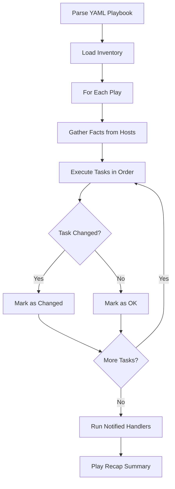

# How to Write Your First Ansible Playbook

Author: [nawazdhandala](https://www.github.com/nawazdhandala)

Tags: Ansible, Playbook, Automation, DevOps

Description: A hands-on guide to writing your first Ansible playbook from scratch, covering YAML syntax, modules, and execution basics.

---

If you have been managing servers by SSHing into each one and running commands manually, Ansible playbooks will change how you work. A playbook is a YAML file that describes a set of tasks you want to run on your remote hosts. Instead of typing commands one at a time, you define everything in a file and let Ansible handle the execution across as many machines as you need.

This guide walks through creating your very first playbook, explaining every piece so you understand what is happening under the hood.

## Prerequisites

Before writing a playbook, you need:

- Ansible installed on your control node (your laptop or a management server)
- SSH access to at least one target host
- An inventory file listing your hosts

Here is a minimal inventory file to start with.

```ini
# inventory.ini - defines the hosts Ansible will manage
[webservers]
192.168.1.10
192.168.1.11

[dbservers]
192.168.1.20
```

## Understanding Playbook Structure

Every Ansible playbook is a list of "plays." Each play targets a group of hosts and defines tasks to run on them. Here is the basic skeleton.

```yaml
# site.yml - a minimal playbook structure
---
- name: My first play
  hosts: webservers
  become: yes

  tasks:
    - name: First task description
      module_name:
        parameter1: value1
        parameter2: value2
```

Let me break down each line:

- `---` marks the start of a YAML document
- `name` is a human-readable label for the play
- `hosts` tells Ansible which inventory group to target
- `become: yes` means run tasks with sudo privileges
- `tasks` is the list of actions to perform

## Writing a Real Playbook

Let us build a playbook that sets up a basic web server. This is a common first project and covers several important concepts.

```yaml
# setup-webserver.yml - installs and configures nginx on Ubuntu
---
- name: Set up a basic web server
  hosts: webservers
  become: yes

  vars:
    http_port: 80
    server_name: mysite.example.com

  tasks:
    - name: Update the apt package cache
      apt:
        update_cache: yes
        cache_valid_time: 3600

    - name: Install nginx
      apt:
        name: nginx
        state: present

    - name: Copy the custom index page
      copy:
        content: |
          <html>
          <head><title>Welcome</title></head>
          <body>
            <h1>Hello from {{ inventory_hostname }}</h1>
            <p>Server: {{ server_name }}</p>
          </body>
          </html>
        dest: /var/www/html/index.html
        owner: www-data
        group: www-data
        mode: '0644'

    - name: Make sure nginx is running and enabled
      service:
        name: nginx
        state: started
        enabled: yes
```

There are several things happening here. The `vars` section defines variables that you can reference throughout the playbook using Jinja2 syntax (`{{ variable_name }}`). The `apt` module handles package management on Debian/Ubuntu systems. The `copy` module writes content to a file on the remote host. The `service` module manages system services.

## Running Your Playbook

Execute the playbook with the `ansible-playbook` command.

```bash
# Run the playbook against hosts defined in inventory.ini
ansible-playbook -i inventory.ini setup-webserver.yml
```

You will see output like this:

```
PLAY [Set up a basic web server] **********************************************

TASK [Gathering Facts] ********************************************************
ok: [192.168.1.10]
ok: [192.168.1.11]

TASK [Update the apt package cache] *******************************************
changed: [192.168.1.10]
changed: [192.168.1.11]

TASK [Install nginx] **********************************************************
changed: [192.168.1.10]
changed: [192.168.1.11]

TASK [Copy the custom index page] *********************************************
changed: [192.168.1.10]
changed: [192.168.1.11]

TASK [Make sure nginx is running and enabled] *********************************
ok: [192.168.1.10]
ok: [192.168.1.11]

PLAY RECAP ********************************************************************
192.168.1.10     : ok=5    changed=3    unreachable=0    failed=0    skipped=0
192.168.1.11     : ok=5    changed=3    unreachable=0    failed=0    skipped=0
```

The PLAY RECAP at the bottom is your summary. "ok" means the task ran successfully, "changed" means Ansible made a modification on the host.

## Adding Handlers for Efficiency

Handlers are tasks that only run when notified by another task. This is useful when you need to restart a service only if its configuration changed.

```yaml
# setup-webserver-v2.yml - adds a handler to restart nginx on config change
---
- name: Set up web server with handler
  hosts: webservers
  become: yes

  tasks:
    - name: Install nginx
      apt:
        name: nginx
        state: present

    - name: Deploy nginx configuration
      template:
        src: templates/nginx.conf.j2
        dest: /etc/nginx/sites-available/default
        owner: root
        group: root
        mode: '0644'
      notify: Restart nginx

    - name: Ensure nginx is running
      service:
        name: nginx
        state: started
        enabled: yes

  handlers:
    - name: Restart nginx
      service:
        name: nginx
        state: restarted
```

The `notify` keyword on the template task tells Ansible to trigger the "Restart nginx" handler, but only if the template task actually changed the file. If the config file is already correct, nginx will not get an unnecessary restart.

## Using Conditionals

Sometimes you need tasks to run only under certain conditions. The `when` clause handles this.

```yaml
# conditional-example.yml - demonstrates when clause for OS-specific tasks
---
- name: Install packages based on OS
  hosts: all
  become: yes

  tasks:
    - name: Install nginx on Debian/Ubuntu
      apt:
        name: nginx
        state: present
      when: ansible_os_family == "Debian"

    - name: Install nginx on RedHat/CentOS
      yum:
        name: nginx
        state: present
      when: ansible_os_family == "RedHat"
```

Ansible gathers facts about each host before running tasks (that is the "Gathering Facts" step in the output). The `ansible_os_family` fact tells you what type of OS the host is running, so you can branch your logic accordingly.

## Playbook Execution Flow

Here is how Ansible processes a playbook from start to finish.



## Using Loops

When you need to perform the same action on multiple items, use a loop instead of duplicating tasks.

```yaml
# loop-example.yml - installs multiple packages in a single task
---
- name: Install common packages
  hosts: all
  become: yes

  tasks:
    - name: Install required packages
      apt:
        name: "{{ item }}"
        state: present
      loop:
        - nginx
        - git
        - curl
        - htop
        - vim
```

This is cleaner than writing five separate tasks and is easier to maintain. You just add or remove items from the list.

## Common Mistakes to Avoid

**Indentation errors** are the number one cause of playbook failures. YAML is very strict about whitespace. Use spaces, never tabs, and be consistent with your indentation level (two spaces is the standard).

**Forgetting `become: yes`** when you need root privileges will give you permission denied errors. If a task needs sudo, either set `become: yes` at the play level or on individual tasks.

**Not quoting strings that start with special characters** can break YAML parsing. If a value starts with `{`, `[`, `*`, or other YAML special characters, wrap it in quotes.

## Next Steps

Once you are comfortable with basic playbooks, explore:

- **Variables and templates** for dynamic configuration
- **Roles** for organizing complex playbooks into reusable components
- **Vault** for encrypting sensitive data like passwords

Your first playbook does not need to be perfect. Start simple, test often, and build complexity as you get comfortable with the patterns. The real power of Ansible shows up when you have a library of tested playbooks that you can run confidently across your entire infrastructure.
