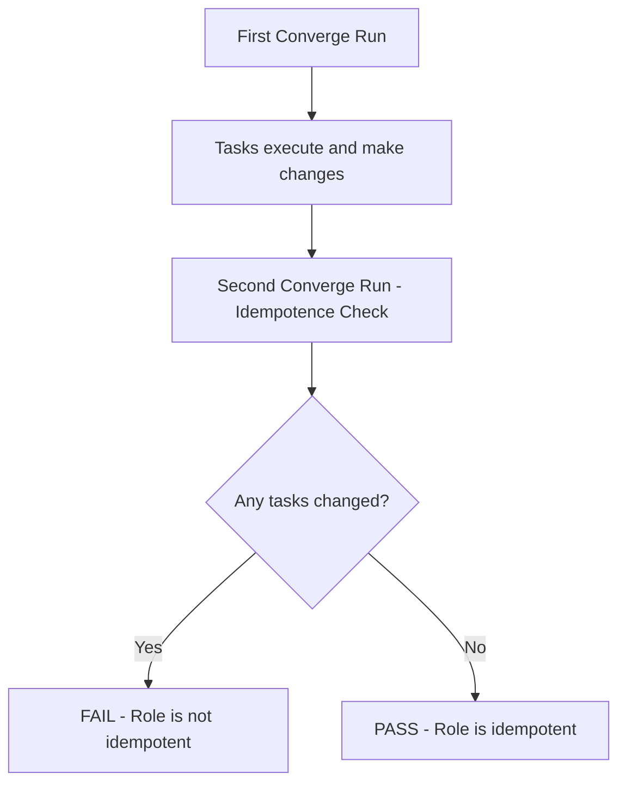

# How to Write Idempotence Tests in Molecule

Author: [nawazdhandala](https://www.github.com/nawazdhandala)

Tags: Ansible, Molecule, Idempotence, Testing, Best Practices

Description: Master Ansible idempotence testing with Molecule to ensure your roles produce consistent results on repeated runs without unwanted changes.

---

Idempotence is one of Ansible's core principles. Running a playbook once should produce the same result as running it ten times. No extra changes, no side effects, no drift. Molecule has a built-in idempotence test that catches violations of this principle, and understanding how it works will help you write better roles.

## What the Idempotence Test Does

When you run `molecule test`, the idempotence step does something straightforward: it runs your converge playbook a second time and checks if any tasks report "changed". If any task reports changed on the second run, the idempotence test fails.



The underlying check is simple: Molecule parses Ansible's output from the second run and looks for `changed=N` where N is greater than zero. If any changes are detected, the test fails.

## Running the Idempotence Test

You can run the idempotence test as part of the full sequence or individually.

```bash
# Full test sequence (includes idempotence)
molecule test

# Run converge first, then idempotence separately
molecule converge
molecule idempotence

# Run idempotence with verbose output to see which tasks change
molecule idempotence -- -v
```

## Common Idempotence Failures and Fixes

### Problem 1: Using command/shell Modules

The command and shell modules always report "changed" because Ansible has no way to know if the command actually changed anything.

```yaml
# BAD - always reports changed
- name: Set hostname
  ansible.builtin.command: hostnamectl set-hostname webserver01

# GOOD - uses the proper module which checks current state
- name: Set hostname
  ansible.builtin.hostname:
    name: webserver01
```

When you must use command or shell, use `changed_when` to tell Ansible when the task actually made a change.

```yaml
# BETTER - command with changed_when
- name: Check if swap is enabled
  ansible.builtin.command: swapon --show
  register: swap_status
  changed_when: false

- name: Disable swap
  ansible.builtin.command: swapoff -a
  when: swap_status.stdout | length > 0
  changed_when: true
```

### Problem 2: File Content Regeneration

Templates and copy modules can fail idempotence if the content includes timestamps or random values.

```yaml
# BAD - timestamp changes on every run
- name: Create config file
  ansible.builtin.template:
    src: config.j2
    dest: /etc/myapp/config.yml
    mode: '0644'

# config.j2 (problematic):
# generated_at: {{ ansible_date_time.iso8601 }}
# app_secret: {{ lookup('password', '/dev/null length=32') }}
```

```yaml
# GOOD - use static values or generate once
- name: Generate secret if not exists
  ansible.builtin.copy:
    dest: /etc/myapp/secret
    content: "{{ lookup('password', '/dev/null length=32') }}"
    mode: '0600'
    # force: false means do not overwrite if file already exists
    force: false

- name: Create config file without timestamp
  ansible.builtin.template:
    src: config.j2
    dest: /etc/myapp/config.yml
    mode: '0644'

# config.j2 (fixed):
# app_name: myapp
# app_version: {{ app_version }}
```

### Problem 3: Package Installation with Latest

Using `state: latest` can cause idempotence issues if package repositories update between runs (unlikely in Molecule containers, but worth knowing).

```yaml
# Can fail idempotence if repo updates between runs
- name: Install nginx
  ansible.builtin.apt:
    name: nginx
    state: latest

# More predictable
- name: Install nginx
  ansible.builtin.apt:
    name: nginx
    state: present
```

### Problem 4: Handlers That Always Trigger

If a task always reports changed, its handler always fires, causing cascading idempotence failures.

```yaml
# BAD - shell task always triggers handler
- name: Generate DH parameters
  ansible.builtin.shell: openssl dhparam -out /etc/ssl/dhparam.pem 2048
  notify: restart nginx

# GOOD - only generate if file does not exist
- name: Check if DH parameters exist
  ansible.builtin.stat:
    path: /etc/ssl/dhparam.pem
  register: dhparam_stat

- name: Generate DH parameters
  ansible.builtin.command: openssl dhparam -out /etc/ssl/dhparam.pem 2048
  when: not dhparam_stat.stat.exists
  notify: restart nginx
```

### Problem 5: Service Restarts

Restarting a service is not idempotent. Use handlers instead of inline restart tasks.

```yaml
# BAD - restarts nginx on every run
- name: Deploy nginx config
  ansible.builtin.template:
    src: nginx.conf.j2
    dest: /etc/nginx/nginx.conf

- name: Restart nginx
  ansible.builtin.service:
    name: nginx
    state: restarted

# GOOD - only restarts when config changes
- name: Deploy nginx config
  ansible.builtin.template:
    src: nginx.conf.j2
    dest: /etc/nginx/nginx.conf
  notify: restart nginx

# In handlers/main.yml
- name: restart nginx
  ansible.builtin.service:
    name: nginx
    state: restarted
```

## Writing Custom Idempotence Checks

Sometimes the built-in idempotence check is not granular enough. You can write custom checks in your verify playbook.

```yaml
# molecule/default/verify.yml - Custom idempotence verification
---
- name: Verify Idempotence Details
  hosts: all
  become: true
  tasks:
    - name: Run role again and capture output
      ansible.builtin.include_role:
        name: my_role
      register: role_result

    - name: Collect task results
      ansible.builtin.set_fact:
        changed_tasks: "{{ ansible_play_hosts | map('extract', hostvars) | list }}"

    # Alternatively, check specific files have not changed
    - name: Stat critical config files
      ansible.builtin.stat:
        path: "{{ item }}"
      register: config_stats
      loop:
        - /etc/myapp/config.yml
        - /etc/myapp/database.yml
        - /etc/nginx/sites-enabled/myapp

    - name: Record config file checksums
      ansible.builtin.copy:
        content: "{{ config_stats | to_json }}"
        dest: /tmp/config_checksums_run1.json
        mode: '0644'
```

## Excluding Tasks from Idempotence

Some tasks legitimately cannot be idempotent (like sending a notification or writing to an external API). Tag these tasks and exclude them from the idempotence check.

```yaml
# In your role tasks
- name: Send deployment notification to Slack
  ansible.builtin.uri:
    url: "{{ slack_webhook }}"
    method: POST
    body_format: json
    body:
      text: "Role deployed successfully"
  tags:
    - notest
    - notification
  changed_when: false
```

Or, mark the task with `changed_when: false` if the task does not actually change system state.

## Testing Idempotence Across Different Starting States

Create multiple scenarios to test idempotence from different starting points.

```yaml
# molecule/fresh-install/molecule.yml - Test on a clean system
platforms:
  - name: fresh
    image: geerlingguy/docker-ubuntu2204-ansible:latest
    pre_build_image: true
    privileged: true
```

```yaml
# molecule/upgrade/prepare.yml - Test upgrade path
---
- name: Prepare - Install old version
  hosts: all
  become: true
  tasks:
    - name: Install old version of application
      ansible.builtin.apt:
        name: myapp=1.0.0
        state: present

    - name: Create old configuration format
      ansible.builtin.copy:
        dest: /etc/myapp/config.yml
        content: |
          # Old format v1
          db_host: localhost
          db_port: 5432
        mode: '0644'
```

## A Complete Idempotent Role Example

Here is a small but complete role that passes idempotence tests. Notice how every task is designed to check before changing.

```yaml
# tasks/main.yml - Fully idempotent role
---
- name: Install required packages
  ansible.builtin.apt:
    name:
      - nginx
      - certbot
    state: present
    update_cache: true
    cache_valid_time: 3600

- name: Create application directory
  ansible.builtin.file:
    path: /var/www/myapp
    state: directory
    owner: www-data
    group: www-data
    mode: '0755'

- name: Deploy nginx configuration
  ansible.builtin.template:
    src: nginx-site.conf.j2
    dest: /etc/nginx/sites-available/myapp
    owner: root
    group: root
    mode: '0644'
  notify: reload nginx

- name: Enable nginx site
  ansible.builtin.file:
    src: /etc/nginx/sites-available/myapp
    dest: /etc/nginx/sites-enabled/myapp
    state: link
  notify: reload nginx

- name: Remove default nginx site
  ansible.builtin.file:
    path: /etc/nginx/sites-enabled/default
    state: absent
  notify: reload nginx

- name: Ensure nginx is running
  ansible.builtin.service:
    name: nginx
    state: started
    enabled: true

- name: Create log rotation config
  ansible.builtin.copy:
    dest: /etc/logrotate.d/myapp
    content: |
      /var/log/myapp/*.log {
          daily
          missingok
          rotate 14
          compress
          notifempty
          create 0640 www-data adm
      }
    mode: '0644'
```

Every task in this role uses modules that check the current state before making changes. The template module compares checksums. The file module checks if paths exist. The service module checks the current service state. The package module checks if packages are installed.

## Debugging Idempotence Failures

When the idempotence test fails, Molecule will show you which tasks reported changed. Use this workflow:

```bash
# Step 1: Run converge
molecule converge

# Step 2: Run converge again with diff mode
molecule converge -- --diff -v

# Step 3: Look at the diff output to see what changed
# This shows you exactly what values are different
```

The `--diff` flag is incredibly useful. It shows you the before and after state for tasks that report changed, making it obvious what is not idempotent.

Idempotence testing with Molecule is one of the most valuable quality checks you can add to your Ansible development process. It forces you to write roles that behave predictably, which is exactly what you want when those roles run in production against real infrastructure.
