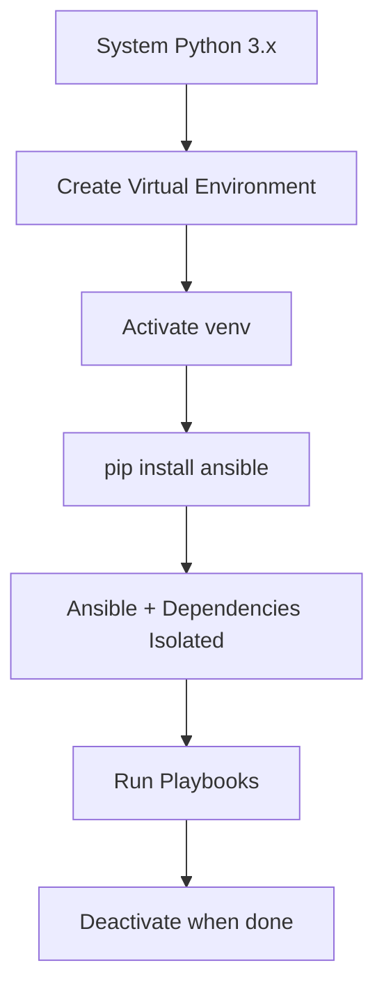

# How to Install Ansible Using pip in a Python Virtual Environment

Author: [nawazdhandala](https://www.github.com/nawazdhandala)

Tags: Ansible, Python, pip, DevOps, Virtual Environment

Description: Learn how to install Ansible using pip inside a Python virtual environment for clean dependency management and version control.

---

Installing Ansible with pip in a Python virtual environment is the cleanest way to manage your Ansible installation. It isolates Ansible and its dependencies from your system Python, lets you run multiple Ansible versions side by side, and makes upgrades or rollbacks trivial. This approach is especially useful when different projects require different Ansible versions, or when you want to avoid breaking system packages.

## Why Use a Virtual Environment?

When you install Ansible system-wide with pip (using `sudo pip install ansible`), it can conflict with packages managed by your OS package manager. On Debian/Ubuntu, this can break apt-managed Python packages. On RHEL/CentOS, it can conflict with dnf-managed ones. Virtual environments solve this entirely by creating an isolated Python installation per project.

Here is the high-level flow of what we will set up:



## Prerequisites

You need Python 3.9 or later installed on your system. Most modern Linux distributions ship with Python 3.9+ by default. Check your version:

```bash
# Check your Python version
python3 --version
```

You also need the `venv` module. On Debian/Ubuntu, install it if it is not already present:

```bash
# Install venv module on Ubuntu/Debian
sudo apt install python3-venv python3-pip -y
```

On CentOS/RHEL:

```bash
# Install venv and pip on CentOS/RHEL
sudo dnf install python3-pip python3-virtualenv -y
```

On macOS with Homebrew:

```bash
# Python from Homebrew includes venv by default
brew install python3
```

## Create the Virtual Environment

Pick a location for your virtual environment. I like to create one per project, but you can also have a single shared environment for all your Ansible work.

### Per-Project Virtual Environment

```bash
# Create a project directory
mkdir -p ~/projects/infra-automation
cd ~/projects/infra-automation

# Create a virtual environment named .venv inside the project
python3 -m venv .venv

# Activate the virtual environment
source .venv/bin/activate
```

### Shared Virtual Environment

```bash
# Create a shared Ansible environment
python3 -m venv ~/ansible-env

# Activate it
source ~/ansible-env/bin/activate
```

After activation, your shell prompt changes to show the environment name, something like `(.venv) user@host:~$`. This tells you that any Python or pip commands will use the isolated environment.

## Install Ansible

With the virtual environment activated, install Ansible:

```bash
# Install the latest stable version of Ansible
pip install ansible
```

This pulls in `ansible-core` plus all the community collections bundled in the `ansible` package. If you only need the core engine without community collections, install `ansible-core` instead:

```bash
# Install only ansible-core (smaller, no bundled collections)
pip install ansible-core
```

Verify the installation:

```bash
# Check the installed version
ansible --version

# Confirm pip installed packages
pip list | grep ansible
```

## Install a Specific Version

Pinning a specific version is a common practice for production environments. It ensures everyone on your team runs the exact same Ansible version.

```bash
# Install a specific version
pip install ansible==9.2.0

# Or pin ansible-core specifically
pip install ansible-core==2.16.4
```

To see all available versions:

```bash
# List all available versions of ansible on PyPI
pip index versions ansible
```

## Use a Requirements File

For team environments, create a requirements.txt file that pins all your Ansible-related dependencies:

```txt
# requirements.txt
ansible==9.2.0
ansible-lint==24.2.0
molecule==24.2.0
jmespath==1.0.1
netaddr==1.2.1
```

Install everything from the requirements file:

```bash
# Install all dependencies from the requirements file
pip install -r requirements.txt
```

This guarantees that every team member has the same tool versions. Commit this file to your Git repository alongside your playbooks.

## Create a Wrapper Script for Activation

Remembering to activate the virtual environment every time is annoying. Create a wrapper script that does it for you:

```bash
# ~/bin/ansible-activate.sh
#!/bin/bash
# Activate the Ansible virtual environment and drop into a shell
source ~/ansible-env/bin/activate
echo "Ansible environment activated: $(ansible --version | head -1)"
exec bash
```

Make it executable:

```bash
chmod +x ~/bin/ansible-activate.sh
```

Alternatively, add an alias to your shell configuration:

```bash
# Add to ~/.bashrc or ~/.zshrc
alias ansible-on='source ~/ansible-env/bin/activate'
alias ansible-off='deactivate'
```

## Managing Multiple Ansible Versions

One of the biggest advantages of virtual environments is running multiple Ansible versions. This is useful when you maintain playbooks that target different Ansible versions.

```bash
# Create environments for different versions
python3 -m venv ~/ansible-8
python3 -m venv ~/ansible-9

# Install Ansible 8.x in the first environment
source ~/ansible-8/bin/activate
pip install "ansible>=8.0,<9.0"
deactivate

# Install Ansible 9.x in the second
source ~/ansible-9/bin/activate
pip install "ansible>=9.0,<10.0"
deactivate
```

Switch between them by activating the appropriate environment:

```bash
# Use Ansible 8.x
source ~/ansible-8/bin/activate
ansible --version

# Switch to Ansible 9.x
deactivate
source ~/ansible-9/bin/activate
ansible --version
```

## Upgrading Ansible in a Virtual Environment

Upgrading within a virtual environment is straightforward:

```bash
# Activate the environment
source ~/ansible-env/bin/activate

# Upgrade to the latest version
pip install --upgrade ansible

# Or upgrade to a specific version
pip install --upgrade ansible==9.3.0
```

If something goes wrong after an upgrade, you can roll back:

```bash
# Roll back to a previous version
pip install ansible==9.2.0
```

## Freezing Your Environment

Before upgrading, it is smart to freeze your current environment so you can recreate it later if needed:

```bash
# Save the current state of all installed packages
pip freeze > requirements-lock.txt
```

To recreate the exact same environment on another machine:

```bash
python3 -m venv ~/ansible-env
source ~/ansible-env/bin/activate
pip install -r requirements-lock.txt
```

## Installing Extra Python Dependencies

Some Ansible modules need additional Python libraries. For example, the AWS modules need `boto3`, and the Azure modules need the Azure SDK. Install these inside the same virtual environment:

```bash
# Install dependencies for AWS modules
pip install boto3 botocore

# Install dependencies for Azure modules
pip install azure-identity azure-mgmt-compute azure-mgmt-network

# Install dependencies for network automation
pip install paramiko pynautobot
```

## Common Issues and Fixes

**"ansible: command not found" after closing the terminal**

You need to reactivate the virtual environment. Virtual environment activation does not persist across terminal sessions. Add activation to your `.bashrc` or use the alias approach described above.

**"pip install ansible" fails with permission errors**

Make sure you are inside an activated virtual environment. If your prompt does not show the environment name, run `source /path/to/venv/bin/activate` first. Never use `sudo pip install` inside a virtual environment.

**Ansible cannot find Python on remote hosts**

This is not related to your local virtual environment. Set the Python interpreter for remote hosts in your inventory:

```ini
[all:vars]
ansible_python_interpreter=/usr/bin/python3
```

## Summary

Using pip with a virtual environment is the most flexible way to install Ansible. It gives you version isolation, easy upgrades and rollbacks, and keeps your system Python clean. The extra step of activating the environment is a small price to pay for the control you get in return. For team environments, pair this approach with a `requirements.txt` file to keep everyone on the same page.
