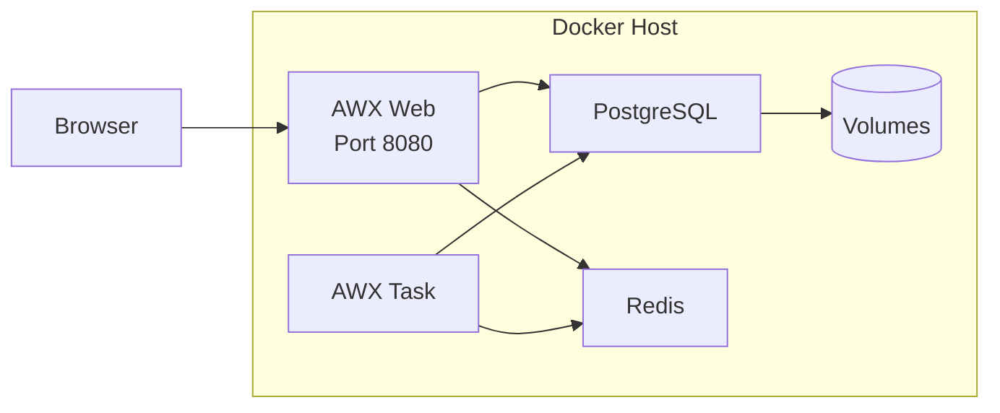

# How to Install AWX on Docker Compose

Author: [nawazdhandala](https://www.github.com/nawazdhandala)

Tags: Ansible, AWX, Docker Compose, Installation, DevOps

Description: Deploy AWX using Docker Compose for development and small-scale production environments with step-by-step configuration.

---

While the AWX Operator on Kubernetes is the recommended production deployment method, Docker Compose is still a viable option for development environments, small teams, and situations where Kubernetes is overkill. The AWX project provides official tooling for Docker Compose based deployments. This guide covers the full installation process.

## Prerequisites

You need a Linux host (Ubuntu 22.04 recommended) with:

- Docker Engine 24+ installed
- Docker Compose V2 (the plugin version, not the standalone binary)
- At least 4GB of RAM and 2 CPU cores
- 20GB of free disk space
- Git installed

```bash
# Verify Docker is installed and running
docker version
docker compose version

# Check available resources
free -h
nproc
```

## Step 1: Clone the AWX Repository

AWX provides a Docker Compose setup through the awx repository.

```bash
# Clone the AWX repository
git clone -b 24.2.0 https://github.com/ansible/awx.git
cd awx
```

## Step 2: Configure the Inventory

The AWX Docker Compose deployment uses an inventory file for configuration. Create your custom settings.

```bash
# Copy the example inventory
cp tools/docker-compose/inventory tools/docker-compose/inventory.local
```

Edit the inventory file with your settings.

```ini
# tools/docker-compose/inventory.local
[all:vars]

# Docker Compose project name
compose_project_name=awx

# AWX admin credentials
admin_user=admin
admin_password=changeme_strong_password

# PostgreSQL settings
pg_host=postgres
pg_port=5432
pg_database=awx
pg_username=awx
pg_password=changeme_pg_password

# Secret key for AWX
secret_key=a_very_long_random_secret_key_change_this

# Project data directory (where AWX stores playbooks)
project_data_dir=/var/lib/awx/projects

# Host port for the web UI
host_port=80
host_port_ssl=443
```

## Step 3: Build and Start AWX

Use the provided Makefile to build and launch AWX.

```bash
# Build the Docker images
make docker-compose-build

# Start AWX
make docker-compose
```

Alternatively, you can use docker compose directly.

```bash
# Navigate to the docker-compose directory
cd tools/docker-compose

# Generate the docker-compose.yml from the template
ansible-playbook -i inventory.local ../../tools/docker-compose/ansible/provision.yml

# Start the services
docker compose up -d
```

## Manual Docker Compose Setup

If you prefer a manual approach without the AWX build system, here is a standalone docker-compose.yml. This uses the pre-built AWX images.

```yaml
# docker-compose.yml - AWX deployment
version: '3.8'

services:
  postgres:
    image: postgres:15
    container_name: awx-postgres
    environment:
      POSTGRES_DB: awx
      POSTGRES_USER: awx
      POSTGRES_PASSWORD: ${PG_PASSWORD:-awxpassword}
    volumes:
      - postgres_data:/var/lib/postgresql/data
    healthcheck:
      test: ["CMD-SHELL", "pg_isready -U awx"]
      interval: 10s
      timeout: 5s
      retries: 5
    restart: unless-stopped

  redis:
    image: redis:7-alpine
    container_name: awx-redis
    volumes:
      - redis_data:/data
    healthcheck:
      test: ["CMD", "redis-cli", "ping"]
      interval: 10s
      timeout: 5s
      retries: 5
    restart: unless-stopped

  awx-web:
    image: quay.io/ansible/awx:24.2.0
    container_name: awx-web
    hostname: awxweb
    command: /usr/bin/launch_awx.sh
    environment:
      DATABASE_HOST: postgres
      DATABASE_NAME: awx
      DATABASE_USER: awx
      DATABASE_PASSWORD: ${PG_PASSWORD:-awxpassword}
      DATABASE_PORT: 5432
      AWX_ADMIN_USER: ${AWX_ADMIN_USER:-admin}
      AWX_ADMIN_PASSWORD: ${AWX_ADMIN_PASSWORD:-password}
      SECRET_KEY: ${SECRET_KEY:-change_me_to_something_random}
    ports:
      - "8080:8052"
    volumes:
      - awx_projects:/var/lib/awx/projects
      - awx_receptor:/var/run/receptor
    depends_on:
      postgres:
        condition: service_healthy
      redis:
        condition: service_healthy
    restart: unless-stopped

  awx-task:
    image: quay.io/ansible/awx:24.2.0
    container_name: awx-task
    hostname: awxtask
    command: /usr/bin/launch_awx_task.sh
    environment:
      DATABASE_HOST: postgres
      DATABASE_NAME: awx
      DATABASE_USER: awx
      DATABASE_PASSWORD: ${PG_PASSWORD:-awxpassword}
      DATABASE_PORT: 5432
      SECRET_KEY: ${SECRET_KEY:-change_me_to_something_random}
      SUPERVISOR_WEB_CONFIG_PATH: /etc/supervisord.conf
    volumes:
      - awx_projects:/var/lib/awx/projects
      - awx_receptor:/var/run/receptor
    depends_on:
      postgres:
        condition: service_healthy
      redis:
        condition: service_healthy
      awx-web:
        condition: service_started
    restart: unless-stopped

volumes:
  postgres_data:
  redis_data:
  awx_projects:
  awx_receptor:
```

Create a `.env` file for sensitive values.

```bash
# .env
PG_PASSWORD=strong_postgres_password_here
AWX_ADMIN_USER=admin
AWX_ADMIN_PASSWORD=strong_admin_password_here
SECRET_KEY=generate_a_random_64_char_string_here
```

Start it up.

```bash
docker compose up -d
```

## Architecture



## Step 4: Run Database Migrations

After the containers start, run the initial database setup.

```bash
# Run migrations
docker exec -it awx-web awx-manage migrate

# Create the admin superuser
docker exec -it awx-web awx-manage createsuperuser --username admin --email admin@example.com

# Or set the password for the default admin
docker exec -it awx-web awx-manage update_password --username admin --password 'your_password'
```

## Step 5: Access the Web UI

Open your browser and navigate to `http://your-server-ip:8080`. Log in with the admin credentials you configured.

## Adding TLS with Nginx Reverse Proxy

For production, put AWX behind an Nginx reverse proxy with TLS.

```yaml
# Add to docker-compose.yml
  nginx:
    image: nginx:alpine
    container_name: awx-nginx
    ports:
      - "443:443"
      - "80:80"
    volumes:
      - ./nginx.conf:/etc/nginx/conf.d/default.conf:ro
      - ./certs:/etc/nginx/certs:ro
    depends_on:
      - awx-web
    restart: unless-stopped
```

```nginx
# nginx.conf
server {
    listen 80;
    server_name awx.example.com;
    return 301 https://$server_name$request_uri;
}

server {
    listen 443 ssl;
    server_name awx.example.com;

    ssl_certificate /etc/nginx/certs/fullchain.pem;
    ssl_certificate_key /etc/nginx/certs/privkey.pem;

    # SSL settings
    ssl_protocols TLSv1.2 TLSv1.3;
    ssl_ciphers HIGH:!aNULL:!MD5;
    ssl_prefer_server_ciphers on;

    location / {
        proxy_pass http://awx-web:8052;
        proxy_set_header Host $host;
        proxy_set_header X-Real-IP $remote_addr;
        proxy_set_header X-Forwarded-For $proxy_add_x_forwarded_for;
        proxy_set_header X-Forwarded-Proto $scheme;

        # WebSocket support
        proxy_http_version 1.1;
        proxy_set_header Upgrade $http_upgrade;
        proxy_set_header Connection "upgrade";
    }
}
```

## Backup and Restore

Back up the database and project files regularly.

```bash
#!/bin/bash
# backup-awx.sh - Backup AWX data
BACKUP_DIR="/backups/awx/$(date +%Y%m%d)"
mkdir -p "$BACKUP_DIR"

# Backup PostgreSQL
docker exec awx-postgres pg_dump -U awx awx | gzip > "$BACKUP_DIR/awx-db.sql.gz"

# Backup project files
docker cp awx-web:/var/lib/awx/projects "$BACKUP_DIR/projects"

# Backup the docker-compose configuration
cp docker-compose.yml "$BACKUP_DIR/"
cp .env "$BACKUP_DIR/"

echo "Backup completed at $BACKUP_DIR"

# Remove backups older than 30 days
find /backups/awx -maxdepth 1 -mtime +30 -type d -exec rm -rf {} \;
```

Restore from backup.

```bash
#!/bin/bash
# restore-awx.sh - Restore AWX from backup
BACKUP_DIR="${1:?Usage: $0 /path/to/backup}"

# Stop AWX services
docker compose stop awx-web awx-task

# Restore database
gunzip -c "$BACKUP_DIR/awx-db.sql.gz" | docker exec -i awx-postgres psql -U awx awx

# Restore project files
docker cp "$BACKUP_DIR/projects" awx-web:/var/lib/awx/

# Restart services
docker compose start awx-web awx-task
```

## Upgrading AWX

To upgrade, update the image tags and recreate containers.

```bash
# Pull new images
docker compose pull

# Recreate containers with new images
docker compose up -d

# Run migrations for the new version
docker exec -it awx-web awx-manage migrate
```

## Monitoring the Deployment

Check the health of your AWX deployment.

```bash
# Check container status
docker compose ps

# View logs
docker compose logs -f awx-web
docker compose logs -f awx-task

# Check resource usage
docker stats awx-web awx-task awx-postgres awx-redis

# Check AWX version
docker exec awx-web awx-manage version
```

## Troubleshooting

Common issues you might encounter:

```bash
# Database connection errors - check PostgreSQL is healthy
docker compose logs postgres
docker exec awx-postgres pg_isready -U awx

# Web UI not responding - check web container logs
docker compose logs awx-web --tail=50

# Jobs not running - check task container
docker compose logs awx-task --tail=50

# Reset admin password
docker exec -it awx-web awx-manage update_password --username admin --password 'new_password'

# Clear stuck jobs
docker exec -it awx-web awx-manage cleanup_jobs --days 0
```

Docker Compose gives you a simpler deployment path for AWX when Kubernetes is not available or not warranted. It works well for development, testing, and small teams. For larger deployments or production environments with high availability requirements, consider migrating to the Kubernetes-based deployment with the AWX Operator.
