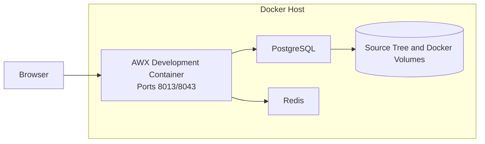

# How to Install AWX on Docker Compose

Author: [nawazdhandala](https://www.github.com/nawazdhandala)

Tags: Ansible, AWX, Docker Compose, Installation, DevOps

Description: Deploy AWX using Docker Compose for development and small-scale production environments with step-by-step configuration.

---

While the AWX Operator on Kubernetes is the recommended deployment method, Docker Compose is still a viable option for development and testing environments where Kubernetes is overkill. The AWX project provides official Docker Compose tooling for its development environment. This guide covers the full installation process for that workflow.

## Prerequisites

You need a Linux host (Ubuntu LTS recommended) with:

- Docker Engine 24+ installed
- Docker Compose V2 (the plugin version, not the standalone binary)
- Ansible installed
- OpenSSL installed
- At least 4GB of RAM and 2 CPU cores
- 20GB of free disk space
- Git installed

```bash
# Verify Docker is installed and running

docker version
docker compose version

# Check available resources
free -h
nproc
```

## Step 1: Clone the AWX Repository

AWX provides a Docker Compose setup through the awx repository.

```bash
# Clone the AWX repository
git clone -b 24.2.0 https://github.com/ansible/awx.git
cd awx
```

## Step 2: Configure the Inventory

The AWX Docker Compose deployment uses an inventory file for configuration. Keep a backup of the default file before editing it.

```bash
# Back up the default inventory
cp tools/docker-compose/inventory tools/docker-compose/inventory.bak
```

Edit the inventory file with your settings.

```ini
# tools/docker-compose/inventory
localhost ansible_connection=local ansible_python_interpreter="/usr/bin/env python3"

[all:vars]

# AWX admin password for the default admin user
admin_password=changeme_strong_password

# AWX-managed PostgreSQL password
pg_password=changeme_pg_password

# Secret values for AWX
broadcast_websocket_secret=changeme_websocket_secret
secret_key=a_very_long_random_secret_key_change_this
```

## Step 3: Build and Start AWX

Use the provided Makefile to build and launch AWX.

```bash
# Build the Docker images
make docker-compose-build

# Start AWX in detached mode
make docker-compose COMPOSE_UP_OPTS=-d
```

Alternatively, you can use docker compose directly.

```bash
# Generate the docker-compose.yml from the template
ansible-galaxy install --ignore-certs -r tools/docker-compose/ansible/requirements.yml
ansible-playbook -i tools/docker-compose/inventory tools/docker-compose/ansible/sources.yml

# Start the services
docker compose -f tools/docker-compose/_sources/docker-compose.yml up -d --remove-orphans
```

## Manual Docker Compose Setup

AWX 24.2.0 does not provide a supported standalone Docker Compose file that runs the published `quay.io/ansible/awx` image by itself. Use the AWX repository tooling to render the compose file and start the development environment.

```bash
make docker-compose-build
make docker-compose COMPOSE_UP_OPTS=-d
```

## Architecture


```mermaid
graph LR
    subgraph Docker Host
        WEB[AWX Development Container<br/>Ports 8013/8043]
        PG[PostgreSQL]
        REDIS[Redis]
        VOL[(Source Tree and Docker Volumes)]
    end
    USER[Browser] --> WEB
    WEB --> PG
    WEB --> REDIS
    PG --> VOL
```

## Step 4: Run Database Migrations

The development startup process runs the initial database migrations when `RUN_MIGRATIONS` is set for the first AWX container. If you started the environment with the Makefile, wait for migrations to complete in the logs, then create or update the admin user if needed.

```bash
# Watch startup logs
docker compose -f tools/docker-compose/_sources/docker-compose.yml logs -f awx_1

# Build the development UI after migrations complete
docker exec tools_awx_1 make clean-ui ui-devel

# Create the admin superuser
docker exec -it tools_awx_1 awx-manage createsuperuser --username admin --email admin@example.com

# Or set the password for the default admin
docker exec -it tools_awx_1 awx-manage update_password --username admin --password 'your_password'
```

## Step 5: Access the Web UI

Open your browser and navigate to `https://localhost:8043/#/home`. Log in with the admin credentials you configured.

## Adding TLS with Nginx Reverse Proxy

If you need to expose the development environment through a hostname, put AWX behind an Nginx reverse proxy with TLS.

```yaml
# Add to the generated Docker Compose file or an override file
  nginx:
    image: nginx:alpine
    container_name: awx-nginx
    ports:
      - "443:443"
      - "80:80"
    volumes:
      - ./nginx.conf:/etc/nginx/conf.d/default.conf:ro
      - ./certs:/etc/nginx/certs:ro
    depends_on:
      - awx_1
    networks:
      - awx
    restart: unless-stopped
```

```nginx
# nginx.conf
server {
    listen 80;
    server_name awx.example.com;
    return 301 https://$server_name$request_uri;
}

server {
    listen 443 ssl;
    server_name awx.example.com;

    ssl_certificate /etc/nginx/certs/fullchain.pem;
    ssl_certificate_key /etc/nginx/certs/privkey.pem;

    # SSL settings
    ssl_protocols TLSv1.2 TLSv1.3;
    ssl_ciphers HIGH:!aNULL:!MD5;
    ssl_prefer_server_ciphers on;

    location / {
        proxy_pass http://tools_awx_1:8013;
        proxy_set_header Host $host;
        proxy_set_header X-Real-IP $remote_addr;
        proxy_set_header X-Forwarded-For $proxy_add_x_forwarded_for;
        proxy_set_header X-Forwarded-Proto $scheme;

        # WebSocket support
        proxy_http_version 1.1;
        proxy_set_header Upgrade $http_upgrade;
        proxy_set_header Connection "upgrade";
    }
}
```

## Backup and Restore

Back up the database and project files regularly.

```bash
#!/bin/bash
# backup-awx.sh - Backup AWX data
BACKUP_DIR="/backups/awx/$(date +%Y%m%d)"
mkdir -p "$BACKUP_DIR"

# Backup PostgreSQL
docker exec tools_postgres_1 pg_dump -U awx awx | gzip > "$BACKUP_DIR/awx-db.sql.gz"

# Backup project files
cp -a awx/projects "$BACKUP_DIR/projects"

# Backup the docker-compose configuration
cp tools/docker-compose/inventory "$BACKUP_DIR/"
cp -a tools/docker-compose/_sources "$BACKUP_DIR/"

echo "Backup completed at $BACKUP_DIR"

# Remove backups older than 30 days
find /backups/awx -maxdepth 1 -mtime +30 -type d -exec rm -rf {} \;
```

Restore from backup.

```bash
#!/bin/bash
# restore-awx.sh - Restore AWX from backup
BACKUP_DIR="${1:?Usage: $0 /path/to/backup}"

# Stop AWX services
docker compose -f tools/docker-compose/_sources/docker-compose.yml stop awx_1

# Restore database
gunzip -c "$BACKUP_DIR/awx-db.sql.gz" | docker exec -i tools_postgres_1 psql -U awx awx

# Restore project files
rm -rf awx/projects
cp -a "$BACKUP_DIR/projects" awx/projects

# Restart services
docker compose -f tools/docker-compose/_sources/docker-compose.yml start awx_1
```

## Upgrading AWX

To upgrade, check out the newer AWX release, review your inventory values, rebuild the development image, and restart the environment.

```bash
# Check out a newer AWX release
git fetch --tags
git checkout <new-awx-version>

# Rebuild and restart
make docker-compose-build
make docker-compose COMPOSE_UP_OPTS=-d

# Check the AWX version
docker exec tools_awx_1 awx-manage version
```

## Monitoring the Deployment

Check the health of your AWX deployment.

```bash
# Check container status
docker compose -f tools/docker-compose/_sources/docker-compose.yml ps

# View logs
docker compose -f tools/docker-compose/_sources/docker-compose.yml logs -f awx_1

# Check resource usage
docker stats tools_awx_1 tools_postgres_1 tools_redis_1

# Check AWX version
docker exec tools_awx_1 awx-manage version
```

## Troubleshooting

Common issues you might encounter:

```bash
# Database connection errors - check PostgreSQL is healthy
docker compose -f tools/docker-compose/_sources/docker-compose.yml logs postgres
docker exec tools_postgres_1 pg_isready -U awx

# Web UI not responding - check web container logs
docker compose -f tools/docker-compose/_sources/docker-compose.yml logs awx_1 --tail=50

# Jobs not running - check AWX container logs
docker compose -f tools/docker-compose/_sources/docker-compose.yml logs awx_1 --tail=50

# Reset admin password
docker exec -it tools_awx_1 awx-manage update_password --username admin --password 'new_password'

# Clear stuck jobs
docker exec -it tools_awx_1 awx-manage cleanup_jobs --days 0
```

Docker Compose gives you a simpler development path for AWX when Kubernetes is not available or not warranted. It works well for development and testing. For production environments, consider migrating to the Kubernetes-based deployment with the AWX Operator.
