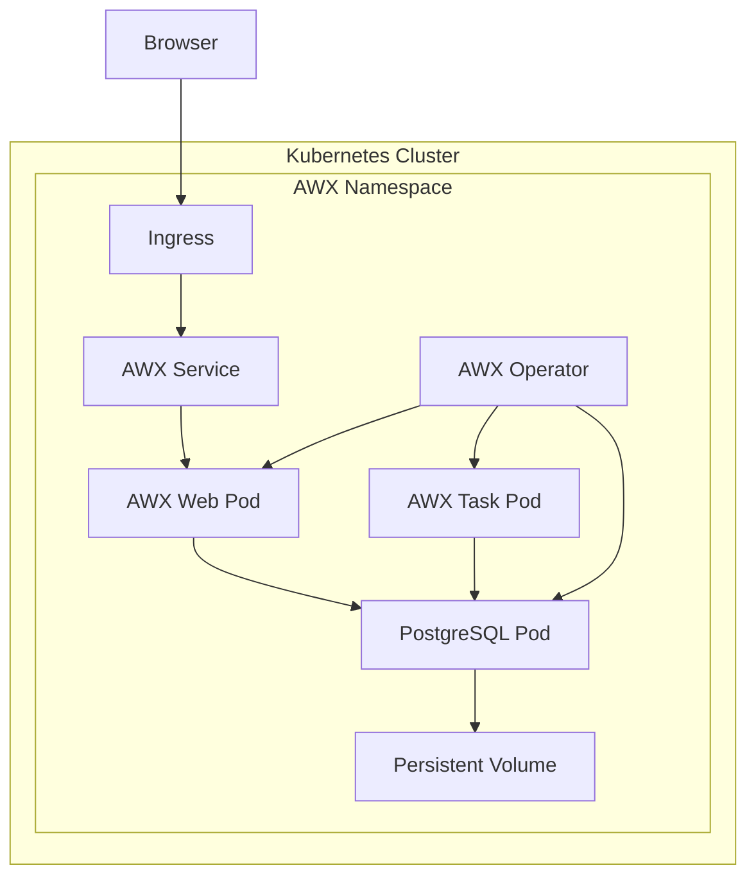

# How to Install AWX on Kubernetes

Author: [nawazdhandala](https://www.github.com/nawazdhandala)

Tags: Ansible, AWX, Kubernetes, Installation, Automation

Description: Step-by-step guide to deploying AWX on Kubernetes using the AWX Operator with persistent storage and ingress configuration.

---

AWX is the open-source version of Ansible Tower, providing a web UI, REST API, and role-based access control for running Ansible playbooks. The recommended way to deploy AWX is on Kubernetes using the AWX Operator. This guide walks through the entire installation process, from setting up the operator to accessing the AWX web interface.

## Prerequisites

Before starting, make sure you have:

- A running Kubernetes cluster (minikube, k3s, EKS, GKE, or AKS all work)
- kubectl configured and connected to your cluster
- At least 4GB of free memory and 2 CPU cores available
- A StorageClass that supports dynamic provisioning (for PostgreSQL data)

Check your cluster is ready.

```bash
# Verify cluster access
kubectl cluster-info

# Check available resources
kubectl top nodes

# Verify a StorageClass exists
kubectl get storageclass
```

## Step 1: Install the AWX Operator

The AWX Operator manages AWX instances on Kubernetes. Install it using Kustomize.

Create a directory for the AWX deployment configuration.

```bash
mkdir -p awx-deployment && cd awx-deployment
```

Create a kustomization.yml that references the AWX Operator.

```yaml
# kustomization.yml
apiVersion: kustomize.config.k8s.io/v1beta1
kind: Kustomization

resources:
  - github.com/ansible/awx-operator/config/default?ref=2.12.2

# Set the namespace for the operator
namespace: awx

# Set the image tag for the operator
images:
  - name: quay.io/ansible/awx-operator
    newTag: 2.12.2
```

Apply it to your cluster.

```bash
# Create the namespace first
kubectl create namespace awx

# Deploy the operator
kubectl apply -k .

# Watch the operator come up
kubectl -n awx get pods -w
```

Wait until the operator pod shows `Running` status.

```bash
# Verify operator is running
kubectl -n awx get deployment awx-operator-controller-manager
```

## Step 2: Create the AWX Instance

Now create an AWX custom resource that tells the operator what to deploy.

```yaml
# awx-instance.yml
apiVersion: awx.ansible.com/v1beta1
kind: AWX
metadata:
  name: awx
  namespace: awx
spec:
  # Service type - use NodePort for local, LoadBalancer for cloud
  service_type: NodePort
  nodeport_port: 30080

  # PostgreSQL configuration
  postgres_configuration_secret: awx-postgres-configuration

  # Resource limits
  web_resource_requirements:
    requests:
      cpu: 500m
      memory: 1Gi
    limits:
      cpu: "2"
      memory: 4Gi

  task_resource_requirements:
    requests:
      cpu: 500m
      memory: 1Gi
    limits:
      cpu: "2"
      memory: 4Gi

  # Persistent storage for projects
  projects_persistence: true
  projects_storage_size: 10Gi
  projects_storage_access_mode: ReadWriteOnce
```

Create the PostgreSQL configuration secret.

```yaml
# awx-postgres-secret.yml
apiVersion: v1
kind: Secret
metadata:
  name: awx-postgres-configuration
  namespace: awx
type: Opaque
stringData:
  host: "awx-postgres-13"
  port: "5432"
  database: "awx"
  username: "awx"
  password: "changeme-strong-password"
  sslmode: "prefer"
  type: "managed"
```

Add these to your kustomization.

```yaml
# Updated kustomization.yml
apiVersion: kustomize.config.k8s.io/v1beta1
kind: Kustomization

resources:
  - github.com/ansible/awx-operator/config/default?ref=2.12.2
  - awx-postgres-secret.yml
  - awx-instance.yml

namespace: awx

images:
  - name: quay.io/ansible/awx-operator
    newTag: 2.12.2
```

Apply the updated configuration.

```bash
kubectl apply -k .
```

## Step 3: Monitor the Deployment

The operator creates several resources. Watch them come up.

```bash
# Watch all pods in the awx namespace
kubectl -n awx get pods -w

# Check the AWX deployment logs
kubectl -n awx logs -f deployment/awx-operator-controller-manager -c awx-manager

# Check the status of the AWX instance
kubectl -n awx get awx
```

The full deployment takes 5-10 minutes. You should eventually see these pods.

```bash
kubectl -n awx get pods
# NAME                                              READY   STATUS    RESTARTS
# awx-operator-controller-manager-xxx               2/2     Running   0
# awx-postgres-13-0                                 1/1     Running   0
# awx-web-xxx                                       3/3     Running   0
# awx-task-xxx                                      4/4     Running   0
```

## Step 4: Get the Admin Password

The operator creates a secret with the initial admin password.

```bash
# Get the admin password
kubectl -n awx get secret awx-admin-password -o jsonpath='{.data.password}' | base64 --decode
```

## Step 5: Access the Web Interface

Access depends on your service type.

For NodePort (local/minikube):

```bash
# Get the NodePort
kubectl -n awx get svc awx-service

# For minikube, get the URL
minikube service awx-service -n awx --url
```

For LoadBalancer (cloud):

```bash
# Get the external IP
kubectl -n awx get svc awx-service
# Wait for EXTERNAL-IP to be assigned
```

## Configuring Ingress

For production, set up an Ingress resource instead of NodePort.

```yaml
# awx-ingress.yml
apiVersion: networking.k8s.io/v1
kind: Ingress
metadata:
  name: awx-ingress
  namespace: awx
  annotations:
    nginx.ingress.kubernetes.io/proxy-body-size: "0"
    nginx.ingress.kubernetes.io/proxy-read-timeout: "600"
    nginx.ingress.kubernetes.io/proxy-send-timeout: "600"
spec:
  ingressClassName: nginx
  rules:
    - host: awx.example.com
      http:
        paths:
          - path: /
            pathType: Prefix
            backend:
              service:
                name: awx-service
                port:
                  number: 80
  tls:
    - hosts:
        - awx.example.com
      secretName: awx-tls
```

Update the AWX instance to use ClusterIP when using Ingress.

```yaml
# awx-instance.yml (updated for Ingress)
apiVersion: awx.ansible.com/v1beta1
kind: AWX
metadata:
  name: awx
  namespace: awx
spec:
  service_type: ClusterIP
  ingress_type: ingress
  ingress_hosts:
    - hostname: awx.example.com
  ingress_tls_secret: awx-tls
```

## Architecture Overview



## Persistent Storage Configuration

For production, configure proper persistent storage.

```yaml
# awx-instance.yml with storage configuration
apiVersion: awx.ansible.com/v1beta1
kind: AWX
metadata:
  name: awx
  namespace: awx
spec:
  service_type: ClusterIP

  # PostgreSQL storage
  postgres_storage_class: standard
  postgres_storage_requirements:
    requests:
      storage: 20Gi

  # Project storage
  projects_persistence: true
  projects_storage_size: 20Gi
  projects_storage_class: standard
  projects_storage_access_mode: ReadWriteOnce

  # Extra settings for production
  extra_settings:
    - setting: REMOTE_HOST_HEADERS
      value:
        - HTTP_X_FORWARDED_FOR
    - setting: CSRF_TRUSTED_ORIGINS
      value:
        - https://awx.example.com
```

## Upgrading AWX

To upgrade, update the operator version in your kustomization.yml.

```yaml
# kustomization.yml - Updated version
apiVersion: kustomize.config.k8s.io/v1beta1
kind: Kustomization

resources:
  - github.com/ansible/awx-operator/config/default?ref=2.13.0

namespace: awx

images:
  - name: quay.io/ansible/awx-operator
    newTag: 2.13.0
```

```bash
# Apply the upgrade
kubectl apply -k .

# Watch the rolling update
kubectl -n awx get pods -w
```

The operator handles the upgrade process, including database migrations.

## Troubleshooting

Common issues and their solutions.

```bash
# Pods stuck in Pending - check storage
kubectl -n awx describe pod awx-postgres-13-0
kubectl get pv,pvc -n awx

# Operator errors - check operator logs
kubectl -n awx logs deployment/awx-operator-controller-manager -c awx-manager --tail=100

# Web UI not loading - check web pod logs
kubectl -n awx logs deployment/awx-web -c awx-web --tail=100

# Migration issues - check task pod
kubectl -n awx logs deployment/awx-task -c awx-task --tail=100

# Database connection issues
kubectl -n awx exec -it awx-postgres-13-0 -- psql -U awx -d awx -c "SELECT 1"
```

## Backup and Restore

Create a backup custom resource.

```yaml
# awx-backup.yml
apiVersion: awx.ansible.com/v1beta1
kind: AWXBackup
metadata:
  name: awx-backup-daily
  namespace: awx
spec:
  deployment_name: awx
  backup_pvc: awx-backup-claim
  backup_pvc_namespace: awx
  backup_storage_class: standard
  backup_storage_requirements:
    requests:
      storage: 10Gi
```

```bash
# Create the backup
kubectl apply -f awx-backup.yml

# Check backup status
kubectl -n awx get awxbackup
```

Deploying AWX on Kubernetes with the operator is the most maintainable approach. The operator handles the complexity of managing PostgreSQL, migrations, and rolling updates. Once installed, you get a production-grade Ansible automation platform with a web UI that your whole team can use.
