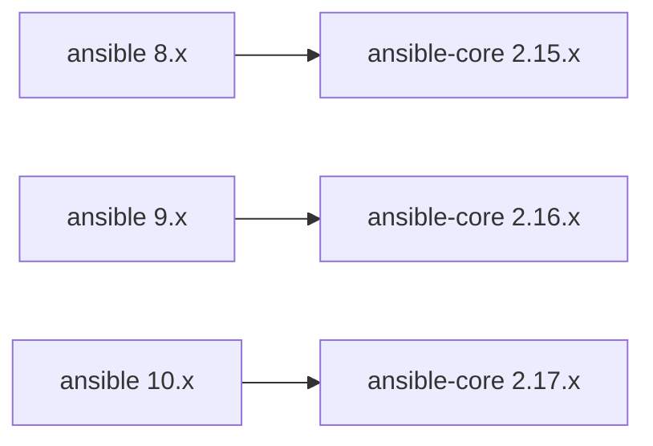

# How to Install a Specific Version of Ansible

Author: [nawazdhandala](https://www.github.com/nawazdhandala)

Tags: Ansible, Installation, Python, DevOps

Description: How to install a specific version of Ansible using pip, apt, or dnf for reproducible automation environments and team consistency.

---

There are plenty of reasons to install a specific version of Ansible instead of whatever "latest" happens to be. Maybe your playbooks were written for Ansible 2.14 and you do not want to risk breaking changes. Maybe your team standardized on a particular version. Maybe you are debugging a version-specific bug. Whatever the reason, pinning Ansible to an exact version is straightforward with any installation method.

## Understanding Ansible Versioning

Before installing a specific version, it helps to understand the versioning scheme. There are two packages to be aware of:

- **ansible**: The full package that includes ansible-core plus community collections. Uses versions like 8.0.0, 9.2.0, etc.
- **ansible-core**: The engine that runs playbooks, without bundled collections. Uses versions like 2.15.0, 2.16.4, etc.

The `ansible` package depends on a specific range of `ansible-core` versions. For example, ansible 9.x requires ansible-core 2.16.x.



## Method 1: Install a Specific Version with pip

pip is the most flexible method for version pinning.

### Find Available Versions

```bash
# List all available versions of the ansible package
pip index versions ansible

# List all available versions of ansible-core
pip index versions ansible-core
```

### Install an Exact Version

```bash
# Create a virtual environment for isolation
python3 -m venv ~/ansible-specific
source ~/ansible-specific/bin/activate

# Install an exact version of the full ansible package
pip install ansible==9.2.0

# Or install an exact version of ansible-core only
pip install ansible-core==2.16.4
```

### Install Within a Version Range

```bash
# Install the latest 9.x release
pip install "ansible>=9.0,<10.0"

# Install the latest 2.16.x core release
pip install "ansible-core>=2.16.0,<2.17.0"

# Install at least 9.1 but below 10
pip install "ansible>=9.1,<10.0"
```

### Verify the Installed Version

```bash
# Check the installed version
ansible --version

# Check the pip package version
pip show ansible
pip show ansible-core
```

## Method 2: Pin with a Requirements File

For team environments, define the exact version in a requirements.txt file:

```txt
# requirements.txt
ansible==9.2.0
ansible-lint==24.2.0
molecule==24.2.0
jmespath==1.0.1
```

Install from the file:

```bash
# Create environment and install pinned versions
python3 -m venv ~/ansible-env
source ~/ansible-env/bin/activate
pip install -r requirements.txt
```

For even stricter version pinning, use pip-compile from pip-tools to generate a fully resolved lock file:

```bash
# Install pip-tools
pip install pip-tools

# Generate a lock file from requirements.txt
pip-compile requirements.txt --output-file requirements-lock.txt
```

The lock file will include every transitive dependency with its exact version, ensuring completely reproducible installations.

## Method 3: Install a Specific Version with apt

On Ubuntu/Debian, you can install a specific version from the repository or PPA.

### List Available Versions

```bash
# Show available versions in the configured repositories
apt-cache showpkg ansible

# More detailed version info
apt-cache madison ansible
```

### Install a Specific Version

```bash
# Install a specific version
sudo apt install ansible=<version-string>

# Example (version strings vary by repository)
sudo apt install ansible=9.2.0-1ppa~jammy
```

### Prevent Automatic Upgrades

After installing a specific version, hold it to prevent automatic upgrades:

```bash
# Hold the ansible package at the current version
sudo apt-mark hold ansible

# Verify the hold is in place
apt-mark showhold

# Later, when you want to allow upgrades again
sudo apt-mark unhold ansible
```

## Method 4: Install a Specific Version with dnf

On CentOS/RHEL with the EPEL repository:

```bash
# List available versions
dnf --showduplicates list ansible

# Install a specific version
sudo dnf install ansible-<version>

# Example
sudo dnf install ansible-9.2.0-1.el9
```

To prevent automatic upgrades:

```bash
# Exclude ansible from future updates
sudo dnf versionlock add ansible

# Or add to dnf.conf
echo "exclude=ansible" | sudo tee -a /etc/dnf/dnf.conf
```

## Method 5: Install from Source (Git)

For development or testing unreleased versions, install directly from the Git repository:

```bash
# Clone the ansible-core repository
git clone https://github.com/ansible/ansible.git
cd ansible

# List available tags (versions)
git tag | grep "^v2.16" | sort -V

# Check out a specific version
git checkout v2.16.4

# Install in a virtual environment
python3 -m venv ~/ansible-dev
source ~/ansible-dev/bin/activate
pip install .
```

This is primarily useful for contributors or for testing specific commits that might contain a bug fix you need.

## Managing Multiple Versions Side by Side

If different projects require different Ansible versions, create separate virtual environments:

```bash
# Project A needs Ansible 8.x
python3 -m venv ~/projects/project-a/.venv
source ~/projects/project-a/.venv/bin/activate
pip install "ansible>=8.0,<9.0"
deactivate

# Project B needs Ansible 9.x
python3 -m venv ~/projects/project-b/.venv
source ~/projects/project-b/.venv/bin/activate
pip install "ansible>=9.0,<10.0"
deactivate
```

You can simplify switching between environments with direnv. Create a `.envrc` file in each project:

```bash
# ~/projects/project-a/.envrc
source .venv/bin/activate
```

```bash
# ~/projects/project-b/.envrc
source .venv/bin/activate
```

With direnv installed, the correct environment activates automatically when you `cd` into each project directory.

## Downgrading Ansible

If you need to go back to an older version:

### With pip

```bash
source ~/ansible-env/bin/activate

# Install the older version (pip will downgrade automatically)
pip install ansible==8.7.0
```

### With apt

```bash
# Install a specific older version
sudo apt install ansible=<older-version>
```

### With dnf

```bash
sudo dnf downgrade ansible-<older-version>
```

## Collection Version Pinning

Do not forget that collections have their own versions. Pin them alongside Ansible for full reproducibility:

```yaml
# collections/requirements.yml
---
collections:
  - name: community.general
    version: "8.3.0"
  - name: amazon.aws
    version: "7.2.0"
  - name: ansible.posix
    version: "1.5.4"
  - name: community.docker
    version: "3.8.0"
```

Install pinned collections:

```bash
ansible-galaxy collection install -r collections/requirements.yml
```

## Verifying Version Compatibility

After installing a specific version, verify that your playbooks work with it:

```bash
# Syntax check all playbooks
find . -name "*.yml" -path "*/playbooks/*" -exec ansible-playbook --syntax-check {} \;

# Run in check mode against a test inventory
ansible-playbook --check -i inventory/test.ini playbooks/deploy.yml

# Run ansible-lint to catch deprecation warnings
ansible-lint playbooks/
```

## CI/CD Version Enforcement

In your CI/CD pipeline, verify the Ansible version before running playbooks:

```bash
#!/bin/bash
# verify-ansible-version.sh

REQUIRED="9.2.0"
ACTUAL=$(pip show ansible 2>/dev/null | grep "^Version:" | awk '{print $2}')

if [ "$ACTUAL" != "$REQUIRED" ]; then
    echo "ERROR: Expected Ansible $REQUIRED but found $ACTUAL"
    exit 1
fi

echo "Ansible version $ACTUAL confirmed"
```

## Summary

Installing a specific Ansible version is essential for reproducible automation. Use pip with virtual environments for the most control and easiest rollback. Pin your version in a requirements.txt file for team consistency. Remember to also pin your collection versions and hold the package in your OS package manager to prevent unintended upgrades. The few minutes you spend setting this up saves hours of debugging version-related issues down the road.
