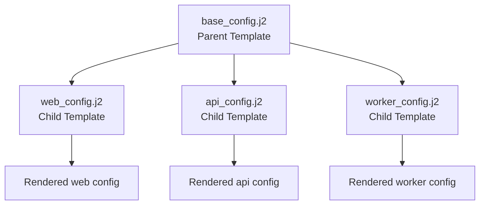

# How to Use Jinja2 Template Inheritance in Ansible

Author: [nawazdhandala](https://www.github.com/nawazdhandala)

Tags: Ansible, Jinja2, Templates, Configuration Management

Description: Learn how to use Jinja2 template inheritance in Ansible to create base templates with overridable blocks for consistent configurations.

---

If you manage multiple services that share a common configuration structure but differ in specific sections, Jinja2 template inheritance can save you a lot of copy-paste work. Template inheritance lets you define a base template with placeholder blocks, then create child templates that override only the blocks they need to customize. This pattern is well-known in web development frameworks like Django and Flask, but it works just as well in Ansible for infrastructure configuration.

## How Template Inheritance Works

The concept is simple. You create a parent template that defines the overall structure and marks certain sections as blocks. Child templates extend the parent and fill in or override those blocks. Anything not overridden in the child template keeps the parent's default content.

Here is the relationship visualized:



## A Basic Example

Let us start with a simple parent template for a systemd service unit file. Many services share the same basic structure but differ in their ExecStart command, environment variables, and resource limits.

Parent template:

```jinja2
{# templates/base_service.j2 - Base systemd service template #}
[Unit]
Description={{ service_description }}
After=network.target


[Service]
Type={{ service_type | default('simple') }}
User={{ service_user | default('nobody') }}
Group={{ service_group | default('nogroup') }}
WorkingDirectory={{ service_workdir | default('/opt/' + service_name) }}


ExecStart={{ service_exec }}

Restart={{ service_restart | default('on-failure') }}
RestartSec={{ service_restart_sec | default(5) }}

LimitNOFILE=65536
LimitNPROC=4096


[Install]
WantedBy=multi-user.target

```

Now child templates that extend it:

```jinja2
{# templates/web_service.j2 - Web application service #}



After=postgresql.service
Requires=postgresql.service



Environment=NODE_ENV=production
Environment=PORT={{ web_port | default(3000) }}
Environment=DATABASE_URL={{ database_url }}



ExecStart=/usr/bin/node {{ service_workdir }}/server.js

```

```jinja2
{# templates/worker_service.j2 - Background worker service #}



Environment=WORKER_CONCURRENCY={{ worker_concurrency | default(4) }}
Environment=REDIS_URL={{ redis_url }}
Environment=QUEUE_NAME={{ queue_name }}



ExecStart=/usr/bin/python3 {{ service_workdir }}/worker.py



LimitNOFILE=65536
LimitNPROC=8192
MemoryMax=2G
CPUQuota=200%

```

The web service template overrides the unit dependencies, environment, and exec blocks but keeps the default resource limits from the parent. The worker service overrides the resource limits with tighter constraints but does not need extra unit dependencies.

## Using It in a Playbook

Here is how you would use these templates in a playbook:

```yaml
# deploy_services.yml - Deploy services using inherited templates
- name: Deploy web application
  hosts: web_servers
  vars:
    service_name: myapp-web
    service_description: "My Application Web Server"
    service_user: myapp
    service_group: myapp
    web_port: 8080
    database_url: "postgresql://db.internal:5432/myapp"
  tasks:
    - name: Create systemd unit file for web service
      ansible.builtin.template:
        src: web_service.j2
        dest: /etc/systemd/system/myapp-web.service
      notify: Reload systemd

- name: Deploy background workers
  hosts: worker_servers
  vars:
    service_name: myapp-worker
    service_description: "My Application Background Worker"
    service_user: myapp
    service_group: myapp
    redis_url: "redis://redis.internal:6379/0"
    queue_name: "default"
    worker_concurrency: 8
  tasks:
    - name: Create systemd unit file for worker service
      ansible.builtin.template:
        src: worker_service.j2
        dest: /etc/systemd/system/myapp-worker.service
      notify: Reload systemd

  handlers:
    - name: Reload systemd
      ansible.builtin.systemd:
        daemon_reload: true
```

## Using super() to Extend Parent Blocks

Sometimes you do not want to completely replace a parent block. Instead, you want to add to it while keeping the parent's content. The `super()` function lets you do exactly that:

```jinja2
{# templates/api_service.j2 - API service that extends parent resource limits #}



Environment=API_PORT={{ api_port | default(9090) }}
Environment=LOG_LEVEL={{ log_level | default('info') }}



ExecStart=/usr/bin/java -jar {{ service_workdir }}/api.jar



{{ super() }}
MemoryMax=4G

```

The `super()` call in the `resource_limits` block inserts the parent's default content (LimitNOFILE and LimitNPROC), and then adds `MemoryMax=4G` below it. The rendered output would be:

```ini
LimitNOFILE=65536
LimitNPROC=4096
MemoryMax=4G
```

This is extremely useful when the parent defines sensible defaults that children should keep but augment.

## Practical Example: Nginx Virtual Host Templates

Let us build a more complete example with Nginx virtual hosts. Many sites share the same SSL configuration, logging setup, and security headers, but differ in their location blocks and upstream definitions.

Base template:

```jinja2
{# templates/nginx/base_vhost.j2 - Base virtual host configuration #}


server {
    listen {{ listen_port | default(443) }} ssl http2;
    server_name {{ server_name }};

    
    ssl_certificate /etc/ssl/certs/{{ ssl_cert_name }}.crt;
    ssl_certificate_key /etc/ssl/private/{{ ssl_cert_name }}.key;
    ssl_protocols TLSv1.2 TLSv1.3;
    ssl_ciphers HIGH:!aNULL:!MD5;
    ssl_prefer_server_ciphers on;
    

    
    access_log /var/log/nginx/{{ server_name }}_access.log combined;
    error_log /var/log/nginx/{{ server_name }}_error.log warn;
    

    
    add_header X-Frame-Options "SAMEORIGIN" always;
    add_header X-Content-Type-Options "nosniff" always;
    add_header X-XSS-Protection "1; mode=block" always;
    add_header Strict-Transport-Security "max-age=31536000; includeSubDomains" always;
    

    
    location / {
        return 404;
    }
    
}
```

Child template for a single-page application:

```jinja2
{# templates/nginx/spa_vhost.j2 - SPA virtual host #}



    root {{ document_root }};
    index index.html;

    location / {
        try_files $uri $uri/ /index.html;
    }

    location /static/ {
        expires 1y;
        add_header Cache-Control "public, immutable";
    }

```

Child template for a reverse proxy application:

```jinja2
{# templates/nginx/proxy_vhost.j2 - Reverse proxy virtual host #}



upstream {{ upstream_name }} {
    
    server {{ server.host }}:{{ server.port }};
    
}



    location / {
        proxy_pass http://{{ upstream_name }};
        proxy_set_header Host $host;
        proxy_set_header X-Real-IP $remote_addr;
        proxy_set_header X-Forwarded-For $proxy_add_x_forwarded_for;
        proxy_set_header X-Forwarded-Proto $scheme;
        proxy_http_version 1.1;
        proxy_set_header Upgrade $http_upgrade;
        proxy_set_header Connection "upgrade";
    }



{{ super() }}
    add_header Content-Security-Policy "default-src 'self'" always;

```

## File Organization

When using template inheritance in Ansible roles, organize your templates directory clearly:

```
roles/
  nginx/
    templates/
      nginx/
        base_vhost.j2       # Parent template
        spa_vhost.j2         # Child for SPAs
        proxy_vhost.j2       # Child for proxied apps
        static_vhost.j2      # Child for static sites
```

This structure makes the inheritance hierarchy obvious to anyone reading the role.

## Limitations and Gotchas

Template inheritance in Ansible has a few quirks to watch out for.

First, the `` tag must be the first tag in the child template. You cannot put any output or other tags before it.

Second, the parent template path in `` is relative to the Ansible template search path. For roles, this is the `templates/` directory of the role. If you have templates in multiple locations, make sure the path resolves correctly.

Third, deeply nested inheritance (grandchild templates) works but can become confusing. Stick to one level of inheritance for most use cases. If you need more complexity, consider combining inheritance with macros.

Fourth, block names must be unique within a template. You cannot define two blocks with the same name in the same parent template.

## When to Use Template Inheritance

Template inheritance shines when you have:

- Multiple services or applications with a shared configuration skeleton
- Environments (dev, staging, production) that share most settings but differ in specific sections
- Platform-specific configurations that share a common base (Ubuntu vs. RHEL variants)

It is less useful for templates that are completely different from each other or for very simple templates where the overhead of defining blocks is not worth it.

## Wrapping Up

Jinja2 template inheritance brings a clean, object-oriented approach to configuration management in Ansible. Define your common structure once in a parent template, mark the variable sections as blocks, and let child templates override only what they need. Combined with `super()` for extending rather than replacing parent blocks, this pattern keeps your templates DRY and makes cross-cutting changes easy to implement.
