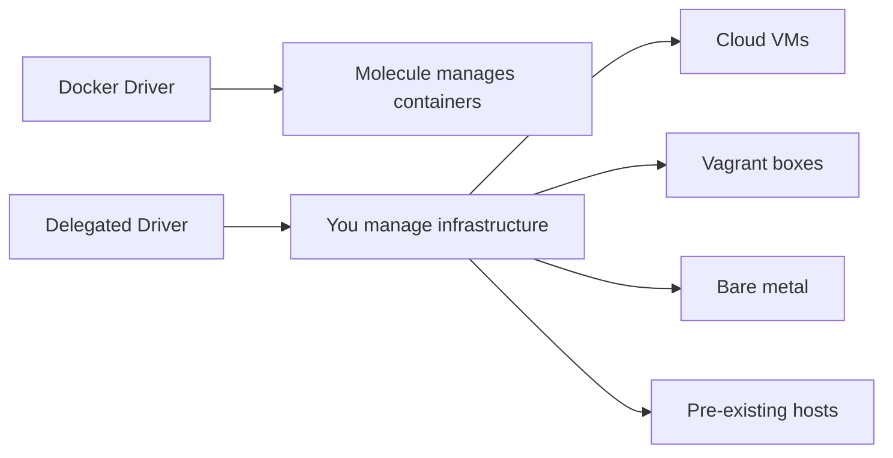

# How to Use Molecule with Delegated Driver

Author: [nawazdhandala](https://www.github.com/nawazdhandala)

Tags: Ansible, Molecule, Delegated Driver, Testing, Infrastructure

Description: Use Molecule's delegated driver to test Ansible roles against existing infrastructure, cloud instances, VMs, or bare metal servers.

---

Molecule's Docker driver is great for fast, local testing, but it has limitations. Docker containers are not real VMs. They share the host kernel, may not support all systemd features, and cannot test things like kernel modules, networking configuration, or hardware-specific roles. The delegated driver solves this by letting you bring your own infrastructure. You control how instances are created and destroyed, and Molecule handles everything else.

## What Is the Delegated Driver?

The delegated driver is Molecule's way of saying "you handle the infrastructure, I will handle the testing." Unlike the Docker driver which creates and destroys containers automatically, the delegated driver expects you to provide create and destroy playbooks (or skip them entirely if you are testing against pre-existing machines).



## Basic Delegated Configuration

The simplest delegated setup tests against localhost or an existing host.

```yaml
# molecule/delegated/molecule.yml
dependency:
  name: galaxy

driver:
  name: default  # 'default' is the new name for 'delegated' in newer Molecule versions

platforms:
  - name: instance
    managed: false  # Molecule will not try to create/destroy this

provisioner:
  name: ansible
  inventory:
    hosts:
      all:
        hosts:
          instance:
            ansible_host: 192.168.1.100
            ansible_user: ubuntu
            ansible_ssh_private_key_file: ~/.ssh/id_rsa

verifier:
  name: ansible
```

With `managed: false`, Molecule skips the create and destroy steps entirely. It assumes the host at `192.168.1.100` is already running and ready.

## Delegated with Create/Destroy Playbooks

For a more automated approach, write playbooks that provision and tear down infrastructure.

```yaml
# molecule/cloud/molecule.yml
dependency:
  name: galaxy

driver:
  name: default

platforms:
  - name: test-instance
    managed: true  # Molecule will use create.yml and destroy.yml

provisioner:
  name: ansible
  inventory:
    hosts:
      all:
        hosts:
          test-instance:
            ansible_host: "{{ lookup('file', molecule_ephemeral_directory + '/instance_ip') }}"
            ansible_user: ubuntu
            ansible_ssh_private_key_file: ~/.ssh/molecule_test

verifier:
  name: ansible

scenario:
  create_sequence:
    - create
  destroy_sequence:
    - destroy
```

### Create Playbook for AWS EC2

```yaml
# molecule/cloud/create.yml
---
- name: Create
  hosts: localhost
  connection: local
  gather_facts: false
  tasks:
    - name: Create EC2 instance
      amazon.aws.ec2_instance:
        name: "molecule-test-{{ lookup('env', 'USER') }}"
        image_id: ami-0c7217cdde317cfec  # Ubuntu 22.04
        instance_type: t3.micro
        key_name: molecule-test
        security_group: molecule-test-sg
        vpc_subnet_id: subnet-12345678
        wait: true
        state: running
        tags:
          Creator: molecule
          Purpose: testing
      register: ec2_result

    - name: Wait for SSH to become available
      ansible.builtin.wait_for:
        host: "{{ ec2_result.instances[0].public_ip_address }}"
        port: 22
        delay: 10
        timeout: 300

    - name: Save instance IP to ephemeral directory
      ansible.builtin.copy:
        content: "{{ ec2_result.instances[0].public_ip_address }}"
        dest: "{{ molecule_ephemeral_directory }}/instance_ip"
        mode: '0644'

    - name: Save instance ID for destroy step
      ansible.builtin.copy:
        content: "{{ ec2_result.instances[0].instance_id }}"
        dest: "{{ molecule_ephemeral_directory }}/instance_id"
        mode: '0644'

    - name: Wait a bit more for the instance to fully initialize
      ansible.builtin.pause:
        seconds: 15
```

### Destroy Playbook for AWS EC2

```yaml
# molecule/cloud/destroy.yml
---
- name: Destroy
  hosts: localhost
  connection: local
  gather_facts: false
  tasks:
    - name: Read instance ID
      ansible.builtin.slurp:
        src: "{{ molecule_ephemeral_directory }}/instance_id"
      register: instance_id_file
      ignore_errors: true

    - name: Terminate EC2 instance
      amazon.aws.ec2_instance:
        instance_ids:
          - "{{ instance_id_file.content | b64decode | trim }}"
        state: terminated
        wait: true
      when: instance_id_file is not failed
```

## Delegated with Vagrant

Vagrant is another popular backend for the delegated driver. It gives you full VMs with proper kernel support.

```yaml
# molecule/vagrant/molecule.yml
driver:
  name: default

platforms:
  - name: vagrant-instance
    managed: true

provisioner:
  name: ansible
  inventory:
    hosts:
      all:
        hosts:
          vagrant-instance:
            ansible_host: 127.0.0.1
            ansible_port: 2222
            ansible_user: vagrant
            ansible_ssh_private_key_file: .vagrant/machines/default/virtualbox/private_key
            ansible_ssh_common_args: '-o StrictHostKeyChecking=no'
```

```yaml
# molecule/vagrant/create.yml
---
- name: Create Vagrant VM
  hosts: localhost
  connection: local
  gather_facts: false
  tasks:
    - name: Create Vagrantfile
      ansible.builtin.copy:
        dest: "{{ molecule_ephemeral_directory }}/Vagrantfile"
        content: |
          Vagrant.configure("2") do |config|
            config.vm.box = "ubuntu/jammy64"
            config.vm.network "forwarded_port", guest: 22, host: 2222
            config.vm.provider "virtualbox" do |vb|
              vb.memory = "1024"
              vb.cpus = 2
            end
          end
        mode: '0644'

    - name: Start Vagrant VM
      ansible.builtin.command: vagrant up
      args:
        chdir: "{{ molecule_ephemeral_directory }}"

    - name: Wait for SSH
      ansible.builtin.wait_for:
        host: 127.0.0.1
        port: 2222
        delay: 5
        timeout: 120
```

```yaml
# molecule/vagrant/destroy.yml
---
- name: Destroy Vagrant VM
  hosts: localhost
  connection: local
  gather_facts: false
  tasks:
    - name: Destroy Vagrant VM
      ansible.builtin.command: vagrant destroy -f
      args:
        chdir: "{{ molecule_ephemeral_directory }}"
      ignore_errors: true
```

## Testing Against Pre-Existing Infrastructure

For roles that configure production-like environments, you might have a dedicated test environment. The delegated driver handles this cleanly.

```yaml
# molecule/staging/molecule.yml
driver:
  name: default

platforms:
  - name: staging-web
    managed: false
  - name: staging-db
    managed: false

provisioner:
  name: ansible
  inventory:
    hosts:
      all:
        children:
          webservers:
            hosts:
              staging-web:
                ansible_host: 10.0.1.10
                ansible_user: ansible
          databases:
            hosts:
              staging-db:
                ansible_host: 10.0.1.20
                ansible_user: ansible
        vars:
          ansible_ssh_private_key_file: ~/.ssh/staging_key
          ansible_become: true
```

This configuration tests against your staging servers without creating or destroying anything. Just make sure to have a cleanup step.

```yaml
# molecule/staging/cleanup.yml
---
- name: Cleanup staging after tests
  hosts: all
  become: true
  tasks:
    - name: Remove test artifacts
      ansible.builtin.file:
        path: "{{ item }}"
        state: absent
      loop:
        - /tmp/molecule-test-marker
        - /etc/myapp/test-config.yml

    - name: Restore original configuration
      ansible.builtin.copy:
        src: /etc/myapp/config.yml.backup
        dest: /etc/myapp/config.yml
        remote_src: true
      ignore_errors: true
```

## When to Use the Delegated Driver

Here is a decision matrix for choosing between Docker and delegated.

| Scenario | Docker | Delegated |
|---|---|---|
| Simple package installation | Yes | Overkill |
| Service configuration with systemd | Sometimes | Yes |
| Kernel module testing | No | Yes |
| Network configuration | No | Yes |
| Cloud-specific testing (AWS, Azure) | No | Yes |
| Fast local development | Yes | Slower |
| CI pipeline testing | Yes | Depends |
| Multi-OS testing | Yes | Yes |

## SSH Configuration Tips

The delegated driver relies on SSH connectivity. Common issues and solutions:

```yaml
# molecule.yml - SSH configuration
provisioner:
  name: ansible
  connection_options:
    ansible_ssh_common_args: >-
      -o StrictHostKeyChecking=no
      -o UserKnownHostsFile=/dev/null
      -o ConnectTimeout=30
    ansible_ssh_retries: 3
```

For instances that take a while to boot, add a wait in the create playbook.

```yaml
# In create.yml
- name: Wait for SSH availability
  ansible.builtin.wait_for:
    host: "{{ instance_ip }}"
    port: 22
    delay: 10
    timeout: 300
    state: started
```

## Cost Management for Cloud-Based Testing

If you are using the delegated driver with cloud instances, implement safeguards against forgotten instances.

```yaml
# destroy.yml - Safety check
- name: Find and terminate old Molecule instances
  amazon.aws.ec2_instance_info:
    filters:
      "tag:Creator": molecule
      instance-state-name: running
  register: running_instances

- name: Terminate instances older than 2 hours
  amazon.aws.ec2_instance:
    instance_ids: "{{ item.instance_id }}"
    state: terminated
  loop: "{{ running_instances.instances }}"
  when: >
    (ansible_date_time.epoch | int) -
    (item.launch_time | to_datetime('%Y-%m-%dT%H:%M:%S+00:00')).strftime('%s') | int
    > 7200
```

The delegated driver gives you the flexibility to test Ansible roles against any infrastructure. It takes more setup than the Docker driver, but for roles that need real VMs, kernel access, or cloud-specific features, it is the right choice. Start with pre-existing hosts if you have them, and move to automated create/destroy playbooks as your testing needs grow.
