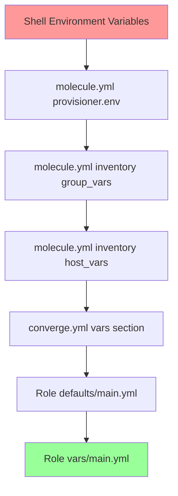

# How to Use Molecule with Environment Variables

Author: [nawazdhandala](https://www.github.com/nawazdhandala)

Tags: Ansible, Molecule, Environment Variables, Testing, Configuration

Description: Master environment variable configuration in Molecule for dynamic testing, CI integration, and secure secrets handling.

---

Environment variables are the glue between Molecule and the outside world. They let you configure test behavior without modifying molecule.yml, pass secrets from CI systems, switch between test configurations, and control Ansible behavior. This post covers every way you can use environment variables with Molecule, from basic configuration to advanced patterns.

## Molecule's Built-In Environment Variables

Molecule exposes several variables automatically that you can use in your molecule.yml and playbooks.

```yaml
# These are available in molecule.yml and all playbooks
# MOLECULE_PROJECT_DIRECTORY - Root of the role
# MOLECULE_SCENARIO_DIRECTORY - Current scenario directory
# MOLECULE_EPHEMERAL_DIRECTORY - Temp directory for this run
# MOLECULE_INSTANCE_CONFIG - Path to instance config
# MOLECULE_INVENTORY_FILE - Generated inventory file path
# MOLECULE_SCENARIO_NAME - Name of the current scenario
# MOLECULE_DISTRO - Distribution being tested (if set)
```

Use them in molecule.yml with `${}` syntax.

```yaml
# molecule/default/molecule.yml
provisioner:
  name: ansible
  config_options:
    defaults:
      vault_password_file: ${MOLECULE_PROJECT_DIRECTORY}/.vault-password
  inventory:
    group_vars:
      all:
        project_root: ${MOLECULE_PROJECT_DIRECTORY}
```

## Setting Environment Variables in molecule.yml

The provisioner's `env` section sets variables for all Ansible invocations (converge, verify, prepare, etc.).

```yaml
# molecule/default/molecule.yml
provisioner:
  name: ansible
  env:
    # Ansible configuration
    ANSIBLE_FORCE_COLOR: "true"
    ANSIBLE_VERBOSITY: "1"
    ANSIBLE_DEPRECATION_WARNINGS: "false"

    # Application-specific variables
    APP_ENV: "testing"
    APP_PORT: "8080"
    DATABASE_URL: "postgresql://localhost/testdb"

    # Reference other env vars (from the shell)
    HOME_DIR: "${HOME}"
    CI_BUILD_ID: "${CI_BUILD_ID:-local}"
```

The `${CI_BUILD_ID:-local}` syntax provides a default value of "local" when the variable is not set, which is useful for running tests both locally and in CI.

## Using Environment Variables in Playbooks

Access environment variables in your Ansible playbooks using the `lookup` plugin.

```yaml
# molecule/default/converge.yml
---
- name: Converge
  hosts: all
  become: true
  vars:
    app_env: "{{ lookup('env', 'APP_ENV') | default('development', true) }}"
    db_url: "{{ lookup('env', 'DATABASE_URL') | default('sqlite:///test.db', true) }}"
  roles:
    - role: my_app
      vars:
        myapp_environment: "{{ app_env }}"
        myapp_database_url: "{{ db_url }}"
```

You can also access them in templates.

```jinja2
{# templates/app-config.j2 #}
environment: {{ lookup('env', 'APP_ENV') | default('production') }}
database_url: {{ myapp_database_url }}
log_level: {{ lookup('env', 'LOG_LEVEL') | default('info') }}
```

## Dynamic Platform Selection with Environment Variables

Use environment variables to switch which platform Molecule tests against.

```yaml
# molecule/default/molecule.yml
platforms:
  - name: "instance-${MOLECULE_DISTRO:-ubuntu2204}"
    image: "geerlingguy/docker-${MOLECULE_DISTRO:-ubuntu2204}-ansible:latest"
    pre_build_image: true
    privileged: true
    cgroupns_mode: host
    volumes:
      - /sys/fs/cgroup:/sys/fs/cgroup:rw
```

Now you can test against different distros by setting a single variable.

```bash
# Test on Ubuntu 22.04 (default)
molecule test

# Test on CentOS Stream 9
MOLECULE_DISTRO=centos9 molecule test

# Test on Debian 12
MOLECULE_DISTRO=debian12 molecule test
```

This pattern is especially useful in CI where you want to run the same scenario against multiple distros.

```yaml
# .github/workflows/test.yml
jobs:
  molecule:
    strategy:
      matrix:
        distro:
          - ubuntu2204
          - centos9
          - debian12
    steps:
      - uses: actions/checkout@v4
      - name: Run Molecule
        env:
          MOLECULE_DISTRO: ${{ matrix.distro }}
        run: molecule test
```

## Passing Secrets Through Environment Variables

Never hardcode secrets in molecule.yml. Use environment variables instead.

```yaml
# molecule/default/molecule.yml
provisioner:
  name: ansible
  env:
    # Reference secrets from the environment
    ANSIBLE_VAULT_PASSWORD: "${VAULT_PASSWORD}"
  inventory:
    group_vars:
      all:
        # Use env var for test credentials
        test_api_key: "{{ lookup('env', 'TEST_API_KEY') }}"
        test_db_password: "{{ lookup('env', 'TEST_DB_PASSWORD') | default('localpass', true) }}"
```

```bash
# Set secrets before running tests
export VAULT_PASSWORD="my-vault-password"
export TEST_API_KEY="test-key-12345"
export TEST_DB_PASSWORD="test-password"
molecule test
```

## Environment Variables in the Create Step

When using the delegated driver, environment variables control how infrastructure gets provisioned.

```yaml
# molecule/cloud/create.yml
---
- name: Create cloud instances
  hosts: localhost
  connection: local
  gather_facts: false
  vars:
    aws_region: "{{ lookup('env', 'AWS_REGION') | default('us-east-1') }}"
    instance_type: "{{ lookup('env', 'MOLECULE_INSTANCE_TYPE') | default('t3.micro') }}"
    ssh_key_name: "{{ lookup('env', 'MOLECULE_SSH_KEY') | default('molecule-test') }}"
  tasks:
    - name: Create EC2 instance
      amazon.aws.ec2_instance:
        name: "molecule-{{ lookup('env', 'USER') }}-{{ ansible_date_time.epoch }}"
        image_id: "{{ lookup('env', 'MOLECULE_AMI') | default('ami-0c7217cdde317cfec') }}"
        instance_type: "{{ instance_type }}"
        key_name: "{{ ssh_key_name }}"
        region: "{{ aws_region }}"
        state: running
      register: ec2
```

## Variable Precedence

When the same variable is set in multiple places, the precedence order matters.



Variables set later (lower in the diagram) take higher precedence. So role vars override group_vars, which override environment variables. Keep this in mind when debugging why a variable has an unexpected value.

## .env Files for Local Development

Create a `.env` file for local development variables and source it before running Molecule.

```bash
# .env - Local development environment
export MOLECULE_DISTRO=ubuntu2204
export APP_ENV=testing
export TEST_DB_PASSWORD=localpass
export LOG_LEVEL=debug
export ANSIBLE_VERBOSITY=1
```

```bash
# Source the file and run
source .env && molecule test
```

Or use a wrapper script.

```bash
#!/bin/bash
# test.sh - Wrapper for running Molecule with environment
set -euo pipefail

# Load environment if .env exists
if [ -f .env ]; then
    source .env
fi

# Set defaults for missing variables
export MOLECULE_DISTRO="${MOLECULE_DISTRO:-ubuntu2204}"
export APP_ENV="${APP_ENV:-testing}"
export ANSIBLE_FORCE_COLOR="${ANSIBLE_FORCE_COLOR:-true}"

# Run Molecule with any passed arguments
molecule "${@:-test}"
```

```bash
# Run full test
./test.sh

# Run just converge
./test.sh converge

# Run specific scenario
./test.sh test --scenario-name multi-node
```

## Environment Variables for CI Systems

Each CI platform has its own way of setting environment variables. Here are the common ones.

### GitHub Actions

```yaml
# .github/workflows/molecule.yml
env:
  # Global variables for all jobs
  ANSIBLE_FORCE_COLOR: "true"

jobs:
  test:
    runs-on: ubuntu-latest
    env:
      # Job-level variables
      MOLECULE_DISTRO: ubuntu2204
    steps:
      - name: Run Molecule
        env:
          # Step-level variables
          VAULT_PASSWORD: ${{ secrets.VAULT_PASSWORD }}
          TEST_API_KEY: ${{ secrets.TEST_API_KEY }}
        run: molecule test
```

### GitLab CI

```yaml
# .gitlab-ci.yml
variables:
  ANSIBLE_FORCE_COLOR: "true"
  MOLECULE_DISTRO: ubuntu2204

molecule:
  script:
    - molecule test
  variables:
    VAULT_PASSWORD: $ANSIBLE_VAULT_PASSWORD  # From CI/CD settings
```

### Jenkins

```groovy
// Jenkinsfile
pipeline {
    environment {
        ANSIBLE_FORCE_COLOR = 'true'
        MOLECULE_DISTRO = 'ubuntu2204'
    }
    stages {
        stage('Test') {
            steps {
                withCredentials([string(credentialsId: 'vault-pass', variable: 'VAULT_PASSWORD')]) {
                    sh 'molecule test'
                }
            }
        }
    }
}
```

## Debugging Environment Variables

When things are not working, check which variables Molecule sees.

```bash
# Print all environment variables that Molecule uses
env | grep -E "^(MOLECULE_|ANSIBLE_|APP_)" | sort

# Run Molecule in debug mode to see variable resolution
molecule --debug converge 2>&1 | head -50
```

Add a debug task to your converge playbook to verify variables are being passed correctly.

```yaml
# Add temporarily to converge.yml
- name: Debug environment variables
  ansible.builtin.debug:
    msg: |
      APP_ENV: {{ lookup('env', 'APP_ENV') }}
      MOLECULE_DISTRO: {{ lookup('env', 'MOLECULE_DISTRO') }}
      MOLECULE_SCENARIO_NAME: {{ lookup('env', 'MOLECULE_SCENARIO_NAME') }}
      DB_URL: {{ lookup('env', 'DATABASE_URL') | default('NOT SET') }}
```

Environment variables are fundamental to making Molecule tests flexible and portable. Use them for anything that changes between environments (local vs CI, distro selection, secrets) and keep static configuration in molecule.yml. This separation makes your tests easy to run anywhere without modification.
