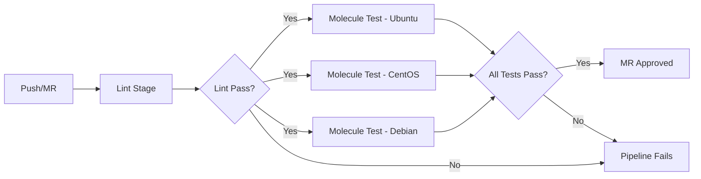

# How to Use Molecule with GitLab CI

Author: [nawazdhandala](https://www.github.com/nawazdhandala)

Tags: Ansible, Molecule, GitLab CI, Testing, CI/CD

Description: Learn how to integrate Ansible Molecule testing into your GitLab CI pipelines for automated role validation on every commit.

---

If you have been writing Ansible roles and testing them locally with Molecule, the next logical step is to plug those tests into your CI pipeline. GitLab CI is a natural fit because it uses Docker runners by default, and Molecule's Docker driver works perfectly inside those runners. In this post, I will walk through setting up a complete Molecule testing pipeline in GitLab CI, from basic configuration to advanced patterns like matrix testing and caching.

## Why Run Molecule in GitLab CI?

Running Molecule locally is fine during development, but it does not protect your main branch from broken roles. Someone can push a change that passes linting but fails the actual converge step. By running Molecule in GitLab CI, every merge request gets tested automatically. You catch failures before they hit production.

The key benefits are:

- Every commit triggers a full test cycle (create, converge, idempotence, verify, destroy)
- You get a clear pass/fail signal in your merge request
- Test results are visible to the whole team
- You can test against multiple platforms in parallel

## Basic GitLab CI Configuration

Start with a `.gitlab-ci.yml` in the root of your Ansible role repository. The simplest setup uses the official Molecule Docker image.

```yaml
# .gitlab-ci.yml - Basic Molecule testing pipeline
stages:
  - lint
  - test

variables:
  PIP_CACHE_DIR: "$CI_PROJECT_DIR/.cache/pip"

# Cache pip packages between pipeline runs
cache:
  paths:
    - .cache/pip

lint:
  stage: lint
  image: python:3.11-slim
  before_script:
    - pip install ansible-lint yamllint
  script:
    - yamllint .
    - ansible-lint

molecule-test:
  stage: test
  image: docker:24-dind
  services:
    - docker:24-dind
  variables:
    DOCKER_HOST: tcp://docker:2376
    DOCKER_TLS_CERTDIR: "/certs"
    DOCKER_TLS_VERIFY: 1
    DOCKER_CERT_PATH: "$DOCKER_TLS_CERTDIR/client"
  before_script:
    - apk add --no-cache python3 py3-pip gcc musl-dev python3-dev libffi-dev
    - pip3 install molecule molecule-plugins[docker] ansible-core --break-system-packages
  script:
    - molecule test
```

This configuration has two stages. The lint stage runs yamllint and ansible-lint to catch syntax issues. The test stage spins up Docker-in-Docker and runs the full Molecule test sequence.

## Using a Custom Docker Image for Faster Builds

Installing dependencies in every pipeline run wastes time. A better approach is to build a custom Docker image with everything pre-installed.

```dockerfile
# Dockerfile.ci - Pre-built image for Molecule testing
FROM python:3.11-slim

RUN apt-get update && \
    apt-get install -y --no-install-recommends \
    docker.io \
    gcc \
    libffi-dev \
    && rm -rf /var/lib/apt/lists/*

RUN pip install --no-cache-dir \
    molecule \
    molecule-plugins[docker] \
    ansible-core \
    ansible-lint \
    yamllint \
    pytest-testinfra

WORKDIR /role
```

Push this image to your GitLab Container Registry, then reference it in your pipeline.

```yaml
# .gitlab-ci.yml using custom image from GitLab registry
molecule-test:
  stage: test
  image: $CI_REGISTRY_IMAGE/molecule-runner:latest
  services:
    - docker:24-dind
  variables:
    DOCKER_HOST: tcp://docker:2376
    DOCKER_TLS_CERTDIR: "/certs"
  script:
    - molecule test
```

This cuts pipeline time significantly because you skip the dependency installation step.

## Testing Multiple Scenarios

If your role has multiple Molecule scenarios (for example, testing on different distros), you can run them in parallel using GitLab CI matrix builds.

```yaml
# .gitlab-ci.yml with matrix builds for multiple scenarios
molecule-test:
  stage: test
  image: $CI_REGISTRY_IMAGE/molecule-runner:latest
  services:
    - docker:24-dind
  variables:
    DOCKER_HOST: tcp://docker:2376
    DOCKER_TLS_CERTDIR: "/certs"
  script:
    - molecule test --scenario-name $SCENARIO
  parallel:
    matrix:
      - SCENARIO:
          - default
          - ubuntu
          - centos
          - multi-node
```

Each scenario runs as a separate job, so they execute in parallel across your GitLab runners. This is one of the biggest wins you get from CI integration: testing against five distros does not take five times as long.

## Handling Docker-in-Docker Permissions

One issue you will run into is Docker socket permissions. GitLab's Docker-in-Docker service needs specific configuration. If you are using a shared runner, you need to make sure the runner is configured with the right privileges.

```yaml
# .gitlab-ci.yml with explicit Docker configuration
molecule-test:
  stage: test
  image: $CI_REGISTRY_IMAGE/molecule-runner:latest
  services:
    - name: docker:24-dind
      alias: docker
      command: ["--tls=false"]
  variables:
    # Use non-TLS connection for simplicity in CI
    DOCKER_HOST: tcp://docker:2375
    DOCKER_TLS_CERTDIR: ""
  script:
    - docker info
    - molecule test
  tags:
    - docker-privileged
```

The `tags` directive ensures the job only runs on runners that support privileged mode. Without this, the Docker-in-Docker service will fail to start.

## Pipeline Flow

Here is what the complete pipeline looks like from a high level:



## Advanced: Molecule with Ansible Vault in CI

When your role uses encrypted variables, you need to pass the vault password into the CI environment. GitLab CI variables are perfect for this.

```yaml
# .gitlab-ci.yml with Vault support
molecule-test:
  stage: test
  image: $CI_REGISTRY_IMAGE/molecule-runner:latest
  services:
    - docker:24-dind
  variables:
    DOCKER_HOST: tcp://docker:2376
    DOCKER_TLS_CERTDIR: "/certs"
  before_script:
    # Write the vault password from CI variable to a file
    - echo "$ANSIBLE_VAULT_PASSWORD" > .vault-pass
    - export ANSIBLE_VAULT_PASSWORD_FILE=.vault-pass
  script:
    - molecule test
  after_script:
    # Clean up the vault password file
    - rm -f .vault-pass
```

Store `ANSIBLE_VAULT_PASSWORD` as a masked variable in your GitLab project settings under Settings > CI/CD > Variables. Mark it as protected and masked so it never appears in job logs.

## Collecting Test Reports

GitLab CI can display test reports directly in merge requests. Configure Molecule to output JUnit-style reports and tell GitLab where to find them.

```yaml
# .gitlab-ci.yml with JUnit report collection
molecule-test:
  stage: test
  image: $CI_REGISTRY_IMAGE/molecule-runner:latest
  services:
    - docker:24-dind
  variables:
    DOCKER_HOST: tcp://docker:2376
    DOCKER_TLS_CERTDIR: "/certs"
  script:
    - molecule test 2>&1 | tee molecule-output.log
  artifacts:
    when: always
    paths:
      - molecule-output.log
    reports:
      junit: molecule-report.xml
    expire_in: 30 days
```

If you are using Testinfra as your verifier, you can generate JUnit reports directly.

```yaml
# molecule.yml verifier configuration for JUnit output
verifier:
  name: testinfra
  options:
    junit-xml: molecule-report.xml
    v: true
```

## Caching Strategies

Molecule creates and destroys containers on every run, but you can still cache Python dependencies and Ansible collections to speed things up.

```yaml
# .gitlab-ci.yml with comprehensive caching
molecule-test:
  stage: test
  image: $CI_REGISTRY_IMAGE/molecule-runner:latest
  services:
    - docker:24-dind
  variables:
    DOCKER_HOST: tcp://docker:2376
    PIP_CACHE_DIR: "$CI_PROJECT_DIR/.cache/pip"
    ANSIBLE_COLLECTIONS_PATH: "$CI_PROJECT_DIR/.cache/collections"
  cache:
    key: molecule-$CI_COMMIT_REF_SLUG
    paths:
      - .cache/pip
      - .cache/collections
  before_script:
    - ansible-galaxy collection install -r requirements.yml -p $ANSIBLE_COLLECTIONS_PATH
  script:
    - molecule test
```

## Troubleshooting Common Issues

A few gotchas I have run into when setting up Molecule in GitLab CI:

1. **Docker socket not available**: Make sure you are using `docker:dind` as a service and the runner supports privileged mode.
2. **Timeouts**: Molecule's default timeout might not be enough for CI environments. Set `MOLECULE_DESTROY_TIMEOUT` and `MOLECULE_CONVERGE_TIMEOUT` environment variables.
3. **Image pull failures**: If your Molecule scenario uses images from private registries, configure Docker login in the `before_script`.
4. **Flaky tests**: Add retry logic at the job level with `retry: 1` to handle transient failures.

## Complete Working Example

Here is a full `.gitlab-ci.yml` that puts everything together.

```yaml
# Complete .gitlab-ci.yml for Molecule testing
stages:
  - lint
  - test

variables:
  PIP_CACHE_DIR: "$CI_PROJECT_DIR/.cache/pip"

cache:
  paths:
    - .cache/pip

lint:
  stage: lint
  image: python:3.11-slim
  before_script:
    - pip install ansible-lint yamllint
  script:
    - yamllint .
    - ansible-lint
  rules:
    - if: $CI_PIPELINE_SOURCE == "merge_request_event"
    - if: $CI_COMMIT_BRANCH == $CI_DEFAULT_BRANCH

molecule:
  stage: test
  image: $CI_REGISTRY_IMAGE/molecule-runner:latest
  services:
    - name: docker:24-dind
      alias: docker
  variables:
    DOCKER_HOST: tcp://docker:2375
    DOCKER_TLS_CERTDIR: ""
  script:
    - molecule test --scenario-name $SCENARIO
  parallel:
    matrix:
      - SCENARIO: [default, ubuntu, centos]
  retry: 1
  rules:
    - if: $CI_PIPELINE_SOURCE == "merge_request_event"
    - if: $CI_COMMIT_BRANCH == $CI_DEFAULT_BRANCH
  artifacts:
    when: always
    paths:
      - molecule-output.log
    expire_in: 7 days
```

With this setup, your Ansible roles get tested automatically on every merge request. The matrix build tests multiple scenarios in parallel, the retry handles flaky failures, and artifacts preserve logs for debugging. It is a solid foundation that scales well as your role collection grows.
