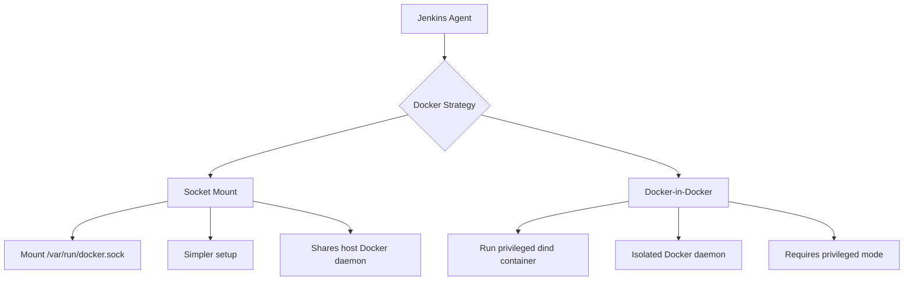

# How to Use Molecule with Jenkins

Author: [nawazdhandala](https://www.github.com/nawazdhandala)

Tags: Ansible, Molecule, Jenkins, CI/CD, Testing

Description: Set up Ansible Molecule testing in Jenkins pipelines using both declarative and scripted approaches with Docker agents.

---

Jenkins remains one of the most widely used CI/CD platforms, and if your organization runs Jenkins, you probably want to plug Molecule testing into it. The setup is a bit different from other CI systems because Jenkins has its own agent model and pipeline syntax. In this guide, I will cover how to run Molecule tests in Jenkins using both declarative pipelines and freestyle jobs, along with practical tips for handling Docker-in-Docker and parallel test execution.

## Prerequisites

Before you start, make sure your Jenkins setup meets these requirements:

- Jenkins 2.x with Pipeline plugin installed
- Docker plugin for Jenkins (if using Docker agents)
- A Jenkins agent with Docker installed
- Python 3.8+ available on the agent (or use a Docker agent)

## Declarative Pipeline Approach

The cleanest way to run Molecule in Jenkins is with a declarative pipeline using a Docker agent. This keeps dependencies isolated and reproducible.

```groovy
// Jenkinsfile - Declarative pipeline for Molecule testing
pipeline {
    agent {
        docker {
            image 'python:3.11-slim'
            args '-v /var/run/docker.sock:/var/run/docker.sock --group-add docker'
        }
    }

    environment {
        // Prevent Python from buffering output
        PYTHONUNBUFFERED = '1'
    }

    stages {
        stage('Install Dependencies') {
            steps {
                sh '''
                    pip install molecule molecule-plugins[docker] ansible-core ansible-lint
                '''
            }
        }

        stage('Lint') {
            steps {
                sh 'ansible-lint'
                sh 'yamllint .'
            }
        }

        stage('Molecule Test') {
            steps {
                sh 'molecule test'
            }
        }
    }

    post {
        always {
            // Clean up any leftover Molecule instances
            sh 'molecule destroy || true'
        }
        failure {
            echo 'Molecule tests failed. Check the console output for details.'
        }
    }
}
```

The critical piece here is the Docker socket mount: `-v /var/run/docker.sock:/var/run/docker.sock`. Molecule needs access to the Docker daemon to create test containers, and mounting the socket from the host is the simplest way to provide that access.

## Docker-in-Docker vs Socket Mounting

You have two options for giving Molecule access to Docker inside Jenkins:



Socket mounting is simpler and faster because containers are created on the host Docker daemon. Docker-in-Docker provides better isolation but requires privileged containers. For most Jenkins setups, socket mounting works fine.

## Using a Custom Jenkins Agent Image

Installing Molecule dependencies on every build is slow. Build a custom Docker image instead.

```dockerfile
# Dockerfile for Jenkins Molecule agent
FROM python:3.11-slim

# Install Docker CLI (not the daemon, just the client)
RUN apt-get update && \
    apt-get install -y --no-install-recommends \
    docker.io \
    git \
    openssh-client \
    && rm -rf /var/lib/apt/lists/*

# Install Python dependencies
RUN pip install --no-cache-dir \
    molecule \
    molecule-plugins[docker] \
    ansible-core \
    ansible-lint \
    yamllint \
    pytest-testinfra \
    jmespath

# Set up a non-root user that matches Jenkins UID
ARG JENKINS_UID=1000
RUN useradd -m -u ${JENKINS_UID} jenkins && \
    usermod -aG docker jenkins

USER jenkins
WORKDIR /home/jenkins
```

Build and push this image, then reference it in your Jenkinsfile.

```groovy
// Jenkinsfile using pre-built Molecule image
pipeline {
    agent {
        docker {
            image 'your-registry.com/molecule-jenkins:latest'
            args '-v /var/run/docker.sock:/var/run/docker.sock'
        }
    }

    stages {
        stage('Molecule Test') {
            steps {
                sh 'molecule test'
            }
        }
    }
}
```

## Parallel Scenario Testing

If your role has multiple Molecule scenarios, run them in parallel to cut down pipeline time.

```groovy
// Jenkinsfile with parallel Molecule scenarios
pipeline {
    agent none

    stages {
        stage('Lint') {
            agent {
                docker {
                    image 'your-registry.com/molecule-jenkins:latest'
                    args '-v /var/run/docker.sock:/var/run/docker.sock'
                }
            }
            steps {
                sh 'ansible-lint'
            }
        }

        stage('Molecule Tests') {
            parallel {
                stage('Default Scenario') {
                    agent {
                        docker {
                            image 'your-registry.com/molecule-jenkins:latest'
                            args '-v /var/run/docker.sock:/var/run/docker.sock'
                        }
                    }
                    steps {
                        sh 'molecule test --scenario-name default'
                    }
                }

                stage('CentOS Scenario') {
                    agent {
                        docker {
                            image 'your-registry.com/molecule-jenkins:latest'
                            args '-v /var/run/docker.sock:/var/run/docker.sock'
                        }
                    }
                    steps {
                        sh 'molecule test --scenario-name centos'
                    }
                }

                stage('Multi-Node Scenario') {
                    agent {
                        docker {
                            image 'your-registry.com/molecule-jenkins:latest'
                            args '-v /var/run/docker.sock:/var/run/docker.sock'
                        }
                    }
                    steps {
                        sh 'molecule test --scenario-name multi-node'
                    }
                }
            }
        }
    }
}
```

Each parallel stage gets its own Docker agent, so they run completely independently.

## Handling Ansible Vault in Jenkins

When your roles use encrypted variables, store the vault password as a Jenkins credential and inject it.

```groovy
// Jenkinsfile with Vault credential injection
pipeline {
    agent {
        docker {
            image 'your-registry.com/molecule-jenkins:latest'
            args '-v /var/run/docker.sock:/var/run/docker.sock'
        }
    }

    stages {
        stage('Molecule Test') {
            steps {
                withCredentials([string(credentialsId: 'ansible-vault-pass', variable: 'VAULT_PASS')]) {
                    sh '''
                        echo "$VAULT_PASS" > .vault-password
                        export ANSIBLE_VAULT_PASSWORD_FILE=.vault-password
                        molecule test
                        rm -f .vault-password
                    '''
                }
            }
        }
    }
}
```

## Scripted Pipeline for Complex Scenarios

When you need more control over the pipeline logic, a scripted pipeline works better. This example dynamically discovers Molecule scenarios and runs them.

```groovy
// Jenkinsfile - Scripted pipeline with dynamic scenario discovery
node {
    docker.image('your-registry.com/molecule-jenkins:latest').inside(
        '-v /var/run/docker.sock:/var/run/docker.sock'
    ) {
        stage('Checkout') {
            checkout scm
        }

        stage('Discover Scenarios') {
            // Find all molecule scenarios in the role
            scenarios = sh(
                script: "ls -d molecule/*/molecule.yml | xargs -I{} dirname {} | xargs -I{} basename {}",
                returnStdout: true
            ).trim().split('\n')
            echo "Found scenarios: ${scenarios}"
        }

        stage('Lint') {
            sh 'ansible-lint'
        }

        // Build parallel stages dynamically
        def parallelStages = [:]
        for (scenario in scenarios) {
            def s = scenario // capture for closure
            parallelStages["molecule-${s}"] = {
                stage("Test ${s}") {
                    sh "molecule test --scenario-name ${s}"
                }
            }
        }

        stage('Molecule Tests') {
            parallel parallelStages
        }
    }
}
```

This approach is useful when you frequently add new scenarios and do not want to update the Jenkinsfile every time.

## Publishing Test Results

If you use Testinfra as your Molecule verifier, you can publish JUnit test results in Jenkins.

```groovy
// Jenkinsfile with test result publishing
pipeline {
    agent {
        docker {
            image 'your-registry.com/molecule-jenkins:latest'
            args '-v /var/run/docker.sock:/var/run/docker.sock'
        }
    }

    stages {
        stage('Molecule Test') {
            steps {
                sh 'molecule test'
            }
        }
    }

    post {
        always {
            // Publish JUnit results if Testinfra generated them
            junit allowEmptyResults: true, testResults: '**/molecule-report.xml'

            // Archive Molecule logs
            archiveArtifacts artifacts: '**/*.log', allowEmptyArchive: true
        }
    }
}
```

Configure the Testinfra verifier in your `molecule.yml` to output JUnit format.

```yaml
# molecule/default/molecule.yml - verifier config for JUnit output
verifier:
  name: testinfra
  options:
    junit-xml: molecule-report.xml
    v: true
```

## Multibranch Pipeline Setup

For organizations with many Ansible roles, a multibranch pipeline is the way to go. Create a `Jenkinsfile` in each role repository, and Jenkins will automatically create pipelines for each branch.

In Jenkins, create a new Multibranch Pipeline job and point it at your Git repository. Jenkins will scan for branches containing a `Jenkinsfile` and set up pipelines automatically.

## Troubleshooting Jenkins-Specific Issues

A few problems that are specific to Jenkins:

1. **Permission denied on Docker socket**: The Jenkins user inside the container needs to be in the docker group. Either add it in your Dockerfile or use `args '--user root'` (less secure but works for testing).

2. **Workspace conflicts**: When running parallel Molecule stages on the same agent, each stage needs its own workspace. Use `ws()` blocks or separate Docker agents.

3. **Stale containers**: If a Jenkins build is aborted, Molecule might not clean up its containers. Add a periodic cleanup job that runs `docker container prune -f`.

4. **Slow builds**: Cache the Python virtual environment or use a pre-built Docker image. Installing Molecule from scratch on every build adds 2-3 minutes.

5. **Memory issues**: Molecule creates Docker containers which consume memory. Make sure your Jenkins agents have enough RAM, especially when running parallel scenarios.

Running Molecule in Jenkins takes a bit more setup than some newer CI platforms, but once configured, it provides reliable automated testing for your Ansible roles with the flexibility that Jenkins is known for.
