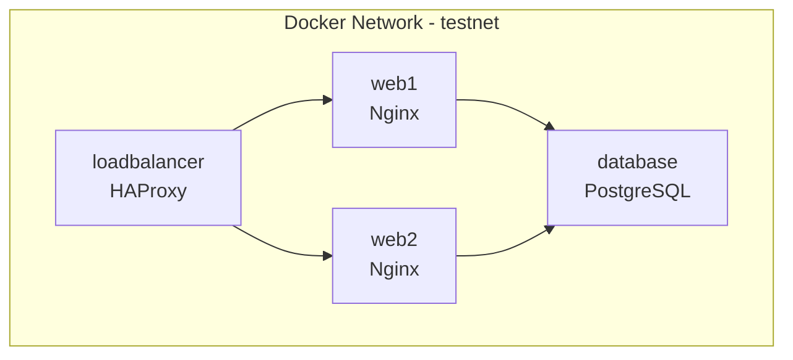

# How to Use Molecule to Test Multi-Host Scenarios

Author: [nawazdhandala](https://www.github.com/nawazdhandala)

Tags: Ansible, Molecule, Multi-Host, Testing, Infrastructure

Description: Test complex multi-host Ansible scenarios with Molecule including load balancers, database clusters, and application tiers.

---

Most Molecule tutorials test a single role on a single host, but real infrastructure is rarely that simple. Your web servers talk to database servers. Your load balancer needs backends to route to. Your monitoring agent needs a monitoring server to report to. Molecule fully supports multi-host scenarios, and this post shows you how to set them up.

## Defining Multiple Platforms

The platforms section in molecule.yml accepts a list. Each entry creates a separate test instance.

```yaml
# molecule/multi-host/molecule.yml
dependency:
  name: galaxy

driver:
  name: docker

platforms:
  - name: loadbalancer
    image: geerlingguy/docker-ubuntu2204-ansible:latest
    pre_build_image: true
    privileged: true
    cgroupns_mode: host
    volumes:
      - /sys/fs/cgroup:/sys/fs/cgroup:rw
    networks:
      - name: testnet
    groups:
      - lb

  - name: web1
    image: geerlingguy/docker-ubuntu2204-ansible:latest
    pre_build_image: true
    privileged: true
    cgroupns_mode: host
    volumes:
      - /sys/fs/cgroup:/sys/fs/cgroup:rw
    networks:
      - name: testnet
    groups:
      - webservers

  - name: web2
    image: geerlingguy/docker-ubuntu2204-ansible:latest
    pre_build_image: true
    privileged: true
    cgroupns_mode: host
    volumes:
      - /sys/fs/cgroup:/sys/fs/cgroup:rw
    networks:
      - name: testnet
    groups:
      - webservers

  - name: database
    image: geerlingguy/docker-ubuntu2204-ansible:latest
    pre_build_image: true
    privileged: true
    cgroupns_mode: host
    volumes:
      - /sys/fs/cgroup:/sys/fs/cgroup:rw
    networks:
      - name: testnet
    groups:
      - databases

provisioner:
  name: ansible

verifier:
  name: ansible
```

The key things to notice here:

- Each host has a unique name
- They share a Docker network (`testnet`) so they can communicate
- Each host is assigned to groups, which your playbooks can target

## Network Architecture

The Docker network lets instances communicate by hostname. Here is how the test topology looks.



Inside any container, you can reach the others by their Molecule instance name. For example, from `web1` you can ping `database` directly.

## Writing the Converge Playbook

With multiple hosts in different groups, your converge playbook applies different roles to different groups.

```yaml
# molecule/multi-host/converge.yml
---
- name: Configure database servers
  hosts: databases
  become: true
  tasks:
    - name: Install PostgreSQL
      ansible.builtin.apt:
        name:
          - postgresql
          - postgresql-client
          - python3-psycopg2
        state: present
        update_cache: true

    - name: Configure PostgreSQL to listen on all interfaces
      ansible.builtin.lineinfile:
        path: /etc/postgresql/14/main/postgresql.conf
        regexp: "^#?listen_addresses"
        line: "listen_addresses = '*'"
      notify: restart postgresql

    - name: Allow connections from the test network
      ansible.builtin.lineinfile:
        path: /etc/postgresql/14/main/pg_hba.conf
        line: "host all all 0.0.0.0/0 md5"
      notify: restart postgresql

    - name: Ensure PostgreSQL is running
      ansible.builtin.service:
        name: postgresql
        state: started
        enabled: true

    - name: Create application database
      become_user: postgres
      community.postgresql.postgresql_db:
        name: webapp
        state: present

    - name: Create application user
      become_user: postgres
      community.postgresql.postgresql_user:
        name: webapp_user
        password: "secretpass"
        db: webapp
        priv: ALL
        state: present

  handlers:
    - name: restart postgresql
      ansible.builtin.service:
        name: postgresql
        state: restarted

- name: Configure web servers
  hosts: webservers
  become: true
  tasks:
    - name: Install nginx and application dependencies
      ansible.builtin.apt:
        name:
          - nginx
          - python3
          - python3-pip
        state: present
        update_cache: true

    - name: Deploy nginx site configuration
      ansible.builtin.copy:
        dest: /etc/nginx/sites-available/webapp
        content: |
          server {
              listen 80;
              server_name _;
              location / {
                  proxy_pass http://127.0.0.1:8000;
                  proxy_set_header Host $host;
                  proxy_set_header X-Real-IP $remote_addr;
              }
              location /health {
                  return 200 'OK';
                  add_header Content-Type text/plain;
              }
          }
        mode: '0644'
      notify: reload nginx

    - name: Enable webapp site
      ansible.builtin.file:
        src: /etc/nginx/sites-available/webapp
        dest: /etc/nginx/sites-enabled/webapp
        state: link
      notify: reload nginx

    - name: Remove default site
      ansible.builtin.file:
        path: /etc/nginx/sites-enabled/default
        state: absent
      notify: reload nginx

    - name: Ensure nginx is running
      ansible.builtin.service:
        name: nginx
        state: started
        enabled: true

  handlers:
    - name: reload nginx
      ansible.builtin.service:
        name: nginx
        state: reloaded

- name: Configure load balancer
  hosts: lb
  become: true
  tasks:
    - name: Install HAProxy
      ansible.builtin.apt:
        name: haproxy
        state: present
        update_cache: true

    - name: Deploy HAProxy configuration
      ansible.builtin.copy:
        dest: /etc/haproxy/haproxy.cfg
        content: |
          global
              log /dev/log local0
              maxconn 4096

          defaults
              log global
              mode http
              option httplog
              timeout connect 5000ms
              timeout client 50000ms
              timeout server 50000ms

          frontend http_front
              bind *:80
              default_backend webservers

          backend webservers
              balance roundrobin
              option httpchk GET /health
              server web1 web1:80 check
              server web2 web2:80 check
        mode: '0644'
      notify: restart haproxy

    - name: Ensure HAProxy is running
      ansible.builtin.service:
        name: haproxy
        state: started
        enabled: true

  handlers:
    - name: restart haproxy
      ansible.builtin.service:
        name: haproxy
        state: restarted
```

## Verifying Cross-Host Communication

The verification step is where multi-host testing really shines. You can verify that the hosts communicate correctly.

```yaml
# molecule/multi-host/verify.yml
---
- name: Verify database connectivity from web servers
  hosts: webservers
  become: true
  tasks:
    - name: Install PostgreSQL client for testing
      ansible.builtin.apt:
        name: postgresql-client
        state: present

    - name: Test database connection from web server
      ansible.builtin.command: >
        pg_isready -h database -p 5432 -U webapp_user
      register: db_check
      changed_when: false

    - name: Assert database is reachable
      ansible.builtin.assert:
        that:
          - db_check.rc == 0
        fail_msg: "Cannot connect to database from {{ inventory_hostname }}"

- name: Verify web servers from load balancer
  hosts: lb
  become: true
  tasks:
    - name: Check web1 is reachable
      ansible.builtin.uri:
        url: http://web1:80/health
        return_content: true
      register: web1_health

    - name: Check web2 is reachable
      ansible.builtin.uri:
        url: http://web2:80/health
        return_content: true
      register: web2_health

    - name: Assert web servers are healthy
      ansible.builtin.assert:
        that:
          - web1_health.status == 200
          - web2_health.status == 200

    - name: Test load balancer distribution
      ansible.builtin.uri:
        url: http://localhost:80/health
        return_content: true
      register: lb_result
      loop: "{{ range(4) | list }}"

    - name: Assert load balancer responds
      ansible.builtin.assert:
        that:
          - item.status == 200
        fail_msg: "Load balancer request failed"
      loop: "{{ lb_result.results }}"

- name: Verify full stack connectivity
  hosts: lb
  tasks:
    - name: End-to-end request through load balancer to web to db
      ansible.builtin.uri:
        url: http://localhost:80/health
      register: e2e_result

    - name: Assert end-to-end works
      ansible.builtin.assert:
        that:
          - e2e_result.status == 200
```

## Using Inventory Variables

Molecule generates an inventory for your multi-host scenario. You can add variables to it through molecule.yml.

```yaml
# molecule/multi-host/molecule.yml (provisioner section)
provisioner:
  name: ansible
  inventory:
    group_vars:
      webservers:
        db_host: database
        db_port: 5432
        db_name: webapp
        db_user: webapp_user
        db_password: secretpass
      lb:
        backend_servers:
          - web1
          - web2
      databases:
        postgresql_listen_addresses: "*"
        postgresql_max_connections: 100
    host_vars:
      web1:
        server_id: 1
      web2:
        server_id: 2
```

## Ordering Host Configuration

In multi-host scenarios, order matters. The database needs to be ready before web servers try to connect. Use `serial` and `order` in your converge playbook to control this, or simply order your plays correctly (databases first, web servers second, load balancer last).

## Debugging Multi-Host Issues

When multi-host tests fail, you can log into any specific instance.

```bash
# Log into a specific host
molecule login --host web1
molecule login --host database
molecule login --host loadbalancer

# From inside web1, test connectivity to database
ping database
curl http://web2:80/health
```

You can also run ad-hoc commands against specific hosts.

```bash
# Run a command on all web servers
molecule converge -- --limit webservers -m ping
```

## Testing Cluster Scenarios

Multi-host scenarios are essential for testing clustered services. Here is a Redis cluster example.

```yaml
# molecule/redis-cluster/molecule.yml
platforms:
  - name: redis1
    image: geerlingguy/docker-ubuntu2204-ansible:latest
    pre_build_image: true
    privileged: true
    cgroupns_mode: host
    volumes:
      - /sys/fs/cgroup:/sys/fs/cgroup:rw
    networks:
      - name: redis-net
    groups:
      - redis_cluster

  - name: redis2
    image: geerlingguy/docker-ubuntu2204-ansible:latest
    pre_build_image: true
    privileged: true
    cgroupns_mode: host
    volumes:
      - /sys/fs/cgroup:/sys/fs/cgroup:rw
    networks:
      - name: redis-net
    groups:
      - redis_cluster

  - name: redis3
    image: geerlingguy/docker-ubuntu2204-ansible:latest
    pre_build_image: true
    privileged: true
    cgroupns_mode: host
    volumes:
      - /sys/fs/cgroup:/sys/fs/cgroup:rw
    networks:
      - name: redis-net
    groups:
      - redis_cluster
```

Multi-host Molecule testing adds significant confidence that your Ansible roles work correctly in realistic topologies. The setup is more involved than single-host testing, but the ability to verify cross-host communication, service discovery, and full-stack connectivity makes it well worth the effort.
