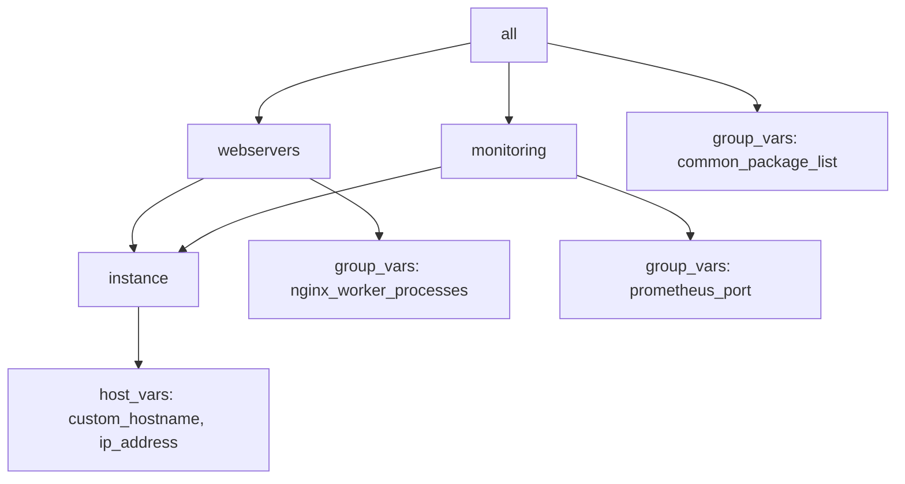

# How to Configure Molecule Provisioner Options

Author: [nawazdhandala](https://www.github.com/nawazdhandala)

Tags: Ansible, Molecule, Provisioner, Configuration, Testing

Description: Deep dive into Molecule provisioner configuration options including ansible.cfg overrides, environment variables, and inventory management.

---

The provisioner section in molecule.yml is where you configure how Molecule runs Ansible. Most people use the defaults and add a few variables, but the provisioner has a lot more to offer. You can override ansible.cfg settings, inject environment variables, customize the inventory, pass extra arguments, and control connection behavior. This post covers the full range of provisioner options with practical examples.

## Provisioner Basics

The provisioner section tells Molecule how to run Ansible. Here is the minimal configuration.

```yaml
# molecule/default/molecule.yml
provisioner:
  name: ansible
```

That is it. Molecule uses sensible defaults for everything else. But let us look at what you can customize.

## Overriding ansible.cfg Settings

The `config_options` key lets you override any ansible.cfg setting without creating an actual ansible.cfg file.

```yaml
# molecule/default/molecule.yml
provisioner:
  name: ansible
  config_options:
    defaults:
      # Increase timeout for slow operations
      timeout: 60
      # Use a faster gathering method
      gathering: smart
      # Cache facts between runs
      fact_caching: jsonfile
      fact_caching_connection: /tmp/molecule_facts
      fact_caching_timeout: 3600
      # Disable retry files
      retry_files_enabled: false
      # Set stdout callback
      stdout_callback: yaml
      # Enable profiling
      callbacks_enabled: timer, profile_tasks
      # Interpreter discovery
      interpreter_python: auto_silent
    ssh_connection:
      # SSH configuration
      pipelining: true
      ssh_args: -o ControlMaster=auto -o ControlPersist=60s
    privilege_escalation:
      become: true
      become_method: sudo
      become_user: root
      become_ask_pass: false
```

These settings override anything in your global or local ansible.cfg. This is useful because it keeps your test configuration isolated from your production Ansible settings.

## Environment Variables

Set environment variables that Ansible and its plugins can use.

```yaml
# molecule/default/molecule.yml
provisioner:
  name: ansible
  env:
    # Ansible environment
    ANSIBLE_FORCE_COLOR: "true"
    ANSIBLE_VERBOSITY: "1"
    ANSIBLE_ROLES_PATH: "${MOLECULE_PROJECT_DIRECTORY}/roles:~/.ansible/roles"

    # Vault
    ANSIBLE_VAULT_PASSWORD_FILE: "${MOLECULE_PROJECT_DIRECTORY}/.vault-password"

    # Python
    PYTHONUNBUFFERED: "1"

    # Custom variables for your role
    APP_ENVIRONMENT: "testing"
    DB_HOST: "localhost"
```

Molecule provides several built-in variables you can reference:

| Variable | Description |
|---|---|
| `MOLECULE_PROJECT_DIRECTORY` | Root of the role directory |
| `MOLECULE_SCENARIO_DIRECTORY` | Current scenario directory |
| `MOLECULE_EPHEMERAL_DIRECTORY` | Temporary directory for this scenario |
| `MOLECULE_INSTANCE_CONFIG` | Path to instance config file |
| `MOLECULE_INVENTORY_FILE` | Path to generated inventory |

## Inventory Configuration

The provisioner's inventory section is powerful. You can define hosts, groups, and variables that get merged with Molecule's auto-generated inventory.

```yaml
# molecule/default/molecule.yml
provisioner:
  name: ansible
  inventory:
    hosts:
      all:
        children:
          webservers:
            hosts:
              instance:
                http_port: 8080
          monitoring:
            hosts:
              instance:
                prometheus_port: 9090
    group_vars:
      all:
        common_package_list:
          - curl
          - vim
          - htop
        ntp_server: pool.ntp.org
      webservers:
        nginx_worker_processes: auto
        nginx_keepalive_timeout: 65
    host_vars:
      instance:
        custom_hostname: test-server
        ip_address: "{{ ansible_default_ipv4.address }}"
```

This generates an inventory where `instance` (your Molecule platform) belongs to both `webservers` and `monitoring` groups, each with their own variables.



## Custom Playbooks

Override the default playbook names for each test step.

```yaml
# molecule/default/molecule.yml
provisioner:
  name: ansible
  playbooks:
    create: create.yml
    prepare: prepare.yml
    converge: converge.yml
    side_effect: side_effect.yml
    verify: verify.yml
    cleanup: cleanup.yml
    destroy: destroy.yml
```

You can also point to playbooks outside the scenario directory.

```yaml
provisioner:
  name: ansible
  playbooks:
    converge: ${MOLECULE_PROJECT_DIRECTORY}/tests/converge.yml
    prepare: ${MOLECULE_PROJECT_DIRECTORY}/tests/shared_prepare.yml
```

This is useful when multiple scenarios share the same prepare or verify playbook.

## Ansible Arguments

Pass additional arguments to every Ansible invocation.

```yaml
# molecule/default/molecule.yml
provisioner:
  name: ansible
  ansible_args:
    - --diff
    - --check
    - --tags
    - install,configure
```

Be careful with `--check` as it will prevent tasks from actually executing. It is more useful for specific test scenarios than as a default.

For passing arguments to a single run, use the command line.

```bash
# Pass extra arguments to converge
molecule converge -- --diff -v --tags install

# Pass extra variables
molecule converge -- -e "nginx_version=1.24"
```

## Connection Options

Control how Ansible connects to test instances.

```yaml
# molecule/default/molecule.yml
provisioner:
  name: ansible
  connection_options:
    ansible_connection: docker  # or ssh, local, etc.
    ansible_docker_extra_args: ""
    ansible_python_interpreter: /usr/bin/python3
```

For the Docker driver, Molecule sets the connection to `docker` automatically. For the delegated driver, you typically use `ssh`.

```yaml
# For delegated driver with SSH
provisioner:
  name: ansible
  connection_options:
    ansible_connection: ssh
    ansible_ssh_common_args: "-o StrictHostKeyChecking=no -o UserKnownHostsFile=/dev/null"
    ansible_ssh_retries: 3
    ansible_ssh_timeout: 30
```

## Log Configuration

Control Ansible's log output.

```yaml
# molecule/default/molecule.yml
provisioner:
  name: ansible
  log: true  # Log Ansible output to a file
  config_options:
    defaults:
      # Use YAML callback for readable output
      stdout_callback: yaml
      # Show diffs when files change
      display_args_to_stdout: true
      # Set verbosity level
      verbosity: 1
```

The `log: true` option writes Ansible output to a log file in the ephemeral directory, which is helpful for debugging CI failures.

## Lint Configuration

Configure linting through the provisioner.

```yaml
# molecule/default/molecule.yml
provisioner:
  name: ansible
  lint:
    name: ansible-lint
    options:
      # Exclude specific rules
      x:
        - "no-changed-when"
        - "package-latest"
      # Skip specific paths
      exclude_paths:
        - molecule/
```

Note: In newer versions of Molecule, linting is configured differently. Check your Molecule version.

## Complete Provisioner Configuration Example

Here is a comprehensive molecule.yml that uses most provisioner features.

```yaml
# molecule/default/molecule.yml - Full provisioner configuration
dependency:
  name: galaxy
  options:
    requirements-file: requirements.yml
    force: false

driver:
  name: docker

platforms:
  - name: instance
    image: geerlingguy/docker-ubuntu2204-ansible:latest
    pre_build_image: true
    privileged: true
    cgroupns_mode: host
    volumes:
      - /sys/fs/cgroup:/sys/fs/cgroup:rw

provisioner:
  name: ansible

  # Log output to file
  log: true

  # Override ansible.cfg settings
  config_options:
    defaults:
      timeout: 60
      gathering: smart
      fact_caching: jsonfile
      fact_caching_connection: /tmp/molecule_facts
      fact_caching_timeout: 3600
      retry_files_enabled: false
      stdout_callback: yaml
      callbacks_enabled: timer, profile_tasks
      interpreter_python: auto_silent
      vault_password_file: ${MOLECULE_PROJECT_DIRECTORY}/.vault-password
    ssh_connection:
      pipelining: true
    privilege_escalation:
      become: true
      become_method: sudo

  # Environment variables
  env:
    ANSIBLE_FORCE_COLOR: "true"
    PYTHONUNBUFFERED: "1"
    APP_ENVIRONMENT: "testing"

  # Inventory configuration
  inventory:
    group_vars:
      all:
        app_port: 8080
        app_environment: testing
        db_host: localhost
        db_port: 5432
    host_vars:
      instance:
        custom_hostname: molecule-test

  # Custom playbook paths
  playbooks:
    prepare: prepare.yml
    converge: converge.yml
    verify: verify.yml

verifier:
  name: ansible

scenario:
  name: default
  test_sequence:
    - dependency
    - destroy
    - create
    - prepare
    - converge
    - idempotence
    - verify
    - destroy
```

## Provisioner Options for Specific Use Cases

### Testing with Ansible Collections

```yaml
provisioner:
  name: ansible
  env:
    ANSIBLE_COLLECTIONS_PATH: "${MOLECULE_PROJECT_DIRECTORY}/.collections"
  config_options:
    defaults:
      collections_path: ${MOLECULE_PROJECT_DIRECTORY}/.collections
```

### Testing with Custom Modules

```yaml
provisioner:
  name: ansible
  config_options:
    defaults:
      library: ${MOLECULE_PROJECT_DIRECTORY}/library
      module_utils: ${MOLECULE_PROJECT_DIRECTORY}/module_utils
      filter_plugins: ${MOLECULE_PROJECT_DIRECTORY}/plugins/filter
```

### Testing with Callback Plugins

```yaml
provisioner:
  name: ansible
  config_options:
    defaults:
      callback_plugins: ${MOLECULE_PROJECT_DIRECTORY}/plugins/callback
      callbacks_enabled: custom_callback, timer
```

The provisioner configuration is the heart of how Molecule runs your tests. Taking the time to configure it properly pays off in faster, more readable, and more reliable test runs. Start with the defaults and add configuration as you need it rather than copying a massive configuration block upfront.
