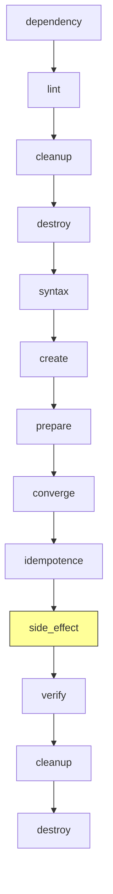

# How to Use Molecule Side Effect for Pre/Post Test Tasks

Author: [nawazdhandala](https://www.github.com/nawazdhandala)

Tags: Ansible, Molecule, Testing, Side Effect, Automation

Description: Use Molecule's side_effect step to run additional playbooks for simulating failures, testing recovery, and validating edge cases.

---

Molecule's test sequence has a step that most people overlook: side_effect. This step runs after the idempotence check and before verification. It is designed for situations where you need to simulate something happening to the system between your role's initial run and your verification. Think of things like simulating a service crash, rotating a certificate, or filling up a disk. The side_effect step gives you a hook to introduce these conditions.

## Where Side Effect Fits in the Test Sequence

The full Molecule test sequence runs in this order:



The highlighted step is side_effect. Notice it runs after idempotence (which confirms your role is stable) but before verify. This placement is intentional: you want to introduce some condition and then verify that the system handles it correctly.

## Basic Side Effect Configuration

To use side_effect, create a `side_effect.yml` playbook in your scenario directory.

```yaml
# molecule/default/side_effect.yml
---
- name: Side Effect - Simulate service failure
  hosts: all
  become: true
  tasks:
    - name: Stop the nginx service to simulate a crash
      ansible.builtin.service:
        name: nginx
        state: stopped

    - name: Remove the PID file to simulate unclean shutdown
      ansible.builtin.file:
        path: /run/nginx.pid
        state: absent
```

Your molecule.yml does not need any special configuration for this. Molecule automatically looks for `side_effect.yml` in the scenario directory. However, you can customize the path if needed.

```yaml
# molecule/default/molecule.yml
provisioner:
  name: ansible
  playbooks:
    side_effect: side_effect.yml
```

## Use Case 1: Testing Service Recovery

This is the most common use case. Your role sets up a service, and you want to verify it can handle a restart or crash.

```yaml
# molecule/default/converge.yml - The role installs and configures nginx
---
- name: Converge
  hosts: all
  become: true
  roles:
    - role: nginx
```

```yaml
# molecule/default/side_effect.yml - Simulate service crash
---
- name: Side Effect - Crash and Recovery
  hosts: all
  become: true
  tasks:
    - name: Kill nginx process abruptly
      ansible.builtin.command: pkill -9 nginx
      ignore_errors: true

    - name: Wait for process to fully terminate
      ansible.builtin.wait_for:
        path: /run/nginx.pid
        state: absent
        timeout: 10

    - name: Re-run the role to test recovery
      ansible.builtin.include_role:
        name: nginx
```

```yaml
# molecule/default/verify.yml - Verify service recovered
---
- name: Verify
  hosts: all
  become: true
  tasks:
    - name: Check nginx is running after recovery
      ansible.builtin.service_facts:

    - name: Assert nginx is active
      ansible.builtin.assert:
        that:
          - ansible_facts.services['nginx.service'].state == 'running'
        fail_msg: "nginx failed to recover after simulated crash"

    - name: Check nginx responds to requests
      ansible.builtin.uri:
        url: http://localhost:80
        return_content: false
      register: http_result

    - name: Assert HTTP response is OK
      ansible.builtin.assert:
        that:
          - http_result.status == 200
```

## Use Case 2: Testing Configuration Drift

You can use side_effect to simulate someone manually editing a configuration file, then verify that your role corrects the drift.

```yaml
# molecule/default/side_effect.yml - Simulate config drift
---
- name: Side Effect - Configuration Drift
  hosts: all
  become: true
  tasks:
    - name: Tamper with nginx configuration
      ansible.builtin.lineinfile:
        path: /etc/nginx/nginx.conf
        regexp: 'worker_processes'
        line: 'worker_processes 999;'

    - name: Add an unauthorized server block
      ansible.builtin.copy:
        dest: /etc/nginx/conf.d/rogue.conf
        content: |
          server {
              listen 9999;
              location / { return 200 'hacked'; }
          }
        mode: '0644'

    - name: Re-run the role to fix drift
      ansible.builtin.include_role:
        name: nginx
```

```yaml
# molecule/default/verify.yml - Verify drift was corrected
---
- name: Verify
  hosts: all
  become: true
  tasks:
    - name: Read nginx config
      ansible.builtin.slurp:
        src: /etc/nginx/nginx.conf
      register: nginx_conf

    - name: Assert worker_processes is correct
      ansible.builtin.assert:
        that:
          - "'worker_processes auto;' in nginx_conf.content | b64decode"
        fail_msg: "Configuration drift was not corrected"

    - name: Check rogue config was removed
      ansible.builtin.stat:
        path: /etc/nginx/conf.d/rogue.conf
      register: rogue_conf

    - name: Assert rogue config does not exist
      ansible.builtin.assert:
        that:
          - not rogue_conf.stat.exists
        fail_msg: "Unauthorized config file still present"
```

## Use Case 3: Testing Log Rotation

If your role sets up log rotation, use side_effect to create large log files and trigger rotation.

```yaml
# molecule/default/side_effect.yml - Test log rotation
---
- name: Side Effect - Generate Logs and Rotate
  hosts: all
  become: true
  tasks:
    - name: Generate a large log file
      ansible.builtin.shell: |
        for i in $(seq 1 100000); do
          echo "$(date) - Log entry $i - some application output" >> /var/log/myapp/application.log
        done
      args:
        creates: /var/log/myapp/application.log.bak

    - name: Run logrotate manually
      ansible.builtin.command: logrotate -f /etc/logrotate.d/myapp

    - name: Wait for rotation to complete
      ansible.builtin.pause:
        seconds: 2
```

## Use Case 4: Testing Certificate Renewal

For roles that manage TLS certificates, side_effect can simulate certificate expiry.

```yaml
# molecule/default/side_effect.yml - Simulate certificate renewal
---
- name: Side Effect - Certificate Renewal
  hosts: all
  become: true
  tasks:
    - name: Backup current certificate
      ansible.builtin.copy:
        src: /etc/ssl/myapp/server.crt
        dest: /etc/ssl/myapp/server.crt.backup
        remote_src: true

    - name: Generate a new self-signed certificate (simulating renewal)
      ansible.builtin.command: >
        openssl req -x509 -newkey rsa:2048
        -keyout /etc/ssl/myapp/server.key
        -out /etc/ssl/myapp/server.crt
        -days 365 -nodes
        -subj "/CN=renewed.example.com"

    - name: Reload the service to pick up new cert
      ansible.builtin.service:
        name: nginx
        state: reloaded
```

## Running Side Effect Independently

You can run the side_effect step on its own, which is helpful during development.

```bash
# Run just the side effect step
molecule side-effect

# Combine with converge and verify for iterative testing
molecule converge && molecule side-effect && molecule verify
```

## Multiple Side Effect Playbooks

If you need different side effect scenarios, create multiple Molecule scenarios rather than trying to cram everything into one side_effect.yml.

```
molecule/
  default/
    molecule.yml
    converge.yml
    verify.yml
  crash-recovery/
    molecule.yml
    converge.yml
    side_effect.yml    # Simulates crash
    verify.yml
  config-drift/
    molecule.yml
    converge.yml
    side_effect.yml    # Simulates drift
    verify.yml
```

Each scenario can have its own side_effect.yml tailored to what it is testing.

## Side Effect with Variables

Pass variables to your side_effect playbook through the provisioner configuration.

```yaml
# molecule/default/molecule.yml
provisioner:
  name: ansible
  inventory:
    group_vars:
      all:
        side_effect_action: crash
        side_effect_service: nginx
        recovery_timeout: 30
```

```yaml
# molecule/default/side_effect.yml - Parameterized side effect
---
- name: Side Effect - Parameterized
  hosts: all
  become: true
  tasks:
    - name: Perform side effect action
      when: side_effect_action == 'crash'
      block:
        - name: Kill the service
          ansible.builtin.command: "pkill -9 {{ side_effect_service }}"
          ignore_errors: true

        - name: Wait for recovery
          ansible.builtin.wait_for:
            port: 80
            timeout: "{{ recovery_timeout }}"
```

## Conditional Side Effects

You can make side effects conditional based on the platform or other factors.

```yaml
# molecule/default/side_effect.yml - Platform-specific side effects
---
- name: Side Effect
  hosts: all
  become: true
  tasks:
    - name: Simulate SELinux enforcement on RHEL
      when: ansible_os_family == 'RedHat'
      block:
        - name: Set SELinux to enforcing
          ansible.builtin.command: setenforce 1
          ignore_errors: true

        - name: Re-run role under enforcing SELinux
          ansible.builtin.include_role:
            name: my_role

    - name: Simulate AppArmor profile on Ubuntu
      when: ansible_os_family == 'Debian'
      block:
        - name: Install AppArmor utilities
          ansible.builtin.apt:
            name: apparmor-utils
            state: present

        - name: Re-run role with AppArmor active
          ansible.builtin.include_role:
            name: my_role
```

The side_effect step is one of Molecule's most powerful features for testing resilience and recovery. Instead of only verifying that your role installs things correctly on a clean system, you can verify it handles real-world conditions like crashes, configuration drift, and certificate rotation. If you are not using it yet, start with the service crash recovery pattern and expand from there.
