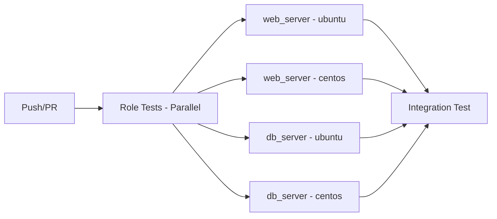

# How to Use Molecule with Collections

Author: [nawazdhandala](https://www.github.com/nawazdhandala)

Tags: Ansible, Molecule, Collections, Testing, Galaxy

Description: Configure Molecule to test Ansible collections including dependency management, namespace handling, and collection-level testing strategies.

---

Ansible collections changed how roles and modules are packaged and distributed. Testing collections with Molecule requires a slightly different approach than testing standalone roles. The namespace and collection structure add some complexity, but once you understand the setup, Molecule works just as well with collections as it does with individual roles. This post covers everything from basic collection testing to advanced patterns.

## Collection Structure Basics

An Ansible collection has a specific directory layout that Molecule needs to understand.

```
my_namespace/
  my_collection/
    galaxy.yml
    plugins/
      modules/
      filters/
    roles/
      web_server/
        tasks/
        defaults/
        molecule/
          default/
            molecule.yml
            converge.yml
      db_server/
        tasks/
        defaults/
        molecule/
          default/
            molecule.yml
            converge.yml
    playbooks/
    tests/
```

Each role inside the collection can have its own Molecule scenarios, just like standalone roles.

## Testing a Role Within a Collection

The main challenge is that Molecule needs to know the collection namespace and name so Ansible can find the role correctly. Configure this in molecule.yml.

```yaml
# roles/web_server/molecule/default/molecule.yml
dependency:
  name: galaxy

driver:
  name: docker

platforms:
  - name: instance
    image: geerlingguy/docker-ubuntu2204-ansible:latest
    pre_build_image: true
    privileged: true
    cgroupns_mode: host
    volumes:
      - /sys/fs/cgroup:/sys/fs/cgroup:rw

provisioner:
  name: ansible
  env:
    # Tell Ansible where to find the collection
    ANSIBLE_COLLECTIONS_PATH: "${MOLECULE_PROJECT_DIRECTORY}/../../../.."

verifier:
  name: ansible
```

The `ANSIBLE_COLLECTIONS_PATH` needs to point to the directory that contains the `my_namespace/my_collection/` structure. Since Molecule runs from the role directory, you need to go up several levels.

The converge playbook uses the fully qualified collection name (FQCN).

```yaml
# roles/web_server/molecule/default/converge.yml
---
- name: Converge
  hosts: all
  become: true
  collections:
    - my_namespace.my_collection
  roles:
    - role: my_namespace.my_collection.web_server
```

## Setting Up Collection Dependencies

If your collection depends on other collections, define them in a requirements file.

```yaml
# requirements.yml at the collection root
---
collections:
  - name: community.general
    version: ">=7.0.0"
  - name: community.crypto
    version: ">=2.0.0"
  - name: ansible.posix
    version: ">=1.5.0"
```

Configure Molecule to install these dependencies.

```yaml
# molecule/default/molecule.yml
dependency:
  name: galaxy
  options:
    requirements-file: ${MOLECULE_PROJECT_DIRECTORY}/../../requirements.yml
    force: false
```

## Testing Collection Plugins

Collections often include custom modules, filters, and plugins. To test these, you need the collection installed in a location Ansible can find.

```yaml
# molecule/default/molecule.yml
provisioner:
  name: ansible
  env:
    ANSIBLE_COLLECTIONS_PATH: "${MOLECULE_PROJECT_DIRECTORY}/../../../..:/tmp/collections"
  config_options:
    defaults:
      collections_path: "${MOLECULE_PROJECT_DIRECTORY}/../../../..:/tmp/collections"
```

Create a converge playbook that exercises the custom modules.

```yaml
# molecule/default/converge.yml
---
- name: Converge - Test Collection Plugins
  hosts: all
  become: true
  collections:
    - my_namespace.my_collection

  tasks:
    - name: Test custom module
      my_namespace.my_collection.my_custom_module:
        param1: value1
        param2: value2
      register: module_result

    - name: Verify module output
      ansible.builtin.assert:
        that:
          - module_result is success
          - module_result.my_output == "expected"

    - name: Test custom filter
      ansible.builtin.set_fact:
        filtered_value: "{{ 'input' | my_namespace.my_collection.my_filter }}"

    - name: Verify filter output
      ansible.builtin.assert:
        that:
          - filtered_value == "expected_output"
```

## Collection-Level Molecule Testing

Instead of testing roles individually, you can create Molecule scenarios at the collection level that test the entire collection as an integration test.

```
my_namespace/
  my_collection/
    molecule/
      integration/
        molecule.yml
        converge.yml
        verify.yml
    roles/
      web_server/
      db_server/
```

```yaml
# molecule/integration/molecule.yml
dependency:
  name: galaxy

driver:
  name: docker

platforms:
  - name: web
    image: geerlingguy/docker-ubuntu2204-ansible:latest
    pre_build_image: true
    privileged: true
    cgroupns_mode: host
    volumes:
      - /sys/fs/cgroup:/sys/fs/cgroup:rw
    networks:
      - name: testnet
    groups:
      - webservers

  - name: db
    image: geerlingguy/docker-ubuntu2204-ansible:latest
    pre_build_image: true
    privileged: true
    cgroupns_mode: host
    volumes:
      - /sys/fs/cgroup:/sys/fs/cgroup:rw
    networks:
      - name: testnet
    groups:
      - databases

provisioner:
  name: ansible
  env:
    ANSIBLE_COLLECTIONS_PATH: "${MOLECULE_PROJECT_DIRECTORY}/../.."

verifier:
  name: ansible
```

```yaml
# molecule/integration/converge.yml
---
- name: Deploy database
  hosts: databases
  become: true
  collections:
    - my_namespace.my_collection
  roles:
    - role: my_namespace.my_collection.db_server

- name: Deploy web server
  hosts: webservers
  become: true
  collections:
    - my_namespace.my_collection
  roles:
    - role: my_namespace.my_collection.web_server
      vars:
        web_db_host: db
```

## Handling the Collection Path Problem

The trickiest part of testing collections with Molecule is the path setup. Ansible expects collections in a specific directory structure: `<path>/ansible_collections/<namespace>/<collection>/`. Here is a helper script that sets this up correctly.

```bash
#!/bin/bash
# setup-collection-test.sh
# Run this before molecule test to set up the collection path

COLLECTION_ROOT="$(git rev-parse --show-toplevel)"
NAMESPACE=$(grep '^namespace:' galaxy.yml | awk '{print $2}')
COLLECTION=$(grep '^name:' galaxy.yml | awk '{print $2}')

# Create a symlink structure that Ansible expects
TEMP_COLLECTIONS="/tmp/molecule-collections/ansible_collections/${NAMESPACE}"
mkdir -p "${TEMP_COLLECTIONS}"
ln -sf "${COLLECTION_ROOT}" "${TEMP_COLLECTIONS}/${COLLECTION}"

export ANSIBLE_COLLECTIONS_PATH="/tmp/molecule-collections"
echo "Collection path set to: ${ANSIBLE_COLLECTIONS_PATH}"
echo "Collection available as: ${NAMESPACE}.${COLLECTION}"
```

Then reference this in your molecule.yml.

```yaml
# molecule/default/molecule.yml
provisioner:
  name: ansible
  env:
    ANSIBLE_COLLECTIONS_PATH: "/tmp/molecule-collections"
```

## Using galaxy.yml for Dependencies

Your collection's `galaxy.yml` defines dependencies on other collections. Molecule should install these.

```yaml
# galaxy.yml
namespace: my_namespace
name: my_collection
version: 1.0.0
dependencies:
  community.general: ">=7.0.0"
  community.crypto: ">=2.0.0"
```

Create a requirements file that Molecule can process.

```yaml
# molecule/requirements.yml
---
collections:
  - name: community.general
    version: ">=7.0.0"
  - name: community.crypto
    version: ">=2.0.0"
```

```yaml
# molecule/default/molecule.yml
dependency:
  name: galaxy
  options:
    requirements-file: ${MOLECULE_SCENARIO_DIRECTORY}/../requirements.yml
```

## CI Pipeline for Collection Testing

Here is a GitHub Actions workflow that tests a collection with Molecule.

```yaml
# .github/workflows/molecule.yml
name: Molecule Tests

on:
  push:
    branches: [main]
  pull_request:

jobs:
  molecule:
    runs-on: ubuntu-latest
    strategy:
      matrix:
        role:
          - web_server
          - db_server
        distro:
          - ubuntu2204
          - centos9
    steps:
      - name: Checkout collection
        uses: actions/checkout@v4
        with:
          path: ansible_collections/my_namespace/my_collection

      - name: Set up Python
        uses: actions/setup-python@v5
        with:
          python-version: "3.11"

      - name: Install dependencies
        run: |
          pip install molecule molecule-plugins[docker] ansible-core
          ansible-galaxy collection install -r ansible_collections/my_namespace/my_collection/requirements.yml

      - name: Run Molecule
        run: |
          cd ansible_collections/my_namespace/my_collection/roles/${{ matrix.role }}
          molecule test
        env:
          ANSIBLE_COLLECTIONS_PATH: ${{ github.workspace }}
          MOLECULE_DISTRO: ${{ matrix.distro }}

  integration:
    runs-on: ubuntu-latest
    needs: molecule
    steps:
      - name: Checkout collection
        uses: actions/checkout@v4
        with:
          path: ansible_collections/my_namespace/my_collection

      - name: Set up Python
        uses: actions/setup-python@v5
        with:
          python-version: "3.11"

      - name: Install dependencies
        run: |
          pip install molecule molecule-plugins[docker] ansible-core
          ansible-galaxy collection install -r ansible_collections/my_namespace/my_collection/requirements.yml

      - name: Run integration tests
        run: |
          cd ansible_collections/my_namespace/my_collection
          molecule test --scenario-name integration
        env:
          ANSIBLE_COLLECTIONS_PATH: ${{ github.workspace }}
```

The workflow structure runs individual role tests in parallel and then an integration test that exercises the whole collection.



Testing collections with Molecule requires more path configuration than standalone roles, but the core workflow is the same. The biggest hurdle is making sure Ansible can find your collection at the expected namespace path. Once you solve that with either symlinks or proper ANSIBLE_COLLECTIONS_PATH configuration, everything else follows naturally.
