# How to Set Default Ansible Forks for Parallel Execution

Author: [nawazdhandala](https://www.github.com/nawazdhandala)

Tags: Ansible, Performance, Parallel Execution, DevOps

Description: Learn how to configure Ansible forks to control parallel task execution across your managed hosts for optimal performance.

---

Ansible's `forks` setting controls how many hosts are managed simultaneously during a playbook run. The default is 5, which means Ansible processes 5 hosts at a time regardless of how many are in your inventory. If you have 100 hosts and forks is set to 5, Ansible works through them in batches of 5. Increasing forks can dramatically reduce your overall playbook execution time, but setting it too high can overwhelm your control node. This guide explains how to tune this setting correctly.

## Understanding Forks

When Ansible runs a task, it creates a separate process for each host it is managing in parallel. The `forks` value determines the maximum number of these processes. Here is how it works with 3 forks and 9 hosts:

```mermaid
gantt
    title Ansible Task Execution with forks=3
    dateFormat X
    axisFormat %s

    section Batch 1
    host1: 0, 10
    host2: 0, 10
    host3: 0, 10

    section Batch 2
    host4: 10, 20
    host5: 10, 20
    host6: 10, 20

    section Batch 3
    host7: 20, 30
    host8: 20, 30
    host9: 20, 30
```



With 3 forks, it takes 3 batches to process all 9 hosts. With 9 forks, all hosts would be processed in a single batch.

## Setting Forks in ansible.cfg

The most common way to set forks is in your ansible.cfg file:

```ini
# ansible.cfg
[defaults]
# Set the default number of parallel processes
forks = 20
```

This setting applies to all playbook runs from the directory containing this ansible.cfg.

## Setting Forks via Command Line

You can override the configured value for a specific run with the `-f` flag:

```bash
# Run with 50 forks for this specific execution
ansible-playbook -f 50 deploy.yml

# Use 1 fork for serial debugging
ansible-playbook -f 1 deploy.yml
```

## Setting Forks via Environment Variable

Set it through an environment variable for CI/CD pipelines:

```bash
# Set forks via environment variable
export ANSIBLE_FORKS=30
ansible-playbook deploy.yml
```

## How to Choose the Right Value

The optimal forks value depends on several factors:

### Control Node Resources

Each fork spawns a Python process on the control node. A rough guideline:

- 2-4 GB RAM control node: 10-15 forks
- 8 GB RAM control node: 20-30 forks
- 16+ GB RAM control node: 50-100 forks

Monitor your control node's resource usage during playbook runs to find the sweet spot:

```bash
# Monitor control node resources during a playbook run
# Run this in a separate terminal
watch -n 1 "free -h && echo '---' && uptime"
```

### Network Bandwidth

If your tasks involve transferring large files to remote hosts, high forks can saturate your network connection. For file-heavy playbooks, use lower forks. For command-based tasks with minimal data transfer, you can go higher.

### SSH Connection Limits

Some SSH servers limit the number of concurrent connections. The default for OpenSSH is 10 unauthenticated connections (`MaxStartups 10:30:60`). If your forks value exceeds this, some connections will be dropped.

Check the remote host's SSH config:

```bash
# Check MaxStartups on a remote host
ssh deploy@server01 "grep MaxStartups /etc/ssh/sshd_config"
```

If needed, increase it on the remote hosts:

```
# /etc/ssh/sshd_config on managed hosts
MaxStartups 50:30:100
```

## Benchmarking Different Fork Values

Here is a practical way to find the optimal forks value for your environment. Create a simple benchmark playbook:

```yaml
# benchmark-forks.yml
---
- name: Benchmark forks setting
  hosts: all
  gather_facts: false

  tasks:
    - name: Simple command to measure parallel execution
      ansible.builtin.command: sleep 1
      changed_when: false
```

Run it with different fork values and compare the total execution time:

```bash
# Benchmark with 5 forks
time ansible-playbook -f 5 benchmark-forks.yml

# Benchmark with 10 forks
time ansible-playbook -f 10 benchmark-forks.yml

# Benchmark with 25 forks
time ansible-playbook -f 25 benchmark-forks.yml

# Benchmark with 50 forks
time ansible-playbook -f 50 benchmark-forks.yml
```

With 100 hosts and a 1-second task, the total time should roughly be `(number of hosts / forks) * task_duration`. So with 100 hosts and 25 forks, expect about 4 seconds of task time plus SSH overhead.

## Forks vs Serial

The `forks` setting and the `serial` keyword in playbooks serve different purposes but interact with each other.

- `forks` controls the maximum parallel SSH connections
- `serial` controls how many hosts run through the entire play before moving to the next batch

```yaml
# This play processes 10 hosts at a time through ALL tasks
# Within each batch of 10, up to 'forks' hosts run each task in parallel
---
- name: Rolling update
  hosts: webservers
  serial: 10

  tasks:
    - name: Stop the service
      ansible.builtin.service:
        name: nginx
        state: stopped

    - name: Deploy new code
      ansible.builtin.copy:
        src: app/
        dest: /opt/app/

    - name: Start the service
      ansible.builtin.service:
        name: nginx
        state: started
```

If `serial` is 10 and `forks` is 20, Ansible will process all 10 hosts in the batch simultaneously (since 10 < 20). If `serial` is 50 and `forks` is 20, each batch of 50 hosts will be processed 20 at a time.

## Combining Forks with Other Performance Settings

Forks alone is not the only performance lever. Combine it with other settings for maximum speed:

```ini
# ansible.cfg - optimized for large fleet management
[defaults]
forks = 30

# Cache facts so they don't need to be re-gathered
gathering = smart
fact_caching = jsonfile
fact_caching_connection = /tmp/ansible_facts_cache
fact_caching_timeout = 3600

# Show task timing to identify bottlenecks
callback_whitelist = timer, profile_tasks

[ssh_connection]
# Pipelining reduces SSH round trips
pipelining = True

# SSH multiplexing reuses connections
ssh_args = -o ControlMaster=auto -o ControlPersist=600s
```

## Per-Play Fork Override

You cannot set forks directly in a playbook YAML (there is no `forks:` keyword at the play level). However, you can effectively limit parallelism for specific plays using `serial` or `throttle` at the task level:

```yaml
---
- name: Database migration (must be careful)
  hosts: databases
  serial: 1

  tasks:
    - name: Run migration
      ansible.builtin.command: /opt/app/migrate.sh

- name: Web server update (can be parallel)
  hosts: webservers
  # This play uses the default forks value

  tasks:
    - name: Deploy code
      ansible.builtin.copy:
        src: app/
        dest: /opt/app/

    - name: Restart with throttle to limit parallel restarts
      ansible.builtin.service:
        name: nginx
        state: restarted
      throttle: 5
```

The `throttle` keyword on a task limits how many hosts run that specific task in parallel, regardless of the forks setting. This is useful for tasks like service restarts where you want to limit the blast radius.

## Monitoring Fork Usage

To see how forks are being used during a playbook run, watch the process list on your control node:

```bash
# Count the number of Ansible worker processes
watch -n 0.5 "ps aux | grep '[a]nsible' | wc -l"
```

If the number consistently stays well below your forks setting, the bottleneck is elsewhere (probably SSH connection time or task execution time on remote hosts). If it frequently hits the forks limit, increasing the value might help.

## Summary

The default forks value of 5 is too conservative for anything beyond a handful of hosts. Increase it based on your control node's resources and your SSH server configuration. Start with 20 for medium-sized environments and scale up from there. Use the benchmark approach to find the optimal value for your specific setup, and combine higher forks with SSH pipelining and connection persistence for the best results.
