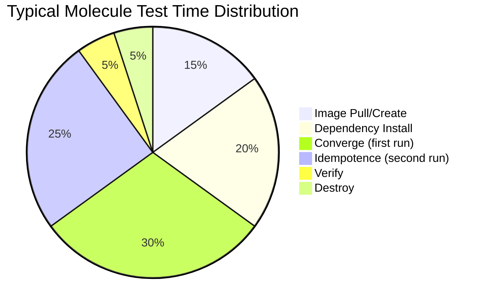

# How to Speed Up Molecule Test Runs

Author: [nawazdhandala](https://www.github.com/nawazdhandala)

Tags: Ansible, Molecule, Performance, Testing, Optimization

Description: Practical techniques to reduce Molecule test execution time from minutes to seconds using caching, parallelism, and smart configuration.

---

Molecule tests can be painfully slow. A full `molecule test` cycle on a moderately complex role might take 5-10 minutes, and if you are testing against multiple platforms, multiply that accordingly. Slow tests discourage developers from running them frequently, which defeats the purpose of having tests at all. In this post, I will cover concrete techniques that I have used to cut Molecule test times significantly.

## Where Time Goes

Before optimizing, understand where the time is actually spent.



The biggest time sinks are dependency installation and the two converge runs (one for converge, one for idempotence). Let us tackle each one.

## 1. Use Pre-Built Docker Images

This is the single biggest time saver. Instead of using bare OS images and installing prerequisites during the test, build images with everything pre-installed.

```dockerfile
# Dockerfile.molecule-ubuntu - Pre-built test image
FROM ubuntu:22.04

ENV DEBIAN_FRONTEND=noninteractive
ENV container=docker

# Install systemd and common dependencies upfront
RUN apt-get update && \
    apt-get install -y --no-install-recommends \
    systemd systemd-sysv \
    python3 python3-apt \
    sudo iproute2 curl ca-certificates \
    # Add packages your role commonly needs
    apt-transport-https gnupg2 \
    && rm -rf /var/lib/apt/lists/*

# Clean up systemd
RUN rm -f /lib/systemd/system/multi-user.target.wants/* \
    /etc/systemd/system/*.wants/* \
    /lib/systemd/system/local-fs.target.wants/* \
    /lib/systemd/system/sockets.target.wants/*udev* \
    /lib/systemd/system/sockets.target.wants/*initctl*

VOLUME ["/sys/fs/cgroup"]
CMD ["/lib/systemd/systemd"]
```

```yaml
# molecule/default/molecule.yml
platforms:
  - name: instance
    image: molecule-ubuntu:latest
    pre_build_image: true  # Skip building, use the image as-is
    privileged: true
    cgroupns_mode: host
    volumes:
      - /sys/fs/cgroup:/sys/fs/cgroup:rw
```

The `pre_build_image: true` flag tells Molecule not to build a Docker image from a Dockerfile, saving the build step entirely.

## 2. Cache Ansible Collections and Roles

If your role depends on Galaxy collections, downloading them on every run wastes time.

```yaml
# molecule/default/molecule.yml
dependency:
  name: galaxy
  options:
    role-file: requirements.yml
    requirements-file: requirements.yml
    force: false  # Do not re-download if already present
```

Set a persistent collections path.

```yaml
# molecule/default/molecule.yml
provisioner:
  name: ansible
  env:
    ANSIBLE_COLLECTIONS_PATH: ${MOLECULE_PROJECT_DIRECTORY}/.cache/collections
    ANSIBLE_ROLES_PATH: ${MOLECULE_PROJECT_DIRECTORY}/.cache/roles
```

Add `.cache/` to your `.gitignore` and the collections will persist between runs on your local machine.

## 3. Skip Unnecessary Test Steps

The full `molecule test` sequence includes steps you might not always need. Use `molecule converge` during development and only run the full test before committing.

```bash
# During development - fast iteration
molecule converge

# After making changes - check idempotence
molecule converge && molecule idempotence

# Before committing - full test
molecule test
```

You can also customize which steps the `test` command runs.

```yaml
# molecule/default/molecule.yml
scenario:
  name: default
  test_sequence:
    - dependency
    - destroy
    - create
    - prepare
    - converge
    - idempotence
    - verify
    - destroy
  # Removed: lint, syntax, side_effect, cleanup
```

Or skip specific steps at runtime.

```bash
# Skip the destroy step to keep instances running
molecule test --destroy=never

# Run only converge and verify
molecule converge && molecule verify
```

## 4. Parallel Scenario Execution

If you have multiple scenarios, run them in parallel rather than sequentially.

```bash
# Sequential (slow)
molecule test --scenario-name default
molecule test --scenario-name centos
molecule test --scenario-name multi-node

# Parallel (fast) - use GNU parallel or background processes
molecule test --scenario-name default &
molecule test --scenario-name centos &
molecule test --scenario-name multi-node &
wait
```

For a more robust approach, use a Makefile.

```makefile
# Makefile for parallel Molecule testing
SCENARIOS := default centos debian

.PHONY: test
test:
	@echo "Running all scenarios in parallel..."
	@$(MAKE) -j $(words $(SCENARIOS)) $(addprefix test-,$(SCENARIOS))

test-%:
	molecule test --scenario-name $*

.PHONY: converge
converge:
	molecule converge
```

```bash
# Run all scenarios in parallel
make test

# Just converge the default scenario
make converge
```

## 5. Reduce Ansible Gathering Facts Time

Fact gathering adds seconds to every play. If you do not need all facts, limit what gets gathered.

```yaml
# converge.yml - Only gather needed facts
---
- name: Converge
  hosts: all
  become: true
  gather_facts: true
  # Only gather specific fact subsets
  gather_subset:
    - min
    - network
  roles:
    - role: my_role
```

Or cache facts so they do not need to be gathered on the idempotence run.

```yaml
# molecule/default/molecule.yml
provisioner:
  name: ansible
  config_options:
    defaults:
      gathering: smart
      fact_caching: jsonfile
      fact_caching_connection: /tmp/ansible_fact_cache
      fact_caching_timeout: 3600
```

## 6. Use Tmpfs for Fast I/O

Docker volumes on macOS are notoriously slow. Use tmpfs mounts for directories that see heavy I/O.

```yaml
# molecule/default/molecule.yml
platforms:
  - name: instance
    image: molecule-ubuntu:latest
    pre_build_image: true
    privileged: true
    tmpfs:
      - /tmp
      - /run
      - /var/log
```

## 7. Optimize Package Installation

Package installation is often the slowest part of converge. There are a few tricks to speed it up.

```yaml
# Install all packages in a single task (one apt transaction)
# BAD - multiple apt transactions
- name: Install nginx
  ansible.builtin.apt:
    name: nginx
    state: present

- name: Install curl
  ansible.builtin.apt:
    name: curl
    state: present

# GOOD - single apt transaction
- name: Install all packages
  ansible.builtin.apt:
    name:
      - nginx
      - curl
      - python3
      - git
    state: present
    update_cache: true
    cache_valid_time: 3600
```

The `cache_valid_time` parameter prevents apt from updating the cache if it was updated recently, saving time on the idempotence run.

## 8. Use ansible.builtin.package_facts Wisely

If you are checking whether packages are installed before installing them, this adds overhead. The package modules already handle this internally.

## 9. Disable Retry Files

Ansible creates retry files on failure, which adds unnecessary I/O.

```yaml
# molecule/default/molecule.yml
provisioner:
  name: ansible
  config_options:
    defaults:
      retry_files_enabled: false
```

## 10. Profile Your Tasks

Use Ansible's callback plugins to identify slow tasks.

```yaml
# molecule/default/molecule.yml
provisioner:
  name: ansible
  config_options:
    defaults:
      callbacks_enabled: timer, profile_tasks
      # Show the 20 slowest tasks
      callback_whitelist: timer, profile_tasks
  env:
    PROFILE_TASKS_SORT_ORDER: descending
    PROFILE_TASKS_TASK_OUTPUT_LIMIT: 20
```

This outputs timing information for each task, making it obvious which tasks need optimization.

```
Wednesday 21 February 2026  10:30:00 +0000 (0:00:45.123)     0:02:30.456 *****
===============================================================================
Install packages -------------------------------------------- 45.12s
Deploy configuration ----------------------------------------- 8.34s
Start service ------------------------------------------------ 5.67s
Create directories ------------------------------------------- 1.23s
```

## 11. Use Mitogen for Ansible

Mitogen is an Ansible strategy plugin that dramatically speeds up task execution by eliminating SSH overhead and reducing Python interpreter startups.

```bash
pip install mitogen
```

```yaml
# molecule/default/molecule.yml
provisioner:
  name: ansible
  config_options:
    defaults:
      strategy_plugins: /path/to/mitogen/ansible_mitogen/plugins/strategy
      strategy: mitogen_linear
```

Mitogen can reduce execution time by 1.5x to 7x depending on the workload.

## 12. Reuse Test Instances

During development, do not destroy and recreate instances between test runs.

```bash
# First run - create and converge
molecule converge

# Make changes to your role, then re-converge
# This reuses the existing container
molecule converge

# Only destroy when you are done
molecule destroy
```

## Benchmarking Your Improvements

Track your test times to see what is working.

```bash
# Time the full test run
time molecule test

# Time individual steps
time molecule create
time molecule converge
time molecule idempotence
time molecule verify
time molecule destroy
```

A typical progression might look like:

| Optimization | Test Time |
|---|---|
| Baseline (bare OS image) | 8m 30s |
| Pre-built image | 5m 15s |
| Cached collections | 4m 45s |
| Reduced fact gathering | 4m 20s |
| Single package task | 3m 50s |
| Mitogen | 2m 10s |
| Combined | 2m 10s |

These numbers will vary based on your role complexity, but the relative improvements are consistent. Start with pre-built images and collection caching since those give the biggest wins with the least effort.
