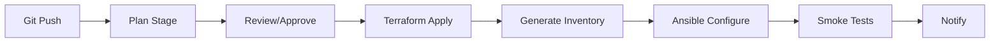

# How to Integrate Terraform and Ansible in CI/CD Pipelines

Author: [nawazdhandala](https://www.github.com/nawazdhandala)

Tags: Ansible, Terraform, CI/CD, GitOps, DevOps

Description: Build CI/CD pipelines that orchestrate Terraform provisioning and Ansible configuration for automated infrastructure deployment.

---

Running Terraform and Ansible manually works for small teams, but as your infrastructure grows, you need automated pipelines that handle the full provisioning and configuration workflow. CI/CD pipelines ensure that infrastructure changes go through code review, testing, and controlled deployment.

## Pipeline Architecture



## GitLab CI Pipeline

```yaml
# .gitlab-ci.yml - Terraform + Ansible pipeline
stages:
  - validate
  - plan
  - apply
  - configure
  - test

variables:
  TF_DIR: terraform
  ANSIBLE_DIR: ansible

validate:
  stage: validate
  script:
    - cd $TF_DIR && terraform init && terraform validate
    - cd ../$ANSIBLE_DIR && ansible-lint playbook.yml
    - cd ../$ANSIBLE_DIR && ansible-playbook --syntax-check playbook.yml

plan:
  stage: plan
  script:
    - cd $TF_DIR
    - terraform init
    - terraform plan -out=tfplan
  artifacts:
    paths:
      - $TF_DIR/tfplan

apply:
  stage: apply
  script:
    - cd $TF_DIR
    - terraform init
    - terraform apply -auto-approve tfplan
    - terraform output -json > tf_outputs.json
    - python3 ../scripts/generate_inventory.py tf_outputs.json > ../$ANSIBLE_DIR/inventory/hosts.ini
  artifacts:
    paths:
      - $ANSIBLE_DIR/inventory/hosts.ini
  when: manual  # Require manual approval
  only:
    - main

configure:
  stage: configure
  script:
    - cd $ANSIBLE_DIR
    - ansible-playbook -i inventory/hosts.ini playbook.yml
  dependencies:
    - apply

test:
  stage: test
  script:
    - cd tests
    - pytest test_infrastructure.py
  dependencies:
    - configure
```

## GitHub Actions Workflow

```yaml
# .github/workflows/deploy.yml
name: Infrastructure Deployment
on:
  push:
    branches: [main]
    paths:
      - 'terraform/**'
      - 'ansible/**'

jobs:
  terraform:
    runs-on: ubuntu-latest
    steps:
      - uses: actions/checkout@v4

      - name: Terraform Init
        working-directory: terraform
        run: terraform init

      - name: Terraform Plan
        working-directory: terraform
        run: terraform plan -out=tfplan

      - name: Terraform Apply
        working-directory: terraform
        run: |
          terraform apply -auto-approve tfplan
          terraform output -json > tf_outputs.json

      - name: Generate Ansible Inventory
        run: python3 scripts/generate_inventory.py terraform/tf_outputs.json > ansible/inventory/hosts.ini

      - name: Upload Inventory
        uses: actions/upload-artifact@v3
        with:
          name: inventory
          path: ansible/inventory/hosts.ini

  ansible:
    needs: terraform
    runs-on: ubuntu-latest
    steps:
      - uses: actions/checkout@v4

      - name: Download Inventory
        uses: actions/download-artifact@v3
        with:
          name: inventory
          path: ansible/inventory/

      - name: Run Ansible
        working-directory: ansible
        run: ansible-playbook -i inventory/hosts.ini playbook.yml
        env:
          ANSIBLE_HOST_KEY_CHECKING: "false"
```

## Summary

CI/CD pipelines for Terraform and Ansible follow a natural sequence: validate, plan, apply (Terraform), generate inventory, configure (Ansible), and test. The key design decisions are whether to require manual approval before apply, how to pass the inventory between stages, and how to handle secrets. Using pipeline artifacts to pass the generated inventory from the Terraform stage to the Ansible stage keeps the workflow clean and auditable.

## Common Use Cases

Here are several practical scenarios where this module proves essential in real-world playbooks.

### Infrastructure Provisioning Workflow

```yaml
# Complete workflow incorporating this module
- name: Infrastructure provisioning
  hosts: all
  become: true
  gather_facts: true
  tasks:
    - name: Gather system information
      ansible.builtin.setup:
        gather_subset:
          - hardware
          - network

    - name: Display system summary
      ansible.builtin.debug:
        msg: >-
          Host {{ inventory_hostname }} has
          {{ ansible_memtotal_mb }}MB RAM,
          {{ ansible_processor_vcpus }} vCPUs,
          running {{ ansible_distribution }} {{ ansible_distribution_version }}

    - name: Install required packages
      ansible.builtin.package:
        name:
          - curl
          - wget
          - git
          - vim
          - htop
          - jq
        state: present

    - name: Configure system timezone
      ansible.builtin.timezone:
        name: "{{ system_timezone | default('UTC') }}"

    - name: Configure hostname
      ansible.builtin.hostname:
        name: "{{ inventory_hostname }}"

    - name: Update /etc/hosts
      ansible.builtin.lineinfile:
        path: /etc/hosts
        regexp: '^127\.0\.1\.1'
        line: "127.0.1.1 {{ inventory_hostname }}"

    - name: Configure SSH hardening
      ansible.builtin.lineinfile:
        path: /etc/ssh/sshd_config
        regexp: "{{ item.regexp }}"
        line: "{{ item.line }}"
      loop:
        - { regexp: '^PermitRootLogin', line: 'PermitRootLogin no' }
        - { regexp: '^PasswordAuthentication', line: 'PasswordAuthentication no' }
      notify: restart sshd

    - name: Configure firewall rules
      community.general.ufw:
        rule: allow
        port: "{{ item }}"
        proto: tcp
      loop:
        - "22"
        - "80"
        - "443"

    - name: Enable firewall
      community.general.ufw:
        state: enabled
        policy: deny

  handlers:
    - name: restart sshd
      ansible.builtin.service:
        name: sshd
        state: restarted
```

### Integration with Monitoring

```yaml
# Using gathered facts to configure monitoring thresholds
- name: Configure monitoring based on system specs
  hosts: all
  become: true
  tasks:
    - name: Set monitoring thresholds based on hardware
      ansible.builtin.template:
        src: monitoring_config.yml.j2
        dest: /etc/monitoring/config.yml
      vars:
        memory_warning_threshold: "{{ (ansible_memtotal_mb * 0.8) | int }}"
        memory_critical_threshold: "{{ (ansible_memtotal_mb * 0.95) | int }}"
        cpu_warning_threshold: 80
        cpu_critical_threshold: 95

    - name: Register host with monitoring system
      ansible.builtin.uri:
        url: "https://monitoring.example.com/api/hosts"
        method: POST
        body_format: json
        body:
          hostname: "{{ inventory_hostname }}"
          ip_address: "{{ ansible_default_ipv4.address }}"
          os: "{{ ansible_distribution }}"
          memory_mb: "{{ ansible_memtotal_mb }}"
          cpus: "{{ ansible_processor_vcpus }}"
        headers:
          Authorization: "Bearer {{ monitoring_api_token }}"
        status_code: [200, 201, 409]
```

### Error Handling Patterns

```yaml
# Robust error handling with this module
- name: Robust task execution
  hosts: all
  tasks:
    - name: Attempt primary operation
      ansible.builtin.command: /opt/app/primary-task.sh
      register: primary_result
      failed_when: false

    - name: Handle primary failure with fallback
      ansible.builtin.command: /opt/app/fallback-task.sh
      when: primary_result.rc != 0
      register: fallback_result

    - name: Report final status
      ansible.builtin.debug:
        msg: >-
          Task completed via {{ 'primary' if primary_result.rc == 0 else 'fallback' }} path.
          Return code: {{ primary_result.rc if primary_result.rc == 0 else fallback_result.rc }}

    - name: Fail if both paths failed
      ansible.builtin.fail:
        msg: "Both primary and fallback operations failed"
      when:
        - primary_result.rc != 0
        - fallback_result is defined
        - fallback_result.rc != 0
```

### Scheduling and Automation

```yaml
# Set up scheduled compliance scans using cron
- name: Configure automated scans
  hosts: all
  become: true
  tasks:
    - name: Create scan script
      ansible.builtin.copy:
        dest: /opt/scripts/compliance_scan.sh
        mode: '0755'
        content: |
          #!/bin/bash
          cd /opt/ansible
          ansible-playbook playbooks/validate.yml -i inventory/ > /var/log/compliance_scan.log 2>&1
          EXIT_CODE=$?
          if [ $EXIT_CODE -ne 0 ]; then
            curl -X POST https://hooks.example.com/alert \
              -H "Content-Type: application/json" \
              -d "{\"text\":\"Compliance scan failed on $(hostname)\"}"
          fi
          exit $EXIT_CODE

    - name: Schedule weekly compliance scan
      ansible.builtin.cron:
        name: "Weekly compliance scan"
        minute: "0"
        hour: "3"
        weekday: "1"
        job: "/opt/scripts/compliance_scan.sh"
        user: ansible
```

