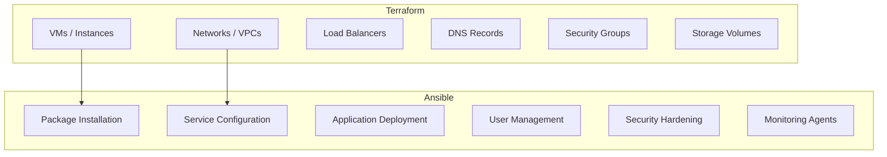

# How to Use Terraform for Infrastructure and Ansible for Configuration

Author: [nawazdhandala](https://www.github.com/nawazdhandala)

Tags: Ansible, Terraform, IaC, Best Practices, DevOps

Description: Establish clear boundaries between Terraform for resource provisioning and Ansible for configuration management in your IaC strategy.

---

The most effective way to use Terraform and Ansible together is to draw a clear line between their responsibilities. Terraform owns the infrastructure layer (what exists), and Ansible owns the configuration layer (how things are set up). Blurring this line leads to duplication, conflicts, and confusion about which tool is the source of truth for what.

## Responsibility Boundaries



## Terraform: Create the Resources

```hcl
# terraform/main.tf - Only provision infrastructure
resource "aws_instance" "app" {
  count         = var.app_server_count
  ami           = var.ami_id
  instance_type = var.instance_type
  subnet_id     = var.subnet_id
  key_name      = var.ssh_key_name

  vpc_security_group_ids = [aws_security_group.app.id]

  # DO NOT use user_data for complex configuration
  # Only use it for minimal bootstrapping (like installing Python for Ansible)
  user_data = <<-EOF
    #!/bin/bash
    apt-get update && apt-get install -y python3
  EOF

  tags = {
    Name        = "app-${count.index + 1}"
    Environment = var.environment
    ManagedBy   = "terraform"
  }
}
```

## Ansible: Configure the Servers

```yaml
# ansible/playbook.yml - All configuration goes here
---
- hosts: app_servers
  become: yes
  roles:
    - role: security_baseline
    - role: monitoring_agent
    - role: application
    - role: log_shipping
```

## Anti-Patterns to Avoid

### Do Not Use Terraform for Configuration

```hcl
# BAD: Installing packages via Terraform provisioners
resource "aws_instance" "web" {
  # ...
  provisioner "remote-exec" {
    inline = [
      "apt-get update",
      "apt-get install -y nginx",
      "systemctl enable nginx",
      # This is configuration management, use Ansible instead
    ]
  }
}
```

### Do Not Use Ansible for Provisioning

```yaml
# BAD: Creating cloud resources with Ansible
- name: Create EC2 instance
  amazon.aws.ec2_instance:
    name: web-server
    instance_type: t3.medium
    # Ansible can do this, but Terraform does it better
    # with state management, dependency graphing, and plan/apply workflow
```

## The Handoff Point

```bash
#!/bin/bash
# scripts/deploy.sh - Clean handoff between tools

echo "=== Phase 1: Terraform ==="
cd terraform
terraform plan -out=tfplan
terraform apply tfplan

echo "=== Phase 2: Generate Inventory ==="
terraform output -json > /tmp/tf_outputs.json
python3 scripts/generate_inventory.py /tmp/tf_outputs.json > ../ansible/inventory/hosts.ini

echo "=== Phase 3: Ansible ==="
cd ../ansible
ansible-playbook -i inventory/hosts.ini site.yml
```

## Summary

The key to using Terraform and Ansible together effectively is clear separation of concerns. Terraform provisions infrastructure, Ansible configures it. The handoff point is the inventory, generated from Terraform outputs. This separation makes each tool's state clean and predictable, and lets your team use the right tool for each job without overlap or conflict.

## Common Use Cases

Here are several practical scenarios where this module proves essential in real-world playbooks.

### Infrastructure Provisioning Workflow

```yaml
# Complete workflow incorporating this module
- name: Infrastructure provisioning
  hosts: all
  become: true
  gather_facts: true
  tasks:
    - name: Gather system information
      ansible.builtin.setup:
        gather_subset:
          - hardware
          - network

    - name: Display system summary
      ansible.builtin.debug:
        msg: >-
          Host {{ inventory_hostname }} has
          {{ ansible_memtotal_mb }}MB RAM,
          {{ ansible_processor_vcpus }} vCPUs,
          running {{ ansible_distribution }} {{ ansible_distribution_version }}

    - name: Install required packages
      ansible.builtin.package:
        name:
          - curl
          - wget
          - git
          - vim
          - htop
          - jq
        state: present

    - name: Configure system timezone
      ansible.builtin.timezone:
        name: "{{ system_timezone | default('UTC') }}"

    - name: Configure hostname
      ansible.builtin.hostname:
        name: "{{ inventory_hostname }}"

    - name: Update /etc/hosts
      ansible.builtin.lineinfile:
        path: /etc/hosts
        regexp: '^127\.0\.1\.1'
        line: "127.0.1.1 {{ inventory_hostname }}"

    - name: Configure SSH hardening
      ansible.builtin.lineinfile:
        path: /etc/ssh/sshd_config
        regexp: "{{ item.regexp }}"
        line: "{{ item.line }}"
      loop:
        - { regexp: '^PermitRootLogin', line: 'PermitRootLogin no' }
        - { regexp: '^PasswordAuthentication', line: 'PasswordAuthentication no' }
      notify: restart sshd

    - name: Configure firewall rules
      community.general.ufw:
        rule: allow
        port: "{{ item }}"
        proto: tcp
      loop:
        - "22"
        - "80"
        - "443"

    - name: Enable firewall
      community.general.ufw:
        state: enabled
        policy: deny

  handlers:
    - name: restart sshd
      ansible.builtin.service:
        name: sshd
        state: restarted
```

### Integration with Monitoring

```yaml
# Using gathered facts to configure monitoring thresholds
- name: Configure monitoring based on system specs
  hosts: all
  become: true
  tasks:
    - name: Set monitoring thresholds based on hardware
      ansible.builtin.template:
        src: monitoring_config.yml.j2
        dest: /etc/monitoring/config.yml
      vars:
        memory_warning_threshold: "{{ (ansible_memtotal_mb * 0.8) | int }}"
        memory_critical_threshold: "{{ (ansible_memtotal_mb * 0.95) | int }}"
        cpu_warning_threshold: 80
        cpu_critical_threshold: 95

    - name: Register host with monitoring system
      ansible.builtin.uri:
        url: "https://monitoring.example.com/api/hosts"
        method: POST
        body_format: json
        body:
          hostname: "{{ inventory_hostname }}"
          ip_address: "{{ ansible_default_ipv4.address }}"
          os: "{{ ansible_distribution }}"
          memory_mb: "{{ ansible_memtotal_mb }}"
          cpus: "{{ ansible_processor_vcpus }}"
        headers:
          Authorization: "Bearer {{ monitoring_api_token }}"
        status_code: [200, 201, 409]
```

### Error Handling Patterns

```yaml
# Robust error handling with this module
- name: Robust task execution
  hosts: all
  tasks:
    - name: Attempt primary operation
      ansible.builtin.command: /opt/app/primary-task.sh
      register: primary_result
      failed_when: false

    - name: Handle primary failure with fallback
      ansible.builtin.command: /opt/app/fallback-task.sh
      when: primary_result.rc != 0
      register: fallback_result

    - name: Report final status
      ansible.builtin.debug:
        msg: >-
          Task completed via {{ 'primary' if primary_result.rc == 0 else 'fallback' }} path.
          Return code: {{ primary_result.rc if primary_result.rc == 0 else fallback_result.rc }}

    - name: Fail if both paths failed
      ansible.builtin.fail:
        msg: "Both primary and fallback operations failed"
      when:
        - primary_result.rc != 0
        - fallback_result is defined
        - fallback_result.rc != 0
```

### Scheduling and Automation

```yaml
# Set up scheduled compliance scans using cron
- name: Configure automated scans
  hosts: all
  become: true
  tasks:
    - name: Create scan script
      ansible.builtin.copy:
        dest: /opt/scripts/compliance_scan.sh
        mode: '0755'
        content: |
          #!/bin/bash
          cd /opt/ansible
          ansible-playbook playbooks/validate.yml -i inventory/ > /var/log/compliance_scan.log 2>&1
          EXIT_CODE=$?
          if [ $EXIT_CODE -ne 0 ]; then
            curl -X POST https://hooks.example.com/alert \
              -H "Content-Type: application/json" \
              -d "{\"text\":\"Compliance scan failed on $(hostname)\"}"
          fi
          exit $EXIT_CODE

    - name: Schedule weekly compliance scan
      ansible.builtin.cron:
        name: "Weekly compliance scan"
        minute: "0"
        hour: "3"
        weekday: "1"
        job: "/opt/scripts/compliance_scan.sh"
        user: ansible
```

