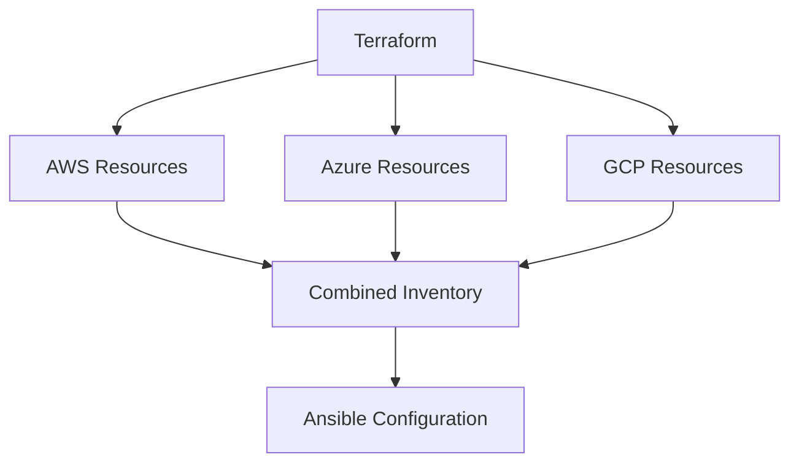

# How to Use Terraform for Multi-Cloud with Ansible Configuration

Author: [nawazdhandala](https://www.github.com/nawazdhandala)

Tags: Ansible, Terraform, Multi-Cloud, AWS, Azure

Description: Deploy infrastructure across multiple cloud providers with Terraform and use Ansible for consistent configuration management regardless of cloud.

---

Multi-cloud deployments use multiple cloud providers for redundancy, compliance, or best-of-breed service selection. Terraform handles the provider-specific resource creation, while Ansible provides consistent configuration across all clouds since it connects via SSH regardless of the underlying provider.

## Multi-Cloud Architecture



## Terraform Multi-Cloud Setup

```hcl
# terraform/aws/main.tf
provider "aws" {
  region = "us-east-1"
}

resource "aws_instance" "web" {
  count = 2
  ami   = var.aws_ami
  instance_type = "t3.medium"
  tags  = { Name = "web-aws-${count.index}", Cloud = "aws" }
}

# terraform/azure/main.tf
provider "azurerm" {
  features {}
}

resource "azurerm_linux_virtual_machine" "web" {
  count    = 2
  name     = "web-azure-${count.index}"
  size     = "Standard_B2s"
  tags     = { Cloud = "azure" }
}
```

## Combined Inventory Generation

```bash
#!/bin/bash
# Generate combined inventory from all cloud providers
echo "[webservers]" > inventory/multi-cloud.ini

# AWS hosts
cd terraform/aws
terraform output -json web_ips | jq -r '.[] | . + " cloud=aws"' >> ../../inventory/multi-cloud.ini

# Azure hosts
cd ../azure
terraform output -json web_ips | jq -r '.[] | . + " cloud=azure"' >> ../../inventory/multi-cloud.ini

echo "" >> ../../inventory/multi-cloud.ini
echo "[all:vars]" >> ../../inventory/multi-cloud.ini
echo "ansible_user=ubuntu" >> ../../inventory/multi-cloud.ini
```

## Cloud-Agnostic Ansible Configuration

```yaml
# playbook.yml - Same configuration regardless of cloud
---
- hosts: webservers
  become: yes
  tasks:
    - name: Install packages (works on any cloud)
      apt:
        name:
          - nginx
          - python3
          - monitoring-agent
        state: present

    - name: Deploy application
      include_role:
        name: app_deploy

    - name: Configure cloud-specific monitoring
      template:
        src: "monitoring-{{ cloud }}.conf.j2"
        dest: /etc/monitoring/config.conf
```

## Summary

Terraform handles the cloud-specific provisioning through its provider system, creating resources in AWS, Azure, GCP, or anywhere else. Ansible provides the consistency layer, applying the same configuration to servers regardless of which cloud they run on. The inventory is the integration point, combining hosts from all clouds into a single target for Ansible.

## Common Use Cases

Here are several practical scenarios where this module proves essential in real-world playbooks.

### Infrastructure Provisioning Workflow

```yaml
# Complete workflow incorporating this module
- name: Infrastructure provisioning
  hosts: all
  become: true
  gather_facts: true
  tasks:
    - name: Gather system information
      ansible.builtin.setup:
        gather_subset:
          - hardware
          - network

    - name: Display system summary
      ansible.builtin.debug:
        msg: >-
          Host {{ inventory_hostname }} has
          {{ ansible_memtotal_mb }}MB RAM,
          {{ ansible_processor_vcpus }} vCPUs,
          running {{ ansible_distribution }} {{ ansible_distribution_version }}

    - name: Install required packages
      ansible.builtin.package:
        name:
          - curl
          - wget
          - git
          - vim
          - htop
          - jq
        state: present

    - name: Configure system timezone
      ansible.builtin.timezone:
        name: "{{ system_timezone | default('UTC') }}"

    - name: Configure hostname
      ansible.builtin.hostname:
        name: "{{ inventory_hostname }}"

    - name: Update /etc/hosts
      ansible.builtin.lineinfile:
        path: /etc/hosts
        regexp: '^127\.0\.1\.1'
        line: "127.0.1.1 {{ inventory_hostname }}"

    - name: Configure SSH hardening
      ansible.builtin.lineinfile:
        path: /etc/ssh/sshd_config
        regexp: "{{ item.regexp }}"
        line: "{{ item.line }}"
      loop:
        - { regexp: '^PermitRootLogin', line: 'PermitRootLogin no' }
        - { regexp: '^PasswordAuthentication', line: 'PasswordAuthentication no' }
      notify: restart sshd

    - name: Configure firewall rules
      community.general.ufw:
        rule: allow
        port: "{{ item }}"
        proto: tcp
      loop:
        - "22"
        - "80"
        - "443"

    - name: Enable firewall
      community.general.ufw:
        state: enabled
        policy: deny

  handlers:
    - name: restart sshd
      ansible.builtin.service:
        name: sshd
        state: restarted
```

### Integration with Monitoring

```yaml
# Using gathered facts to configure monitoring thresholds
- name: Configure monitoring based on system specs
  hosts: all
  become: true
  tasks:
    - name: Set monitoring thresholds based on hardware
      ansible.builtin.template:
        src: monitoring_config.yml.j2
        dest: /etc/monitoring/config.yml
      vars:
        memory_warning_threshold: "{{ (ansible_memtotal_mb * 0.8) | int }}"
        memory_critical_threshold: "{{ (ansible_memtotal_mb * 0.95) | int }}"
        cpu_warning_threshold: 80
        cpu_critical_threshold: 95

    - name: Register host with monitoring system
      ansible.builtin.uri:
        url: "https://monitoring.example.com/api/hosts"
        method: POST
        body_format: json
        body:
          hostname: "{{ inventory_hostname }}"
          ip_address: "{{ ansible_default_ipv4.address }}"
          os: "{{ ansible_distribution }}"
          memory_mb: "{{ ansible_memtotal_mb }}"
          cpus: "{{ ansible_processor_vcpus }}"
        headers:
          Authorization: "Bearer {{ monitoring_api_token }}"
        status_code: [200, 201, 409]
```

### Error Handling Patterns

```yaml
# Robust error handling with this module
- name: Robust task execution
  hosts: all
  tasks:
    - name: Attempt primary operation
      ansible.builtin.command: /opt/app/primary-task.sh
      register: primary_result
      failed_when: false

    - name: Handle primary failure with fallback
      ansible.builtin.command: /opt/app/fallback-task.sh
      when: primary_result.rc != 0
      register: fallback_result

    - name: Report final status
      ansible.builtin.debug:
        msg: >-
          Task completed via {{ 'primary' if primary_result.rc == 0 else 'fallback' }} path.
          Return code: {{ primary_result.rc if primary_result.rc == 0 else fallback_result.rc }}

    - name: Fail if both paths failed
      ansible.builtin.fail:
        msg: "Both primary and fallback operations failed"
      when:
        - primary_result.rc != 0
        - fallback_result is defined
        - fallback_result.rc != 0
```

### Scheduling and Automation

```yaml
# Set up scheduled compliance scans using cron
- name: Configure automated scans
  hosts: all
  become: true
  tasks:
    - name: Create scan script
      ansible.builtin.copy:
        dest: /opt/scripts/compliance_scan.sh
        mode: '0755'
        content: |
          #!/bin/bash
          cd /opt/ansible
          ansible-playbook playbooks/validate.yml -i inventory/ > /var/log/compliance_scan.log 2>&1
          EXIT_CODE=$?
          if [ $EXIT_CODE -ne 0 ]; then
            curl -X POST https://hooks.example.com/alert \
              -H "Content-Type: application/json" \
              -d "{\"text\":\"Compliance scan failed on $(hostname)\"}"
          fi
          exit $EXIT_CODE

    - name: Schedule weekly compliance scan
      ansible.builtin.cron:
        name: "Weekly compliance scan"
        minute: "0"
        hour: "3"
        weekday: "1"
        job: "/opt/scripts/compliance_scan.sh"
        user: ansible
```

