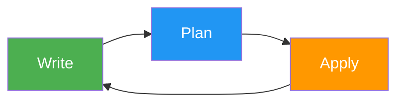
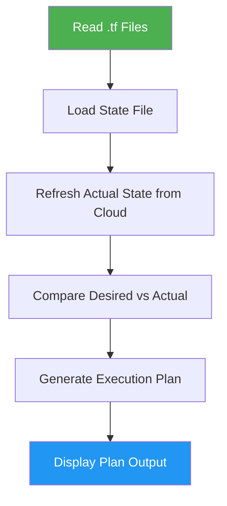
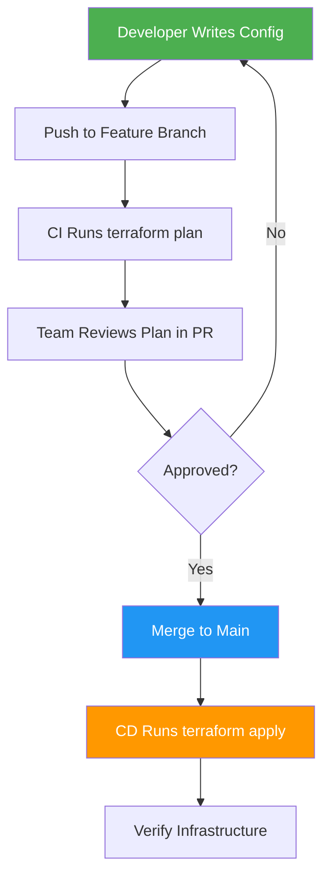

# How to Understand the Terraform Core Workflow (Write Plan Apply)

Author: [nawazdhandala](https://github.com/nawazdhandala)

Tags: Terraform, Workflow, Best Practices, DevOps, Infrastructure as Code

Description: Understand the Terraform core workflow of Write, Plan, and Apply including how each phase works, what happens behind the scenes, and best practices for each step.

---

Every Terraform project follows the same fundamental workflow: Write, Plan, Apply. This three-step cycle is the backbone of how Terraform manages infrastructure. Understanding each step - not just what commands to type, but what is actually happening under the hood - makes you a more effective Terraform user and helps you avoid common mistakes.

## The Three Phases



1. **Write** - Define infrastructure in `.tf` files
2. **Plan** - Preview what Terraform will change
3. **Apply** - Execute the changes

This cycle repeats every time you modify your infrastructure. You write configuration changes, plan them to see the impact, and apply them to make the changes real.

## Phase 1: Write

The Write phase is where you define your desired infrastructure state in HCL (HashiCorp Configuration Language) files. This includes:

- Provider configurations (which cloud to talk to)
- Resources (what infrastructure to create)
- Data sources (what existing infrastructure to look up)
- Variables (parameterized inputs)
- Outputs (exported values)
- Modules (reusable groups of resources)

```hcl
# Example: defining a simple web server setup
provider "aws" {
  region = "us-east-1"
}

resource "aws_instance" "web" {
  ami           = "ami-0c55b159cbfafe1f0"
  instance_type = "t3.micro"

  tags = {
    Name = "web-server"
  }
}

resource "aws_security_group" "web_sg" {
  name = "web-security-group"

  ingress {
    from_port   = 80
    to_port     = 80
    protocol    = "tcp"
    cidr_blocks = ["0.0.0.0/0"]
  }

  egress {
    from_port   = 0
    to_port     = 0
    protocol    = "-1"
    cidr_blocks = ["0.0.0.0/0"]
  }
}
```

### What Happens During Write

During the Write phase, you are working with files. Terraform is not involved yet. You are editing `.tf` files in your editor, thinking about what infrastructure you need, and expressing it in code.

Key considerations during Write:

- **Use version control.** Every change to your `.tf` files should be tracked in Git.
- **Follow naming conventions.** Consistent resource names make configurations easier to maintain.
- **Use variables for anything that might change.** Hardcoded values become technical debt.
- **Keep files organized.** Separate concerns into different files (variables.tf, outputs.tf, etc.).

## Phase 2: Plan

The Plan phase is where Terraform compares your configuration (desired state) with the current infrastructure (actual state) and produces an execution plan showing exactly what it will do.

```bash
# Generate and review the execution plan
terraform plan
```

### What Happens During Plan

When you run `terraform plan`, Terraform performs several operations:

1. **Reads the configuration** - Parses all `.tf` files in the current directory
2. **Reads the state** - Loads the state file to know what already exists
3. **Refreshes state** - Queries the actual cloud provider to check current resource status
4. **Computes the diff** - Compares desired state (config) with actual state (refreshed state)
5. **Generates the plan** - Produces a list of actions (create, update, destroy, no-op)



### Reading the Plan Output

The plan output uses symbols to indicate what will happen:

```text
# + means create
  + resource "aws_instance" "web" {
      + ami           = "ami-0c55b159cbfafe1f0"
      + instance_type = "t3.micro"
    }

# ~ means update in place
  ~ resource "aws_instance" "web" {
      ~ tags = {
          ~ Name = "old-name" -> "new-name"
        }
    }

# - means destroy
  - resource "aws_instance" "old_server" {
    }

# -/+ means destroy and recreate (replace)
  -/+ resource "aws_instance" "web" {
      ~ ami = "ami-old" -> "ami-new" # forces replacement
    }
```

The summary at the bottom tells you the total count:

```text
Plan: 2 to add, 1 to change, 1 to destroy.
```

### Saving a Plan

You can save the plan to a file and apply it later. This ensures exactly what you reviewed is what gets applied:

```bash
# Save the plan to a file
terraform plan -out=tfplan

# Later, apply the saved plan (no confirmation prompt needed)
terraform apply tfplan
```

This is especially important in CI/CD pipelines where you want to separate the review step from the apply step.

### Plan Best Practices

- **Always review the plan before applying.** Even if you think the change is small, check the plan.
- **Look for unexpected destroys.** A change to a resource attribute might force replacement, which means Terraform destroys the old one and creates a new one.
- **Use `-target` sparingly.** You can plan against specific resources, but this can miss dependency changes.
- **Save plans in CI/CD.** Use `terraform plan -out=tfplan` to guarantee consistency between review and apply.

## Phase 3: Apply

The Apply phase executes the plan, making the changes real. Terraform creates, updates, and destroys resources in the correct order based on their dependencies.

```bash
# Apply changes (shows plan and asks for confirmation)
terraform apply

# Apply a saved plan (no confirmation prompt)
terraform apply tfplan

# Apply without confirmation (use with caution, mainly for automation)
terraform apply -auto-approve
```

### What Happens During Apply

1. **Executes operations in dependency order** - If resource B depends on resource A, A is created first
2. **Runs operations in parallel** - Independent resources are created simultaneously (controlled by `-parallelism`)
3. **Updates the state file** - After each resource operation completes, the state is updated
4. **Displays progress** - You see each resource being created, modified, or destroyed in real time
5. **Shows outputs** - At the end, output values are displayed

### Understanding Dependencies

Terraform automatically figures out the order of operations based on references between resources:

```hcl
# Terraform knows the instance depends on the security group
# because it references it
resource "aws_security_group" "web_sg" {
  name = "web-sg"
  # ...
}

resource "aws_instance" "web" {
  vpc_security_group_ids = [aws_security_group.web_sg.id]
  # Terraform creates the security group first, then the instance
}
```

You can visualize the dependency graph:

```bash
# Generate a dependency graph in DOT format
terraform graph | dot -Tpng > graph.png
```

### Handling Apply Failures

If `terraform apply` fails partway through:

- Resources that were successfully created are recorded in the state
- Resources that failed are not in the state
- You can run `terraform apply` again to retry the failed operations
- Terraform is idempotent - applying the same configuration multiple times produces the same result

```bash
# If an apply fails, just run it again
terraform apply
# Terraform will only attempt the operations that did not succeed
```

### Apply Best Practices

- **Never use `-auto-approve` in production without a saved plan.** At minimum, save the plan first and apply it: `terraform plan -out=tfplan && terraform apply tfplan`.
- **Review the state after apply.** Use `terraform state list` to verify what was created.
- **Monitor the infrastructure.** After applying, check that the resources are functioning correctly.

## The Complete Cycle in Practice

Here is what a typical workflow looks like for adding a new feature to existing infrastructure:

```bash
# 1. Pull the latest configuration from Git
git pull origin main

# 2. Create a branch for your change
git checkout -b add-database

# 3. Write your configuration changes
# (edit .tf files)

# 4. Validate the syntax
terraform validate

# 5. Format the code
terraform fmt

# 6. Preview the changes
terraform plan -out=tfplan

# 7. Review the plan carefully
# (look for unexpected changes)

# 8. Apply the changes
terraform apply tfplan

# 9. Verify the infrastructure works
# (test the new resources)

# 10. Commit and push
git add .
git commit -m "Add database resources"
git push origin add-database

# 11. Open a pull request for team review
```

## The Workflow in Team Environments

When working with a team, the workflow extends to include code review and coordination:



Key principles for team workflows:

- **Use remote state** so everyone works against the same state
- **Enable state locking** to prevent concurrent applies
- **Run plan in CI** so the plan output is visible in pull requests
- **Apply from a controlled pipeline**, not individual developer machines

## Additional Commands in the Workflow

Beyond the core three phases, these commands support the workflow:

```bash
# Initialize the project (required before plan/apply)
terraform init

# Validate configuration syntax
terraform validate

# Format code consistently
terraform fmt

# Destroy infrastructure
terraform destroy

# Show current state
terraform show

# List resources in state
terraform state list
```

## Conclusion

Write, Plan, Apply. Once this cycle becomes second nature, working with Terraform is predictable and safe. The Plan phase is the safety net - it prevents surprises by showing you exactly what will change before anything happens. Always review the plan, always version control your configurations, and always use remote state with locking in team environments. These habits make Terraform a reliable tool for managing infrastructure at any scale.
