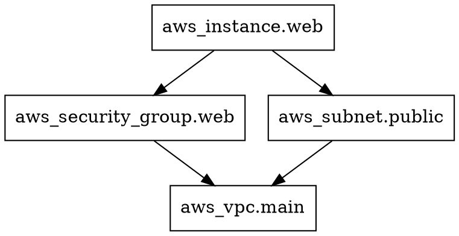

# How to Use terraform graph to Visualize Resource Dependencies

Author: [nawazdhandala](https://github.com/nawazdhandala)

Tags: Terraform, DevOps, Infrastructure as Code, Visualization, Dependencies

Description: Learn how to use the terraform graph command to visualize resource dependencies in your infrastructure, generate DOT format graphs, and render them with Graphviz.

---

When your Terraform configuration grows beyond a handful of resources, understanding the dependency chain becomes critical. Which resources depend on which? What gets created first? What happens if you delete that VPC - will it cascade to everything else?

The `terraform graph` command answers these questions by generating a visual dependency graph of your infrastructure. In this guide, we will cover how to use it effectively, how to render the output, and how to interpret what it tells you.

## What terraform graph Produces

The `terraform graph` command outputs a graph description in DOT format. DOT is a plain-text graph description language used by Graphviz, a popular open-source graph visualization tool.

```bash
# Generate the dependency graph
terraform graph
```

The raw output looks like this:



This is not meant to be read directly. You need to render it into an actual visual diagram.

## Installing Graphviz

Before you can render the graph, you need Graphviz installed:

```bash
# macOS
brew install graphviz

# Ubuntu/Debian
sudo apt-get install graphviz

# CentOS/RHEL
sudo yum install graphviz

# Windows (with Chocolatey)
choco install graphviz
```

## Rendering the Graph

Pipe the output of `terraform graph` directly into the `dot` command from Graphviz:

```bash
# Generate a PNG image
terraform graph | dot -Tpng > graph.png

# Generate an SVG (better for large graphs)
terraform graph | dot -Tsvg > graph.svg

# Generate a PDF
terraform graph | dot -Tpdf > graph.pdf
```

SVG format is usually the best choice for large configurations because it scales without losing quality and you can zoom in on specific areas.

## Graph Types

The `terraform graph` command supports a `-type` flag that controls what kind of graph it generates:

```bash
# Plan graph (default) - shows resources and their dependencies
terraform graph -type=plan

# Apply graph - shows the order resources will be created/modified
terraform graph -type=apply

# Destroy graph - shows the order resources will be destroyed
terraform graph -type=plan-destroy
```

The destroy graph is particularly useful because destruction order is the reverse of creation order, and seeing it visually helps you understand cascade effects.

## A Practical Example

Let's work through a real example. Consider this configuration for a basic web application on AWS:

```hcl
# vpc.tf - Network foundation
resource "aws_vpc" "main" {
  cidr_block = "10.0.0.0/16"

  tags = {
    Name = "main-vpc"
  }
}

resource "aws_subnet" "public" {
  vpc_id     = aws_vpc.main.id
  cidr_block = "10.0.1.0/24"

  tags = {
    Name = "public-subnet"
  }
}

resource "aws_internet_gateway" "gw" {
  vpc_id = aws_vpc.main.id

  tags = {
    Name = "main-igw"
  }
}

# security.tf - Security groups
resource "aws_security_group" "web" {
  name        = "web-sg"
  description = "Allow HTTP and HTTPS traffic"
  vpc_id      = aws_vpc.main.id

  ingress {
    from_port   = 80
    to_port     = 80
    protocol    = "tcp"
    cidr_blocks = ["0.0.0.0/0"]
  }

  ingress {
    from_port   = 443
    to_port     = 443
    protocol    = "tcp"
    cidr_blocks = ["0.0.0.0/0"]
  }
}

resource "aws_security_group" "db" {
  name        = "db-sg"
  description = "Allow traffic from web tier"
  vpc_id      = aws_vpc.main.id

  ingress {
    from_port       = 5432
    to_port         = 5432
    protocol        = "tcp"
    # Reference to web security group creates a dependency
    security_groups = [aws_security_group.web.id]
  }
}

# compute.tf - EC2 instances
resource "aws_instance" "web" {
  ami                    = "ami-0c55b159cbfafe1f0"
  instance_type          = "t3.micro"
  subnet_id              = aws_subnet.public.id
  vpc_security_group_ids = [aws_security_group.web.id]

  tags = {
    Name = "web-server"
  }
}

# database.tf - RDS instance
resource "aws_db_instance" "main" {
  allocated_storage      = 20
  engine                 = "postgres"
  engine_version         = "15.4"
  instance_class         = "db.t3.micro"
  db_name                = "myapp"
  username               = "admin"
  password               = var.db_password
  vpc_security_group_ids = [aws_security_group.db.id]
}
```

When you run `terraform graph | dot -Tpng > graph.png`, you get a diagram that clearly shows:

- `aws_vpc.main` is the root - everything depends on it
- `aws_subnet.public` and both security groups depend on the VPC
- `aws_security_group.db` depends on `aws_security_group.web` (because of the security group reference)
- `aws_instance.web` depends on both the subnet and the web security group
- `aws_db_instance.main` depends on the DB security group

## Filtering the Graph for Clarity

Large configurations produce very busy graphs. You can filter them with `grep` to focus on specific resources:

```bash
# Generate a graph and remove provider nodes for clarity
terraform graph | grep -v "provider" | dot -Tpng > graph-no-providers.png

# Focus only on specific resource relationships
terraform graph | grep -E "(aws_instance|aws_security_group|->)" | dot -Tpng > graph-filtered.png
```

For more advanced filtering, you can use a script:

```bash
#!/bin/bash
# filter-graph.sh - Filter terraform graph output by resource type

RESOURCE_TYPE=${1:-"aws_instance"}

terraform graph | awk -v type="$RESOURCE_TYPE" '
  /digraph/ { print; next }
  /compound|newrank|subgraph|^\}/ { print; next }
  /\[label/ && $0 ~ type { print; next }
  /->/ {
    # Print edges where either side matches our type
    if ($0 ~ type) print
  }
  /^\s*\}/ { print }
' | dot -Tpng > "graph-${RESOURCE_TYPE}.png"

echo "Generated graph-${RESOURCE_TYPE}.png"
```

## Using terraform graph in CI/CD

You can automatically generate and publish dependency graphs as part of your CI/CD pipeline:

```yaml
# .github/workflows/terraform-graph.yml
name: Terraform Graph

on:
  pull_request:
    paths:
      - '**.tf'

jobs:
  graph:
    runs-on: ubuntu-latest
    steps:
      - uses: actions/checkout@v4

      - name: Setup Terraform
        uses: hashicorp/setup-terraform@v3

      - name: Install Graphviz
        run: sudo apt-get install -y graphviz

      - name: Init Terraform
        run: terraform init -backend=false

      - name: Generate Graph
        run: terraform graph | dot -Tsvg > infrastructure-graph.svg

      - name: Upload Graph
        uses: actions/upload-artifact@v4
        with:
          name: infrastructure-graph
          path: infrastructure-graph.svg

      - name: Comment on PR
        uses: actions/github-script@v7
        with:
          script: |
            github.rest.issues.createComment({
              issue_number: context.issue.number,
              owner: context.repo.owner,
              repo: context.repo.repo,
              body: 'Infrastructure dependency graph has been generated. Download it from the workflow artifacts.'
            })
```

## Reading the Graph Effectively

When you look at a rendered terraform graph, keep these things in mind:

**Arrows mean "depends on."** If resource A has an arrow pointing to resource B, it means A depends on B. Terraform will create B first and destroy A first.

**Root nodes are created first.** Resources at the bottom of the graph (with no outgoing arrows) are created first because nothing depends on them creating something else.

**Leaf nodes are created last.** Resources at the top (with no incoming arrows) are created last because they depend on everything below them.

**Width indicates parallelism.** Resources at the same level with no dependencies between them can be created in parallel. A wider graph means more parallelism and faster applies.

## Alternative Visualization Tools

While Graphviz is the standard approach, there are other tools that can render DOT format:

```bash
# Use the online Graphviz viewer
# Copy the output and paste at https://dreampuf.github.io/GraphvizOnline/
terraform graph

# Use D2 for a more modern look (if installed)
# D2 does not directly support DOT, but converters exist

# Use Blast Radius for an interactive web view
pip install blastradius
blast-radius --serve .
```

Blast Radius is particularly nice because it gives you an interactive web interface where you can click on resources to see their details and dependencies.

## Debugging Dependency Issues

One of the best uses for `terraform graph` is debugging unexpected dependency issues. If Terraform keeps trying to create a resource before its dependency is ready, the graph will show you exactly what Terraform thinks the dependency chain looks like.

```bash
# Generate both plan and apply graphs and compare
terraform graph -type=plan | dot -Tpng > plan-graph.png
terraform graph -type=apply | dot -Tpng > apply-graph.png
```

If you see a missing edge in the graph, it means Terraform does not know about a dependency you expected. You may need to add an explicit `depends_on`:

```hcl
# Sometimes Terraform cannot detect implicit dependencies
# Use depends_on when you know a dependency exists
# but it is not reflected in resource attributes
resource "aws_instance" "app" {
  ami           = "ami-0c55b159cbfafe1f0"
  instance_type = "t3.micro"

  # This dependency is not detectable from attributes alone
  depends_on = [aws_iam_role_policy_attachment.app_policy]
}
```

## Summary

The `terraform graph` command is an underused tool that becomes invaluable as your infrastructure grows. Use it to understand dependency chains, debug ordering issues, verify that implicit dependencies are correct, and document your infrastructure architecture. Combined with Graphviz, it turns abstract HCL configurations into visual maps that anyone on your team can understand.

Make it a habit to generate and review the graph whenever you make significant changes to your Terraform configuration. It takes seconds to run and can reveal dependency issues that would otherwise only show up during a failed apply.
