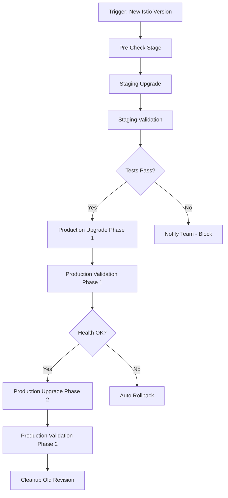

# How to Automate Istio Upgrades with CI/CD Pipelines

Author: [nawazdhandala](https://github.com/nawazdhandala)

Tags: Istio, Kubernetes, CI/CD, Automation, Service Mesh, GitOps

Description: How to build a CI/CD pipeline that automates Istio upgrades including pre-checks, staged rollouts, validation, and automatic rollback on failure.

---

Manually upgrading Istio works fine when you have one or two clusters. But when you are managing five, ten, or fifty clusters, manual upgrades become a bottleneck. You also lose consistency - each manual upgrade might be done slightly differently, increasing the chance of mistakes.

Automating Istio upgrades through CI/CD pipelines makes the process repeatable, auditable, and scalable. Here is how to build a pipeline that handles the full upgrade lifecycle.

## Pipeline Design Overview

A good Istio upgrade pipeline has these stages:



Each stage should have clear entry and exit criteria, automated health checks, and the ability to pause or roll back.

## Prerequisites

Your pipeline needs:

- A CI/CD system (GitHub Actions, GitLab CI, Jenkins, ArgoCD, etc.)
- Helm-based Istio installation (easiest to automate)
- kubeconfig access to staging and production clusters
- Monitoring APIs accessible from the pipeline (Prometheus, Datadog, etc.)
- Istio values files stored in a Git repository

## Stage 1: Pre-Check

This stage runs automatically when a new Istio version is available or when someone opens a PR to bump the version.

```yaml
# GitHub Actions example
name: Istio Upgrade
on:
  pull_request:
    paths:
      - 'infrastructure/istio/version.yaml'

jobs:
  pre-check:
    runs-on: ubuntu-latest
    steps:
      - uses: actions/checkout@v4

      - name: Read target version
        id: version
        run: echo "version=$(cat infrastructure/istio/version.yaml | grep version | awk '{print $2}')" >> $GITHUB_OUTPUT

      - name: Install istioctl
        run: |
          curl -L https://istio.io/downloadIstio | ISTIO_VERSION=${{ steps.version.outputs.version }} sh -
          echo "$PWD/istio-${{ steps.version.outputs.version }}/bin" >> $GITHUB_PATH

      - name: Run pre-check against staging
        run: |
          istioctl x precheck --kubeconfig $STAGING_KUBECONFIG

      - name: Validate Helm values
        run: |
          helm template istiod istio/istiod \
            --version ${{ steps.version.outputs.version }} \
            -f infrastructure/istio/istiod-values.yaml \
            -n istio-system > /dev/null

      - name: Validate Istio resources
        run: |
          kubectl get vs,dr,gw,se --all-namespaces -o yaml \
            --kubeconfig $STAGING_KUBECONFIG > resources.yaml
          istioctl validate -f resources.yaml
```

## Stage 2: Staging Upgrade

After pre-checks pass, upgrade the staging cluster:

```yaml
  staging-upgrade:
    needs: pre-check
    runs-on: ubuntu-latest
    environment: staging
    steps:
      - uses: actions/checkout@v4

      - name: Read target version
        id: version
        run: echo "version=$(cat infrastructure/istio/version.yaml | grep version | awk '{print $2}')" >> $GITHUB_OUTPUT

      - name: Upgrade Istio base
        run: |
          helm upgrade istio-base istio/base \
            -n istio-system \
            --version ${{ steps.version.outputs.version }} \
            --kubeconfig $STAGING_KUBECONFIG

      - name: Upgrade istiod
        run: |
          helm upgrade istiod istio/istiod \
            -n istio-system \
            --version ${{ steps.version.outputs.version }} \
            -f infrastructure/istio/istiod-values.yaml \
            --wait --timeout 300s \
            --kubeconfig $STAGING_KUBECONFIG

      - name: Upgrade gateway
        run: |
          helm upgrade istio-ingressgateway istio/gateway \
            -n istio-system \
            --version ${{ steps.version.outputs.version }} \
            -f infrastructure/istio/gateway-values.yaml \
            --wait --timeout 300s \
            --kubeconfig $STAGING_KUBECONFIG

      - name: Restart sidecars
        run: |
          for ns in $(kubectl get ns -l istio-injection=enabled \
            -o jsonpath='{.items[*].metadata.name}' \
            --kubeconfig $STAGING_KUBECONFIG); do
            kubectl rollout restart deployment -n $ns \
              --kubeconfig $STAGING_KUBECONFIG
          done
```

## Stage 3: Staging Validation

Run comprehensive tests against the staging environment:

```yaml
  staging-validation:
    needs: staging-upgrade
    runs-on: ubuntu-latest
    steps:
      - name: Wait for stabilization
        run: sleep 120

      - name: Check proxy status
        run: |
          istioctl proxy-status --kubeconfig $STAGING_KUBECONFIG
          STALE=$(istioctl proxy-status --kubeconfig $STAGING_KUBECONFIG | grep -c STALE || true)
          if [ "$STALE" -gt 0 ]; then
            echo "Found $STALE stale proxies"
            exit 1
          fi

      - name: Run analyzer
        run: |
          istioctl analyze --all-namespaces --kubeconfig $STAGING_KUBECONFIG

      - name: Run integration tests
        run: |
          # Run your test suite against staging
          ./tests/integration/run-tests.sh --target staging

      - name: Check error rates
        run: |
          # Query Prometheus for error rate
          ERROR_RATE=$(curl -s "http://prometheus-staging:9090/api/v1/query" \
            --data-urlencode 'query=sum(rate(istio_requests_total{response_code=~"5.*"}[5m])) / sum(rate(istio_requests_total[5m]))' \
            | jq -r '.data.result[0].value[1]')
          echo "Error rate: $ERROR_RATE"
          if (( $(echo "$ERROR_RATE > 0.01" | bc -l) )); then
            echo "Error rate too high: $ERROR_RATE"
            exit 1
          fi
```

## Stage 4: Production Upgrade with Canary

For production, use a revision-based canary approach:

```yaml
  production-canary:
    needs: staging-validation
    runs-on: ubuntu-latest
    environment: production
    steps:
      - name: Install canary revision
        run: |
          helm install istiod-canary istio/istiod \
            -n istio-system \
            --version ${{ steps.version.outputs.version }} \
            --set revision=canary \
            -f infrastructure/istio/istiod-values.yaml \
            --kubeconfig $PRODUCTION_KUBECONFIG

      - name: Migrate canary namespaces
        run: |
          CANARY_NAMESPACES=$(cat infrastructure/istio/canary-namespaces.txt)
          for ns in $CANARY_NAMESPACES; do
            kubectl label namespace $ns istio-injection- --overwrite \
              --kubeconfig $PRODUCTION_KUBECONFIG 2>/dev/null || true
            kubectl label namespace $ns istio.io/rev=canary --overwrite \
              --kubeconfig $PRODUCTION_KUBECONFIG
            kubectl rollout restart deployment -n $ns \
              --kubeconfig $PRODUCTION_KUBECONFIG
          done

      - name: Validate canary
        run: |
          sleep 300  # 5 minutes
          ./scripts/validate-canary.sh --kubeconfig $PRODUCTION_KUBECONFIG
```

## Stage 5: Production Full Rollout

After the canary phase passes, migrate all remaining namespaces:

```yaml
  production-full:
    needs: production-canary
    runs-on: ubuntu-latest
    environment: production-full
    steps:
      - name: Migrate remaining namespaces
        run: |
          REMAINING=$(kubectl get ns -l istio-injection=enabled \
            -o jsonpath='{.items[*].metadata.name}' \
            --kubeconfig $PRODUCTION_KUBECONFIG)
          for ns in $REMAINING; do
            kubectl label namespace $ns istio-injection- --overwrite \
              --kubeconfig $PRODUCTION_KUBECONFIG 2>/dev/null || true
            kubectl label namespace $ns istio.io/rev=canary --overwrite \
              --kubeconfig $PRODUCTION_KUBECONFIG
            kubectl rollout restart deployment -n $ns \
              --kubeconfig $PRODUCTION_KUBECONFIG
            sleep 60  # Wait between namespaces
          done

      - name: Final validation
        run: |
          sleep 300
          istioctl proxy-status --kubeconfig $PRODUCTION_KUBECONFIG
          istioctl analyze --all-namespaces --kubeconfig $PRODUCTION_KUBECONFIG

      - name: Remove old revision
        run: |
          helm delete istiod -n istio-system --kubeconfig $PRODUCTION_KUBECONFIG
```

## Automatic Rollback

Build rollback into the pipeline so it triggers automatically on failure:

```yaml
  rollback:
    needs: [production-canary]
    if: failure()
    runs-on: ubuntu-latest
    steps:
      - name: Rollback canary namespaces
        run: |
          CANARY_NAMESPACES=$(cat infrastructure/istio/canary-namespaces.txt)
          for ns in $CANARY_NAMESPACES; do
            kubectl label namespace $ns istio.io/rev- --overwrite \
              --kubeconfig $PRODUCTION_KUBECONFIG 2>/dev/null || true
            kubectl label namespace $ns istio-injection=enabled --overwrite \
              --kubeconfig $PRODUCTION_KUBECONFIG
            kubectl rollout restart deployment -n $ns \
              --kubeconfig $PRODUCTION_KUBECONFIG
          done

      - name: Remove canary revision
        run: |
          helm delete istiod-canary -n istio-system \
            --kubeconfig $PRODUCTION_KUBECONFIG

      - name: Notify team
        run: |
          curl -X POST $SLACK_WEBHOOK -d '{
            "text": "Istio upgrade rollback triggered. Canary validation failed."
          }'
```

## GitOps Approach with ArgoCD

If you use ArgoCD, you can manage Istio upgrades declaratively:

```yaml
# Application for istiod
apiVersion: argoproj.io/v1alpha1
kind: Application
metadata:
  name: istiod
  namespace: argocd
spec:
  project: infrastructure
  source:
    repoURL: https://istio-release.storage.googleapis.com/charts
    chart: istiod
    targetRevision: 1.21.0
    helm:
      valueFiles:
        - $values/infrastructure/istio/istiod-values.yaml
  destination:
    server: https://kubernetes.default.svc
    namespace: istio-system
  syncPolicy:
    automated:
      prune: false
      selfHeal: false
```

With ArgoCD, changing the `targetRevision` in Git triggers the upgrade. Manual sync gives you control over when it applies.

## Multi-Cluster Automation

For multiple clusters, parameterize the pipeline:

```yaml
  upgrade-cluster:
    strategy:
      matrix:
        cluster: [staging, prod-us-east, prod-us-west, prod-eu-west]
      max-parallel: 1  # One cluster at a time
    steps:
      - name: Upgrade ${{ matrix.cluster }}
        run: |
          ./scripts/upgrade-istio.sh \
            --cluster ${{ matrix.cluster }} \
            --version ${{ steps.version.outputs.version }}
```

The `max-parallel: 1` setting ensures clusters are upgraded sequentially, so you can catch problems before they spread to all clusters.

## Pipeline Best Practices

**Version pin everything.** Pin the istioctl version, the Helm chart version, and the CI runner version. Floating versions cause unreproducible builds.

**Use environment approvals.** Require manual approval before production stages. Automation should not bypass human judgment for production changes.

**Keep secrets secure.** Use your CI/CD system's secret management for kubeconfig files and API tokens. Never commit credentials to the repository.

**Log everything.** Store pipeline logs for audit purposes. When something goes wrong, you need to know exactly what commands ran and what their output was.

**Test the pipeline itself.** Run the full pipeline in a disposable test cluster to verify it works before trusting it with production.

## Summary

Automating Istio upgrades with CI/CD pipelines makes the process repeatable and consistent across clusters. Build stages for pre-checks, staging upgrades, staging validation, production canary, production full rollout, and automatic rollback. Use environment approvals for production stages, automate health checks between stages, and build rollback into the pipeline as a first-class feature. The upfront investment in building the pipeline pays off every time you upgrade, especially across multiple clusters.
