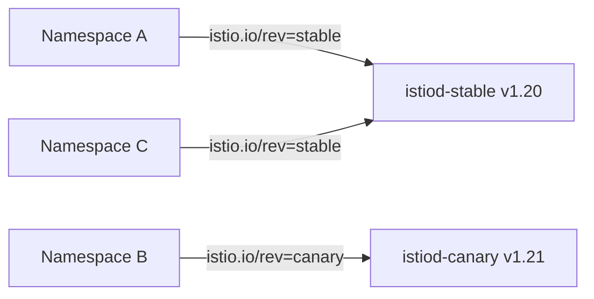

# How to Perform a Canary Upgrade of Istio Control Plane

Author: [nawazdhandala](https://github.com/nawazdhandala)

Tags: Istio, Kubernetes, Service Mesh, Canary Upgrade, Control Plane

Description: Learn how to perform a canary upgrade of the Istio control plane by running two revisions side-by-side and gradually migrating workloads.

---

Upgrading Istio can feel risky, especially in production. One bad config change or an incompatible proxy version can break traffic routing for your entire mesh. That is exactly why the canary upgrade approach exists. Instead of swapping out the entire control plane at once, you install a new revision alongside the old one, test it with a subset of workloads, and only cut over fully when you are confident everything works.

This guide walks through the full process of performing a canary upgrade of the Istio control plane.

## Why Canary Upgrades Matter

The traditional in-place upgrade replaces your running istiod with a new version. If something goes wrong, rolling back means reinstalling the old version and hoping state is preserved. With a canary upgrade, both the old and new control planes run simultaneously. You control which namespaces talk to which revision. If the new version has problems, you just point namespaces back to the old revision. No panic, no rushed rollback.



## Prerequisites

Before starting, make sure you have:

- A running Istio installation (we will assume version 1.20 as the current version)
- `istioctl` binaries for both the current and target versions
- `kubectl` access to the cluster with admin privileges
- Familiarity with Istio revision labels

Check your current Istio version:

```bash
istioctl version
```

## Step 1: Install the New Control Plane Revision

Download the target version of `istioctl`. For this example, we are upgrading from 1.20 to 1.21.

```bash
curl -L https://istio.io/downloadIstio | ISTIO_VERSION=1.21.0 sh -
export PATH=$PWD/istio-1.21.0/bin:$PATH
```

Now install the canary revision. The key flag here is `--revision`, which tells Istio to install a separate control plane instance with a specific label.

```bash
istioctl install --revision=canary --set profile=default -y
```

This creates a new `istiod-canary` deployment in the `istio-system` namespace. Your existing istiod continues running untouched.

Verify both control planes are running:

```bash
kubectl get pods -n istio-system -l app=istiod
```

You should see something like:

```text
NAME                             READY   STATUS    RESTARTS   AGE
istiod-6b4c4d8f9b-xyz12         1/1     Running   0          30d
istiod-canary-7c5d6e9f1a-abc34  1/1     Running   0          2m
```

## Step 2: Label a Test Namespace

The way Istio revision-based canary works is through namespace labels. Instead of the standard `istio-injection=enabled` label, you use `istio.io/rev=<revision>` to point a namespace at a specific control plane.

Pick a non-critical namespace to test with first:

```bash
kubectl label namespace test-app istio-injection- istio.io/rev=canary --overwrite
```

The first part (`istio-injection-`) removes the old injection label. The second part adds the revision label pointing to the canary control plane.

## Step 3: Restart Workloads in the Test Namespace

Changing the label does not automatically re-inject sidecars. You need to restart the pods so they pick up the new proxy version from the canary control plane.

```bash
kubectl rollout restart deployment -n test-app
```

After the rollout completes, verify the sidecar version:

```bash
istioctl proxy-status
```

Look for the pods in `test-app`. They should show the new Istio version (1.21) and be connected to `istiod-canary`.

You can also check a specific pod:

```bash
kubectl get pod -n test-app -o jsonpath='{.items[0].spec.containers[?(@.name=="istio-proxy")].image}'
```

## Step 4: Validate the Canary

This is the most important step. Do not rush past it. Run your validation suite against the test namespace.

Check proxy configuration is correctly synced:

```bash
istioctl analyze -n test-app
```

Verify that traffic routing still works. If you have VirtualServices or DestinationRules in the namespace, make sure they are being honored:

```bash
istioctl proxy-config routes -n test-app <pod-name>
```

Run any integration tests you have. Check your monitoring dashboards for error rate spikes, latency increases, or dropped connections. Give it time - at least a few hours in a real production environment, ideally a day or more for high-traffic services.

## Step 5: Migrate Remaining Namespaces

Once you are satisfied the canary revision is stable, migrate the rest of your namespaces one by one or in batches.

```bash
# Migrate namespace by namespace
for ns in app-frontend app-backend app-payments; do
  kubectl label namespace $ns istio-injection- istio.io/rev=canary --overwrite
  kubectl rollout restart deployment -n $ns
done
```

After each batch, monitor for issues before proceeding to the next batch. There is no reason to rush this.

Verify all proxies are on the new version:

```bash
istioctl proxy-status | grep -v "canary"
```

If any pods are still connected to the old control plane, they have not been migrated yet.

## Step 6: Remove the Old Control Plane

Once every workload has been migrated to the canary revision and you have verified stability, remove the old control plane:

```bash
istioctl uninstall --revision=default -y
```

If your old installation did not use a revision label (which is common for the initial install), you may need to use:

```bash
istioctl uninstall --revision=default -y
```

Or if you used Helm:

```bash
helm delete istiod -n istio-system
```

Clean up and verify:

```bash
kubectl get pods -n istio-system -l app=istiod
```

Only the canary revision should remain.

## Step 7: Rename the Canary (Optional)

At this point your "canary" is now the production control plane, but it still has the canary revision label. You have two options:

1. Leave it as-is and just remember that "canary" is now production
2. Install a new revision with a better name like "stable" and migrate again

Many teams adopt a naming convention like `stable` and `canary` that they rotate between upgrades. For example:

- Current production: `stable` (v1.20)
- New canary: `canary` (v1.21)
- After migration: `canary` becomes the production revision
- Next upgrade: install new `stable` (v1.22), migrate from `canary` to `stable`

## Common Pitfalls

**Forgetting to remove the old injection label.** If a namespace has both `istio-injection=enabled` and `istio.io/rev=canary`, the behavior is undefined. Always remove the old label first.

**Not restarting pods.** Label changes do not trigger automatic sidecar re-injection. You must restart pods.

**Rushing validation.** The whole point of a canary upgrade is to catch problems early. Give the canary time to handle real traffic before migrating everything.

**Gateway resources.** If you are using Istio ingress gateways, remember that they also need to be upgraded. The gateway pods need to match the control plane version they connect to.

```bash
kubectl get pods -n istio-system -l istio=ingressgateway -o jsonpath='{.items[*].spec.containers[?(@.name=="istio-proxy")].image}'
```

## Wrapping Up

The canary upgrade process takes more time than an in-place upgrade, but the safety it provides is worth it for production environments. You get to validate the new version with real traffic before committing to it, and rolling back is as simple as relabeling namespaces. If you are running Istio in any environment where downtime matters, this is the upgrade strategy you should be using.
