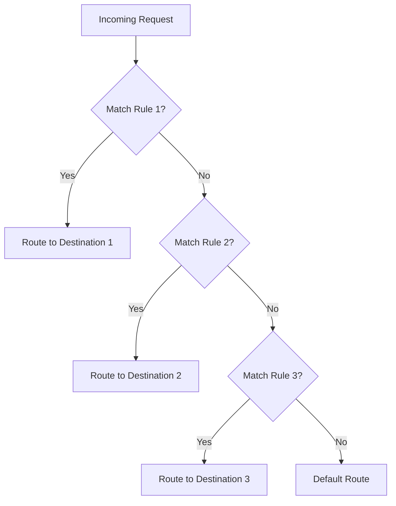

# How to Configure Request Routing with Istio VirtualService

Author: [nawazdhandala](https://github.com/nawazdhandala)

Tags: Istio, Kubernetes, VirtualService, Traffic Routing, Service Mesh

Description: A comprehensive guide to configuring request routing with Istio VirtualService, covering match conditions, multiple routes, and advanced routing patterns.

---

Request routing is the core function of Istio's VirtualService resource. While the basic concept is simple - define rules that direct traffic to specific destinations - the actual routing capabilities are extensive. You can route based on headers, URI paths, query parameters, source labels, and more. You can combine conditions, set priorities, and build complex routing logic that would otherwise require application-level code.

This guide covers the full range of request routing options available in VirtualService.

## The Routing Model

Every HTTP request that enters the mesh passes through a sidecar proxy. The proxy evaluates the VirtualService rules for the destination service and picks the matching route. The evaluation is top-down - the first matching rule wins.



If no rule matches and there is no default route, Istio uses standard Kubernetes service routing.

## Basic Route Configuration

The simplest VirtualService routes all traffic to a single destination:

```yaml
apiVersion: networking.istio.io/v1
kind: VirtualService
metadata:
  name: productpage
  namespace: bookinfo
spec:
  hosts:
  - productpage
  http:
  - route:
    - destination:
        host: productpage
        subset: v1
        port:
          number: 9080
```

The `port` field is optional if the service only exposes one port.

## Routing to Multiple Destinations

You can route to multiple destinations with different weights:

```yaml
apiVersion: networking.istio.io/v1
kind: VirtualService
metadata:
  name: reviews
  namespace: bookinfo
spec:
  hosts:
  - reviews
  http:
  - route:
    - destination:
        host: reviews
        subset: v1
      weight: 80
    - destination:
        host: reviews
        subset: v2
      weight: 20
```

80% of traffic goes to v1, 20% to v2. Weights must add up to 100.

## Match Conditions

Match conditions determine which requests a rule applies to. You can match on various request attributes.

### Header-Based Matching

```yaml
apiVersion: networking.istio.io/v1
kind: VirtualService
metadata:
  name: reviews
  namespace: bookinfo
spec:
  hosts:
  - reviews
  http:
  - match:
    - headers:
        x-api-version:
          exact: "v2"
    route:
    - destination:
        host: reviews
        subset: v2
  - route:
    - destination:
        host: reviews
        subset: v1
```

Requests with header `x-api-version: v2` go to v2. Everything else goes to v1.

Header matching supports several operators:

```yaml
headers:
  x-custom:
    exact: "value"      # Exact string match
    prefix: "val"       # Starts with
    regex: "v[0-9]+"    # Regular expression match
```

### URI Path Matching

```yaml
http:
- match:
  - uri:
      prefix: /api/v2
  route:
  - destination:
      host: api-service
      subset: v2
- match:
  - uri:
      prefix: /api/v1
  route:
  - destination:
      host: api-service
      subset: v1
```

URI matching also supports `exact`, `prefix`, and `regex`.

### Method Matching

```yaml
http:
- match:
  - method:
      exact: GET
  route:
  - destination:
      host: read-service
- match:
  - method:
      exact: POST
  route:
  - destination:
      host: write-service
```

### Query Parameter Matching

```yaml
http:
- match:
  - queryParams:
      version:
        exact: "2"
  route:
  - destination:
      host: reviews
      subset: v2
```

Requests with `?version=2` in the query string match this rule.

### Source Label Matching

Route based on which service is making the request:

```yaml
http:
- match:
  - sourceLabels:
      app: frontend
      version: v2
  route:
  - destination:
      host: backend
      subset: v2
- route:
  - destination:
      host: backend
      subset: v1
```

When the frontend v2 calls the backend, it gets backend v2. All other callers get backend v1. This is useful for pinning traffic in end-to-end testing scenarios.

## Combining Match Conditions

### AND Conditions

Multiple conditions within a single match block are AND-ed together:

```yaml
http:
- match:
  - headers:
      x-api-version:
        exact: "v2"
    uri:
      prefix: /api
  route:
  - destination:
      host: api-service
      subset: v2
```

Both the header AND the URI prefix must match.

### OR Conditions

Multiple match blocks within a rule are OR-ed together:

```yaml
http:
- match:
  - headers:
      x-api-version:
        exact: "v2"
  - uri:
      prefix: /api/v2
  route:
  - destination:
      host: api-service
      subset: v2
```

The request matches if it has the `x-api-version: v2` header OR if the URI starts with `/api/v2`.

## Route Rewriting

You can rewrite the URI before forwarding:

```yaml
http:
- match:
  - uri:
      prefix: /ratings
  rewrite:
    uri: /v1/ratings
  route:
  - destination:
      host: ratings-service
```

Requests to `/ratings/1234` are forwarded to `ratings-service` as `/v1/ratings/1234`.

You can also rewrite the authority (Host header):

```yaml
http:
- match:
  - uri:
      prefix: /legacy-api
  rewrite:
    uri: /api
    authority: new-backend.default.svc.cluster.local
  route:
  - destination:
      host: new-backend
```

## Header Manipulation

Add, set, or remove headers before forwarding:

```yaml
http:
- route:
  - destination:
      host: reviews
      subset: v1
  headers:
    request:
      set:
        x-forwarded-by: istio-mesh
      add:
        x-request-id: "%REQ(x-request-id)%"
      remove:
      - x-internal-header
    response:
      set:
        x-served-by: reviews-v1
      remove:
      - server
```

The `request` section modifies the request going to the destination. The `response` section modifies the response coming back to the caller.

## Routing to External Services

VirtualServices can also route to services outside the mesh if you have a ServiceEntry defined:

```yaml
apiVersion: networking.istio.io/v1
kind: ServiceEntry
metadata:
  name: external-api
  namespace: bookinfo
spec:
  hosts:
  - api.external.com
  ports:
  - number: 443
    name: https
    protocol: HTTPS
  resolution: DNS
  location: MESH_EXTERNAL
---
apiVersion: networking.istio.io/v1
kind: VirtualService
metadata:
  name: external-api-route
  namespace: bookinfo
spec:
  hosts:
  - api.external.com
  http:
  - timeout: 10s
    retries:
      attempts: 2
      perTryTimeout: 5s
    route:
    - destination:
        host: api.external.com
        port:
          number: 443
```

This applies Istio routing features (timeouts, retries) to traffic going to an external API.

## Multiple Hosts

A single VirtualService can apply to multiple hosts:

```yaml
apiVersion: networking.istio.io/v1
kind: VirtualService
metadata:
  name: multi-host-routing
  namespace: bookinfo
spec:
  hosts:
  - reviews
  - ratings
  http:
  - match:
    - uri:
        prefix: /reviews
    route:
    - destination:
        host: reviews
  - match:
    - uri:
        prefix: /ratings
    route:
    - destination:
        host: ratings
```

## Gateway-Bound Routing

When routing traffic coming through an Istio Gateway (external traffic), bind the VirtualService to the Gateway:

```yaml
apiVersion: networking.istio.io/v1
kind: VirtualService
metadata:
  name: bookinfo-gateway-route
  namespace: bookinfo
spec:
  hosts:
  - bookinfo.example.com
  gateways:
  - bookinfo-gateway
  http:
  - match:
    - uri:
        prefix: /productpage
    route:
    - destination:
        host: productpage
        port:
          number: 9080
  - match:
    - uri:
        prefix: /api
    route:
    - destination:
        host: api-service
        port:
          number: 8080
```

The `gateways` field limits this VirtualService to traffic entering through the specified Gateway. Without it, the rules apply to mesh-internal traffic only.

To apply to both gateway and mesh traffic:

```yaml
gateways:
- bookinfo-gateway
- mesh
```

## Debugging Routes

When routes do not work as expected, use istioctl to inspect:

```bash
# Check what routes the proxy has
istioctl proxy-config routes deploy/productpage -n bookinfo

# Get detailed route info for a specific domain
istioctl proxy-config routes deploy/productpage -n bookinfo --name 9080

# Run the analyzer
istioctl analyze -n bookinfo
```

Common routing issues:

- **503 errors**: Usually means the destination subset does not exist in the DestinationRule
- **404 errors**: The VirtualService host does not match the request's Host header
- **No effect**: The sidecar proxy might not have received the configuration yet (check `istioctl proxy-status`)

## Summary

Istio VirtualService request routing covers everything from simple single-destination rules to complex multi-condition routing with header manipulation and URI rewrites. The key concepts are: rules are evaluated top-down, match conditions can be combined with AND/OR logic, weights control traffic splitting, and you can manipulate headers and URIs before forwarding. Start with simple rules and add complexity only when needed. Use istioctl to debug when routes do not behave as expected.
