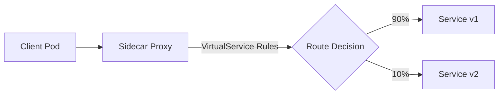

# How to Create Your First Istio VirtualService

Author: [nawazdhandala](https://github.com/nawazdhandala)

Tags: Istio, Kubernetes, VirtualService, Service Mesh, Traffic Management

Description: A beginner-friendly guide to creating your first Istio VirtualService, covering the resource structure, routing rules, and practical deployment examples.

---

The VirtualService is one of the most important resources in Istio. It controls how requests are routed to services within your mesh. Without VirtualServices, Istio just forwards traffic using standard Kubernetes service discovery. With VirtualServices, you get fine-grained control over routing based on headers, paths, weights, and more.

If you have never created a VirtualService before, this guide walks you through the process from scratch.

## What a VirtualService Does

In plain Kubernetes, when Service A calls Service B, the request goes to one of Service B's pods selected randomly by kube-proxy. That is it. No control over which version of Service B handles the request, no ability to route based on the request content, no way to split traffic between versions.

A VirtualService intercepts that routing decision and lets you define rules. You can say "send 90% of traffic to v1 and 10% to v2" or "route requests with header X-Debug=true to the debug version."



The VirtualService rules live in the Istio control plane and are pushed to every sidecar proxy in the mesh. The proxy makes the routing decision locally based on these rules.

## Prerequisites

Before creating a VirtualService, you need:

- A running Kubernetes cluster with Istio installed
- At least one service deployed with sidecar injection enabled
- `kubectl` configured to access your cluster

Verify Istio is running:

```bash
kubectl get pods -n istio-system
```

Verify sidecar injection is enabled for your namespace:

```bash
kubectl get namespace my-app -L istio-injection
```

## Setting Up a Sample Application

For this tutorial, we will use a simple application with two versions. First, create the namespace:

```bash
kubectl create namespace bookstore
kubectl label namespace bookstore istio-injection=enabled
```

Deploy version 1 of the service:

```yaml
apiVersion: apps/v1
kind: Deployment
metadata:
  name: reviews-v1
  namespace: bookstore
spec:
  replicas: 2
  selector:
    matchLabels:
      app: reviews
      version: v1
  template:
    metadata:
      labels:
        app: reviews
        version: v1
    spec:
      containers:
      - name: reviews
        image: docker.io/istio/examples-bookinfo-reviews-v1:1.18.0
        ports:
        - containerPort: 9080
---
apiVersion: apps/v1
kind: Deployment
metadata:
  name: reviews-v2
  namespace: bookstore
spec:
  replicas: 2
  selector:
    matchLabels:
      app: reviews
      version: v2
  template:
    metadata:
      labels:
        app: reviews
        version: v2
    spec:
      containers:
      - name: reviews
        image: docker.io/istio/examples-bookinfo-reviews-v2:1.18.0
        ports:
        - containerPort: 9080
---
apiVersion: v1
kind: Service
metadata:
  name: reviews
  namespace: bookstore
spec:
  selector:
    app: reviews
  ports:
  - port: 9080
    targetPort: 9080
```

Notice that both deployments share the same `app: reviews` label, so the Kubernetes Service routes to both versions. Without a VirtualService, traffic is split roughly 50/50 between v1 and v2.

## Creating a DestinationRule First

Before creating a VirtualService, you usually need a DestinationRule to define subsets. Subsets are named groups of pods identified by labels.

```yaml
apiVersion: networking.istio.io/v1
kind: DestinationRule
metadata:
  name: reviews
  namespace: bookstore
spec:
  host: reviews
  subsets:
  - name: v1
    labels:
      version: v1
  - name: v2
    labels:
      version: v2
```

Apply it:

```bash
kubectl apply -f destinationrule.yaml
```

This tells Istio: "The reviews service has two subsets - v1 (pods with version=v1 label) and v2 (pods with version=v2 label)."

## Your First VirtualService

Now create a VirtualService that routes all traffic to v1:

```yaml
apiVersion: networking.istio.io/v1
kind: VirtualService
metadata:
  name: reviews
  namespace: bookstore
spec:
  hosts:
  - reviews
  http:
  - route:
    - destination:
        host: reviews
        subset: v1
```

Apply it:

```bash
kubectl apply -f virtualservice.yaml
```

That is it. Every request to the `reviews` service now goes to v1 pods only. The v2 pods are still running but receive no traffic.

Let me break down each field:

- **hosts**: Which service this VirtualService applies to. `reviews` is a shorthand for `reviews.bookstore.svc.cluster.local`.
- **http**: Rules for HTTP traffic.
- **route**: Where to send matching traffic.
- **destination.host**: The target service.
- **destination.subset**: Which subset of the service (defined in the DestinationRule).

## Verifying the VirtualService

Check that the VirtualService was created:

```bash
kubectl get virtualservice -n bookstore
```

Verify the proxy received the configuration:

```bash
# Pick a pod in the namespace
POD=$(kubectl get pods -n bookstore -l app=reviews -o jsonpath='{.items[0].metadata.name}')

# Check routes
istioctl proxy-config routes $POD -n bookstore
```

Send test traffic and verify it all goes to v1:

```bash
# Deploy a test pod
kubectl run test-client --image=curlimages/curl -n bookstore --restart=Never -- sleep 3600

# Send requests
for i in $(seq 1 10); do
  kubectl exec test-client -n bookstore -- curl -s reviews:9080/reviews/1 | head -1
done
```

All responses should come from v1.

## Adding a Second Route

Now let us make it more interesting. Route most traffic to v1, but send requests from a specific user to v2:

```yaml
apiVersion: networking.istio.io/v1
kind: VirtualService
metadata:
  name: reviews
  namespace: bookstore
spec:
  hosts:
  - reviews
  http:
  - match:
    - headers:
        end-user:
          exact: jason
    route:
    - destination:
        host: reviews
        subset: v2
  - route:
    - destination:
        host: reviews
        subset: v1
```

Apply it:

```bash
kubectl apply -f virtualservice-v2.yaml
```

Now requests with the header `end-user: jason` go to v2, and everything else goes to v1.

```bash
# This goes to v1
kubectl exec test-client -n bookstore -- curl -s reviews:9080/reviews/1

# This goes to v2
kubectl exec test-client -n bookstore -- curl -s -H "end-user: jason" reviews:9080/reviews/1
```

## Rule Ordering Matters

VirtualService rules are evaluated in order, top to bottom. The first matching rule wins. In the example above:

1. If the request has `end-user: jason` header, route to v2
2. Otherwise (default route), route to v1

If you put the default route first, it would match everything and the header-based rule would never be reached. Always put more specific rules before less specific ones.

## Adding Timeouts and Retries

VirtualServices can also configure timeouts and retries:

```yaml
apiVersion: networking.istio.io/v1
kind: VirtualService
metadata:
  name: reviews
  namespace: bookstore
spec:
  hosts:
  - reviews
  http:
  - route:
    - destination:
        host: reviews
        subset: v1
    timeout: 5s
    retries:
      attempts: 3
      perTryTimeout: 2s
      retryOn: 5xx,reset,connect-failure
```

This sets:

- A total timeout of 5 seconds for the request
- Up to 3 retry attempts
- Each retry attempt has a 2-second timeout
- Retries happen on 5xx errors, connection resets, and connection failures

## Adding Fault Injection for Testing

You can use VirtualServices to inject faults for chaos testing:

```yaml
apiVersion: networking.istio.io/v1
kind: VirtualService
metadata:
  name: reviews
  namespace: bookstore
spec:
  hosts:
  - reviews
  http:
  - fault:
      delay:
        percentage:
          value: 10
        fixedDelay: 5s
    route:
    - destination:
        host: reviews
        subset: v1
```

This adds a 5-second delay to 10% of requests. Useful for testing how your application handles slow dependencies.

## Common Mistakes

**Forgetting the DestinationRule.** If you reference a subset in a VirtualService but have not created the corresponding DestinationRule, requests will fail with 503 errors.

**Mismatched host names.** The `hosts` field in the VirtualService must match how clients address the service. If clients use the full FQDN (`reviews.bookstore.svc.cluster.local`), make sure the VirtualService matches.

**Not having sidecar injection.** VirtualService rules are enforced by the sidecar proxy. If your pods do not have sidecars, the rules have no effect.

**Applying to the wrong namespace.** A VirtualService in namespace A does not automatically affect traffic in namespace B. The VirtualService should be in the same namespace as the service, or you need to use the full service hostname.

## Cleaning Up

Remove the test resources:

```bash
kubectl delete virtualservice reviews -n bookstore
kubectl delete destinationrule reviews -n bookstore
kubectl delete pod test-client -n bookstore
```

## Summary

Creating your first Istio VirtualService involves three things: defining subsets with a DestinationRule, creating the VirtualService with routing rules, and verifying the configuration with istioctl and test traffic. Start simple with a single route, then add complexity with match conditions, timeouts, retries, and fault injection as needed. The VirtualService is your primary tool for traffic management in Istio, and everything else builds on the basics covered here.
