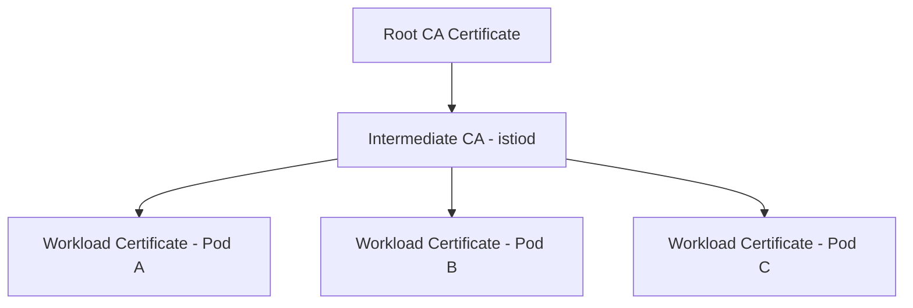

# How to Handle Certificate Rotation During Istio Upgrades

Author: [nawazdhandala](https://github.com/nawazdhandala)

Tags: Istio, Kubernetes, Service Mesh, Certificate, mTLS, Security

Description: How to manage certificate rotation during Istio upgrades to prevent mTLS failures, including root CA migration and workload certificate handling.

---

mTLS is one of Istio's most important features, and it depends entirely on certificates. During an Istio upgrade, the certificate infrastructure can change in ways that break service-to-service communication. A root CA might rotate, certificate lifetimes might change, or the signing mechanism might be different between versions. If you do not handle certificates carefully during an upgrade, you end up with services that cannot talk to each other because their certificates do not match.

Here is how to manage certificates through the upgrade process.

## How Istio Certificates Work

Istio uses a hierarchical certificate system:



The root CA is the trust anchor. istiod acts as the intermediate CA, signing short-lived workload certificates for each sidecar proxy. These workload certificates are used for mTLS between services.

By default, workload certificates have a 24-hour lifetime and are automatically rotated by the sidecar proxy before they expire.

## What Changes During an Upgrade

Several things can change:

1. **Root CA secret format** - Different Istio versions may expect different key formats or secret structures
2. **Certificate signing algorithm** - The upgrade might change from RSA to ECDSA or change key sizes
3. **Certificate lifetime defaults** - Default expiration times might change
4. **CA implementation** - The upgrade might change how istiod generates and signs certificates

The critical risk is a root CA mismatch. If the new istiod starts using a different root CA than the old one, services with old certificates cannot communicate with services that have new certificates.

## Checking Current Certificate State

Before upgrading, document your certificate setup:

```bash
# Check if you are using a custom CA (cacerts secret)
kubectl get secret cacerts -n istio-system -o yaml 2>/dev/null

# Check the current root cert
kubectl get secret istio-ca-secret -n istio-system -o jsonpath='{.data.ca-cert\.pem}' | base64 -d | openssl x509 -noout -text

# Check workload cert details on a specific pod
istioctl proxy-config secret deploy/my-app -n my-namespace -o json | jq '.dynamicActiveSecrets[0]'
```

Check certificate validity:

```bash
# See when the root cert expires
kubectl get secret cacerts -n istio-system -o jsonpath='{.data.root-cert\.pem}' 2>/dev/null | base64 -d | openssl x509 -noout -enddate

# See a workload cert's expiry
istioctl proxy-config secret deploy/my-app -n my-namespace -o json | jq -r '.dynamicActiveSecrets[0].secret.tlsCertificate.certificateChain.inlineBytes' | base64 -d | openssl x509 -noout -dates
```

## Scenario 1: Using Istio's Built-In CA

If you are using Istio's self-signed CA (the default), the root CA is stored in the `istio-ca-secret` secret in the `istio-system` namespace.

During an in-place upgrade, the new istiod picks up the existing root CA from this secret. No rotation happens, and certificates remain compatible.

During a canary/revision upgrade, both istiod instances share the same root CA secret, so certificates signed by either control plane are mutually trusted.

**What to watch for:** If you accidentally delete the `istio-ca-secret` during the upgrade, the new istiod generates a new root CA. All existing workload certificates become untrusted. To prevent this:

```bash
# Back up the CA secret before upgrading
kubectl get secret istio-ca-secret -n istio-system -o yaml > istio-ca-secret-backup.yaml
```

## Scenario 2: Using a Custom Root CA

If you provide your own root CA via the `cacerts` secret, the upgrade should preserve it because Kubernetes secrets persist independently of Istio.

Verify the secret exists and is intact:

```bash
kubectl get secret cacerts -n istio-system
```

The secret should contain:

```bash
kubectl get secret cacerts -n istio-system -o jsonpath='{.data}' | jq 'keys'
```

Expected keys: `ca-cert.pem`, `ca-key.pem`, `cert-chain.pem`, `root-cert.pem`

If you are rotating to a new custom CA during the upgrade, you need to use the trust domain migration process (covered below).

## Scenario 3: Using cert-manager

If you use cert-manager to manage Istio's CA certificate:

```yaml
apiVersion: cert-manager.io/v1
kind: Certificate
metadata:
  name: istio-ca
  namespace: istio-system
spec:
  isCA: true
  commonName: istio-ca
  secretName: cacerts
  issuerRef:
    name: root-issuer
    kind: ClusterIssuer
```

cert-manager handles rotation independently of Istio. During an Istio upgrade:

1. Verify cert-manager is still running and healthy
2. Check that the `cacerts` secret is present and valid
3. Confirm the new Istio version is compatible with your cert-manager setup

```bash
kubectl get certificate istio-ca -n istio-system
kubectl describe certificate istio-ca -n istio-system
```

## Root CA Rotation During Upgrade

If you need to rotate the root CA as part of the upgrade (for example, the old root is expiring), follow this process to avoid downtime:

### Step 1: Create a Combined Trust Bundle

Create a trust bundle that includes both the old and new root CAs:

```bash
# Combine old and new root certs
cat old-root-cert.pem new-root-cert.pem > combined-root-cert.pem
```

### Step 2: Update the CA Secret with Both Roots

```bash
kubectl create secret generic cacerts -n istio-system \
  --from-file=ca-cert.pem=new-ca-cert.pem \
  --from-file=ca-key.pem=new-ca-key.pem \
  --from-file=root-cert.pem=combined-root-cert.pem \
  --from-file=cert-chain.pem=new-cert-chain.pem \
  --dry-run=client -o yaml | kubectl apply -f -
```

### Step 3: Restart istiod

```bash
kubectl rollout restart deployment/istiod -n istio-system
```

istiod now signs new certificates with the new CA but trusts both old and new root CAs.

### Step 4: Restart All Workloads

```bash
for ns in $(kubectl get ns -l istio-injection=enabled -o jsonpath='{.items[*].metadata.name}'); do
  kubectl rollout restart deployment -n $ns
done
```

After restart, all workloads have new certificates signed by the new CA, and they trust both root CAs. Old workloads that have not restarted yet can still communicate because their old certificates are still trusted.

### Step 5: Remove the Old Root (After All Workloads Are Restarted)

Once every pod has a new certificate (verify by checking proxy-config secret on a sample of pods):

```bash
kubectl create secret generic cacerts -n istio-system \
  --from-file=ca-cert.pem=new-ca-cert.pem \
  --from-file=ca-key.pem=new-ca-key.pem \
  --from-file=root-cert.pem=new-root-cert.pem \
  --from-file=cert-chain.pem=new-cert-chain.pem \
  --dry-run=client -o yaml | kubectl apply -f -
```

Restart istiod again:

```bash
kubectl rollout restart deployment/istiod -n istio-system
```

## Monitoring Certificates During Upgrade

Watch for certificate-related errors:

```bash
# Check proxy logs for TLS errors
kubectl logs -n my-app deploy/my-service -c istio-proxy --tail=100 | grep -i "tls\|certificate\|handshake\|x509"
```

Check certificate metrics:

```
# Cert expiration (seconds until expiry)
citadel_server_root_cert_expiry_timestamp
citadel_server_cert_chain_expiry_timestamp

# Certificate signing errors
citadel_server_csr_sign_error_count
```

Verify mTLS is working between services:

```bash
# Check connection between two services
istioctl proxy-config listeners deploy/my-app -n my-namespace --port 80 -o json | jq '.[].filterChains[].transportSocket'
```

## Troubleshooting Certificate Issues

### "x509: certificate signed by unknown authority"

This means the proxy has a certificate signed by a root CA that the other side does not trust. Usually caused by a root CA mismatch during upgrade.

Fix: Restart both sides to get fresh certificates from the current istiod:

```bash
kubectl rollout restart deployment/service-a -n my-namespace
kubectl rollout restart deployment/service-b -n my-namespace
```

### "certificate has expired"

The workload certificate expired and was not renewed. This can happen if istiod was down for too long during the upgrade.

Fix: Restart the affected pods. The new sidecar will request a fresh certificate.

### "connection reset by peer" During mTLS

Often a symptom of version skew between proxy and control plane causing incompatible TLS configuration.

Fix: Ensure the proxy version matches the control plane. Restart the affected pods.

## Summary

Certificate management during Istio upgrades is about preserving trust continuity. The root CA must remain consistent or be rotated using the dual-trust-bundle approach. Back up your CA secrets before upgrading, monitor for TLS errors during the process, and restart workloads to ensure they get fresh certificates from the new control plane. Whether you use Istio's built-in CA, a custom CA, or cert-manager, the principles are the same: maintain trust, rotate gradually, and verify continuously.
