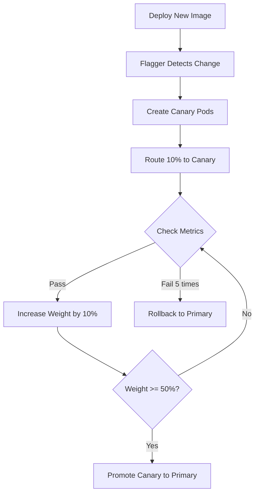

# How to Automate Progressive Traffic Shifting in Istio

Author: [nawazdhandala](https://github.com/nawazdhandala)

Tags: Istio, Progressive Delivery, Traffic Shifting, Automation, Flagger, Kubernetes

Description: Automate progressive traffic shifting in Istio using Flagger and custom scripts to safely roll out new service versions without manual intervention.

---

Manually adjusting traffic weights every few hours gets old fast. You deploy v2, set it to 10%, watch dashboards, update the VirtualService to 20%, watch more dashboards, and repeat until you hit 100%. It works, but it does not scale when you are deploying multiple services multiple times a day.

The solution is to automate the entire traffic shifting process. You define the rules upfront - what metrics to watch, how fast to shift, and when to rollback - and let tooling handle the rest.

## Approaches to Automation

There are two main ways to automate progressive traffic shifting with Istio:

1. **Use a dedicated tool like Flagger** that integrates with Istio natively
2. **Write custom automation** with scripts or a Kubernetes operator

Both work. Flagger is the more mature option and handles most common scenarios. Custom scripts give you more flexibility but require more maintenance.

## Approach 1: Automating with Flagger

Flagger is a progressive delivery tool that works with Istio out of the box. It watches your deployments, creates canary resources, and automatically adjusts VirtualService weights based on metrics.

### Install Flagger

```bash
helm repo add flagger https://flagger.app
helm repo update

helm install flagger flagger/flagger \
  --namespace istio-system \
  --set meshProvider=istio \
  --set metricsServer=http://prometheus.istio-system:9090
```

### Define a Canary Resource

Flagger introduces a `Canary` custom resource that describes your rollout strategy:

```yaml
apiVersion: flagger.app/v1beta1
kind: Canary
metadata:
  name: order-service
  namespace: default
spec:
  targetRef:
    apiVersion: apps/v1
    kind: Deployment
    name: order-service
  progressDeadlineSeconds: 600
  service:
    port: 80
    targetPort: 8080
  analysis:
    interval: 1m
    threshold: 5
    maxWeight: 50
    stepWeight: 10
    metrics:
      - name: request-success-rate
        thresholdRange:
          min: 99
        interval: 1m
      - name: request-duration
        thresholdRange:
          max: 500
        interval: 1m
```

Here is what each field does:

- `interval`: How often Flagger checks metrics (every 1 minute)
- `threshold`: Number of failed checks before rollback (5 failures)
- `maxWeight`: Maximum traffic percentage for the canary (50%)
- `stepWeight`: How much to increase per successful check (10%)
- `metrics`: What to measure - success rate must stay above 99%, latency below 500ms

### How Flagger Manages the Rollout

When you update the deployment image, Flagger detects the change and starts the canary process:



To trigger a rollout, just update the deployment as you normally would:

```bash
kubectl set image deployment/order-service \
  order-service=myregistry/order-service:2.0.0
```

Flagger takes it from there. You can watch the progress:

```bash
kubectl describe canary order-service
```

Or watch Flagger events:

```bash
kubectl get events --field-selector involvedObject.kind=Canary --sort-by='.lastTimestamp'
```

### Custom Metrics with Flagger

You can add application-specific metrics beyond the built-in request success rate and duration:

```yaml
apiVersion: flagger.app/v1beta1
kind: MetricTemplate
metadata:
  name: error-rate
  namespace: default
spec:
  provider:
    type: prometheus
    address: http://prometheus.istio-system:9090
  query: |
    100 - sum(
      rate(istio_requests_total{
        reporter="destination",
        destination_workload_namespace="{{ namespace }}",
        destination_workload="{{ target }}",
        response_code!~"5.*"
      }[{{ interval }}])
    ) / sum(
      rate(istio_requests_total{
        reporter="destination",
        destination_workload_namespace="{{ namespace }}",
        destination_workload="{{ target }}"
      }[{{ interval }}])
    ) * 100
```

Reference it in your Canary:

```yaml
metrics:
  - name: error-rate
    templateRef:
      name: error-rate
    thresholdRange:
      max: 1
    interval: 1m
```

## Approach 2: Custom Automation Script

If you do not want to add another tool to your cluster, a simple script can automate the shifting process. Here is a bash script that progressively shifts traffic:

```bash
#!/bin/bash
# progressive-shift.sh

SERVICE_NAME=$1
NAMESPACE=${2:-default}
STEP=${3:-10}
INTERVAL=${4:-300}  # seconds between steps
ERROR_THRESHOLD=${5:-5}  # max error percentage

if [ -z "$SERVICE_NAME" ]; then
  echo "Usage: progressive-shift.sh <service> [namespace] [step] [interval] [error-threshold]"
  exit 1
fi

current_v2_weight=0

check_error_rate() {
  # Query Prometheus for error rate
  error_rate=$(curl -s "http://localhost:9090/api/v1/query" \
    --data-urlencode "query=sum(rate(istio_requests_total{destination_service=\"${SERVICE_NAME}.${NAMESPACE}.svc.cluster.local\",destination_version=\"v2\",response_code=~\"5.*\"}[2m])) / sum(rate(istio_requests_total{destination_service=\"${SERVICE_NAME}.${NAMESPACE}.svc.cluster.local\",destination_version=\"v2\"}[2m])) * 100" \
    | jq -r '.data.result[0].value[1] // "0"')

  echo "Current v2 error rate: ${error_rate}%"

  if (( $(echo "$error_rate > $ERROR_THRESHOLD" | bc -l) )); then
    return 1
  fi
  return 0
}

apply_weights() {
  local v2_weight=$1
  local v1_weight=$((100 - v2_weight))

  kubectl apply -n "$NAMESPACE" -f - <<EOF
apiVersion: networking.istio.io/v1
kind: VirtualService
metadata:
  name: $SERVICE_NAME
spec:
  hosts:
    - $SERVICE_NAME
  http:
    - route:
        - destination:
            host: $SERVICE_NAME
            subset: v1
          weight: $v1_weight
        - destination:
            host: $SERVICE_NAME
            subset: v2
          weight: $v2_weight
EOF
}

echo "Starting progressive traffic shift for $SERVICE_NAME"

while [ "$current_v2_weight" -lt 100 ]; do
  current_v2_weight=$((current_v2_weight + STEP))
  if [ "$current_v2_weight" -gt 100 ]; then
    current_v2_weight=100
  fi

  echo "Shifting to ${current_v2_weight}% on v2..."
  apply_weights "$current_v2_weight"

  echo "Waiting ${INTERVAL} seconds before checking metrics..."
  sleep "$INTERVAL"

  if ! check_error_rate; then
    echo "ERROR: Error rate exceeded threshold. Rolling back to v1."
    apply_weights 0
    echo "Rollback complete."
    exit 1
  fi

  echo "Metrics look good. v2 at ${current_v2_weight}%."
done

echo "Traffic shift complete. 100% on v2."
```

Run it:

```bash
./progressive-shift.sh order-service default 10 300 5
```

This shifts traffic in 10% increments every 5 minutes, rolling back if the error rate exceeds 5%.

## Approach 3: Using Argo Rollouts with Istio

Argo Rollouts is another option that integrates with Istio for progressive delivery:

```yaml
apiVersion: argoproj.io/v1alpha1
kind: Rollout
metadata:
  name: order-service
spec:
  replicas: 5
  strategy:
    canary:
      canaryService: order-service-canary
      stableService: order-service-stable
      trafficRouting:
        istio:
          virtualServices:
            - name: order-service
              routes:
                - primary
      steps:
        - setWeight: 10
        - pause: {duration: 5m}
        - setWeight: 20
        - pause: {duration: 5m}
        - setWeight: 50
        - pause: {duration: 10m}
        - setWeight: 80
        - pause: {duration: 10m}
        - setWeight: 100
  selector:
    matchLabels:
      app: order-service
  template:
    metadata:
      labels:
        app: order-service
    spec:
      containers:
        - name: order-service
          image: myregistry/order-service:2.0.0
          ports:
            - containerPort: 8080
```

## Choosing the Right Approach

| Approach | Complexity | Flexibility | Maintenance |
|----------|-----------|-------------|-------------|
| Flagger | Medium | High | Low (maintained project) |
| Custom Script | Low | Medium | Medium (you own it) |
| Argo Rollouts | Medium | Very High | Low (maintained project) |

For most teams, Flagger or Argo Rollouts is the way to go. They handle edge cases that custom scripts miss - like what happens if the script process dies mid-rollout, or how to handle multiple concurrent rollouts.

## Monitoring Automated Rollouts

Regardless of which approach you use, set up alerting so you know when rollouts happen:

```yaml
apiVersion: monitoring.coreos.com/v1
kind: PrometheusRule
metadata:
  name: canary-alerts
spec:
  groups:
    - name: canary
      rules:
        - alert: CanaryRollbackTriggered
          expr: flagger_canary_status{status="failed"} == 1
          for: 1m
          labels:
            severity: warning
          annotations:
            summary: "Canary rollback triggered for {{ $labels.name }}"
```

Automated progressive delivery takes the human bottleneck out of deployments. Define your quality gates once, and let the tooling handle the tedious work of watching metrics and adjusting traffic. Your team can focus on building features instead of babysitting rollouts.
