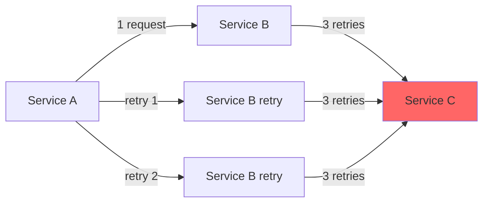

# How to Avoid Retry Storms in Istio

Author: [nawazdhandala](https://github.com/nawazdhandala)

Tags: Istio, Service Mesh, Retries, Reliability, Kubernetes, Performance

Description: Practical strategies to prevent retry storms in Istio service mesh that can amplify failures and bring down your microservices.

---

Retry storms are one of the sneakiest failure modes in microservices. A service starts responding slowly, callers retry, those retries add more load, the service slows down further, more retries pile on, and before you know it the entire system is down. Istio's built-in retry mechanism is powerful, but it can easily make things worse if you are not careful. Here is how to prevent that.

## What Exactly Is a Retry Storm?

Picture a service chain: Service A calls Service B, which calls Service C. Service C starts returning 503 errors because it is overloaded. Service B retries its calls to Service C three times. Service A retries its calls to Service B three times. Now each original request from Service A generates up to 9 requests to Service C (3 from B on first try, 3 on second try, 3 on third try). That is a 9x amplification factor from just two hops.

Add more hops and more retries, and you can easily hit 100x or even 1000x amplification. That is a retry storm.



## Strategy 1: Limit Retry Attempts

The most straightforward defense is keeping retry counts low. For most services, 2 retries (3 total attempts) is plenty. For services deep in the call chain, consider allowing no retries at all.

```yaml
apiVersion: networking.istio.io/v1beta1
kind: VirtualService
metadata:
  name: backend-service
  namespace: default
spec:
  hosts:
    - backend-service
  http:
    - route:
        - destination:
            host: backend-service
            port:
              number: 8080
      retries:
        attempts: 2
        perTryTimeout: 1s
        retryOn: "gateway-error,connect-failure"
```

A good rule of thumb: if your call chain is N services deep, the total retry budget across all hops should be reasonable. Having 3 retries at each of 5 hops gives you 3^5 = 243x amplification. Having 1 retry at each hop gives you 2^5 = 32x. Still a lot, but much more manageable.

## Strategy 2: Use Retry Budgets with Circuit Breaking

Circuit breaking is your best friend against retry storms. When a service starts failing, circuit breaking stops sending requests to it, which prevents retries from piling up.

```yaml
apiVersion: networking.istio.io/v1beta1
kind: DestinationRule
metadata:
  name: backend-service
  namespace: default
spec:
  host: backend-service
  trafficPolicy:
    connectionPool:
      tcp:
        maxConnections: 100
      http:
        h2UpgradePolicy: DEFAULT
        http1MaxPendingRequests: 50
        http2MaxRequests: 100
    outlierDetection:
      consecutive5xxErrors: 3
      interval: 10s
      baseEjectionTime: 30s
      maxEjectionPercent: 50
```

This DestinationRule says: if a backend instance returns 3 consecutive 5xx errors, eject it from the load balancing pool for 30 seconds. This stops retries from hitting an already-failing instance.

## Strategy 3: Set Aggressive Per-Try Timeouts

Long per-try timeouts are dangerous because they tie up resources while waiting for a response that probably is not coming. Keep per-try timeouts short so failed retries get cleared quickly.

```yaml
apiVersion: networking.istio.io/v1beta1
kind: VirtualService
metadata:
  name: api-gateway
  namespace: default
spec:
  hosts:
    - api-gateway
  http:
    - route:
        - destination:
            host: api-gateway
            port:
              number: 8080
      timeout: 5s
      retries:
        attempts: 2
        perTryTimeout: 1500ms
        retryOn: "gateway-error,connect-failure"
```

With a 1.5-second per-try timeout and 2 retries, the worst-case total time is about 4.5 seconds - well within the 5-second overall timeout. The key thing is that failed attempts do not linger for ages before the retry kicks in.

## Strategy 4: Only Retry at the Edge

One effective pattern is to only configure retries at the outermost service (the one closest to the client) and disable retries for internal service-to-service calls.

For internal services, set attempts to 0:

```yaml
apiVersion: networking.istio.io/v1beta1
kind: VirtualService
metadata:
  name: internal-processing-service
  namespace: default
spec:
  hosts:
    - internal-processing-service
  http:
    - route:
        - destination:
            host: internal-processing-service
            port:
              number: 8080
      retries:
        attempts: 0
```

For the edge service that faces external traffic, configure retries:

```yaml
apiVersion: networking.istio.io/v1beta1
kind: VirtualService
metadata:
  name: api-frontend
  namespace: default
spec:
  hosts:
    - api-frontend
  http:
    - route:
        - destination:
            host: api-frontend
            port:
              number: 8080
      retries:
        attempts: 3
        perTryTimeout: 2s
        retryOn: "gateway-error,connect-failure,refused-stream"
```

This eliminates the multiplicative amplification entirely. Retries only happen once at the edge, so you get at most 3x amplification regardless of how deep the call chain goes.

## Strategy 5: Be Selective with retryOn Conditions

Do not retry on all 5xx errors. A 500 Internal Server Error is usually caused by a bug - retrying won't fix it. Stick to conditions that indicate transient infrastructure problems:

```yaml
retries:
  attempts: 2
  perTryTimeout: 2s
  retryOn: "connect-failure,refused-stream,gateway-error"
```

This skips retrying on 500 and 501 errors, which are almost never transient. It focuses on 502, 503, 504 (covered by `gateway-error`), connection failures, and refused streams, all of which have a reasonable chance of succeeding on retry.

## Strategy 6: Monitor Retry Rates

You cannot fix what you cannot see. Monitor your retry metrics to catch retry storms before they become outages.

```bash
# Check retry rates across all services
kubectl exec -it deploy/istio-proxy -c istio-proxy -- \
  curl -s localhost:15000/stats | grep "upstream_rq_retry"

# Look for high retry rates
kubectl exec -it deploy/my-service -c istio-proxy -- \
  curl -s localhost:15000/stats | grep -E "retry_success|retry_limit"
```

If you are using Prometheus and Grafana (which you should be with Istio), create alerts for retry rates:

```yaml
# Prometheus alert rule for high retry rate
groups:
  - name: istio-retry-alerts
    rules:
      - alert: HighRetryRate
        expr: |
          sum(rate(envoy_cluster_upstream_rq_retry[5m])) by (cluster_name)
          / sum(rate(envoy_cluster_upstream_rq_total[5m])) by (cluster_name)
          > 0.1
        for: 5m
        labels:
          severity: warning
        annotations:
          summary: "High retry rate detected for {{ $labels.cluster_name }}"
```

## Strategy 7: Use Backoff Between Retries

Istio uses a default 25ms base interval with exponential backoff for retries. You cannot directly configure the backoff interval in the VirtualService (Envoy handles it internally), but knowing it exists is important. The retries won't all fire at once - there is a jittered exponential backoff between them.

That said, the default backoff is quite short. For services that need longer recovery windows, consider reducing retry attempts and using circuit breaking to handle the backoff at a higher level.

## Putting It All Together

Here is a production-ready configuration that combines several of these strategies:

```yaml
apiVersion: networking.istio.io/v1beta1
kind: VirtualService
metadata:
  name: order-service
  namespace: default
spec:
  hosts:
    - order-service
  http:
    - route:
        - destination:
            host: order-service
            port:
              number: 8080
      timeout: 5s
      retries:
        attempts: 2
        perTryTimeout: 1500ms
        retryOn: "connect-failure,refused-stream,gateway-error"
---
apiVersion: networking.istio.io/v1beta1
kind: DestinationRule
metadata:
  name: order-service
  namespace: default
spec:
  host: order-service
  trafficPolicy:
    connectionPool:
      http:
        http1MaxPendingRequests: 100
        http2MaxRequests: 200
    outlierDetection:
      consecutive5xxErrors: 3
      interval: 15s
      baseEjectionTime: 30s
      maxEjectionPercent: 30
```

Low retry count, short per-try timeouts, selective retry conditions, and circuit breaking working together. This setup will handle transient failures gracefully without turning a small problem into a system-wide meltdown.

Retry storms are preventable, but it takes deliberate configuration. Do not just accept the defaults - think about your service topology, your failure modes, and how retries interact across the full call chain.
