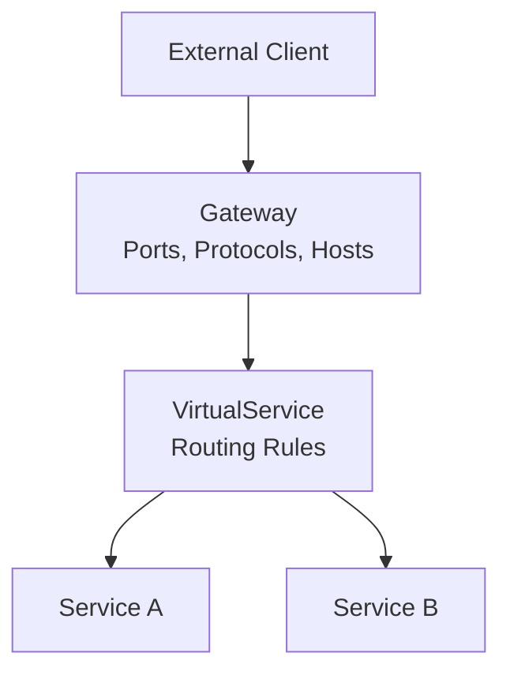

# How to Bind a VirtualService to an Istio Gateway

Author: [nawazdhandala](https://github.com/nawazdhandala)

Tags: Istio, VirtualService, Gateway, Routing, Kubernetes

Description: Learn how to correctly bind VirtualService resources to Istio Gateway resources for proper traffic routing from external clients.

---

The relationship between a Gateway and a VirtualService is one of the first things you need to understand in Istio networking. The Gateway defines what traffic to accept (ports, protocols, hostnames). The VirtualService defines where to send that traffic. Without properly binding them together, traffic hits the gateway and goes nowhere.

## The Gateway-VirtualService Relationship

Think of the Gateway as a door and the VirtualService as the hallway behind it. The door controls who can enter (protocol, port, hostname), and the hallway directs people to the right room (routing rules). You need both for traffic to flow.



## Basic Binding

The binding happens through two fields:

1. The `gateways` field in the VirtualService references the Gateway by name
2. The `hosts` field in the VirtualService must overlap with the hosts in the Gateway

Here is the simplest example:

```yaml
apiVersion: networking.istio.io/v1
kind: Gateway
metadata:
  name: my-gateway
  namespace: default
spec:
  selector:
    istio: ingressgateway
  servers:
  - port:
      number: 80
      name: http
      protocol: HTTP
    hosts:
    - "app.example.com"
---
apiVersion: networking.istio.io/v1
kind: VirtualService
metadata:
  name: my-app-vs
  namespace: default
spec:
  hosts:
  - "app.example.com"
  gateways:
  - my-gateway
  http:
  - route:
    - destination:
        host: my-app
        port:
          number: 8080
```

The VirtualService references `my-gateway` in its `gateways` list, and both resources share the host `app.example.com`.

## Cross-Namespace Gateway References

If your Gateway is in a different namespace than your VirtualService, you need to use the full namespace/name format:

```yaml
apiVersion: networking.istio.io/v1
kind: VirtualService
metadata:
  name: my-app-vs
  namespace: my-app-namespace
spec:
  hosts:
  - "app.example.com"
  gateways:
  - istio-system/shared-gateway
  http:
  - route:
    - destination:
        host: my-app
        port:
          number: 8080
```

The gateway reference `istio-system/shared-gateway` tells Istio to look for a Gateway named `shared-gateway` in the `istio-system` namespace. This is a common pattern where infrastructure teams manage gateways in a central namespace and application teams create VirtualServices in their own namespaces.

## Binding to Multiple Gateways

A single VirtualService can bind to multiple gateways:

```yaml
apiVersion: networking.istio.io/v1
kind: VirtualService
metadata:
  name: my-app-vs
spec:
  hosts:
  - "app.example.com"
  gateways:
  - http-gateway
  - https-gateway
  http:
  - route:
    - destination:
        host: my-app
        port:
          number: 8080
```

This makes the same routing rules apply whether traffic enters through the HTTP gateway or the HTTPS gateway.

## Mesh Gateway Binding

There is a special gateway name called `mesh` that represents the Istio sidecar proxies within the mesh. If you want a VirtualService to apply to both external gateway traffic and internal mesh traffic:

```yaml
apiVersion: networking.istio.io/v1
kind: VirtualService
metadata:
  name: my-app-vs
spec:
  hosts:
  - "my-app.default.svc.cluster.local"
  gateways:
  - my-gateway
  - mesh
  http:
  - route:
    - destination:
        host: my-app
        port:
          number: 8080
```

If you omit the `gateways` field entirely, the VirtualService defaults to applying only to the `mesh` gateway (internal traffic). This is a common gotcha - if your VirtualService is not working for external traffic, check that you have explicitly listed your gateway.

## Host Matching Rules

The hosts in a VirtualService must be a subset of or match the hosts in the bound Gateway. Here are the valid combinations:

| Gateway Host | VirtualService Host | Valid? |
|---|---|---|
| `app.example.com` | `app.example.com` | Yes |
| `*.example.com` | `app.example.com` | Yes |
| `*` | `app.example.com` | Yes |
| `app.example.com` | `*.example.com` | No |
| `app.example.com` | `other.example.com` | No |

The VirtualService host must be equal to or more specific than the Gateway host.

## Multiple VirtualServices for One Gateway

You can have multiple VirtualServices bound to the same Gateway. Istio merges the routing rules:

```yaml
apiVersion: networking.istio.io/v1
kind: VirtualService
metadata:
  name: api-routes
spec:
  hosts:
  - "app.example.com"
  gateways:
  - shared-gateway
  http:
  - match:
    - uri:
        prefix: /api
    route:
    - destination:
        host: api-service
        port:
          number: 8080
---
apiVersion: networking.istio.io/v1
kind: VirtualService
metadata:
  name: web-routes
spec:
  hosts:
  - "app.example.com"
  gateways:
  - shared-gateway
  http:
  - match:
    - uri:
        prefix: /
    route:
    - destination:
        host: web-service
        port:
          number: 3000
```

When multiple VirtualServices bind to the same gateway and host, Istio merges the rules. But be careful with rule ordering - more specific matches should come first. In practice, it is often clearer to put all routing rules for a single host in one VirtualService.

## Debugging Binding Issues

If your VirtualService is not working with your Gateway, check these things:

```bash
# Verify the Gateway exists
kubectl get gateway my-gateway

# Verify the VirtualService references the right gateway
kubectl get virtualservice my-app-vs -o yaml | grep -A 2 gateways

# Check for configuration errors
istioctl analyze

# Look at actual routes in the proxy
istioctl proxy-config routes deploy/istio-ingressgateway -n istio-system
```

The `istioctl analyze` command is especially useful. It catches mismatches between Gateway and VirtualService hosts, missing gateways, and other common issues.

## Common Binding Mistakes

**Forgetting to list the gateway.** If you do not include a `gateways` field, the VirtualService only applies to mesh-internal traffic. Always specify the gateway name for external traffic.

**Namespace mismatch.** When the Gateway and VirtualService are in different namespaces, use `namespace/name` format in the `gateways` field.

**Host mismatch.** The VirtualService host must match or be more specific than the Gateway host. A VirtualService with host `other.example.com` will not work with a Gateway that only accepts `app.example.com`.

**Using short service names.** In the `destination.host` field, use the full service name if the VirtualService and the destination service are in different namespaces:

```yaml
destination:
  host: my-app.other-namespace.svc.cluster.local
  port:
    number: 8080
```

## Verifying the Binding Works

After applying both resources, test from outside the cluster:

```bash
export GATEWAY_IP=$(kubectl -n istio-system get service istio-ingressgateway \
  -o jsonpath='{.status.loadBalancer.ingress[0].ip}')

curl -v -H "Host: app.example.com" "http://$GATEWAY_IP/"
```

If you get a 404 with an Istio-specific error page, the gateway is receiving traffic but there is no VirtualService matching. If you get a connection refused, the gateway itself is not configured correctly.

Binding VirtualServices to Gateways is a fundamental Istio skill. Once you understand the relationship and the common pitfalls, it becomes second nature. The two-resource design gives you clean separation between infrastructure concerns (Gateway) and application routing (VirtualService), which scales well as your mesh grows.
