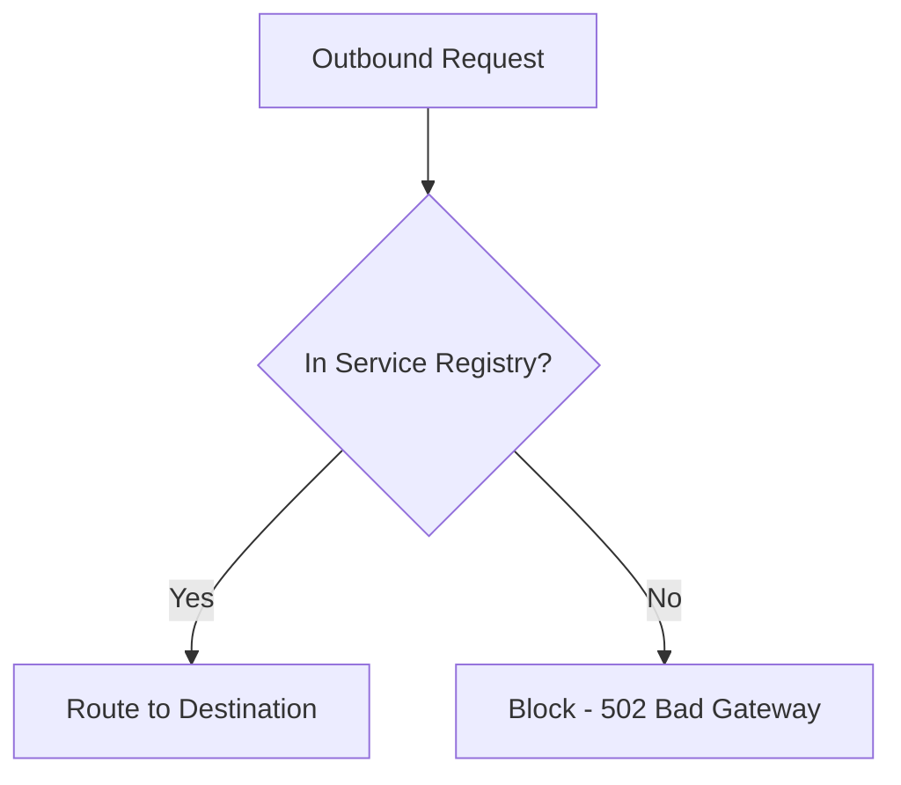

# How to Block All Egress Traffic by Default in Istio

Author: [nawazdhandala](https://github.com/nawazdhandala)

Tags: Istio, Egress, Security, Zero Trust, REGISTRY_ONLY

Description: How to configure Istio to block all outbound traffic by default and only allow explicitly permitted external service connections from your mesh.

---

Blocking all egress traffic by default is a fundamental step toward a zero-trust network. If a pod gets compromised, it should not be able to phone home to a command-and-control server or exfiltrate data to an arbitrary endpoint. Istio makes this possible with its `REGISTRY_ONLY` outbound traffic policy.

This guide walks through enabling the default-deny egress policy, handling the fallout, and building a maintainable allow-list system.

## The Default Is Wide Open

Out of the box, Istio sets `outboundTrafficPolicy.mode` to `ALLOW_ANY`. This means every pod in the mesh can reach any IP address on the internet. If you run a quick test from any meshed pod:

```bash
kubectl exec deploy/sleep -- curl -s -o /dev/null -w "%{http_code}" https://httpbin.org/get
```

You will get a `200`. That is the problem you are solving.

## Switching to REGISTRY_ONLY

Change the mesh configuration to `REGISTRY_ONLY`:

```yaml
apiVersion: install.istio.io/v1alpha1
kind: IstioOperator
spec:
  meshConfig:
    outboundTrafficPolicy:
      mode: REGISTRY_ONLY
```

Apply the change:

```bash
istioctl install -f istio-config.yaml
```

Or if you prefer not to reinstall:

```bash
kubectl get configmap istio -n istio-system -o json | \
  jq '.data.mesh = (.data.mesh | sub("mode: ALLOW_ANY"; "mode: REGISTRY_ONLY"))' | \
  kubectl apply -f -
```

After a few seconds, the sidecars pick up the new configuration. Now test again:

```bash
kubectl exec deploy/sleep -- curl -s -o /dev/null -w "%{http_code}" https://httpbin.org/get
```

You should get a `502` (for HTTP) or a connection reset (for HTTPS). The request is blocked because `httpbin.org` is not in the service registry.

## What REGISTRY_ONLY Actually Does

In REGISTRY_ONLY mode, the sidecar proxy only creates routing entries for services that are in Istio's service registry. This registry includes:

- All Kubernetes services in the cluster
- All Istio ServiceEntry resources

If a pod tries to connect to an address that does not match any registry entry, the sidecar has no route for it. The connection fails with a 502 or a TCP reset.



## Building Your Allow List

With everything blocked, you need to explicitly allow each external service your applications depend on. Create ServiceEntry resources:

```yaml
apiVersion: networking.istio.io/v1
kind: ServiceEntry
metadata:
  name: allowed-external-apis
  namespace: default
spec:
  hosts:
  - "api.stripe.com"
  - "api.sendgrid.com"
  - "hooks.slack.com"
  ports:
  - number: 443
    name: https
    protocol: TLS
  resolution: DNS
  location: MESH_EXTERNAL
```

After applying this, pods can reach these three hosts but nothing else.

## Discovering External Dependencies Before Switching

Switching to REGISTRY_ONLY without knowing all your external dependencies will break things. Here is how to discover them first while still in ALLOW_ANY mode.

### Enable Access Logging

```yaml
apiVersion: telemetry.istio.io/v1
kind: Telemetry
metadata:
  name: mesh-logging
  namespace: istio-system
spec:
  accessLogging:
  - providers:
    - name: envoy
```

### Collect External Connection Data

Check sidecar logs across your pods for outbound connections:

```bash
for pod in $(kubectl get pods -o name); do
  kubectl logs $pod -c istio-proxy 2>/dev/null | grep "outbound" | grep -v "svc.cluster.local"
done
```

### Use Prometheus Metrics

If Prometheus is configured, query for external traffic:

```promql
sum by (destination_service_name) (
  rate(istio_requests_total{
    destination_service_namespace!~"default|kube-system|istio-system",
    reporter="source"
  }[24h])
)
```

Run this for a few days to capture all external dependencies, including those that only trigger on specific schedules (like nightly batch jobs).

## Handling DNS

Blocking egress traffic does not block DNS queries. Pods can still resolve any hostname through Kubernetes DNS. This is by design - the sidecar blocks the actual TCP/TLS connection, not the DNS lookup.

However, some applications check connectivity by resolving DNS first. They might appear to work (DNS succeeds) but then fail when making the actual connection.

## Common Services You Will Need to Allow

Most clusters need these external services even for basic operations:

```yaml
apiVersion: networking.istio.io/v1
kind: ServiceEntry
metadata:
  name: container-registries
  namespace: default
spec:
  hosts:
  - "*.gcr.io"
  - "*.docker.io"
  - "*.azurecr.io"
  - "ghcr.io"
  ports:
  - number: 443
    name: https
    protocol: TLS
  resolution: NONE
  location: MESH_EXTERNAL
---
apiVersion: networking.istio.io/v1
kind: ServiceEntry
metadata:
  name: cloud-metadata
spec:
  hosts:
  - "metadata.google.internal"
  addresses:
  - "169.254.169.254/32"
  ports:
  - number: 80
    name: http
    protocol: HTTP
  resolution: STATIC
  location: MESH_EXTERNAL
  endpoints:
  - address: 169.254.169.254
```

The cloud metadata service (169.254.169.254) is used by many cloud SDKs for authentication. If you block it, service accounts and IAM roles won't work.

## Per-Namespace Exceptions

Some namespaces might need different egress policies. Use the Sidecar resource to override the mesh-wide setting:

```yaml
apiVersion: networking.istio.io/v1
kind: Sidecar
metadata:
  name: allow-all-egress
  namespace: development
spec:
  outboundTrafficPolicy:
    mode: ALLOW_ANY
```

This gives the `development` namespace unrestricted outbound access while keeping REGISTRY_ONLY for everything else.

## Monitoring Blocked Traffic

After switching to REGISTRY_ONLY, monitor for blocked connections:

```bash
# Look for 502 responses in sidecar logs (indicates blocked outbound)
kubectl logs deploy/my-app -c istio-proxy | grep "502"

# Check Prometheus for blocked traffic
```

```promql
sum(rate(istio_requests_total{response_code="502", reporter="source"}[5m])) by (source_workload, destination_service_name)
```

Set up an alert for unexpected 502s:

```yaml
apiVersion: monitoring.coreos.com/v1
kind: PrometheusRule
metadata:
  name: egress-blocked-alert
  namespace: istio-system
spec:
  groups:
  - name: egress
    rules:
    - alert: EgressTrafficBlocked
      expr: |
        sum(rate(istio_requests_total{response_code="502", reporter="source"}[5m])) by (source_workload) > 0
      for: 5m
      labels:
        severity: warning
      annotations:
        summary: "Egress traffic is being blocked for {{ $labels.source_workload }}"
```

## Enforcing with NetworkPolicy

REGISTRY_ONLY blocks traffic at the Envoy proxy level, but it can be bypassed if a pod runs without a sidecar. For defense in depth, add Kubernetes NetworkPolicies:

```yaml
apiVersion: networking.k8s.io/v1
kind: NetworkPolicy
metadata:
  name: default-deny-egress
  namespace: default
spec:
  podSelector: {}
  policyTypes:
  - Egress
  egress:
  - to:
    - podSelector: {}
  - to:
    - namespaceSelector:
        matchLabels:
          kubernetes.io/metadata.name: kube-system
    ports:
    - port: 53
      protocol: UDP
    - port: 53
      protocol: TCP
  - to:
    - namespaceSelector:
        matchLabels:
          kubernetes.io/metadata.name: istio-system
```

This denies all egress except to pods in the same namespace, DNS, and the istio-system namespace. External traffic must go through the egress gateway (which lives in istio-system).

## Rollback Plan

If things go wrong after switching to REGISTRY_ONLY, you can revert quickly:

```bash
kubectl get configmap istio -n istio-system -o json | \
  jq '.data.mesh = (.data.mesh | sub("mode: REGISTRY_ONLY"; "mode: ALLOW_ANY"))' | \
  kubectl apply -f -
```

The change propagates to sidecars within seconds. No pod restarts needed.

## Gradual Rollout Strategy

1. Enable access logging in ALLOW_ANY mode
2. Collect external dependency data for 1-2 weeks
3. Create ServiceEntry resources for all discovered dependencies
4. Switch one namespace to REGISTRY_ONLY using a Sidecar resource
5. Monitor for breakages and add missing ServiceEntries
6. Expand to more namespaces
7. Switch the mesh-wide setting to REGISTRY_ONLY
8. Keep ALLOW_ANY overrides for specific namespaces if needed

## Summary

Blocking all egress traffic by default in Istio means switching to REGISTRY_ONLY mode and explicitly allowing external services through ServiceEntry resources. Before switching, discover all external dependencies using access logs and Prometheus metrics. Use per-namespace Sidecar overrides for exceptions, add NetworkPolicies for defense in depth, and monitor for blocked traffic so you can quickly add missing ServiceEntries. The gradual rollout approach minimizes disruption while moving toward a zero-trust egress posture.
