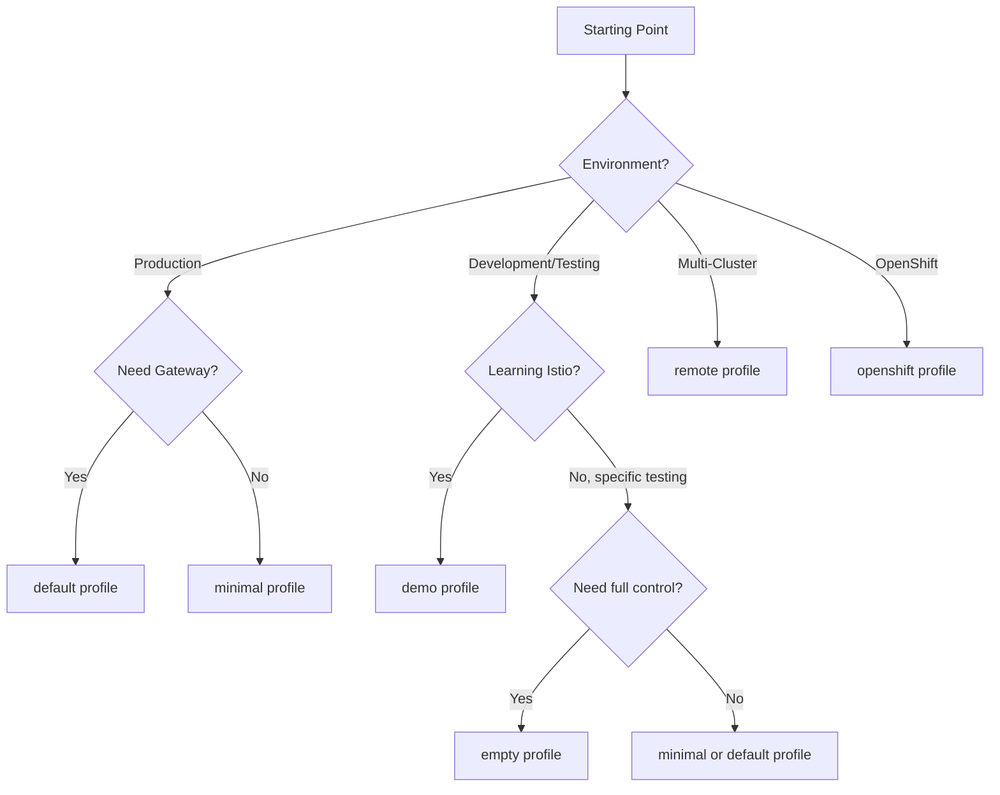

# How to Choose the Right Istio Installation Configuration Profile

Author: [nawazdhandala](https://github.com/nawazdhandala)

Tags: Istio, Kubernetes, Configuration, Service Mesh, Installation Profiles

Description: A comparison of all Istio installation profiles with guidance on choosing the right one for development, testing, and production.

---

Istio ships with several predefined installation profiles, and picking the right one can save you a lot of configuration work. Each profile is tuned for a specific use case - from lightweight development setups to full production deployments. Choosing the wrong profile and then trying to retrofit it later creates unnecessary headaches.

## What Are Istio Profiles

An Istio profile is a predefined set of configuration values that determines which components get installed and how they're configured. Think of profiles as presets - they give you a reasonable starting point that you can then customize.

List the available profiles:

```bash
istioctl profile list
```

As of Istio 1.24, you'll see:

```text
default
demo
empty
minimal
openshift
remote
```

## Profile Comparison

Here's a side-by-side comparison of what each profile installs:

| Component | default | demo | minimal | empty | remote | openshift |
|-----------|---------|------|---------|-------|--------|-----------|
| istiod | Yes | Yes | Yes | No | No | Yes |
| Ingress Gateway | Yes | Yes | No | No | No | Yes |
| Egress Gateway | No | Yes | No | No | No | No |
| CNI Plugin | No | No | No | No | No | Yes |

You can see the exact differences between any two profiles:

```bash
istioctl profile diff default demo
```

And dump a full profile to see every setting:

```bash
istioctl profile dump demo
```

## The Default Profile

The default profile is designed for production use. It installs:

- istiod (control plane)
- Ingress gateway
- Production-ready resource limits
- Conservative settings

```bash
istioctl install --set profile=default -y
```

When to use it:
- Production deployments
- Staging environments that mirror production
- When you want a solid baseline to customize from

The default profile doesn't install an egress gateway because most clusters don't need one. If you need to control outbound traffic, you can add one later.

Resource allocations in the default profile are reasonable for production:

```bash
istioctl profile dump default | grep -A 5 resources
```

## The Demo Profile

The demo profile installs everything and configures it for maximum visibility:

- istiod with higher trace sampling
- Ingress gateway
- Egress gateway
- More verbose logging
- Higher trace sampling rate

```bash
istioctl install --set profile=demo -y
```

When to use it:
- Learning Istio for the first time
- Demos and presentations
- Testing features that require the egress gateway
- When you want to see all of Istio's capabilities

The demo profile uses lower resource limits to fit on smaller clusters:

```yaml
# Demo profile sets lower resource requests
resources:
  requests:
    cpu: 10m
    memory: 40Mi
```

Do NOT use the demo profile in production. The lower resource limits will cause performance issues under real traffic, and the verbose logging generates a lot of data.

## The Minimal Profile

The minimal profile installs only the control plane:

- istiod
- No gateways at all

```bash
istioctl install --set profile=minimal -y
```

When to use it:
- When you only need mTLS and traffic policies between services
- When you'll add gateways separately (maybe through Helm or a separate team)
- When you want the smallest possible Istio footprint
- Multi-cluster setups where gateways are managed differently

You can always add an ingress gateway later:

```yaml
apiVersion: install.istio.io/v1alpha1
kind: IstioOperator
spec:
  profile: minimal
  components:
    ingressGateways:
      - name: istio-ingressgateway
        enabled: true
```

## The Empty Profile

The empty profile installs nothing. It's a blank slate:

```bash
istioctl install --set profile=empty -y
```

When to use it:
- When you want to build a completely custom installation from scratch
- When you're defining every single component explicitly
- Advanced users who know exactly what they need

With the empty profile, you explicitly enable everything:

```yaml
apiVersion: install.istio.io/v1alpha1
kind: IstioOperator
spec:
  profile: empty
  components:
    base:
      enabled: true
    pilot:
      enabled: true
    ingressGateways:
      - name: istio-ingressgateway
        enabled: true
    egressGateways:
      - name: istio-egressgateway
        enabled: true
    cni:
      enabled: true
```

## The Remote Profile

The remote profile is for multi-cluster Istio setups. It configures a cluster to be a remote cluster managed by a primary cluster's control plane:

```bash
istioctl install --set profile=remote -y
```

When to use it:
- Multi-cluster mesh with a shared control plane
- When one cluster acts as the primary and others are remotes

The remote profile doesn't install istiod. Instead, it configures the cluster to connect to an istiod running elsewhere.

## The OpenShift Profile

The openshift profile is configured for Red Hat OpenShift:

- Enables the CNI plugin (avoids the need for privileged init containers)
- Sets platform-specific values
- Configures proper security context settings

```bash
istioctl install --set profile=openshift -y
```

When to use it:
- Any OpenShift deployment

## Decision Flowchart



## Customizing a Profile

Every profile is a starting point. You customize it by overlaying additional configuration. There are two ways to do this:

### Using --set Flags

Quick overrides on the command line:

```bash
istioctl install --set profile=default \
  --set meshConfig.accessLogFile=/dev/stdout \
  --set components.egressGateways[0].name=istio-egressgateway \
  --set components.egressGateways[0].enabled=true \
  -y
```

### Using a Configuration File

For complex customizations, use a YAML file:

```yaml
apiVersion: install.istio.io/v1alpha1
kind: IstioOperator
spec:
  profile: default
  meshConfig:
    accessLogFile: /dev/stdout
    outboundTrafficPolicy:
      mode: REGISTRY_ONLY
  components:
    pilot:
      k8s:
        resources:
          requests:
            cpu: 500m
            memory: 512Mi
          limits:
            cpu: 2000m
            memory: 2Gi
        hpaSpec:
          minReplicas: 2
          maxReplicas: 5
    ingressGateways:
      - name: istio-ingressgateway
        enabled: true
        k8s:
          hpaSpec:
            minReplicas: 2
            maxReplicas: 10
```

```bash
istioctl install -f my-config.yaml -y
```

## Common Customizations by Profile

### Starting from Default (Production)

```yaml
spec:
  profile: default
  meshConfig:
    accessLogFile: /dev/stdout
    enableTracing: true
    defaultConfig:
      holdApplicationUntilProxyStarts: true
  components:
    pilot:
      k8s:
        hpaSpec:
          minReplicas: 2
```

### Starting from Demo (Development)

```yaml
spec:
  profile: demo
  values:
    global:
      proxy:
        resources:
          requests:
            cpu: 10m
            memory: 40Mi
```

### Starting from Minimal (Sidecar-Only)

```yaml
spec:
  profile: minimal
  meshConfig:
    defaultConfig:
      holdApplicationUntilProxyStarts: true
```

## Switching Profiles

You can switch profiles on a running installation by running istioctl install with the new profile. Istio handles the transition - adding or removing components as needed:

```bash
# Switch from demo to default
istioctl install --set profile=default -y
```

This removes the egress gateway (which demo had but default doesn't) and adjusts resource limits. Existing VirtualServices and DestinationRules are not affected.

## Verifying Your Choice

After installation, verify that the installed components match what you expected:

```bash
istioctl verify-install
```

This compares the running installation against the profile and reports any discrepancies.

Also check resource usage to make sure the profile fits your cluster:

```bash
kubectl top pods -n istio-system
```

Choosing the right profile is the first decision you make when setting up Istio, and it affects everything that comes after. Start with the profile that most closely matches your use case, then customize from there. You can always change profiles later, but it's cleaner to start with the right one.
