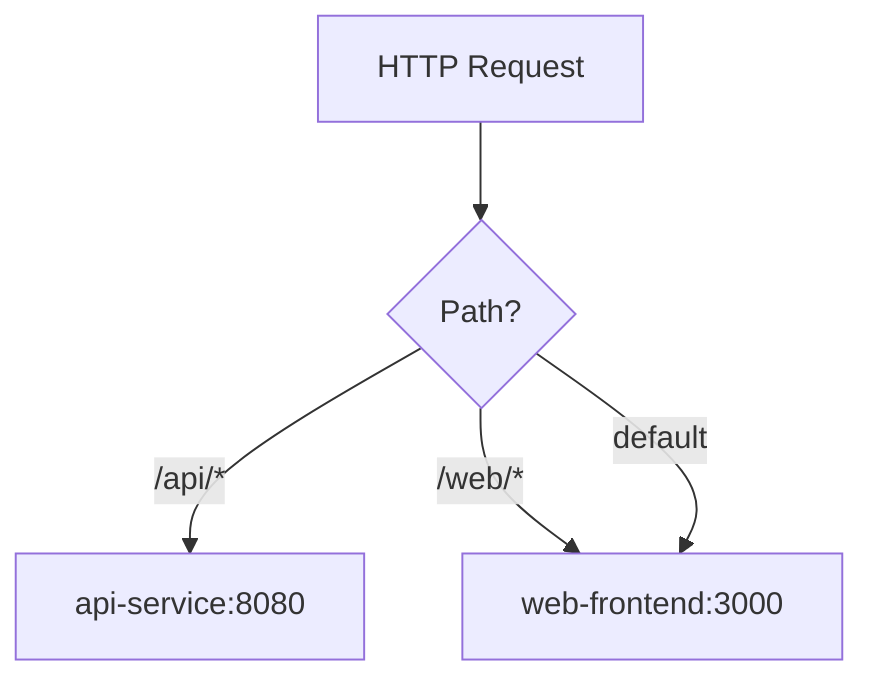

# How to Configure an Istio Gateway for HTTP Traffic

Author: [nawazdhandala](https://github.com/nawazdhandala)

Tags: Istio, HTTP, Gateway, Kubernetes, Service Mesh

Description: Learn how to configure an Istio Gateway resource to handle HTTP traffic routing into your Kubernetes service mesh.

---

HTTP traffic is the most common type of traffic you will handle with an Istio Gateway. While production workloads should use HTTPS, there are plenty of situations where HTTP makes sense - internal services, development environments, or services behind a corporate proxy that handles TLS upstream.

This guide covers the specifics of configuring an Istio Gateway for HTTP traffic, including path-based routing, header manipulation, redirects, and more.

## Basic HTTP Gateway Configuration

The simplest HTTP gateway configuration looks like this:

```yaml
apiVersion: networking.istio.io/v1
kind: Gateway
metadata:
  name: my-http-gateway
  namespace: default
spec:
  selector:
    istio: ingressgateway
  servers:
  - port:
      number: 80
      name: http
      protocol: HTTP
    hosts:
    - "app.example.com"
```

This tells the Istio ingress gateway to accept HTTP traffic on port 80 for the host `app.example.com`. The `protocol: HTTP` setting is important because it tells Envoy to treat this as Layer 7 HTTP traffic, which enables HTTP-specific features like path-based routing, header matching, and retries.

## Allowing Any Host

During development, you might not want to restrict traffic to a specific hostname. You can use a wildcard:

```yaml
apiVersion: networking.istio.io/v1
kind: Gateway
metadata:
  name: dev-gateway
spec:
  selector:
    istio: ingressgateway
  servers:
  - port:
      number: 80
      name: http
      protocol: HTTP
    hosts:
    - "*"
```

Using `*` means the gateway accepts traffic regardless of the Host header. This is fine for development but avoid it in production since it opens the gateway to traffic for any host.

## Routing HTTP Traffic with VirtualService

The Gateway defines what traffic to accept. The VirtualService defines where to send it. Here is a VirtualService with path-based routing:

```yaml
apiVersion: networking.istio.io/v1
kind: VirtualService
metadata:
  name: app-routes
spec:
  hosts:
  - "app.example.com"
  gateways:
  - my-http-gateway
  http:
  - match:
    - uri:
        prefix: /api
    route:
    - destination:
        host: api-service
        port:
          number: 8080
  - match:
    - uri:
        prefix: /web
    route:
    - destination:
        host: web-frontend
        port:
          number: 3000
  - route:
    - destination:
        host: web-frontend
        port:
          number: 3000
```

This configuration does three things:

1. Requests to `/api/*` go to the `api-service` on port 8080
2. Requests to `/web/*` go to `web-frontend` on port 3000
3. Everything else falls through to `web-frontend` as a default



## HTTP to HTTPS Redirect

A very common pattern is accepting HTTP traffic but immediately redirecting it to HTTPS. You can do this directly in the Gateway resource:

```yaml
apiVersion: networking.istio.io/v1
kind: Gateway
metadata:
  name: redirect-gateway
spec:
  selector:
    istio: ingressgateway
  servers:
  - port:
      number: 80
      name: http
      protocol: HTTP
    hosts:
    - "app.example.com"
    tls:
      httpsRedirect: true
  - port:
      number: 443
      name: https
      protocol: HTTPS
    hosts:
    - "app.example.com"
    tls:
      mode: SIMPLE
      credentialName: app-tls-cert
```

The `httpsRedirect: true` setting on the HTTP server entry makes the gateway return a 301 redirect to the HTTPS version of the URL. This is handled at the gateway level, so it is very efficient - no traffic even reaches your services.

## Header-Based Routing

You can route HTTP traffic based on request headers. This is useful for things like canary deployments or A/B testing:

```yaml
apiVersion: networking.istio.io/v1
kind: VirtualService
metadata:
  name: header-routing
spec:
  hosts:
  - "app.example.com"
  gateways:
  - my-http-gateway
  http:
  - match:
    - headers:
        x-version:
          exact: "v2"
    route:
    - destination:
        host: app-v2
        port:
          number: 8080
  - route:
    - destination:
        host: app-v1
        port:
          number: 8080
```

Requests with the header `x-version: v2` go to the v2 service, while everything else goes to v1.

## Adding Request Headers

You can add or modify request headers before they reach your services:

```yaml
apiVersion: networking.istio.io/v1
kind: VirtualService
metadata:
  name: app-with-headers
spec:
  hosts:
  - "app.example.com"
  gateways:
  - my-http-gateway
  http:
  - route:
    - destination:
        host: app-service
        port:
          number: 8080
    headers:
      request:
        add:
          x-forwarded-prefix: /api
        set:
          x-custom-header: "gateway-processed"
      response:
        remove:
        - x-powered-by
        - server
```

This adds `x-forwarded-prefix` to requests, sets a custom header, and removes potentially sensitive headers from responses.

## URI Rewriting

Sometimes you need to rewrite the URI path before forwarding to your service. For example, if your gateway accepts traffic at `/api/v1/users` but your service expects just `/users`:

```yaml
apiVersion: networking.istio.io/v1
kind: VirtualService
metadata:
  name: rewrite-example
spec:
  hosts:
  - "app.example.com"
  gateways:
  - my-http-gateway
  http:
  - match:
    - uri:
        prefix: /api/v1
    rewrite:
      uri: /
    route:
    - destination:
        host: api-service
        port:
          number: 8080
```

A request to `/api/v1/users` will reach `api-service` as `/users`.

## Setting Timeouts and Retries

For HTTP traffic, you can configure timeouts and retries at the VirtualService level:

```yaml
apiVersion: networking.istio.io/v1
kind: VirtualService
metadata:
  name: app-with-resilience
spec:
  hosts:
  - "app.example.com"
  gateways:
  - my-http-gateway
  http:
  - route:
    - destination:
        host: app-service
        port:
          number: 8080
    timeout: 30s
    retries:
      attempts: 3
      perTryTimeout: 10s
      retryOn: 5xx,reset,connect-failure
```

This gives each request a 30-second overall timeout with up to 3 retry attempts. Each retry attempt has a 10-second timeout, and retries happen on 5xx errors, connection resets, and connection failures.

## Verifying HTTP Configuration

After applying your configuration, verify it is working:

```bash
# Check the gateway is applied
kubectl get gateway

# Check the VirtualService is applied
kubectl get virtualservice

# Test with curl
export GATEWAY_URL=$(kubectl -n istio-system get service istio-ingressgateway -o jsonpath='{.status.loadBalancer.ingress[0].ip}')
curl -v -H "Host: app.example.com" "http://$GATEWAY_URL/"
```

If something is not working, check the proxy config:

```bash
istioctl proxy-config routes deploy/istio-ingressgateway -n istio-system
```

This shows you the actual routes configured in the Envoy proxy, which helps you confirm that your Gateway and VirtualService were processed correctly.

## Quick Troubleshooting

If your HTTP gateway is not routing traffic, check these things in order:

1. Is the istio-ingressgateway pod running? `kubectl get pods -n istio-system`
2. Does the Gateway selector match the ingress gateway labels?
3. Does the VirtualService reference the correct Gateway name?
4. Do the hosts match between Gateway and VirtualService?
5. Is your backend service healthy? `kubectl get endpoints <service-name>`

HTTP traffic handling in Istio is straightforward once you understand the Gateway-VirtualService relationship. The Gateway handles the "what to accept" part, and the VirtualService handles the "where to send it" part. This clean separation makes it easy to manage complex routing scenarios without cramming everything into a single resource.
