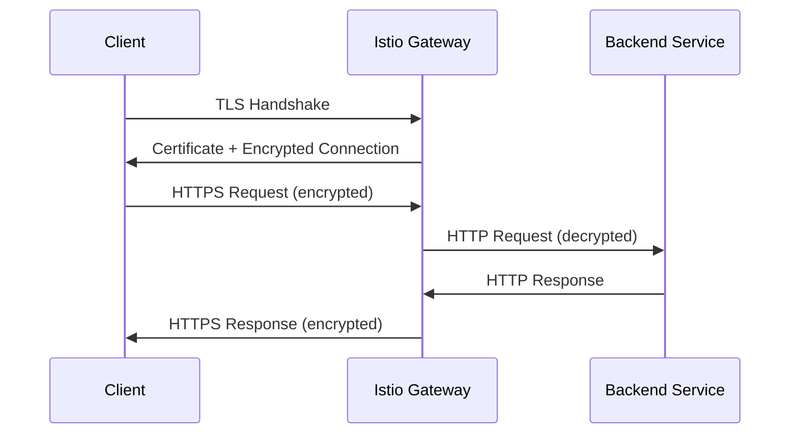

# How to Configure an Istio Gateway for HTTPS Traffic

Author: [nawazdhandala](https://github.com/nawazdhandala)

Tags: Istio, HTTPS, TLS, Gateway, Kubernetes, Security

Description: Step-by-step instructions for configuring an Istio Gateway to handle HTTPS traffic with TLS certificates in Kubernetes.

---

Running HTTPS on your Istio Gateway is a must for production workloads. The good news is that Istio makes TLS configuration pretty straightforward. The gateway handles TLS termination, so your backend services can run plain HTTP internally while clients get encrypted connections from the outside.

This guide covers everything you need to configure HTTPS on an Istio Gateway, from creating certificates to handling the full TLS lifecycle.

## How TLS Works at the Istio Gateway

When a client connects to your Istio ingress gateway over HTTPS, the Envoy proxy running as the gateway handles the TLS handshake. It decrypts the traffic and forwards it to your services as HTTP (or re-encrypts it for mutual TLS within the mesh).



## Creating a TLS Certificate

For testing, you can create a self-signed certificate. For production, you would use a real CA or cert-manager.

Generate a self-signed certificate:

```bash
openssl req -x509 -sha256 -nodes -days 365 -newkey rsa:2048 \
  -subj '/O=Example Inc./CN=example.com' \
  -keyout example.com.key \
  -out example.com.crt
```

For a specific subdomain:

```bash
openssl req -x509 -sha256 -nodes -days 365 -newkey rsa:2048 \
  -subj '/O=Example Inc./CN=app.example.com' \
  -keyout app.example.com.key \
  -out app.example.com.crt
```

## Storing the Certificate as a Kubernetes Secret

Istio expects TLS certificates to be stored as Kubernetes secrets in the same namespace as the ingress gateway (usually `istio-system`):

```bash
kubectl create secret tls app-credential \
  --key=app.example.com.key \
  --cert=app.example.com.crt \
  -n istio-system
```

The secret must be a `tls` type secret with `tls.crt` and `tls.key` fields, which is what `kubectl create secret tls` creates automatically.

## Configuring the HTTPS Gateway

Now create the Gateway resource that uses your TLS certificate:

```yaml
apiVersion: networking.istio.io/v1
kind: Gateway
metadata:
  name: https-gateway
spec:
  selector:
    istio: ingressgateway
  servers:
  - port:
      number: 443
      name: https
      protocol: HTTPS
    hosts:
    - "app.example.com"
    tls:
      mode: SIMPLE
      credentialName: app-credential
```

Key things to note:

- The port number is 443, which is the standard HTTPS port
- The protocol is set to `HTTPS`
- The `tls.mode` is `SIMPLE`, meaning the gateway terminates TLS (one-way TLS)
- The `credentialName` references the Kubernetes secret you created

## Adding HTTP Redirect to HTTPS

You almost always want to redirect HTTP to HTTPS. Add a second server entry for port 80:

```yaml
apiVersion: networking.istio.io/v1
kind: Gateway
metadata:
  name: https-gateway
spec:
  selector:
    istio: ingressgateway
  servers:
  - port:
      number: 443
      name: https
      protocol: HTTPS
    hosts:
    - "app.example.com"
    tls:
      mode: SIMPLE
      credentialName: app-credential
  - port:
      number: 80
      name: http
      protocol: HTTP
    hosts:
    - "app.example.com"
    tls:
      httpsRedirect: true
```

The second server block listens on port 80 and redirects all traffic to HTTPS with a 301 redirect.

## Creating the VirtualService

The VirtualService for HTTPS traffic looks the same as for HTTP. The TLS handling is all done at the Gateway level:

```yaml
apiVersion: networking.istio.io/v1
kind: VirtualService
metadata:
  name: app-virtualservice
spec:
  hosts:
  - "app.example.com"
  gateways:
  - https-gateway
  http:
  - route:
    - destination:
        host: app-service
        port:
          number: 8080
```

Even though the external connection is HTTPS, the routing rules are still in the `http` section because the gateway has already terminated TLS by the time routing happens.

## Configuring TLS Protocol Versions

You can control which TLS versions are accepted:

```yaml
apiVersion: networking.istio.io/v1
kind: Gateway
metadata:
  name: strict-tls-gateway
spec:
  selector:
    istio: ingressgateway
  servers:
  - port:
      number: 443
      name: https
      protocol: HTTPS
    hosts:
    - "app.example.com"
    tls:
      mode: SIMPLE
      credentialName: app-credential
      minProtocolVersion: TLSV1_2
      maxProtocolVersion: TLSV1_3
```

Setting `minProtocolVersion: TLSV1_2` ensures that clients using TLS 1.0 or 1.1 are rejected. This is considered a security best practice since older TLS versions have known vulnerabilities.

## Configuring Cipher Suites

If you need to restrict which cipher suites are allowed:

```yaml
apiVersion: networking.istio.io/v1
kind: Gateway
metadata:
  name: cipher-gateway
spec:
  selector:
    istio: ingressgateway
  servers:
  - port:
      number: 443
      name: https
      protocol: HTTPS
    hosts:
    - "app.example.com"
    tls:
      mode: SIMPLE
      credentialName: app-credential
      cipherSuites:
      - ECDHE-RSA-AES256-GCM-SHA384
      - ECDHE-RSA-AES128-GCM-SHA256
```

Only specify cipher suites if you have specific compliance requirements. The Envoy defaults are solid for most cases.

## Testing HTTPS Configuration

Test your HTTPS gateway with curl:

```bash
export GATEWAY_URL=$(kubectl -n istio-system get service istio-ingressgateway -o jsonpath='{.status.loadBalancer.ingress[0].ip}')

# Test HTTPS (use -k for self-signed certs)
curl -v -k --resolve "app.example.com:443:$GATEWAY_URL" \
  "https://app.example.com/"

# Test HTTP redirect
curl -v -H "Host: app.example.com" "http://$GATEWAY_URL/"
```

The `--resolve` flag maps the hostname to the gateway IP without needing DNS. The `-k` flag skips certificate verification for self-signed certs.

## Checking Certificate Details

To see what certificate the gateway is actually serving:

```bash
openssl s_client -connect $GATEWAY_URL:443 -servername app.example.com </dev/null 2>/dev/null | openssl x509 -noout -text
```

This shows the full certificate details including subject, issuer, and expiration date. It is useful for debugging certificate issues.

## Troubleshooting HTTPS Issues

**Certificate not found.** Make sure the secret is in the `istio-system` namespace and the `credentialName` matches the secret name exactly.

**Connection refused on port 443.** Check that the istio-ingressgateway Service has port 443 exposed:

```bash
kubectl get svc istio-ingressgateway -n istio-system -o jsonpath='{.spec.ports}' | python3 -m json.tool
```

**TLS handshake failure.** Check the ingress gateway logs:

```bash
kubectl logs -n istio-system deploy/istio-ingressgateway | grep -i tls
```

**Certificate mismatch.** The hostname in your certificate must match the host in the Gateway resource. If your cert is for `*.example.com`, the Gateway host can be `app.example.com`, but not `app.other.com`.

## Rotating Certificates

When your certificate is about to expire, update the Kubernetes secret:

```bash
kubectl create secret tls app-credential \
  --key=new-app.key \
  --cert=new-app.crt \
  -n istio-system \
  --dry-run=client -o yaml | kubectl apply -f -
```

Istio watches for secret changes and picks up new certificates automatically. There is no need to restart the ingress gateway. The SDS (Secret Discovery Service) mechanism handles hot-reloading of certificates, typically within a few seconds.

Setting up HTTPS on an Istio Gateway is a one-time effort that protects all the traffic flowing through it. Once you have the Gateway configured with TLS, adding new services is just a matter of creating new VirtualService resources - no additional TLS configuration needed per service.
